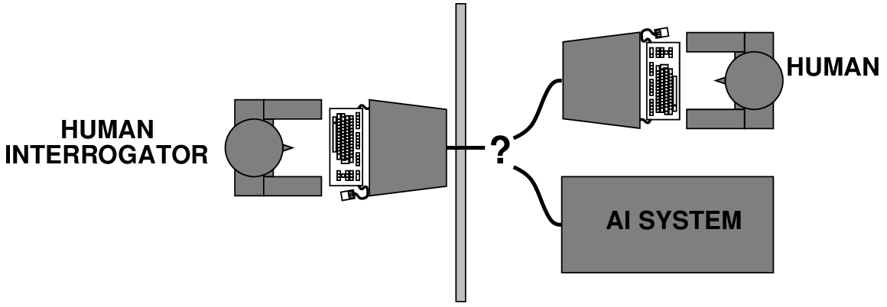

# Chapter 01 Introduction

<!-- tabs:start -->

#### **Tiếng Việt**

  <iframe src="TaiLieu/ebooks_Chapters_Vi3/Chapter_01/chapter_01_vi.html" width="100%" height="100%"></iframe>

#### **Tiếng Anh**

  <iframe src="TaiLieu/ebooks_Chapters/Chapter_01_Introduction.pdf" width="100%" height="100%"></iframe>

#### **Slide**

\usepackage{aima-slides}
\usepackage[utf8]{inputenc}
\usepackage[T5]{fontenc}
\usepackage{lmodern}
\usepackage{epstopdf}
\usepackage{url}

# Trí tuệ nhân tạo

## Chương 1

---
## Nội dung

- Tổng quan khóa học

- Trí tuệ nhân tạo (AI) là gì?

- Lược sử phát triển

- Tình hình hiện tại

---
## Thông tin hành chính

Trang chủ lớp học: \url{http://www-inst.eecs.berkeley.edu/ cs188}

nơi chứa bài giảng, bài tập, đề thi, chấm điểm, giờ giải đáp, v.v.

Bài tập 0 (ôn tập lisp) hạn nộp 8/31

Sách giáo trình: Russell and Norvig <u>Trí tuệ nhân tạo: Cách tiếp cận hiện đại</u>

Đọc Chương 1 và 2 cho tài liệu tuần này

Code: bản cài đặt lisp tích hợp cho các thuật toán AIMA tại

\url{http://www-inst.eecs.berkeley.edu/ cs188/code/}

---
## Tổng quan khóa học

- tác nhân thông minh (intelligent agents)

- tìm kiếm và chơi trò chơi

- các hệ thống logic

- các hệ thống lập kế hoạch

- độ bất định---xác suất và lý thuyết quyết định

- học máy

- ngôn ngữ

- nhận thức

- robot học

- các vấn đề triết học

---
## AI là gì?

| &nbsp; | &nbsp; |
|---|---|
| "[The automation of] activities that we associate with human thinking, activities such as decision-making, problem solving, learning $\ldots$" (Bellman, 1978) | "The study of mental faculties through the use of computational models" (Charniak+McDermott, 1985) |
| "The study of how to make computers do things at which, at the moment, people are better" (Rich+Knight, 1991) | "The branch of computer science that is concerned with the automation of intelligent behavior" (Luger+Stubblefield, 1993) |

Các quan điểm về AI được chia thành bốn loại:

| &nbsp; | &nbsp; |
|---|---|
| Suy nghĩ như người | Suy nghĩ hợp lý |
| Hành động như người | Hành động hợp lý |

Khi xem xét những điều này, chúng ta sẽ nghiêng về hành động hợp lý (ở một mức độ nào đó)
 

---
## Hành động như người: Phép thử Turing

Turing (1950) "Máy tính và trí thông minh":

- "Máy móc có thể suy nghĩ không?" $\longrightarrow$ "Máy móc có thể hành xử thông minh không?"

- Bài kiểm tra thực hành cho hành vi thông minh: Trò chơi bắt chước

- Dự đoán rằng đến năm 2000, một cỗ máy có 30\% cơ hội
  
     đánh lừa một người bình thường trong 5 phút

- Dự đoán trước tất cả các lập luận chính chống lại AI trong 50 năm tiếp theo

- Đề xuất các thành phần chính của AI: tri thức, lập luận, hiểu
  
     ngôn ngữ, học máy
[0.1in]
Vấn đề: Phép thử Turing không có <u>tính lặp lại</u>, <u>tính kiến thiết</u>, hoặc

phù hợp để <u>phân tích toán học</u>

---
## Suy nghĩ như người: Khoa học nhận thức
	

Thập niên 1960 "cách mạng nhận thức": tâm lý học xử lý thông tin thay thế

cho học thuyết hành vi đang thịnh hành

Yêu cầu các lý thuyết khoa học về các hoạt động bên trong của não bộ
  
 -- Ở mức độ trừu tượng nào? "Tri thức" hay "mạch điện"?
  
 -- Làm thế nào để kiểm chứng? Yêu cầu 
    
    1) Dự đoán và kiểm tra hành vi của con người (từ trên xuống)
    
    hoặc 2) Nhận dạng trực tiếp từ dữ liệu thần kinh (từ dưới lên)

Cả hai cách tiếp cận (nói chung là Khoa học nhận thức và Khoa học thần kinh nhận thức) 

hiện nay đều tách biệt với AI

---
## Suy nghĩ hợp lý: Các định luật của tư duy

<u>Chuẩn tắc</u> (hoặc <u>mô tả quy tắc</u>) hơn là <u>mô tả hiện tượng</u>

Aristotle: thế nào là quá trình lập luận/tư duy đúng đắn?

Một số trường phái Hy Lạp đã phát triển nhiều dạng <u>logic</u>:
  
   <u>ký hiệu</u> và <u>các quy tắc dẫn xuất</u> cho tư duy;

có thể đã hoặc chưa tiến tới ý tưởng cơ giới hóa

Đường lối trực tiếp qua toán học và triết học dẫn đến AI hiện đại

Vấn đề: 

1) Không phải tất cả hành vi thông minh đều được trung gian bởi sự suy ngẫm logic

2) Mục đích của suy nghĩ là gì? Tôi nên có những suy nghĩ nào?

---
## Hành động hợp lý

Hành vi <u>hợp lý</u>: làm điều đúng đắn

Điều đúng đắn: điều được kỳ vọng sẽ tối đa hóa việc đạt được mục tiêu,

dựa trên thông tin có sẵn

Không nhất thiết liên quan đến suy nghĩ---ví dụ: phản xạ chớp mắt---nhưng

suy nghĩ nên phục vụ cho hành động hợp lý

Aristotle (Đạo đức học Nicomachean):
  
  *Mọi nghệ thuật và mọi sự tìm tòi, cũng như mọi hành động 
  
       và theo đuổi, đều được cho là hướng tới một điều tốt đẹp nào đó*

---
## Tác nhân hợp lý

Một <u>tác nhân</u> là một thực thể cảm nhận và hành động

Khóa học này xoay quanh việc thiết kế các tác nhân hợp lý

Một cách trừu tượng, một tác nhân là một hàm từ lịch sử nhận thức đến các hành động:
\[f: {\cal P}^* \rightarrow {\cal A}\]
Đối với bất kỳ lớp môi trường và tác vụ nào, chúng ta tìm kiếm

tác nhân (hoặc lớp tác nhân) có hiệu suất tốt nhất

Lưu ý: những hạn chế về tính toán khiến cho sự hợp lý hoàn hảo không thể đạt được

$\rightarrow$ thiết kế <u>chương trình</u> tốt nhất cho các tài nguyên máy móc nhất định

---
## Tiền sử của AI

\resizebox{\textwidth}{!}{

| &nbsp; | &nbsp; |
|---|---|
| Triết học | logic, các phương pháp lập luận |
|  | tâm trí như một hệ thống vật lý |
|  | nền tảng của học máy, ngôn ngữ, tính hợp lý |
| Toán học | biểu diễn và chứng minh hình thức |
|  | thuật toán |
|  | tính toán, tính (không) quyết định được, tính (không) giải được |
|  | xác suất |
| Tâm lý học | sự thích nghi |
|  | các hiện tượng nhận thức và kiểm soát vận động |
|  | các kỹ thuật thực nghiệm (tâm lý vật lý học, v.v.) |
| Ngôn ngữ học | biểu diễn tri thức |
|  | ngữ pháp |
| Khoa học thần kinh | cơ sở vật chất cho hoạt động tâm trí |
| Lý thuyết điều khiển | các hệ thống cân bằng nội môi, tính ổn định |
|  | các thiết kế tác nhân tối ưu đơn giản |

}

---
## Tóm tắt lịch sử AI

\resizebox{\textwidth}{!}{

| &nbsp; | &nbsp; | &nbsp; |
|---|---|---|
| 1943 | McCulloch \ | Pitts: Mô hình mạch Boolean của não bộ |
| 1950 | "Máy tính và trí thông minh" của Turing |
| 1952--69 | Hãy nhìn này, không cần dùng tay! |
| 1950s | Các chương trình AI sơ khai, bao gồm chương trình cờ đam của Samuel, |
|  | Logic Theorist của Newell \ | Simon, Geometry Engine của Gelernter |
| 1956 | Hội nghị Dartmouth: Thuật ngữ "Trí tuệ nhân tạo" được chấp nhận |
| 1965 | Thuật toán hoàn chỉnh của Robinson cho lập luận logic |
| 1966--74 | AI khám phá ra độ phức tạp tính toán |
|  | Nghiên cứu mạng nơ-ron gần như biến mất |
| 1969--79 | Sự phát triển ban đầu của các hệ chuyên gia |
| 1980--88 | Ngành công nghiệp hệ chuyên gia bùng nổ |
| 1988--93 | Ngành công nghiệp hệ chuyên gia phá sản: "Mùa đông AI" |
| 1985--95 | Mạng nơ-ron trở lại phổ biến |
| 1988-- | Sự trỗi dậy của các phương pháp xác suất và lý thuyết quyết định |
|  | Sự gia tăng nhanh chóng về chiều sâu kỹ thuật của AI chính thống |
|  | "Nouvelle AI": ALife, Thuật toán di truyền (GAs), tính toán mềm |

}

---
## Tình hình hiện tại

Những điều nào sau đây có thể thực hiện được ở hiện tại?

- Chơi bóng bàn ở mức độ khá 

- Lái xe trên một con đường núi quanh co 

- Lái xe ở trung tâm Cairo 

- Chơi bài bridge ở mức độ khá 

- Khám phá và chứng minh một định lý toán học mới 

- Cố tình viết một câu chuyện hài hước 

- Đưa ra lời khuyên pháp lý có năng lực trong một lĩnh vực chuyên ngành

- Dịch tiếng Anh nói sang tiếng Thụy Điển nói theo thời gian thực

#### **Trắc nghiệm**
*(Chưa có bài tập trắc nghiệm)*

#### **Pseudocode**
*(Không có mã giả cho chương này trong thư viện)*

*(Thư mục chứa mã giả cho các thuật toán trong sách: `codeAndExercises/aima-pseudocode-master/md`)*

#### **Python**
*(Không có Jupyter Notebook/Python code cho chương này)*

#### **Bài tập**

##### Bài tập 1.1

Define in your own words: (a) intelligence, (b) artificial intelligence,
(c) agent, (d) rationality, (e) logical reasoning.

---

##### Bài tập 1.2

Read Turing’s original paper on AI <a class="paperRef" title="" href="">Turing:1950 </a>.In the paper, he discusses several objections to his proposed enterprise and his test for
intelligence. Which objections still carry weight? Are his refutations
valid? Can you think of new objections arising from developments since
he wrote the paper? In the paper, he predicts that, by the year 2000, a
computer will have a 30% chance of passing a five-minute Turing Test
with an unskilled interrogator. What chance do you think a computer
would have today? In another 50 years?

---

##### Bài tập 1.3

Every year the Loebner Prize is awarded to the program that comes
closest to passing a version of the <a href="https://en.wikipedia.org/wiki/Turing_test">Turing Test</a>. Research and report on
the latest winner of the Loebner prize. What techniques does it use? How
does it advance the state of the art in AI?

---

##### Bài tập 1.4

Are reflex actions (such as flinching from a hot stove) rational? Are
they intelligent?

---

##### Bài tập 1.5

There are well-known classes of problems that are intractably difficult
for computers, and other classes that are provably undecidable. Does
this mean that AI is impossible?

---

##### Bài tập 1.6

Suppose we extend Evans’s <i>SYSTEM</i> program so that it can score 200 on a standard
IQ test. Would we then have a program more intelligent than a human?
Explain.

---

##### Bài tập 1.7

The neural structure of the sea slug <i>Aplysis</i> has been
widely studied (first by Nobel Laureate Eric Kandel) because it has only
about 20,000 neurons, most of them large and easily manipulated.
Assuming that the cycle time for an <i>Aplysis</i> neuron is
roughly the same as for a human neuron, how does the computational
power, in terms of memory updates per second, compare with the high-end
computer described in (Figure <a class ="insideBookFigRef" target="_blank" href="https://aimacode.github.io/aima-exercises/figures/computer-brain-table.png">computer-brain-table</a>)?

---

##### Bài tập 1.8

How could introspection—reporting on one’s inner thoughts—be inaccurate?
Could I be wrong about what I’m thinking? Discuss.

---

##### Bài tập 1.9

To what extent are the following computer systems instances of
artificial intelligence: 

-   Supermarket bar code scanners. 

-   Web search engines. 

-   Voice-activated telephone menus. 

-   Internet routing algorithms that respond dynamically to the state of
    the network.

---

##### Bài tập 1.10

To what extent are the following computer systems instances of
artificial intelligence: 

- Supermarket bar code scanners. 

- Voice-activated telephone menus. 

- Spelling and grammar correction features in Microsoft Word. 

- Internet routing algorithms that respond dynamically to the state of the network. 

---

##### Bài tập 1.11

Many of the computational models of cognitive activities that have been
proposed involve quite complex mathematical operations, such as
convolving an image with a Gaussian or finding a minimum of the entropy
function. Most humans (and certainly all animals) never learn this kind
of mathematics at all, almost no one learns it before college, and
almost no one can compute the convolution of a function with a Gaussian
in their head. What sense does it make to say that the “vision system”
is doing this kind of mathematics, whereas the actual person has no idea
how to do it?

---

##### Bài tập 1.12

Some authors have claimed that perception and motor skills are the most
important part of intelligence, and that “higher level” capacities are
necessarily parasitic—simple add-ons to these underlying facilities.
Certainly, most of evolution and a large part of the brain have been
devoted to perception and motor skills, whereas AI has found tasks such
as game playing and logical inference to be easier, in many ways, than
perceiving and acting in the real world. Do you think that AI’s
traditional focus on higher-level cognitive abilities is misplaced?

---

##### Bài tập 1.13

Why would evolution tend to result in systems that act rationally? What
goals are such systems designed to achieve?

---

##### Bài tập 1.14

Is AI a science, or is it engineering? Or neither or both? Explain.

---

##### Bài tập 1.15

“Surely computers cannot be intelligent—they can do only what their
programmers tell them.” Is the latter statement true, and does it imply
the former?

---

##### Bài tập 1.16

“Surely animals cannot be intelligent—they can do only what their genes
tell them.” Is the latter statement true, and does it imply the former?

---

##### Bài tập 1.17

“Surely animals, humans, and computers cannot be intelligent—they can do
only what their constituent atoms are told to do by the laws of
physics.” Is the latter statement true, and does it imply the former?

---

##### Bài tập 1.18

Examine the AI literature to discover whether the following tasks can
currently be solved by computers:

- Playing a decent game of table tennis (Ping-Pong).
- Driving in the center of Cairo, Egypt.
- Driving in Victorville, California.
- Buying a week’s worth of groceries at the market.
- Buying a week’s worth of groceries on the Web.
- Playing a decent game of bridge at a competitive level.
- Discovering and proving new mathematical theorems.
- Writing an intentionally funny story.
- Giving competent legal advice in a specialized area of law.
- Translating spoken English into spoken Swedish in real time.
- Performing a complex surgical operation.

---

##### Bài tập 1.19

For the currently infeasible tasks, try to find out what the
difficulties are and predict when, if ever, they will be overcome.

---

##### Bài tập 1.20

Various subfields of AI have held contests by defining a standard task
and inviting researchers to do their best. Examples include the DARPA
Grand Challenge for robotic cars, the International Planning
Competition, the Robocup robotic soccer league, the TREC information
retrieval event, and contests in machine translation and speech
recognition. Investigate five of these contests and describe the
progress made over the years. To what degree have the contests advanced
the state of the art in AI? To what degree do they hurt the field by
drawing energy away from new ideas?

---

<!-- tabs:end -->
