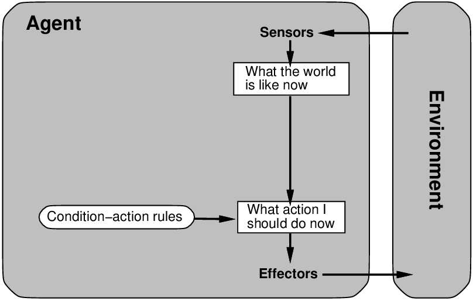
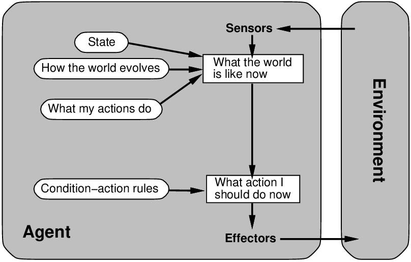
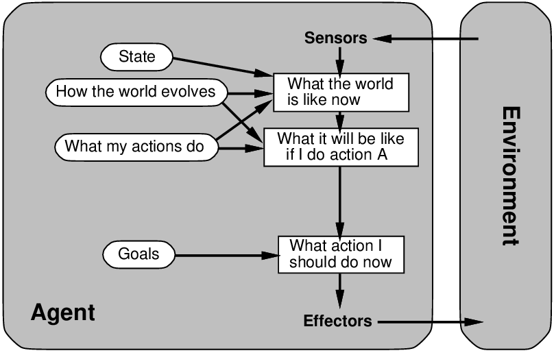
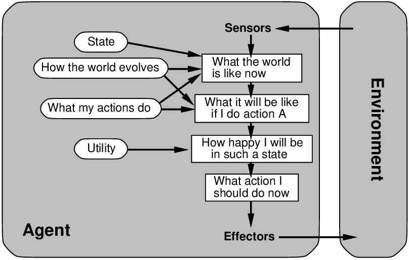

# Chapter 02 Intelligent Agents

<!-- tabs:start -->

#### **Tiếng Việt**
<div class="pdf-container">
  <iframe src="TaiLieu/ebooks_Chapters_Vi3/Chapter_02/chapter_02_vi.html" width="100%" height="100%"></iframe>
</div>

#### **Tiếng Anh**
<div class="pdf-container">
  <iframe src="TaiLieu/ebooks_Chapters/Chapter_02_Intelligent%20Agents.pdf" width="100%" height="100%"></iframe>
</div>

#### **Slide**

\usepackage{aima-slides}
\usepackage[utf8]{inputenc}
\usepackage[T5]{fontenc}
\usepackage{lmodern}

# Tác nhân thông minh

## Chương 2

---
## Nội dung

- PAGE (Nhận thức, Hành động, Mục tiêu, Môi trường)

- Các loại môi trường

- Hàm tác nhân và chương trình tác nhân

- Các loại tác nhân

- Thế giới máy hút bụi

---
## PAGE

Đầu tiên phải xác định bối cảnh để thiết kế tác nhân thông minh

Xem xét, ví dụ: nhiệm vụ thiết kế một chiếc taxi tự động:

<u>Nhận thức (Percepts)</u>??

<u>Hành động (Actions)</u>??

<u>Mục tiêu (Goals)</u>??

<u>Môi trường (Environment)</u>??

---
## PAGE

Đầu tiên phải xác định bối cảnh để thiết kế tác nhân thông minh

Xem xét, ví dụ: nhiệm vụ thiết kế một chiếc taxi tự động:

<u>Nhận thức (Percepts)</u>?? video, gia tốc kế, đồng hồ đo, cảm biến động cơ, bàn phím, GPS, $\ldots$

<u>Hành động (Actions)</u>?? bẻ lái, tăng tốc, phanh, bấm còi, nói/hiển thị, $\ldots$

<u>Mục tiêu (Goals)</u>?? an toàn, đến đích, tối đa hóa lợi nhuận, tuân thủ luật pháp, sự thoải mái của hành khách, $\ldots$

<u>Môi trường (Environment)</u>?? đường phố Mỹ, đường cao tốc, giao thông, người đi bộ, thời tiết, khách hàng, $\ldots$

---
## Tác nhân mua sắm trên Internet

<u>Nhận thức</u>??

<u>Hành động</u>??

<u>Mục tiêu</u>??

<u>Môi trường</u>??

---
## Tác nhân hợp lý (Rational agents)

Không mất tính tổng quát, "mục tiêu" có thể được xác định bằng <u>độ đo hiệu suất</u>

xác định một giá trị số cho bất kỳ lịch sử môi trường nào

<u>Hành động hợp lý</u>: bất kỳ hành động nào tối đa hóa giá trị kỳ vọng của
độ đo hiệu suất <u>cho trước chuỗi nhận thức cho đến nay</u>

Hợp lý $\neq$ toàn tri (omniscient)

Hợp lý $\neq$ thấu thị (clairvoyant)

Hợp lý $\neq$ thành công (successful)

---
## Các loại môi trường

\resizebox{\textwidth}{!}{

| &nbsp; | &nbsp; | &nbsp; | &nbsp; | &nbsp; |
|---|---|---|---|---|
|  | {Xếp bài (Solitaire)} | {Cờ đố (Backgammon)} | {Mua sắm Internet} | {Taxi} |
| <u>Có thể truy cập (Accessible)</u>?? |  |  |  |  |
| <u>Tất định (Deterministic)</u>?? |  |  |  |  |
| <u>Theo giai đoạn (Episodic)</u>?? |  |  |  |  |
| <u>Tĩnh (Static)</u>?? |  |  |  |  |
| <u>Rời rạc (Discrete)</u>?? |  |  |  |  |

}

---
## Các loại môi trường

\resizebox{\textwidth}{!}{

| &nbsp; | &nbsp; | &nbsp; | &nbsp; | &nbsp; |
|---|---|---|---|---|
|  | {Xếp bài} | {Cờ đố} | {Mua sắm Internet} | {Taxi} |
| <u>Có thể truy cập</u>?? | Có | Có | Không | Không |
| <u>Tất định</u>?? | Có | Không | Một phần | Không |
| <u>Theo giai đoạn</u>?? | Không | Không | Không | Không |
| <u>Tĩnh</u>?? | Có | Bán tĩnh | Bán tĩnh | Không |
| <u>Rời rạc</u>?? | Có | Có | Có | Không |

}

Loại môi trường phần lớn quyết định thiết kế của tác nhân

Thế giới thực (tất nhiên) là không thể truy cập, ngẫu nhiên, tuần tự,
động, liên tục

---
## Hàm tác nhân và chương trình

Một tác nhân được xác định hoàn toàn bởi <u>hàm tác nhân</u>

ánh xạ chuỗi nhận thức thành các hành động

(Về nguyên tắc, người ta có thể cung cấp từng chuỗi có thể để xem nó
làm gì. Rõ ràng, một bảng tra cứu thường sẽ rất khổng lồ.)

Một hàm tác nhân (hoặc một lớp tương đương nhỏ) là <u>hợp lý</u>

Mục đích: tìm cách triển khai hàm tác nhân hợp lý một cách ngắn gọn

Một <u>chương trình tác nhân</u> lấy một nhận thức duy nhất làm đầu vào, lưu giữ
trạng thái nội bộ:

```text
function Skeleton-Agent(percept) returns hành\_động
      static: memory, bộ nhớ của tác nhân về thế giới

    memory <- Update-Memory(memory, percept)
    hành\_động <- Choose-Best-Action(memory)
    memory <- Update-Memory(memory, hành\_động)
    return hành\_động
```

---
## Mã nguồn AIMA

Mã nguồn cho mỗi chủ đề được chia thành bốn thư mục:
  
-- `agents`: mã nguồn định nghĩa các loại tác nhân và chương trình
  
-- `algorithms`: mã nguồn cho các phương pháp được sử dụng bởi chương trình tác nhân
  
-- `environments`: mã nguồn định nghĩa các loại môi trường, mô phỏng
  
-- `domains`: các loại bài toán và ví dụ đầu vào cho thuật toán

(Thường chạy các thuật toán trên các miền thay vì các tác nhân trong môi trường.)

{\small

```text
(setq joe (make-agent :name 'joe :body (make-agent-body)
                      :program (make-dumb-agent-program)))

(defun make-dumb-agent-program ()
  (let ((memory nil))
    #'(lambda (percept)
        (push percept memory)
        'no-op)))
```

}

---
## Các loại tác nhân

Bốn loại cơ bản theo thứ tự tính tổng quát tăng dần:
  
-- tác nhân phản xạ đơn giản
  
-- tác nhân phản xạ có trạng thái
  
-- tác nhân dựa trên mục tiêu
  
-- tác nhân dựa trên độ hữu dụng

---
## Tác nhân phản xạ đơn giản



---
## Tác nhân phản xạ có trạng thái



---
## Tác nhân dựa trên mục tiêu



---
## Tác nhân dựa trên độ hữu dụng



---
## Thế giới máy hút bụi

`code/agents/environments/vacuum.lisp`

<u>Nhận thức</u> `(<bump> <dirt> <home>)`

<u>Hành động</u> `shutoff forward suck (turn left) (turn right)`

<u>Mục tiêu</u> (độ đo hiệu suất trên lịch sử môi trường)
  
-- +100 cho mỗi mảng bụi được dọn sạch
  
-- -1 cho mỗi hành động
  
-- -1000 nếu tắt máy khi xa nhà

<u>Môi trường</u>
  
-- dạng lưới, tường/chướng ngại vật, phân bố và tạo bụi, cơ thể
tác nhân
  
-- các hành động di chuyển hoạt động trừ khi đụng tường
  
-- hành động hút đưa bụi vào cơ thể tác nhân (hoặc không)

Có thể truy cập? Tất định? Theo giai đoạn? Tĩnh? Rời rạc?


#### **Trắc nghiệm**
*(Chưa có bài tập trắc nghiệm)*

#### **Pseudocode**
- [TABLE-DRIVEN-AGENT](codeAndExercises/aima-pseudocode-master/md/Table-Driven-Agent.md)
- [REFLEX-VACUUM-AGENT](codeAndExercises/aima-pseudocode-master/md/Reflex-Vacuum-Agent.md)
- [SIMPLE-REFLEX-AGENT](codeAndExercises/aima-pseudocode-master/md/Simple-Reflex-Agent.md)
- [MODEL-BASED-REFLEX-AGENT](codeAndExercises/aima-pseudocode-master/md/Model-Based-Reflex-Agent.md)

*(Thư mục chứa mã giả cho các thuật toán trong sách: `codeAndExercises/aima-pseudocode-master/md`)*

#### **Python**
- [Agents](codeAndExercises/aima-python-master/notebooks/agents.ipynb)
- [Agents (Python File)](codeAndExercises/aima-python-master/notebooks/agents.py)
- [Vacuum World](codeAndExercises/aima-python-master/notebooks/vacuum_world.ipynb)
- [Vacuum World (Python File)](codeAndExercises/aima-python-master/notebooks/vacuum_world.py)


#### **Bài tập**

##### Bài tập 2.1

Suppose that the performance measure is concerned with just the first
$T$ time steps of the environment and ignores everything thereafter.
Show that a rational agent’s action may depend not just on the state of
the environment but also on the time step it has reached.


---

##### Bài tập 2.2

Let us examine the rationality of various
vacuum-cleaner agent functions.<br>
1.  Show that the simple vacuum-cleaner agent function described in
    Figure <a class="insideBookFigRef" target="_blank" href="https://aimacode.github.io/aima-exercises/figures/vacuum-agent-function-table.png">vacuum-agent-function-table</a> is indeed
    rational under the assumptions listed on page <a class="pageRef" title="" href="#">vacuum-rationality-page</a><br>

2.  Describe a rational agent function for the case in which each
    movement costs one point. Does the corresponding agent program
    require internal state?<br>

3.  Discuss possible agent designs for the cases in which clean squares
    can become dirty and the geography of the environment is unknown.
    Does it make sense for the agent to learn from its experience in
    these cases? If so, what should it learn? If not, why not?<br>


---

##### Bài tập 2.3

Write an essay on the relationship between evolution and one or more of
autonomy, intelligence, and learning.


---

##### Bài tập 2.4

For each of the following assertions, say whether it is true or false
and support your answer with examples or counterexamples where
appropriate.<br>

1.  An agent that senses only partial information about the state cannot
    be perfectly rational.<br>

2.  There exist task environments in which no pure reflex agent can
    behave rationally.<br>

3.  There exists a task environment in which every agent is rational.<br>

4.  The input to an agent program is the same as the input to the
    agent function.<br>

5.  Every agent function is implementable by some
    program/machine combination.<br>

6.  Suppose an agent selects its action uniformly at random from the set
    of possible actions. There exists a deterministic task environment
    in which this agent is rational.<br>

7.  It is possible for a given agent to be perfectly rational in two
    distinct task environments.<br>

8.  Every agent is rational in an unobservable environment.<br>

9.  A perfectly rational poker-playing agent never loses.<br>


---

##### Bài tập 2.5

For each of the following activities, give a PEAS
description of the task environment and characterize it in terms of the
properties listed in Section <a class="sectionRef" title="" href="#">env-properties-subsection</a><br>

-   Playing soccer.<br>

-   Exploring the subsurface oceans of Titan.<br>

-   Shopping for used AI books on the Internet.<br>

-   Playing a tennis match.<br>

-   Practicing tennis against a wall.<br>

-   Performing a high jump.<br>

-   Knitting a sweater.<br>

-   Bidding on an item at an auction.<br>


---

##### Bài tập 2.6

For each of the following activities, give a PEAS
description of the task environment and characterize it in terms of the
properties listed in Section <a class="sectionRef" title="" href="#">env-properties-subsection</a><br>

-   Performing a gymnastics floor routine.<br>

-   Exploring the subsurface oceans of Titan.<br>

-   Playing soccer.<br>

-   Shopping for used AI books on the Internet.<br>

-   Practicing tennis against a wall.<br>

-   Performing a high jump.<br>

-   Bidding on an item at an auction.<br>


---

##### Bài tập 2.7

Define in your own words the following terms: agent, agent function,
agent program, rationality, autonomy, reflex agent, model-based agent,
goal-based agent, utility-based agent, learning agent.


---

##### Bài tập 2.8

This exercise explores the differences between
agent functions and agent programs.<br>

1.  Can there be more than one agent program that implements a given
    agent function? Give an example, or show why one is not possible.<br>

2.  Are there agent functions that cannot be implemented by any agent
    program?<br>

3.  Given a fixed machine architecture, does each agent program
    implement exactly one agent function?<br>

4.  Given an architecture with $n$ bits of storage, how many different
    possible agent programs are there?<br>

5.  Suppose we keep the agent program fixed but speed up the machine by
    a factor of two. Does that change the agent function?<br>


---

##### Bài tập 2.9

Write pseudocode agent programs for the goal-based and utility-based
agents.


---

##### Bài tập 2.10

Consider a simple thermostat that turns on a furnace when the
temperature is at least 3 degrees below the setting, and turns off a
furnace when the temperature is at least 3 degrees above the setting. Is
a thermostat an instance of a simple reflex agent, a model-based reflex
agent, or a goal-based agent?


---

##### Bài tập 2.11

Implement a performance-measuring environment
simulator for the vacuum-cleaner world depicted in
Figure <a class="insideBookFigRef" target="_blank" href="https://aimacode.github.io/aima-exercises/figures/vacuum-world-figure.png">vacuum-world-figure</a> and specified on
page <a class="pageRef" title="" href="#">vacuum-rationality-page</a>. Your implementation should be modular so that the
sensors, actuators, and environment characteristics (size, shape, dirt
placement, etc.) can be changed easily. (Note: for some
choices of programming language and operating system there are already
implementations in the online code repository.)


---

##### Bài tập 2.12

Implement a simple reflex agent for the vacuum environment in
Exercise <a class="exerciseRef" href="{{ site.baseurl }}/agents-exercises/ex_10/">vacuum-start-exercise</a>. Run the environment
with this agent for all possible initial dirt configurations and agent
locations. Record the performance score for each configuration and the
overall average score.


---

##### Bài tập 2.13

Consider a modified version of the
vacuum environment in Exercise <a class="exerciseRef" href="{{ site.baseurl }}/agents-exercises/ex_10/">vacuum-start-exercise</a>,
in which the agent is penalized one point for each movement.<br>

1.  Can a simple reflex agent be perfectly rational for this
    environment? Explain.<br>

2.  What about a reflex agent with state? Design such an agent.<br>

3.  How do your answers to 1 and 2
    change if the agent’s percepts give it the clean/dirty status of
    every square in the environment?


---

##### Bài tập 2.14

Consider a modified version of the
vacuum environment in Exercise <a class="exerciseRef" href="{{ site.baseurl }}/agents-exercises/ex_10/">vacuum-start-exercise</a>,
in which the geography of the environment—its extent, boundaries, and
obstacles—is unknown, as is the initial dirt configuration. (The agent
can go Up and Down as well as Left and Right.)<br>

1.  Can a simple reflex agent be perfectly rational for this
    environment? Explain.<br>

2.  Can a simple reflex agent with a randomized agent
    function outperform a simple reflex agent? Design such an agent and
    measure its performance on several environments.<br>

3.  Can you design an environment in which your randomized agent will
    perform poorly? Show your results.<br>

4.  Can a reflex agent with state outperform a simple reflex agent?
    Design such an agent and measure its performance on several
    environments. Can you design a rational agent of this type?


---

##### Bài tập 2.15

Repeat Exercise <a class="exerciseRef" href="{{ site.baseurl }}/agents-exercises/ex_13/">vacuum-unknown-geog-exercise</a> for the case in
which the location sensor is replaced with a “bump” sensor that detects
the agent’s attempts to move into an obstacle or to cross the boundaries
of the environment. Suppose the bump sensor stops working; how should
the agent behave?


---

##### Bài tập 2.16

The vacuum environments in the preceding
exercises have all been deterministic. Discuss possible agent programs
for each of the following stochastic versions:<br>

1.  Murphy’s law: twenty-five percent of the time, the Suck action
    fails to clean the floor if it is dirty and deposits dirt onto the
    floor if the floor is clean. How is your agent program affected if
    the dirt sensor gives the wrong answer 10% of the time?<br>

2.  Small children: At each time step, each clean square has a 10%
    chance of becoming dirty. Can you come up with a rational agent
    design for this case?


---


<!-- tabs:end -->
