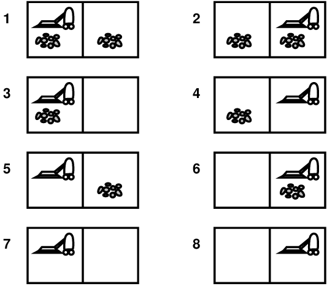
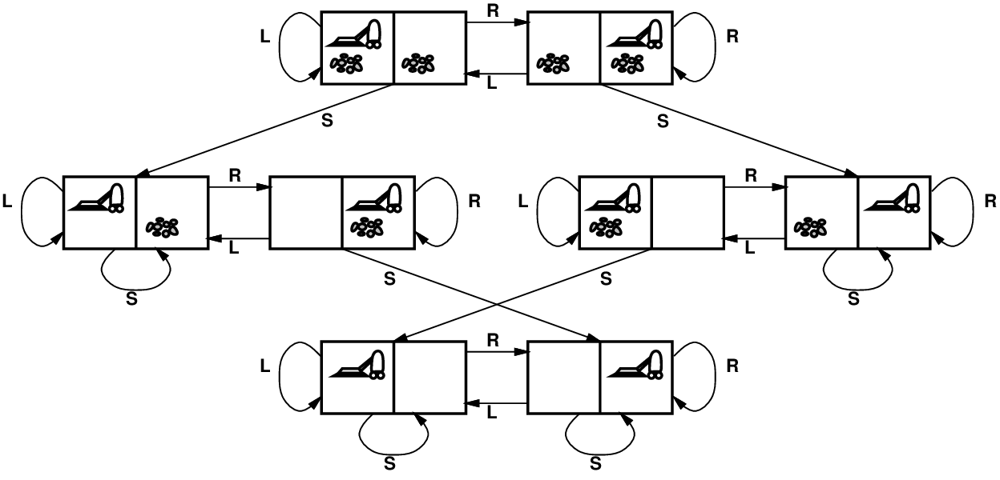
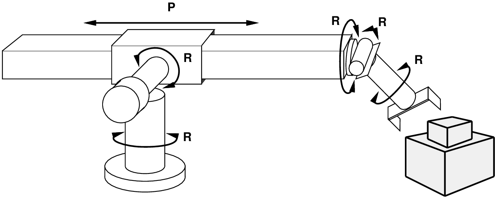
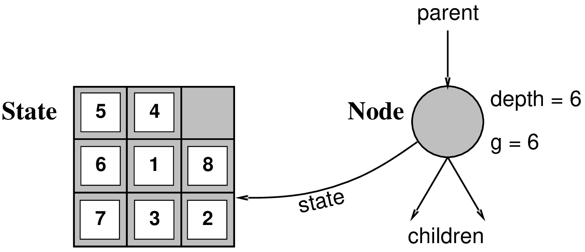

# Chapter 03 Solving Problems by Searching

<!-- tabs:start -->

#### **Tiếng Việt**
<div class="pdf-container">
  <iframe src="TaiLieu/ebooks_Chapters_Vi3/Chapter_03/chapter_03_vi.html" width="100%" height="100%"></iframe>
</div>

#### **Tiếng Anh**
<div class="pdf-container">
  <iframe src="TaiLieu/ebooks_Chapters/Chapter_03_Solving%20Problems%20by%20Searching.pdf" width="100%" height="100%"></iframe>
</div>

#### **Slide**

\usepackage{fleqn}
\usepackage{epsf}
\usepackage[dvips]{color}
\usepackage{aima2e-slides}

# Problem solving and search

## Chapter 3

---
## Nhắc nhở

*Bài tập 0 hạn nộp lúc 5 giờ chiều hôm nay*

*Bài tập 1 đã đăng*, hạn nộp ngày 9/2

\note{Phần 105 sẽ chuyển sang 9-10h sáng} bắt đầu từ tuần sau

---
## Phác thảo

- Tác nhân giải quyết vấn đề

- Các loại sự cố

- Xây dựng bài toán

- Các vấn đề mẫu

- Thuật toán tìm kiếm cơ bản

---
## Tác nhân giải quyết vấn đề

Hình thức tổng đại lý bị hạn chế:

```text
function Simple-Problem-Solving-Agent(percept) returns an action
      static: seq, an action sequence, initially empty
      static: state, some description of the current world state
      static: goal, a goal, initially null
      static: problem, a problem formulation

    state <- Update-State(state, percept)
    if seq is empty then 
          goal <- Formulate-Goal(state)
          problem <- Formulate-Problem(state, goal)
          seq <- Search(problem)
    action <- Recommendation(seq, state)
    seq <- Remainder(seq, state)
    return action
```

Lưu ý: đây là cách giải quyết vấn đề \note{ngoại tuyến}; giải pháp được thực thi " nhắm mắt lại."

\note{Trực tuyến} giải quyết vấn đề liên quan đến hành động mà không có kiến thức đầy đủ.

---
## Ví dụ: Romania

Đang đi nghỉ ở Romania; hiện đang ở Arad.

Chuyến bay khởi hành vào ngày mai từ Bucharest

\note{Xây dựng mục tiêu}:
    
ở Bucharest

\note{Xây dựng bài toán}:
    
\note{tiểu bang}: các thành phố khác nhau
    
\note{hành động}: lái xe giữa các thành phố

\note{Tìm giải pháp}:
    
chuỗi các thành phố, ví dụ: Arad, Sibiu, Fagaras, Bucharest

---
## Ví dụ: Romania


---
## Các loại sự cố

\note{Có tính xác định, hoàn toàn có thể quan sát được} $\Longrightarrow$ \defn{vấn đề một trạng thái}
    
    Đại lý biết chính xác nó sẽ ở trạng thái nào; giải pháp là một chuỗi

\note{Không thể quan sát được} $\Longrightarrow$ \defn{vấn đề về tuân thủ}
    
    Đại lý có thể không biết nó ở đâu; nghiệm (nếu có) là dãy

\note{Không xác định} và/hoặc \note{có thể quan sát được một phần} $\Longrightarrow$ \defn{vấn đề dự phòng}
    
nhận thức cung cấp thông tin *mới* về trạng thái hiện tại
    
giải pháp là \defn{kế hoạch dự phòng} hoặc \defn{chính sách} 
    
thường *xen kẽ* tìm kiếm, thực thi

\note{Không gian trạng thái không xác định} $\Longrightarrow$ \defn{vấn đề khám phá} ("trực tuyến")

---
## Ví dụ: thế giới chân không

\note{Trạng thái đơn}, bắt đầu bằng \#5. <u>Giải pháp</u>?? 

 

,4\maxfigwidth
\raisebox{-0.35\maxfigwidth}[0pt][0pt]{}

---
## Ví dụ: thế giới chân không

\hbox{
\note{Trạng thái đơn}, bắt đầu bằng \#5. <u>Giải pháp</u>?? 

\mat{$[Right,Suck]$}

[0,5\baselineskip]
\note{Conformant}, bắt đầu trong \mat{$\{1,2,3,4,5,6,7,8\}$}

ví dụ: \mat{$Right$} chuyển đến \mat{$\{2,4,6,8\}$}. <u>Giải pháp</u>??
}
 

,4\maxfigwidth
\raisebox{-0.35\maxfigwidth}[0pt][0pt]{}

---
## Ví dụ: thế giới chân không

\hbox{
\note{Trạng thái đơn}, bắt đầu bằng \#5. <u>Giải pháp</u>?? 

\mat{$[Right,Suck]$}

[0,5\baselineskip]
\note{Conformant}, bắt đầu trong \mat{$\{1,2,3,4,5,6,7,8\}$}

ví dụ: \mat{$Right$} chuyển đến \mat{$\{2,4,6,8\}$}. <u>Giải pháp</u>??

\mat{$[Right,Suck,Left,Suck]$}

[0,5\baselineskip]
\note{Dự phòng}, bắt đầu trong \#5

Định luật Murphy: \mat{$Suck$} có thể làm bẩn một tấm thảm sạch

Cảm biến cục bộ: bụi bẩn, chỉ vị trí.

<u>Giải pháp</u>??
}
 

,4\maxfigwidth
\raisebox{-0.35\maxfigwidth}[0pt][0pt]{}

---
## Ví dụ: thế giới chân không

\hbox{
\note{Trạng thái đơn}, bắt đầu bằng \#5. <u>Giải pháp</u>?? 

\mat{$[Right,Suck]$}

[0,5\baselineskip]
\note{Conformant}, bắt đầu trong \mat{$\{1,2,3,4,5,6,7,8\}$}

ví dụ: \mat{$Right$} chuyển đến \mat{$\{2,4,6,8\}$}. <u>Giải pháp</u>??

\mat{$[Right,Suck,Left,Suck]$}

[0,5\baselineskip]
\note{Dự phòng}, bắt đầu trong \#5

Định luật Murphy: \mat{$Suck$} có thể làm bẩn một tấm thảm sạch

Cảm biến cục bộ: bụi bẩn, chỉ vị trí.

<u>Giải pháp</u>??

\mat{$[Right,\k{if}\ dirt\ \k{then}\ Suck]$}
}
 

,4\maxfigwidth
\raisebox{-0.35\maxfigwidth}[0pt][0pt]{}

---
## Xây dựng bài toán trạng thái đơn

Sự cố \defn{} được xác định bởi bốn mục:

\defn{trạng thái ban đầu}  &nbsp;&nbsp;  ví dụ: "tại Arad"

\defn{hàm kế tiếp} \mat{$S(x)$} = tập hợp các cặp hành động--trạng thái 
    
ví dụ: \mat{$S(Arad) = \{\<Arad\rightarrow Zerind, Zerind\>, \ldots \}$}

\defn{kiểm tra mục tiêu}, có thể là
    
\note{rõ ràng}, ví dụ: \mat{$x$} = "tại Bucharest"
    
\note{ẩn}, ví dụ: \mat{$NoDirt(x)$}

\defn{chi phí đường dẫn} (phụ gia)
    
ví dụ: tổng khoảng cách, số hành động được thực hiện, v.v.
    
\mat{$c(x,a,y)$} là \defn{chi phí bước}, giả định là \mat{$\geq 0$}

Giải pháp \defn{} là một chuỗi hành động

dẫn từ trạng thái ban đầu đến trạng thái mục tiêu

---
## Chọn không gian trạng thái

Thế giới thực phức tạp đến mức ngớ ngẩn 
    
Không gian trạng thái $\Rightarrow$ phải được *trừu tượng* để giải quyết vấn đề

(Tóm tắt) trạng thái = tập hợp các trạng thái thực

(Tóm tắt) hành động = sự kết hợp phức tạp của các hành động thực tế
    
   ví dụ: "Arad $\rightarrow$ Zerind" đại diện cho một tập hợp phức tạp
      
   về các tuyến đường có thể, đường vòng, điểm dừng nghỉ, v.v. 

Để đảm bảo khả năng thực hiện được, *bất kỳ* trạng thái thực " ở Arad"
  
phải đến \note{some} trạng thái thực " ở Zerind "

(Tóm tắt) giải pháp = 
    
   tập hợp các đường dẫn thực sự là giải pháp trong thế giới thực

Mỗi hành động trừu tượng phải "dễ dàng hơn" so với vấn đề ban đầu!

---
##  Ví dụ: đồ thị không gian trạng thái thế giới chân không 

,8\textwidth


<u>trạng thái</u>??

<u>hành động</u>??

<u>kiểm tra mục tiêu</u>??

<u>chi phí đường đi</u>??

---
##  Ví dụ: đồ thị không gian trạng thái thế giới chân không 

,8\textwidth


<u>state</u>??: số nguyên bụi bẩn và vị trí robot (bỏ qua bụi bẩn \note{số lượng}, v.v.)

<u>hành động</u>??

<u>kiểm tra mục tiêu</u>??

<u>chi phí đường dẫn</u>??

---
##  Ví dụ: đồ thị không gian trạng thái thế giới chân không 

,8\textwidth


<u>state</u>??: số nguyên bụi bẩn và vị trí robot (bỏ qua bụi bẩn \note{số lượng}, v.v.)

<u>hành động</u>??: \mat{$Left$}, \mat{$Right$}, \mat{$Suck$}, \mat{$NoOp$}

<u>kiểm tra mục tiêu</u>??

<u>chi phí đường dẫn</u>??

---
##  Ví dụ: đồ thị không gian trạng thái thế giới chân không 

,8\textwidth


<u>state</u>??: số nguyên bụi bẩn và vị trí robot (bỏ qua bụi bẩn \note{số lượng}, v.v.)

<u>hành động</u>??: \mat{$Left$}, \mat{$Right$}, \mat{$Suck$}, \mat{$NoOp$}

<u>kiểm tra mục tiêu</u>??: không có bụi bẩn

<u>chi phí đường dẫn</u>??

---
##  Ví dụ: đồ thị không gian trạng thái thế giới chân không 

,8\textwidth


<u>state</u>??: số nguyên bụi bẩn và vị trí robot (bỏ qua bụi bẩn \note{số lượng}, v.v.)

<u>hành động</u>??: \mat{$Left$}, \mat{$Right$}, \mat{$Suck$}, \mat{$NoOp$}

<u>kiểm tra mục tiêu</u>??: không có bụi bẩn

<u>chi phí đường dẫn</u>??: 1 cho mỗi hành động (0 cho \mat{$NoOp$})

---
## Ví dụ: Câu đố 8 ô

,6\textwidth


<u>trạng thái</u>??

<u>hành động</u>??

<u>kiểm tra mục tiêu</u>??

<u>chi phí đường đi</u>??

---
## Ví dụ: Câu đố 8 ô

,6\textwidth


<u>state</u>??: vị trí số nguyên của các ô (bỏ qua các vị trí trung gian)

<u>hành động</u>??

<u>kiểm tra mục tiêu</u>??

<u>chi phí đường đi</u>??

---
## Ví dụ: Câu đố 8 ô

,6\textwidth


<u>state</u>??: vị trí số nguyên của các ô (bỏ qua các vị trí trung gian)

<u>actions</u>??: di chuyển trống sang trái, phải, lên, xuống (bỏ qua việc gỡ nhiễu, v.v.)

<u>kiểm tra mục tiêu</u>??

<u>chi phí đường đi</u>??

---
## Ví dụ: Câu đố 8 ô

,6\textwidth


<u>state</u>??: vị trí số nguyên của các ô (bỏ qua các vị trí trung gian)

<u>actions</u>??: di chuyển trống sang trái, phải, lên, xuống (bỏ qua việc gỡ nhiễu, v.v.)

<u>kiểm tra mục tiêu</u>??: = trạng thái mục tiêu (đã cho)

<u>chi phí đường đi</u>??

---
## Ví dụ: Câu đố 8 ô

,6\textwidth


<u>state</u>??: vị trí số nguyên của các ô (bỏ qua các vị trí trung gian)

<u>actions</u>??: di chuyển trống sang trái, phải, lên, xuống (bỏ qua việc gỡ nhiễu, v.v.)

<u>kiểm tra mục tiêu</u>??: = trạng thái mục tiêu (đã cho)

<u>chi phí đường dẫn</u>??: 1 mỗi lần di chuyển

[Lưu ý: giải pháp tối ưu của $n$-Puzzle là NP-hard]

---
## Ví dụ: lắp ráp robot

,7\textwidth


<u>state</u>??: tọa độ có giá trị thực của các góc khớp robot
    
các bộ phận của đối tượng được lắp ráp

<u>hành động</u>??: chuyển động liên tục của các khớp robot

<u>kiểm tra mục tiêu</u>??: lắp ráp hoàn chỉnh *không bao gồm robot!*

<u>chi phí đường dẫn</u>??: thời gian thực hiện

---
## Thuật toán tìm kiếm cây

Ý tưởng cơ bản:
  
ngoại tuyến, mô phỏng khám phá không gian trạng thái
  
bằng cách tạo ra những trạng thái kế thừa đã được khám phá
      
(còn gọi là trạng thái  \defn{mở rộng })

```text
function Tree-Search(problem, strategy) returns a solution, or failure
    initialize the search tree using the initial state of problem
    loop do
          if there are no candidates for expansion then return failure
          choose a leaf node for expansion according to strategy
          if the node contains a goal state then return the corresponding solution
          else expand the node and add the resulting nodes to the search tree
    end
```

---
## Ví dụ tìm kiếm cây


---
## Ví dụ tìm kiếm cây


---
## Ví dụ tìm kiếm cây


---
## Triển khai: trạng thái so với. nút

Trạng thái \defn{} là (biểu thị của) cấu hình vật lý

Nút \defn{} là cấu trúc dữ liệu cấu thành một phần của cây tìm kiếm
    
    bao gồm \note{parent}, \note{children}, \note{deep}, \note{path cost} \mat{$g(x)$}

Hoa không có cha mẹ, con cái, độ sâu, hoặc chi phí đường đi!

,65\textwidth


Hàm **Expand** tạo các nút mới, điền vào các nút khác nhau
các trường và sử dụng {\s SuccessorFn} của
bài toán để tạo ra các trạng thái tương ứng.

---
## Thực hiện: tìm kiếm cây tổng quát

```text
function Tree-Search(problem, \var{fringe)}{a solution, or failure}
    fringe <- Insert(Make-Node(Initial-State[problem]), fringe)
    loop do
          if fringe is empty then return failure
          node <- Remove-Front(fringe)
          if Goal-Test(problem, State(node)) then return node       
          fringe <- InsertAll(Expand(node, problem), fringe)

\fnsep
function Expand(node, \var{problem)}{a set of nodes}
    successors <- the empty set
    for each action, result in Successor-Fn(problem, State[node]) do
          s <- a new Node
          Parent-Node[s] <- node;  Action[s] <- action;  State[s] <- result
          Path-Cost[s] <- Path-Cost[node] + Step-Cost(State[node], action, result)
          Depth[s] <- Depth[node] + 1
          add s to successors
    return successors
```

---
## Chiến lược tìm kiếm

Chiến lược được xác định bằng cách chọn thứ tự *mở rộng nút*

Các chiến lược được đánh giá theo các khía cạnh sau:
    
\defn{tính đầy đủ}---nó có luôn tìm ra giải pháp nếu có không?
    
\defn{độ phức tạp về thời gian}---số lượng nút được tạo/mở rộng
    
\defn{Độ phức tạp của không gian}---số lượng nút tối đa trong bộ nhớ
    
\defn{optimality}---nó có luôn tìm ra giải pháp có chi phí thấp nhất không?

Độ phức tạp về thời gian và không gian được đo bằng 
    
\mat{$b$}---hệ số phân nhánh tối đa của cây tìm kiếm
    
\mat{$d$}---độ sâu của giải pháp chi phí thấp nhất
    
\mat{$m$}---độ sâu tối đa của không gian trạng thái (có thể là \mat{$\infty$})

---
## Chiến lược tìm kiếm không chính xác

Chiến lược \defn{Uninformed} chỉ sử dụng thông tin có sẵn

trong định nghĩa vấn đề

Tìm kiếm theo chiều rộng

Tìm kiếm chi phí thống nhất

Tìm kiếm theo chiều sâu

Tìm kiếm giới hạn độ sâu

Tìm kiếm sâu hơn lặp đi lặp lại

---
## Tìm kiếm theo chiều rộng

Mở rộng nút nông nhất chưa được mở rộng

*Triển khai*:
    
\v{fringe} là một hàng đợi FIFO, tức là những người kế nhiệm mới sẽ ở cuối

,5\textwidth


---
## Tìm kiếm theo chiều rộng

Mở rộng nút nông nhất chưa được mở rộng

*Triển khai*:
    
\v{fringe} là một hàng đợi FIFO, tức là những người kế nhiệm mới sẽ ở cuối

,5\textwidth


---
## Tìm kiếm theo chiều rộng

Mở rộng nút nông nhất chưa được mở rộng

*Triển khai*:
    
\v{fringe} là một hàng đợi FIFO, tức là những người kế nhiệm mới sẽ ở cuối

,5\textwidth


---
## Tìm kiếm theo chiều rộng

Mở rộng nút nông nhất chưa được mở rộng

*Triển khai*:
    
\v{fringe} là một hàng đợi FIFO, tức là những người kế nhiệm mới sẽ ở cuối

,5\textwidth


---
## Thuộc tính tìm kiếm theo chiều rộng

<u>Hoàn thành</u>?? 

---
## Thuộc tính tìm kiếm theo chiều rộng

<u>Hoàn thành</u>?? Có (nếu \mat{$b$} là hữu hạn)

<u>Thời gian</u>?? 

---
## Thuộc tính tìm kiếm theo chiều rộng

<u>Hoàn thành</u>?? Có (nếu \mat{$b$} là hữu hạn)

<u>Thời gian</u>?? \mat{$1+b+b^2+b^3+\ldots +b^d + b(b^d-1)= O(b^{d+1})$}, tức là exp. in \mat{$d$}

<u>Không gian</u>?? 

---
## Thuộc tính tìm kiếm theo chiều rộng

<u>Hoàn thành</u>?? Có (nếu \mat{$b$} là hữu hạn)

<u>Thời gian</u>?? \mat{$1+b+b^2+b^3+\ldots +b^d + b(b^d-1)= O(b^{d+1})$}, tức là exp. in \mat{$d$}

<u>Space</u>?? \mat{$O(b^{d+1})$} (giữ mọi nút trong bộ nhớ)

<u>Tối ưu</u>?? 

---
## Thuộc tính tìm kiếm theo chiều rộng

<u>Hoàn thành</u>?? Có (nếu \mat{$b$} là hữu hạn)

<u>Thời gian</u>?? \mat{$1+b+b^2+b^3+\ldots +b^d + b(b^d-1)= O(b^{d+1})$}, tức là exp. in \mat{$d$}

<u>Space</u>?? \mat{$O(b^{d+1})$} (giữ mọi nút trong bộ nhớ)

<u>Tối ưu</u>?? Có (nếu chi phí = 1 mỗi bước); nói chung là không tối ưu

*Không gian* là vấn đề lớn; có thể dễ dàng tạo các nút ở tốc độ 100MB/giây
    
vậy 24 giờ = 8640GB.

---
## Tìm kiếm chi phí thống nhất

Mở rộng nút chưa được mở rộng với chi phí thấp nhất

*Triển khai*:
    
\v{fringe} = hàng đợi được sắp xếp theo chi phí đường dẫn, thấp nhất trước

Tương đương với chiều rộng đầu tiên nếu chi phí bước đều bằng nhau

<u>Hoàn thành</u>?? Có, nếu chi phí bước \mat{$\geq \epsilon$}

<u>Thời gian</u>?? \# nút có \mat{$g \leq {}$} chi phí cho giải pháp tối ưu, \mat{$O(b^{\ceiling{C^*/\epsilon}})$}
  
trong đó \mat{$C^*$} là chi phí của giải pháp tối ưu

<u>Không gian</u>?? \# nút có \mat{$g \leq {}$} chi phí của giải pháp tối ưu, \mat{$O(b^{\ceiling{C^*/\epsilon}})$}

<u>Tối ưu</u>?? Có---các nút được mở rộng theo thứ tự tăng dần \mat{$g(n)$}

---
## Tìm kiếm theo chiều sâu

Mở rộng nút chưa được mở rộng sâu nhất

*Triển khai*:
    
\v{fringe} = Hàng đợi LIFO, tức là đặt những người kế nhiệm lên hàng đầu

,5\textwidth


---
## Tìm kiếm theo chiều sâu

Mở rộng nút chưa được mở rộng sâu nhất

*Triển khai*:
    
\v{fringe} = Hàng đợi LIFO, tức là đặt những người kế nhiệm lên hàng đầu

,5\textwidth


---
## Tìm kiếm theo chiều sâu

Mở rộng nút chưa được mở rộng sâu nhất

*Triển khai*:
    
\v{fringe} = Hàng đợi LIFO, tức là đặt những người kế nhiệm lên hàng đầu

,5\textwidth


---
## Tìm kiếm theo chiều sâu

Mở rộng nút chưa được mở rộng sâu nhất

*Triển khai*:
    
\v{fringe} = Hàng đợi LIFO, tức là đặt những người kế nhiệm lên hàng đầu

,5\textwidth


---
## Tìm kiếm theo chiều sâu

Mở rộng nút chưa được mở rộng sâu nhất

*Triển khai*:
    
\v{fringe} = Hàng đợi LIFO, tức là đặt những người kế nhiệm lên hàng đầu

,5\textwidth


---
## Tìm kiếm theo chiều sâu

Mở rộng nút chưa được mở rộng sâu nhất

*Triển khai*:
    
\v{fringe} = Hàng đợi LIFO, tức là đặt những người kế nhiệm lên hàng đầu

,5\textwidth


---
## Tìm kiếm theo chiều sâu

Mở rộng nút chưa được mở rộng sâu nhất

*Triển khai*:
    
\v{fringe} = Hàng đợi LIFO, tức là đặt những người kế nhiệm lên hàng đầu

,5\textwidth


---
## Tìm kiếm theo chiều sâu

Mở rộng nút chưa được mở rộng sâu nhất

*Triển khai*:
    
\v{fringe} = Hàng đợi LIFO, tức là đặt những người kế nhiệm lên hàng đầu

,5\textwidth


---
## Tìm kiếm theo chiều sâu

Mở rộng nút chưa được mở rộng sâu nhất

*Triển khai*:
    
\v{fringe} = Hàng đợi LIFO, tức là đặt những người kế nhiệm lên hàng đầu

,5\textwidth


---
## Tìm kiếm theo chiều sâu

Mở rộng nút chưa được mở rộng sâu nhất

*Triển khai*:
    
\v{fringe} = Hàng đợi LIFO, tức là đặt những người kế nhiệm lên hàng đầu

,5\textwidth


---
## Tìm kiếm theo chiều sâu

Mở rộng nút chưa được mở rộng sâu nhất

*Triển khai*:
    
\v{fringe} = Hàng đợi LIFO, tức là đặt những người kế nhiệm lên hàng đầu

,5\textwidth


---
## Tìm kiếm theo chiều sâu

Mở rộng nút chưa được mở rộng sâu nhất

*Triển khai*:
    
\v{fringe} = Hàng đợi LIFO, tức là đặt những người kế nhiệm lên hàng đầu

,5\textwidth


---
## Thuộc tính tìm kiếm theo chiều sâu

<u>Hoàn thành</u>?? 

---
## Thuộc tính tìm kiếm theo chiều sâu

<u>Hoàn thành</u>?? Không: thất bại trong không gian có độ sâu vô hạn, không gian có vòng lặp
    
Sửa đổi để tránh các trạng thái lặp lại dọc theo đường dẫn 
      
$\Rightarrow$ hoàn thành trong không gian hữu hạn

<u>Thời gian</u>?? 

---
## Thuộc tính tìm kiếm theo chiều sâu

<u>Hoàn thành</u>?? Không: thất bại trong không gian có độ sâu vô hạn, không gian có vòng lặp
    
Sửa đổi để tránh các trạng thái lặp lại dọc theo đường dẫn 
      
$\Rightarrow$ hoàn thành trong không gian hữu hạn

<u>Thời gian</u>?? \mat{$O(b^m)$}: khủng khiếp nếu \mat{$m$} lớn hơn nhiều so với \mat{$d$}
    
        nhưng nếu các giải pháp dày đặc, có thể nhanh hơn nhiều so với chiều rộng đầu tiên

<u>Không gian</u>??

---
## Thuộc tính tìm kiếm theo chiều sâu

<u>Hoàn thành</u>?? Không: thất bại trong không gian có độ sâu vô hạn, không gian có vòng lặp
    
Sửa đổi để tránh các trạng thái lặp lại dọc theo đường dẫn 
      
$\Rightarrow$ hoàn thành trong không gian hữu hạn

<u>Thời gian</u>?? \mat{$O(b^m)$}: khủng khiếp nếu \mat{$m$} lớn hơn nhiều so với \mat{$d$}
    
        nhưng nếu các giải pháp dày đặc, có thể nhanh hơn nhiều so với chiều rộng đầu tiên

<u>Không gian</u>?? \mat{$O(bm)$}, tức là không gian tuyến tính!

<u>Tối ưu</u>?? 

---
## Thuộc tính tìm kiếm theo chiều sâu

<u>Hoàn thành</u>?? Không: thất bại trong không gian có độ sâu vô hạn, không gian có vòng lặp
    
Sửa đổi để tránh các trạng thái lặp lại dọc theo đường dẫn 
      
$\Rightarrow$ hoàn thành trong không gian hữu hạn

<u>Thời gian</u>?? \mat{$O(b^m)$}: khủng khiếp nếu \mat{$m$} lớn hơn nhiều so với \mat{$d$}
    
        nhưng nếu các giải pháp dày đặc, có thể nhanh hơn nhiều so với chiều rộng đầu tiên

<u>Không gian</u>?? \mat{$O(bm)$}, tức là không gian tuyến tính!

<u>Tối ưu</u>?? Không

---
## Tìm kiếm giới hạn độ sâu

= tìm kiếm theo chiều sâu với giới hạn độ sâu \mat{$l$},

tức là các nút ở độ sâu \mat{$l$} không có nút kế thừa

*Triển khai đệ quy*: 

```text
function Depth-Limited-Search(problem, limit) returns soln/fail/cutoff
    Recursive-DLS(Make-Node(Initial-State[problem]), problem, limit)

function Recursive-DLS(node, problem, limit) returns soln/fail/cutoff
    cutoff-occurred? <- false
    if Goal-Test(problem, State[node]) then return node
    else if Depth[node] = limit then return cutoff
    else for each successor in Expand(node, problem) do
          result <- Recursive-DLS(successor, problem, limit)
          if result = cutoff then cutoff-occurred? <- true
          else if result != failure then return result
    if cutoff-occurred? then return cutoff else return failure
```

---
## Tìm kiếm chuyên sâu lặp lại

```text
function Iterative-Deepening-Search(problem) returns a solution
        inputs: problem, a problem

      for depth 0 to infinity do
          result <- Depth-Limited-Search(problem, depth)
          if result != cutoff then return result
      end
```

---
## Tìm kiếm sâu lặp đi lặp lại \mat{$l=0$
}


---
## Tìm kiếm sâu lặp đi lặp lại \mat{$l=1$
}


---
## Tìm kiếm sâu lặp đi lặp lại \mat{$l=2$
}


---
## Tìm kiếm sâu lặp đi lặp lại \mat{$l=3$
}


---
## Thuộc tính của tìm kiếm sâu lặp đi lặp lại

<u>Hoàn thành</u>?? 

---
## Thuộc tính của tìm kiếm sâu lặp đi lặp lại

<u>Hoàn thành</u>?? Có

<u>Thời gian</u>?? 

---
## Thuộc tính của tìm kiếm sâu lặp đi lặp lại

<u>Hoàn thành</u>?? Có

<u>Thời gian</u>?? \mat{$(d+1)b^0 + d b^1 + (d-1)b^2 + \ldots + b^d = O(b^d)$}

<u>Không gian</u>?? 

---
## Thuộc tính của tìm kiếm sâu lặp đi lặp lại

<u>Hoàn thành</u>?? Có

<u>Thời gian</u>?? \mat{$(d+1)b^0 + d b^1 + (d-1)b^2 + \ldots + b^d = O(b^d)$}

<u>Không gian</u>?? \mat{$O(bd)$}

<u>Tối ưu</u>?? 

---
## Thuộc tính của tìm kiếm sâu lặp đi lặp lại

<u>Hoàn thành</u>?? Có

<u>Thời gian</u>?? \mat{$(d+1)b^0 + d b^1 + (d-1)b^2 + \ldots + b^d = O(b^d)$}

<u>Không gian</u>?? \mat{$O(bd)$}

<u>Tối ưu</u>?? Có, nếu chi phí bước = 1
    
Có thể được sửa đổi để khám phá cây chi phí thống nhất

So sánh số cho \mat{$b=10$} và \mat{$d=5$}, giải pháp ở lá ngoài cùng bên phải:
\mat{\begin{eqnarray*}
N(\mbox{IDS}) &=& 50 + 400 + 3,000 + 20,000 + 100,000 = 123,450 

N(\mbox{BFS}) &=& 10 + 100 + 1,000 + 10,000 + 100,000 + 999,990 = 1,111,100
\end{eqnarray*}}

IDS hoạt động tốt hơn vì các nút khác ở độ sâu \mat{$d$} không được mở rộng

BFS có thể được sửa đổi để áp dụng kiểm tra mục tiêu khi một nút được tạo \emph{}

---
## Tóm tắt thuật toán

| &nbsp; | &nbsp; | &nbsp; | &nbsp; | &nbsp; | &nbsp; |
|---|---|---|---|---|---|
| \raisebox{-0.5\baselineskip}[0pt][0pt]{Criterion} | Breadth- | Uniform- | Depth- | Depth- | Iterative |
|  | First | Cost | First | Limited | Deepening |
| \rule{0pt}{3ex}Complete? | Yes$^*$ | Yes$^*$ | No | Yes, if $l \ge d$ | Yes |
| Time | $b^{d+1}$ | $b^{\ceiling{C^*/\epsilon}}$ | $b^m$ | $b^l$ | $b^d$ |
| Space | $b^{d+1}$ | $b^{\ceiling{C^*/\epsilon}}$ | $bm$ | $bl$ | $bd$ |
| Optimal? | Yes$^*$ | Yes | No | No | Yes$^*$ |

---
## Trạng thái lặp lại

Việc không phát hiện được các trạng thái lặp lại có thể biến một bài toán tuyến tính thành một bài toán
số mũ!

,7\maxfigwidth


---
## Tìm kiếm đồ thị

```text
function Graph-Search(problem, \var{fringe)}{a solution, or failure}

    closed <- an empty set
    fringe <- Insert(Make-Node(Initial-State[problem]), fringe)
    loop do
          if fringe is empty then return failure
          node <- Remove-Front(fringe)
          if Goal-Test(problem, State[node]) then return node       
          if State[node] is not in closed then
                add State[node] to closed
                fringe <- InsertAll(Expand(node, problem), fringe)
    end
```

---
## Tóm tắt

Việc xây dựng vấn đề thường yêu cầu trừu tượng hóa các chi tiết trong thế giới thực
để xác định một không gian trạng thái có thể được khám phá

Sự đa dạng của các chiến lược tìm kiếm không chính xác

Tìm kiếm sâu hơn lặp lại chỉ sử dụng không gian tuyến tính

và không mất nhiều thời gian hơn các thuật toán chưa hiểu rõ khác

Tìm kiếm đồ thị có thể hiệu quả hơn theo cấp số nhân so với tìm kiếm cây


#### **Trắc nghiệm**
*(Chưa có bài tập trắc nghiệm)*

#### **Pseudocode**
- [SIMPLE-PROBLEM-SOLVING-AGENT](codeAndExercises/aima-pseudocode-master/md/Simple-Problem-Solving-Agent.md)
- [BEST-FIRST-SEARCH](codeAndExercises/aima-pseudocode-master/md/Tree-Search-and-Graph-Search.md)
- [BREADTH-FIRST-SEARCH](codeAndExercises/aima-pseudocode-master/md/Breadth-First-Search.md)
- [ITERATIVE-DEEPENING-SEARCH](codeAndExercises/aima-pseudocode-master/md/Iterative-Deepening-Search.md)
- [BIBF-SEARCH](codeAndExercises/aima-pseudocode-master/)
- [UNIFORM-COST-SEARCH](codeAndExercises/aima-pseudocode-master/md/Uniform-Cost-Search.md)
- [DEPTH-LIMITED-SEARCH](codeAndExercises/aima-pseudocode-master/md/Depth-Limited-Search.md)
- [RECURSIVE-BEST-FIRST-SEARCH](codeAndExercises/aima-pseudocode-master/md/Recursive-Best-First-Search.md)

*(Thư mục chứa mã giả cho các thuật toán trong sách: `codeAndExercises/aima-pseudocode-master/md`)*

#### **Python**
- [Search](codeAndExercises/aima-python-master/notebooks/search.ipynb)
- [Search (Python File)](codeAndExercises/aima-python-master/notebooks/search.py)


#### **Bài tập**

##### Bài tập 3.1

Explain why problem formulation must follow goal formulation.


---

##### Bài tập 3.2

Give a complete problem formulation for each of the following problems.
Choose a formulation that is precise enough to be implemented.<br>

1.  There are six glass boxes in a row, each with a lock. Each of the
    first five boxes holds a key unlocking the next box in line; the
    last box holds a banana. You have the key to the first box, and you
    want the banana.<br>

2.  You start with the sequence ABABAECCEC, or in general any sequence
    made from A, B, C, and E. You can transform this sequence using the
    following equalities: AC = E, AB = BC, BB = E, and E$x$ = $x$ for
    any $x$. For example, ABBC can be transformed into AEC, and then AC,
    and then E. Your goal is to produce the sequence E.<br>

3.  There is an $n \times n$ grid of squares, each square initially
    being either unpainted floor or a bottomless pit. You start standing
    on an unpainted floor square, and can either paint the square under
    you or move onto an adjacent unpainted floor square. You want the
    whole floor painted.<br>

4.  A container ship is in port, loaded high with containers. There 13
    rows of containers, each 13 containers wide and 5 containers tall.
    You control a crane that can move to any location above the ship,
    pick up the container under it, and move it onto the dock. You want
    the ship unloaded.


---

##### Bài tập 3.3

Your goal is to navigate a robot out of a maze. The robot starts in the
center of the maze facing north. You can turn the robot to face north,
east, south, or west. You can direct the robot to move forward a certain
distance, although it will stop before hitting a wall.<br>

1.  Formulate this problem. How large is the state space?<br>

2.  In navigating a maze, the only place we need to turn is at the
    intersection of two or more corridors. Reformulate this problem
    using this observation. How large is the state space now?<br>

3.  From each point in the maze, we can move in any of the four
    directions until we reach a turning point, and this is the only
    action we need to do. Reformulate the problem using these actions.
    Do we need to keep track of the robot’s orientation now?<br>

4.  In our initial description of the problem we already abstracted from
    the real world, restricting actions and removing details. List three
    such simplifications we made.<br>


---

##### Bài tập 3.4

You have a $9 \times 9$ grid of squares, each of which can be colored
red or blue. The grid is initially colored all blue, but you can change
the color of any square any number of times. Imagining the grid divided
into nine $3 \times 3$ sub-squares, you want each sub-square to be all
one color but neighboring sub-squares to be different colors.<br>

1.  Formulate this problem in the straightforward way. Compute the size
    of the state space.<br>

2.  You need color a square only once. Reformulate, and compute the size
    of the state space. Would breadth-first graph search perform faster
    on this problem than on the one in (a)? How about iterative
    deepening tree search?<br>

3.  Given the goal, we need consider only colorings where each
    sub-square is uniformly colored. Reformulate the problem and compute
    the size of the state space.<br>

4.  How many solutions does this problem have?<br>

5.  Parts (b) and (c) successively abstracted the original problem (a).
    Can you give a translation from solutions in problem (c) into
    solutions in problem (b), and from solutions in problem (b) into
    solutions for problem (a)?<br>


---

##### Bài tập 3.5

Suppose two friends live in different cities on
a map, such as the Romania map shown in . On every turn, we can
simultaneously move each friend to a neighboring city on the map. The
amount of time needed to move from city $i$ to neighbor $j$ is equal to
the road distance $d(i,j)$ between the cities, but on each turn the
friend that arrives first must wait until the other one arrives (and
calls the first on his/her cell phone) before the next turn can begin.
We want the two friends to meet as quickly as possible.<br>

1.  Write a detailed formulation for this search problem. (You will find
    it helpful to define some formal notation here.)<br>

2.  Let $D(i,j)$ be the straight-line distance between cities $i$ and
    $j$. Which of the following heuristic functions are admissible? (i)
    $D(i,j)$; (ii) $2\cdot D(i,j)$; (iii) $D(i,j)/2$. <br>

3.  Are there completely connected maps for which no solution exists? <br>

4.  Are there maps in which all solutions require one friend to visit
    the same city twice?


---

##### Bài tập 3.6

Show that the 8-puzzle states are divided
into two disjoint sets, such that any state is reachable from any other
state in the same set, while no state is reachable from any state in the
other set. (<i>Hint:</i> See <a class="paperRef" title="" href="#">Berlekamp+al:1982</a>) Devise a procedure to decide
which set a given state is in, and explain why this is useful for
generating random states.


---

##### Bài tập 3.7

Consider the $n$-queens problem using the
“efficient” incremental formulation given on page <a class="pageRef" title="" href="#">nqueens-page</a>. Explain why the state
space has at least $\sqrt[3]{n!}$ states and estimate the largest $n$
for which exhaustive exploration is feasible. (<i>Hint</i>:
Derive a lower bound on the branching factor by considering the maximum
number of squares that a queen can attack in any column.)


---

##### Bài tập 3.8

Give a complete problem formulation for each of the following. Choose a
formulation that is precise enough to be implemented.<br>

1.  Using only four colors, you have to color a planar map in such a way
    that no two adjacent regions have the same color.<br>

2.  A 3-foot-tall monkey is in a room where some bananas are suspended
    from the 8-foot ceiling. He would like to get the bananas. The room
    contains two stackable, movable, climbable 3-foot-high crates.<br>

3.  You have a program that outputs the message “illegal input record”
    when fed a certain file of input records. You know that processing
    of each record is independent of the other records. You want to
    discover what record is illegal.<br>

4.  You have three jugs, measuring 12 gallons, 8 gallons, and 3 gallons,
    and a water faucet. You can fill the jugs up or empty them out from
    one to another or onto the ground. You need to measure out exactly
    one gallon.<br>


---

##### Bài tập 3.9

Consider the problem of finding the shortest
path between two points on a plane that has convex polygonal obstacles
as shown in . This is an idealization of the problem that a robot has to
solve to navigate in a crowded environment.<br>

1.  Suppose the state space consists of all positions $(x,y)$ in
    the plane. How many states are there? How many paths are there to
    the goal?<br>

2.  Explain briefly why the shortest path from one polygon vertex to any
    other in the scene must consist of straight-line segments joining
    some of the vertices of the polygons. Define a good state space now.
    How large is this state space?<br>

3.  Define the necessary functions to implement the search problem,
    including an function that takes a vertex as input and returns a set
    of vectors, each of which maps the current vertex to one of the
    vertices that can be reached in a straight line. (Do not forget the
    neighbors on the same polygon.) Use the straight-line distance for
    the heuristic function.<br>

4.  Apply one or more of the algorithms in this chapter to solve a range
    of problems in the domain, and comment on their performance.<br>


---

##### Bài tập 3.10

On page <a class="pageRef" title="" href="#">non-negative-g</a>, we said that we would not consider problems
with negative path costs. In this exercise, we explore this decision in
more depth.<br>

1.  Suppose that actions can have arbitrarily large negative costs;
    explain why this possibility would force any optimal algorithm to
    explore the entire state space.<br>

2.  Does it help if we insist that step costs must be greater than or
    equal to some negative constant $c$? Consider both trees and graphs.<br>

3.  Suppose that a set of actions forms a loop in the state space such
    that executing the set in some order results in no net change to
    the state. If all of these actions have negative cost, what does
    this imply about the optimal behavior for an agent in such an
    environment?<br>

4.  One can easily imagine actions with high negative cost, even in
    domains such as route finding. For example, some stretches of road
    might have such beautiful scenery as to far outweigh the normal
    costs in terms of time and fuel. Explain, in precise terms, within
    the context of state-space search, why humans do not drive around
    scenic loops indefinitely, and explain how to define the state space
    and actions for route finding so that artificial agents can also
    avoid looping.<br>

5.  Can you think of a real domain in which step costs are such as to
    cause looping?<br>


---

##### Bài tập 3.11

The problem is usually stated as follows. Three
missionaries and three cannibals are on one side of a river, along with
a boat that can hold one or two people. Find a way to get everyone to
the other side without ever leaving a group of missionaries in one place
outnumbered by the cannibals in that place. This problem is famous in AI
because it was the subject of the first paper that approached problem
formulation from an analytical viewpoint <a href="#" class="paperRef" title="">Amarel:1968</a>. <br>

1.  Formulate the problem precisely, making only those distinctions
    necessary to ensure a valid solution. Draw a diagram of the complete
    state space.<br>

2.  Implement and solve the problem optimally using an appropriate
    search algorithm. Is it a good idea to check for repeated states? <br>

3.  Why do you think people have a hard time solving this puzzle, given
    that the state space is so simple? <br>


---

##### Bài tập 3.12

Define in your own words the following terms: state, state space, search
tree, search node, goal, action, transition model, and branching factor.


---

##### Bài tập 3.13

What’s the difference between a world state, a state description, and a
search node? Why is this distinction useful?


---

##### Bài tập 3.14

An action such as really consists of a long sequence of finer-grained
actions: turn on the car, release the brake, accelerate forward, etc.
Having composite actions of this kind reduces the number of steps in a
solution sequence, thereby reducing the search time. Suppose we take
this to the logical extreme, by making super-composite actions out of
every possible sequence of actions. Then every problem instance is
solved by a single super-composite action, such as . Explain how search
would work in this formulation. Is this a practical approach for
speeding up problem solving?


---

##### Bài tập 3.15

Does a finite state space always lead to a finite search tree? How about
a finite state space that is a tree? Can you be more precise about what
types of state spaces always lead to finite search trees? (Adapted from
, 1996.)


---

##### Bài tập 3.16

Prove that satisfies the graph
separation property illustrated in . (<i>Hint</i>: Begin by
showing that the property holds at the start, then show that if it holds
before an iteration of the algorithm, it holds afterwards.) Describe a
search algorithm that violates the property.


---

##### Bài tập 3.17

Which of the following are true and which are false? Explain your
answers.<br>

1.  Depth-first search always expands at least as many nodes as A search
    with an admissible heuristic. <br>

2.  $h(n)=0$ is an admissible heuristic for the 8-puzzle. <br>

3.  A is of no use in robotics because percepts, states, and actions
    are continuous.<br>

4.  Breadth-first search is complete even if zero step costs
    are allowed. <br>

5.  Assume that a rook can move on a chessboard any number of squares in
    a straight line, vertically or horizontally, but cannot jump over
    other pieces. Manhattan distance is an admissible heuristic for the
    problem of moving the rook from square A to square B in the smallest
    number of moves.<br>


---

##### Bài tập 3.18

Consider a state space where the start state is number 1 and each state
$k$ has two successors: numbers $2k$ and $2k+1$. <br>

1.  Draw the portion of the state space for states 1 to 15. <br>

2.  Suppose the goal state is 11. List the order in which nodes will be
    visited for breadth-first search, depth-limited search with limit 3,
    and iterative deepening search. <br>

3.  How well would bidirectional search work on this problem? What is
    the branching factor in each direction of the bidirectional search?<br>

4.  Does the answer to (c) suggest a reformulation of the problem that
    would allow you to solve the problem of getting from state 1 to a
    given goal state with almost no search? <br>

5.  Call the action going from $k$ to $2k$ Left, and the action going to
    $2k+1$ Right. Can you find an algorithm that outputs the solution to
    this problem without any search at all?


---

##### Bài tập 3.19

A basic wooden railway set contains the pieces shown in
. The task is to connect these pieces into a railway that has no
overlapping tracks and no loose ends where a train could run off onto
the floor.<br>

1.  Suppose that the pieces fit together <i>exactly</i> with no
    slack. Give a precise formulation of the task as a search problem.<br>

2.  Identify a suitable uninformed search algorithm for this task and
    explain your choice.<br>

3.  Explain why removing any one of the “fork” pieces makes the
    problem unsolvable. <br>

4.  Give an upper bound on the total size of the state space defined by
    your formulation. (<i>Hint</i>: think about the maximum
    branching factor for the construction process and the maximum depth,
    ignoring the problem of overlapping pieces and loose ends. Begin by
    pretending that every piece is unique.)


---

##### Bài tập 3.20

Implement two versions of the function for the 8-puzzle: one that copies
and edits the data structure for the parent node $s$ and one that
modifies the parent state directly (undoing the modifications as
needed). Write versions of iterative deepening depth-first search that
use these functions and compare their performance.


---

##### Bài tập 3.21

On page <a class="pageRef" title="" href="#">iterative-lengthening-page</a>,
we mentioned <b>iterative lengthening search</b>,
an iterative analog of uniform cost search. The idea is to use increasing limits on
path cost. If a node is generated whose path cost exceeds the current
limit, it is immediately discarded. For each new iteration, the limit is
set to the lowest path cost of any node discarded in the previous
iteration.<br>

1.  Show that this algorithm is optimal for general path costs.<br>

2.  Consider a uniform tree with branching factor $b$, solution depth
    $d$, and unit step costs. How many iterations will iterative
    lengthening require?<br>

3.  Now consider step costs drawn from the continuous range
    $[\epsilon,1]$, where $0 < \epsilon < 1$. How many iterations are
    required in the worst case? <br>

4.  Implement the algorithm and apply it to instances of the 8-puzzle
    and traveling salesperson problems. Compare the algorithm’s
    performance to that of uniform-cost search, and comment on
    your results. <br>


---

##### Bài tập 3.22

Describe a state space in which iterative deepening search performs much
worse than depth-first search (for example, $O(n^{2})$ vs. $O(n)$).


---

##### Bài tập 3.23

Write a program that will take as input two Web page URLs and find a
path of links from one to the other. What is an appropriate search
strategy? Is bidirectional search a good idea? Could a search engine be
used to implement a predecessor function?


---

##### Bài tập 3.24

Consider the vacuum-world problem defined in .<br>

1.  Which of the algorithms defined in this chapter would be appropriate
    for this problem? Should the algorithm use tree search or graph
    search?<br>

2.  Apply your chosen algorithm to compute an optimal sequence of
    actions for a $3\times 3$ world whose initial state has dirt in the
    three top squares and the agent in the center.<br>

3.  Construct a search agent for the vacuum world, and evaluate its
    performance in a set of $3\times 3$ worlds with probability 0.2 of
    dirt in each square. Include the search cost as well as path cost in
    the performance measure, using a reasonable exchange rate.<br>

4.  Compare your best search agent with a simple randomized reflex agent
    that sucks if there is dirt and otherwise moves randomly.<br>

5.  Consider what would happen if the world were enlarged to
    $n \times n$. How does the performance of the search agent and of
    the reflex agent vary with $n$? <br>


---

##### Bài tập 3.25

Prove each of the following statements,
or give a counterexample: <br>

1.  Breadth-first search is a special case of uniform-cost search.<br>

2.  Depth-first search is a special case of best-first tree search.<br>

3.  Uniform-cost search is a special case of A search.<br>


---

##### Bài tập 3.26

Compare the performance of A and RBFS on a set of randomly generated
problems in the 8-puzzle (with Manhattan distance) and TSP (with MST—see
) domains. Discuss your results. What happens to the performance of RBFS
when a small random number is added to the heuristic values in the
8-puzzle domain?


---

##### Bài tập 3.27

Trace the operation of A search applied to the problem of getting to
Bucharest from Lugoj using the straight-line distance heuristic. That
is, show the sequence of nodes that the algorithm will consider and the
$f$, $g$, and $h$ score for each node.


---

##### Bài tập 3.28

Sometimes there is no good evaluation function for a problem but there
is a good comparison method: a way to tell whether one node is better
than another without assigning numerical values to either. Show that
this is enough to do a best-first search. Is there an analog of A for
this setting?


---

##### Bài tập 3.29

Devise a state space in which A using returns a
suboptimal solution with an $h(n)$ function that is admissible but
inconsistent.


---

##### Bài tập 3.30

Accurate heuristics don’t necessarily reduce search time in the worst
case. Given any depth $d$, define a search problem with a goal node at
depth $d$, and write a heuristic function such that $|h(n) - h^\*(n)|  \le O(\log h^\*(n))$ but $A^*$ expands all nodes of depth less
than $d$.


---

##### Bài tập 3.31

The <b>heuristic path algorithm</b> <a class="paperRef" title="" href="#">Pohl:1977</a> is a best-first search in which the evaluation function
is $f(n) = (2-w)g(n) + wh(n)$. For what values of $w$ is this complete? For what
values is it optimal, assuming that $h$ is admissible? What kind of
search does this perform for $w=0$, $w=1$, and $w=2$?


---

##### Bài tập 3.32

Consider the unbounded version of the regular 2D grid shown in . The
start state is at the origin, (0,0), and the goal state is at $(x,y)$.<br>

1.  What is the branching factor $b$ in this state space?<br>

2.  How many distinct states are there at depth $k$ (for $k>0$)?<br>

3.  What is the maximum number of nodes expanded by breadth-first tree
    search?<br>

4.  What is the maximum number of nodes expanded by breadth-first graph
    search?<br>

5.  Is $h = |u-x| + |v-y|$ an admissible heuristic for a state at
    $(u,v)$? Explain.<br>

6.  How many nodes are expanded by A graph search using $h$?<br>

7.  Does $h$ remain admissible if some links are removed?<br>

8.  Does $h$ remain admissible if some links are added between
    nonadjacent states?


---

##### Bài tập 3.33

$n$ vehicles occupy squares $(1,1)$ through $(n,1)$ (i.e., the bottom
row) of an $n\times n$ grid. The vehicles must be moved to the top row
but in reverse order; so the vehicle $i$ that starts in $(i,1)$ must end
up in $(n-i+1,n)$. On each time step, every one of the $n$ vehicles can
move one square up, down, left, or right, or stay put; but if a vehicle
stays put, one other adjacent vehicle (but not more than one) can hop
over it. Two vehicles cannot occupy the same square. <br>

1.  Calculate the size of the state space as a function of $n$.<br>

2.  Calculate the branching factor as a function of $n$.<br>

3.  Suppose that vehicle $i$ is at $(x_i,y_i)$; write a nontrivial
    admissible heuristic $h_i$ for the number of moves it will require
    to get to its goal location $(n-i+1,n)$, assuming no other vehicles
    are on the grid.<br>

4.  Which of the following heuristics are admissible for the problem of
    moving all $n$ vehicles to their destinations? Explain.<br>

    1.  $\sum_{i= 1}^{n} h_i$.<br>

    2.  $\max\{h_1,\ldots,h_n\}$.<br>

    3.  $\min\{h_1,\ldots,h_n\}$.<br>


---

##### Bài tập 3.34

Consider the problem of moving $k$ knights from $k$ starting squares
$s_1,\ldots,s_k$ to $k$ goal squares $g_1,\ldots,g_k$, on an unbounded
chessboard, subject to the rule that no two knights can land on the same
square at the same time. Each action consists of moving <i>up
to</i> $k$ knights simultaneously. We would like to complete the
maneuver in the smallest number of actions.<br>

1.  What is the maximum branching factor in this state space, expressed
    as a function of $k$?<br>

2.  Suppose $h_i$ is an admissible heuristic for the problem of moving
    knight $i$ to goal $g_i$ by itself. Which of the following
    heuristics are admissible for the $k$-knight problem? Of those,
    which is the best?<br>

    1.  $\min\{h_1,\ldots,h_k\}$.<br>

    2.  $\max\{h_1,\ldots,h_k\}$.<br>

    3.  $\sum_{i= 1}^{k} h_i$.<br>

3.  Repeat (b) for the case where you are allowed to move only one
    knight at a time.


---

##### Bài tập 3.35

We saw on page <a class="pageRef" title="" href="#">I-to-F</a> that the straight-line distance heuristic leads greedy
best-first search astray on the problem of going from Iasi to Fagaras.
However, the heuristic is perfect on the opposite problem: going from
Fagaras to Iasi. Are there problems for which the heuristic is
misleading in both directions?


---

##### Bài tập 3.36

Invent a heuristic function for the 8-puzzle that sometimes
overestimates, and show how it can lead to a suboptimal solution on a
particular problem. (You can use a computer to help if you want.) Prove
that if $h$ never overestimates by more than $c$, A using $h$ returns a
solution whose cost exceeds that of the optimal solution by no more than
$c$.


---

##### Bài tập 3.37

Prove that if a heuristic is
consistent, it must be admissible. Construct an admissible heuristic
that is not consistent.


---

##### Bài tập 3.38

The traveling salesperson problem (TSP) can be
solved with the minimum-spanning-tree (MST) heuristic, which estimates
the cost of completing a tour, given that a partial tour has already
been constructed. The MST cost of a set of cities is the smallest sum of
the link costs of any tree that connects all the cities.<br>

1.  Show how this heuristic can be derived from a relaxed version of
    the TSP.<br>

2.  Show that the MST heuristic dominates straight-line distance.<br>

3.  Write a problem generator for instances of the TSP where cities are
    represented by random points in the unit square.<br>

4.  Find an efficient algorithm in the literature for constructing the
    MST, and use it with A graph search to solve instances of the TSP.


---

##### Bài tập 3.39

On page <a class="pageRef" title="" href="#">Gaschnig-h-page</a> , we defined the relaxation of the 8-puzzle in
which a tile can move from square A to square B if B is blank. The exact
solution of this problem defines <b>Gaschnig's heuristic</b> <a class="paperRef" title="" href="#">Gaschnig:1979</a>. Explain why Gaschnig’s
heuristic is at least as accurate as $h_1$ (misplaced tiles), and show
cases where it is more accurate than both $h_1$ and $h_2$ (Manhattan
distance). Explain how to calculate Gaschnig’s heuristic efficiently.


---

##### Bài tập 3.40

We gave two simple heuristics for the 8-puzzle: Manhattan distance and
misplaced tiles. Several heuristics in the literature purport to improve
on this—see, for example, <a class="paperRef" title="" href="#">Nilsson:1971</a>,
<a class="paperRef" title="" href="http://citeseerx.ist.psu.edu/viewdoc/download?doi=10.1.1.75.3333&rep=rep1&type=pdf">Mostow+Prieditis:1989</a>, and <a href="https://europepmc.org/abstract/med/1534722" title="" class="paperRef">Hansson+al:1992</a>. Test these claims by implementing
the heuristics and comparing the performance of the resulting
algorithms.


---


<!-- tabs:end -->
