# Chapter 04 Searching In Complex Environments

<!-- tabs:start -->

#### **Tiếng Việt**
<div class="pdf-container">
  <iframe src="TaiLieu/ebooks_Chapters_Vi3/Chapter_04/chapter_04_vi.html" width="100%" height="100%"></iframe>
</div>

#### **Tiếng Anh**
<div class="pdf-container">
  <iframe src="TaiLieu/ebooks_Chapters/Chapter_04_Searching%20In%20Complex%20Environments.pdf" width="100%" height="100%"></iframe>
</div>

#### **Slide**

\usepackage{aima-slides}
\usepackage[utf8]{inputenc}
\usepackage[T5]{fontenc}
\usepackage{lmodern}

# Các thuật toán tìm kiếm có thông tin (Informed search)

## Chương 4, Phần 1--2, 4

---
## Nội dung

- Tìm kiếm tốt nhất đầu tiên (Best-first search)

- Tìm kiếm A$^*$

- Hàm Heuristic

- Leo đồi (Hill-climbing)

- Luyện kim mô phỏng (Simulated annealing)

---
## Ôn tập: Tìm kiếm tổng quát

```text
function General-Search(problem, Queuing-Fn){một giải pháp, hoặc thất bại}

    nodes <- Make-Queue(Make-Node(Initial-State[problem]))
    loop do
          if nodes trống then return thất bại
          node <- Remove-Front(nodes)
          if Goal-Test[problem] áp dụng cho State(node) thành công then return node
          nodes <- Queuing-Fn(nodes, Expand(node, Operators[problem]))
    end
```

Một chiến lược được xác định bằng cách chọn *thứ tự phát triển nút*

---
## Tìm kiếm tốt nhất đầu tiên (Best-first search)

Ý tưởng: sử dụng một *hàm đánh giá* cho mỗi nút
    
-- ước tính mức độ "đáng mong muốn"

$\Rightarrow$ Phát triển nút chưa được phát triển có mức độ mong muốn cao nhất

<u>Cài đặt</u>:

**QueueingFn** = chèn các trạng thái kế tiếp theo thứ tự giảm dần của mức độ mong muốn

Các trường hợp đặc biệt:
    
tìm kiếm tham lam (greedy search)
    
tìm kiếm A$^*$

---
## Bản đồ Romania với chi phí bước tính bằng km

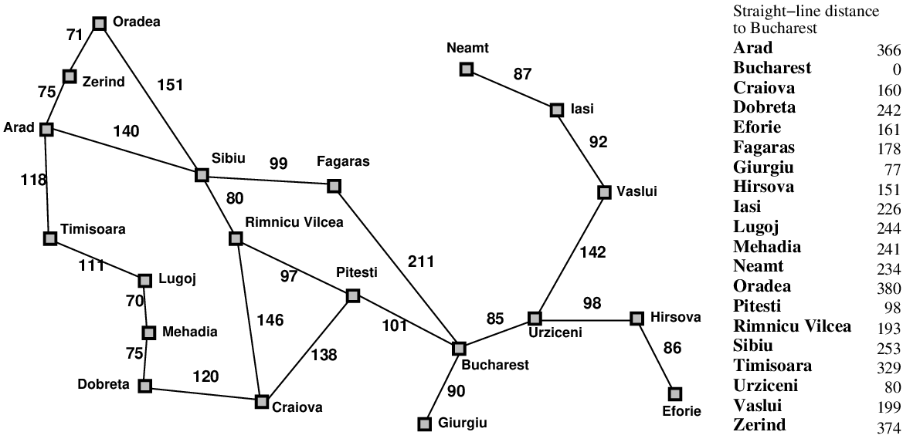

---
## Tìm kiếm tham lam (Greedy search)

Hàm đánh giá $h(n)$ (hàm k<u>h</u>ám phá - <u>h</u>euristic)
    
= ước lượng chi phí từ $n$ đến *đích* ($goal$)

Ví dụ, $h_{{\rm SLD}}(n)$ = khoảng cách đường chim bay từ $n$ đến Bucharest

Tìm kiếm tham lam phát triển nút *có vẻ* gần đích nhất

---
## Ví dụ tìm kiếm tham lam


---
## Ví dụ tìm kiếm tham lam


---
## Ví dụ tìm kiếm tham lam


---
## Ví dụ tìm kiếm tham lam


---
## Thuộc tính của tìm kiếm tham lam

<u>Đầy đủ (Complete)</u>??

<u>Thời gian (Time)</u>??

<u>Không gian bộ nhớ (Space)</u>??

<u>Tối ưu (Optimal)</u>??

---
## Thuộc tính của tìm kiếm tham lam

<u>Đầy đủ</u>?? Không -- có thể bị mắc kẹt trong các vòng lặp, ví dụ:
    
Iasi $\rightarrow$ Neamt $\rightarrow$ Iasi $\rightarrow$ Neamt $\rightarrow$

Sẽ đầy đủ trong không gian hữu hạn nếu có kiểm tra trạng thái lặp

<u>Thời gian</u>?? $O(b^m)$, nhưng một heuristic tốt có thể cải thiện đáng kể

<u>Không gian</u>?? $O(b^m)$ --- giữ tất cả các nút trong bộ nhớ

<u>Tối ưu</u>?? Không

---
## Tìm kiếm A$^*$

Ý tưởng: tránh phát triển các đường đi đã tốn kém

Hàm đánh giá $f(n) = g(n) + h(n)$

$g(n)$ = chi phí tính đến hiện tại để đạt đến $n$

$h(n)$ = chi phí ước tính đến đích từ $n$

$f(n)$ = tổng chi phí ước tính của đường đi qua $n$ đến đích

Tìm kiếm A$^*$ sử dụng một heuristic *chấp nhận được* (admissible)

nghĩa là, $h(n) \leq h^*(n)$ trong đó $h^*(n)$ là chi phí *thực tế* từ $n$.

Ví dụ, $h_{{\rm SLD}}(n)$ không bao giờ đánh giá quá cao khoảng cách đường bộ thực tế

<u>Định lý</u>: Tìm kiếm A$^*$ là tối ưu

---
## Ví dụ tìm kiếm A$^*$


---
## Ví dụ tìm kiếm A$^*$


---
## Ví dụ tìm kiếm A$^*$


---
## Ví dụ tìm kiếm A$^*$


---
## Ví dụ tìm kiếm A$^*$


---
## Ví dụ tìm kiếm A$^*$


---
## Tính tối ưu của A$^*$ (chứng minh tiêu chuẩn)

Giả sử một nút đích không tối ưu $G_2$ đã được sinh ra
và đang ở trong hàng đợi. Gọi $n$ là một nút chưa được phát triển
nằm trên đường đi ngắn nhất đến đích tối ưu $G_1$.

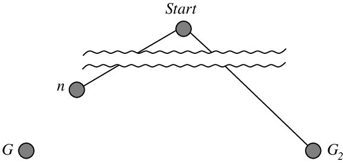

\begin{eqnarray*}
f(G_2) & = &  g(G_2) &nbsp;&nbsp;&nbsp;&nbsp;  \mbox{vì } h(G_2) = 0 

       & > &  g(G_1) &nbsp;&nbsp;&nbsp;&nbsp;  \mbox{vì } G_2 \mbox{ là không tối ưu} 

      &\geq& f(n)    &nbsp;&nbsp;&nbsp;&nbsp;  \mbox{vì } h \mbox{ là chấp nhận được} 
\end{eqnarray*}

Vì $f(G_2) > f(n)$, A$^*$ sẽ không bao giờ chọn $G_2$ để phát triển

---
## Tính tối ưu của A$^*$ (hữu ích hơn)

<u>Bổ đề</u>: A$^*$ phát triển các nút theo thứ tự giá trị $f$ tăng dần

Từ từ thêm các "đường đồng mức $f$" của các nút (so sánh với tìm kiếm chiều rộng thêm các lớp)

Đường đồng mức $i$ chứa tất cả các nút có $f=f_i$, trong đó $f_i < f_{i+1}$

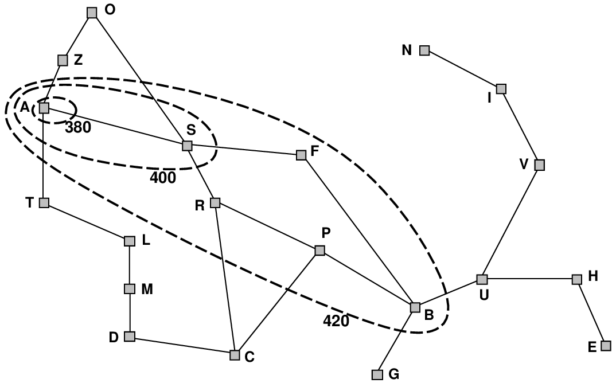

---
## Thuộc tính của A$^*$

<u>Đầy đủ</u>?? Có, trừ khi có vô số nút với $f \leq f(G)$

<u>Thời gian</u>?? Hàm mũ theo [sai số tương đối của $h$ $\times$ chiều dài của giải pháp]

<u>Không gian</u>?? Giữ tất cả các nút trong bộ nhớ

<u>Tối ưu</u>?? Có --- không thể phát triển $f_{i+1}$ cho đến khi $f_i$ hoàn tất

---
## Chứng minh bổ đề: Pathmax

Đối với một số heuristic chấp nhận được, $f$ có thể *giảm* dọc theo một đường đi

Ví dụ, giả sử $n'$ là một nút kế tiếp của $n$

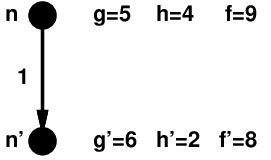

Nhưng điều này ném bỏ thông tin!

$f(n)=9 \Rightarrow$ chi phí thực sự của đường đi qua $n$ là $\geq 9$

Do đó chi phí thực sự của đường đi qua $n'$ cũng $\geq 9$

Điều chỉnh Pathmax cho A$^*$:

Thay vì $f(n') = g(n') + h(n')$, sử dụng $f(n') = max(g(n') + h(n'), f(n))$

Với pathmax, $f$ luôn không giảm dọc theo bất kỳ đường đi nào

---
## Các heuristic chấp nhận được

Ví dụ, cho bài toán 8-puzzle (trò chơi xếp số 8 ô):

$h_1(n)$ = số ô đặt sai vị trí

$h_2(n)$ = tổng khoảng cách <u>Manhattan</u>
    
(tức là tổng số ô vuông từ vị trí hiện tại đến vị trí mong muốn của mỗi ô)

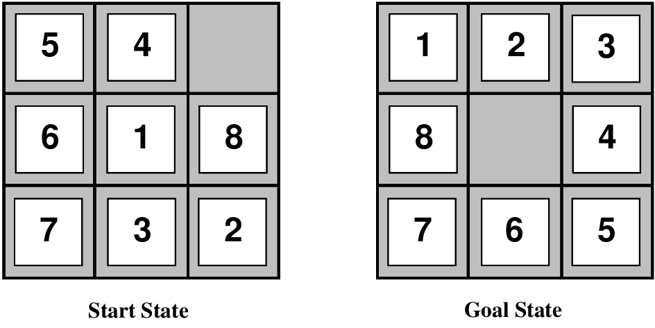

<u>$h_1(S)$ =</u>?? 

<u>$h_2(S)$ =</u>?? 

---
## Các heuristic chấp nhận được

Ví dụ, cho bài toán 8-puzzle:

$h_1(n)$ = số ô đặt sai vị trí

$h_2(n)$ = tổng khoảng cách <u>Manhattan</u>
    
(tức là tổng số ô vuông từ vị trí hiện tại đến vị trí mong muốn của mỗi ô)


<u>$h_1(S)$ =</u>?? 7

<u>$h_2(S)$ =</u>?? 2+3+3+2+4+2+0+2 = 18

---
## Sự vượt trội (Dominance)

Nếu $h_2(n) \geq h_1(n)$ với mọi $n$ (cả hai đều chấp nhận được)

thì $h_2$ *vượt trội* $h_1$ và tốt hơn cho quá trình tìm kiếm

Chi phí tìm kiếm điển hình:

| &nbsp; | &nbsp; |
|---|---|
| $d=14$ | IDS = 3,473,941 nút |
|  | A$^*(h_1)$ = 539 nút |
|  | A$^*(h_2)$ = 113 nút |
| $d=14$ | IDS = quá nhiều nút |
|  | A$^*(h_1)$ = 39,135 nút |
|  | A$^*(h_2)$ = 1,641 nút |

---
## Bài toán nới lỏng (Relaxed problems)

Các heuristic chấp nhận được có thể được suy ra từ chi phí giải pháp

*chính xác* của phiên bản *nới lỏng* của bài toán

Nếu các quy tắc của bài toán 8-puzzle được nới lỏng để một ô có thể di chuyển
*bất cứ nơi đâu*, thì $h_1(n)$ cho ta giải pháp ngắn nhất

Nếu các quy tắc được nới lỏng để một ô có thể di chuyển đến *bất kỳ ô
kề cạnh nào*, thì $h_2(n)$ cho ta giải pháp ngắn nhất

Đối với bài toán Người giao hàng (TSP): gọi đường đi là *bất kỳ* cấu trúc nào nối tất cả các thành phố
    
$\Longrightarrow$ heuristic là cây khung nhỏ nhất (minimum spanning tree)

---
## Thuật toán cải tiến lặp (Iterative improvement algorithms)

Trong nhiều bài toán tối ưu hóa, *đường đi* không quan trọng;

bản thân trạng thái đích chính là giải pháp

Khi đó, không gian trạng thái = tập các cấu hình "đầy đủ";
    
tìm cấu hình *tối ưu*, ví dụ TSP
    
hoặc tìm cấu hình thỏa mãn ràng buộc, ví dụ n-quân hậu

Trong những trường hợp này, có thể sử dụng các thuật toán *cải tiến lặp*;

giữ một trạng thái "hiện tại" duy nhất, và cố gắng cải thiện nó

Không gian bộ nhớ không đổi, thích hợp cho cả tìm kiếm trực tuyến và ngoại tuyến

---
## Ví dụ: Bài toán Người giao hàng (TSP)

Tìm hành trình ngắn nhất đi qua mỗi thành phố đúng một lần

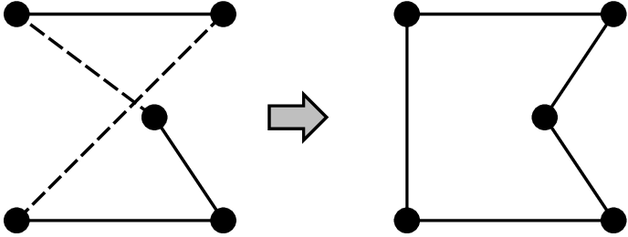

---
## Ví dụ: Bài toán $n$-quân hậu

Đặt $n$ quân hậu trên bàn cờ $n \times n$ sao cho không có hai quân hậu nào nằm
trên cùng một

hàng, cột, hoặc đường chéo

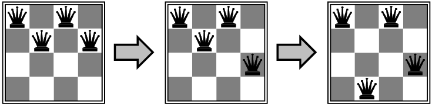

---
## Leo đồi (Hill-climbing / gradient ascent / descent)

"Giống như leo đỉnh Everest trong màn sương mù dày đặc với chứng mất trí nhớ"

```text
function Hill-Climbing(problem) returns một trạng thái giải pháp
      inputs: problem, một bài toán
      local: current, một nút
      local: next, một nút

    current <- Make-Node(Initial-State[problem])
    loop do
          next <- một nút kế tiếp có giá trị cao nhất của current
          if Value[next] $<$ Value[current] then return current
          current <- next
    end
```

---
## Leo đồi (tiếp)

Vấn đề: tùy thuộc vào trạng thái ban đầu, có thể bị mắc kẹt ở cực đại cục bộ (local maxima)

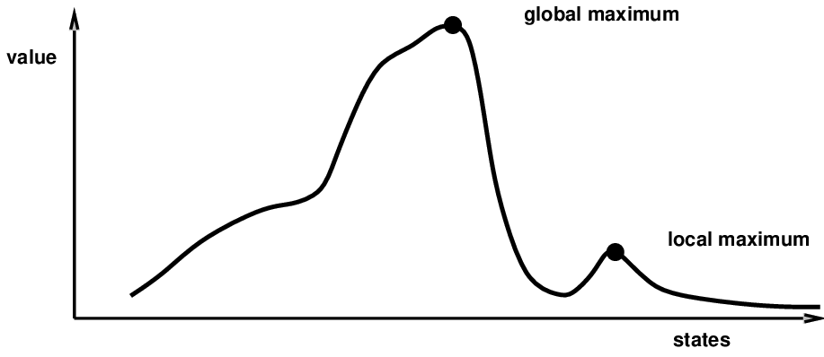

---
## Luyện kim mô phỏng (Simulated annealing)

Ý tưởng: thoát khỏi cực đại cục bộ bằng cách cho phép một số bước đi "tồi"

*nhưng giảm dần kích thước và tần suất của chúng*

```text
function Simulated-Annealing(problem, schedule) returns một trạng thái giải pháp
      inputs: problem, một bài toán
      inputs: schedule, một ánh xạ từ thời gian sang "nhiệt độ"
      local: current, một nút
      local: next, một nút
      local: T, một "nhiệt độ" kiểm soát xác suất của các bước đi xuống

    current <- Make-Node(Initial-State[problem])
    for t 1 to infinity do
          T <- schedule[t]
          if T=0 then return current
          next <- một nút kế tiếp được chọn ngẫu nhiên của current
          $\Delta$E <- Value[next] -- Value[current]
          if $\Delta$E $>$ 0 then current <- next
          else current <- next chỉ với xác suất $e^{\DeltaE/T}$
```

---
## Thuộc tính của luyện kim mô phỏng

Ở một "nhiệt độ" cố định $T$, xác suất chiếm hữu trạng thái đạt đến

phân bố Boltzman
\[
p(x) = 
  pha e^{\frac{E(x)}{kT}}
\]
$T$ giảm đủ chậm $\Longrightarrow$ luôn đạt được trạng thái tốt nhất

<u>Đây có nhất thiết là một sự đảm bảo thú vị không?</u>??

Được phát triển bởi Metropolis và cộng sự vào năm 1953, dùng cho mô phỏng quá trình vật lý

Được sử dụng rộng rãi trong thiết kế bố trí VLSI, lập lịch hàng không, v.v.

\usepackage{aima-slides}
\usepackage[utf8]{inputenc}
\usepackage[T5]{fontenc}
\usepackage{lmodern}

# Bài toán thỏa mãn ràng buộc (CSP)

## Chương 3, Phần 7 và Chương 4, Phần 4.4

---
## Nội dung

- Các ví dụ về CSP

- Tìm kiếm tổng quát áp dụng cho CSP

- Quay lui (Backtracking)

- Kiểm tra tới (Forward checking)

- Heuristic cho CSP

---
## Bài toán thỏa mãn ràng buộc (CSP)

Bài toán tìm kiếm chuẩn:
  
<u>Trạng thái</u> là một "hộp đen"---một cấu trúc dữ liệu cũ bất kỳ
    
hỗ trợ kiểm tra đích, đánh giá, sinh trạng thái kế tiếp

CSP (Constraint Satisfaction Problems):
  
<u>Trạng thái</u> được định nghĩa bởi các *biến* $V_i$
   có *giá trị* thuộc *miền giá trị* $D_i$
  
\ 
  
<u>Kiểm tra đích</u> là một tập hợp các *ràng buộc* quy định
    
   các tổ hợp giá trị cho phép đối với các tập con của các biến

Ví dụ đơn giản về một *ngôn ngữ biểu diễn hình thức*

Cho phép các thuật toán *đa năng* hữu ích có sức mạnh lớn hơn

các thuật toán tìm kiếm tiêu chuẩn

---
## Ví dụ: Bài toán 4 quân hậu dưới dạng CSP

Giả sử mỗi cột có một quân hậu. Mỗi quân hậu sẽ nằm ở hàng nào?

<u>Các biến</u> $Q_1$, $Q_2$, $Q_3$, $Q_4$ 

<u>Miền giá trị</u> $D_i = \{1,2,3,4\}$

<u>Các ràng buộc</u>
  
$Q_i \neq Q_j$ (không thể ở cùng hàng)
  
$|Q_i - Q_j| \neq |i-j|$ (hoặc cùng đường chéo)

 
in
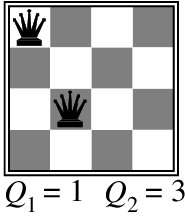

Dịch mỗi ràng buộc thành tập các giá trị cho phép đối với các biến của nó

Ví dụ: các giá trị cho $(Q_1,Q_2)$ là 
$(1,3)\ (1,4)\ (2,4)\ (3,1)\ (4,1)\ (4,2)$

---
## Đồ thị ràng buộc

*CSP nhị phân (Binary CSP)*: mỗi ràng buộc liên kết tối đa hai biến

*Đồ thị ràng buộc*: các nút là các biến, các cung thể hiện các ràng buộc

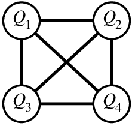

---
## Ví dụ: Số học mật mã (Cryptarithmetic)

<u>Các biến</u>
  
$D\ E\ M\ N\ O\ R\ S\ Y$

<u>Miền giá trị</u>
  
$\{0,1,2,3,4,5,6,7,8,9\}$

 

  S E N D

+ M O R E

\hline
M O N E Y

<u>Các ràng buộc</u>
  
$M\neq 0$, $S\neq 0$ (*ràng buộc một ngôi*)
  
$Y = D+E$ hoặc $Y=D+E-10$, v.v.
  
$D\neq E$, $D\neq M$, $D\neq N$, v.v.

---
## Ví dụ: Tô màu bản đồ

Tô màu một bản đồ sao cho không có hai quốc gia kề nhau nào có cùng màu

<u>Các biến</u>
  
Các quốc gia $C_i$

<u>Miền giá trị</u>
  
$\{Đỏ, Xanh\ dương, Xanh\ lá\}$

<u>Các ràng buộc</u>
  
$C_1 \neq C_2$, $C_1 \neq C_5$, v.v.

 
in
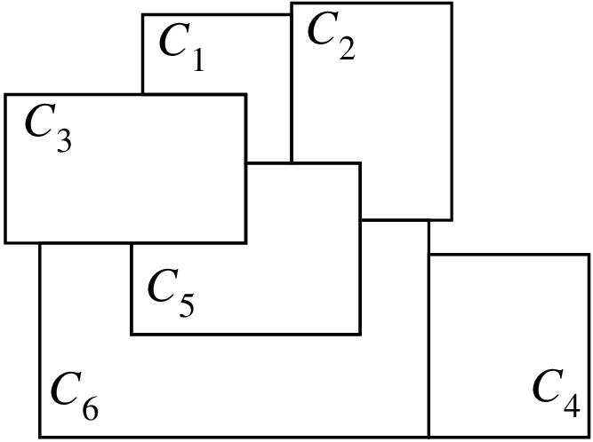

Đồ thị ràng buộc:

 
in
\raisebox{-2.5in}[0pt][0pt]{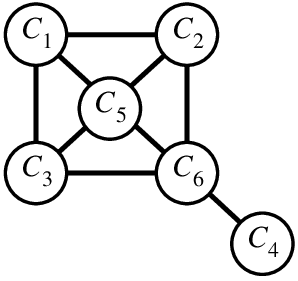}

---
## Các CSP trong thế giới thực

Bài toán phân công
  
    ví dụ: ai dạy lớp nào

Bài toán xếp thời khóa biểu
  
    ví dụ: lớp nào được cung cấp khi nào và ở đâu?

Cấu hình phần cứng

Bảng tính (Spreadsheets)

Lập lịch vận tải

Lập lịch nhà máy

Thiết kế sơ đồ mặt bằng (Floorplanning)

Lưu ý rằng nhiều bài toán trong thế giới thực liên quan đến các biến có giá trị thực

---
## Áp dụng tìm kiếm tiêu chuẩn

Hãy bắt đầu với một phương pháp đơn giản, ngốc nghếch, sau đó sửa chữa nó

Các trạng thái được xác định bởi các giá trị đã được gán cho đến hiện tại

<u>Trạng thái ban đầu</u>: tất cả các biến đều chưa được gán

<u>Toán tử</u>: gán một giá trị cho một biến chưa được gán

<u>Kiểm tra đích</u>: tất cả các biến đã được gán, không có ràng buộc nào bị vi phạm

Lưu ý rằng điều này giống nhau đối với tất cả các CSP!

---
## Cài đặt

Trạng thái CSP theo dõi các biến nào đã có giá trị cho đến thời điểm hiện tại

Mỗi biến có một miền và một giá trị hiện tại

```text
datatype CSP-State
    components: Unassigned, danh sách các biến chưa được gán
            Assigned, danh sách các biến đã có giá trị

datatype CSP-Var
    components: Name, phục vụ cho mục đích i/o
            Domain, danh sách các giá trị có thể
            Value, giá trị hiện tại (nếu có)
```

Các ràng buộc có thể được biểu diễn
  
<u>rõ ràng</u> dưới dạng tập hợp các giá trị cho phép, hoặc
  
<u>ngầm định</u> bởi một hàm kiểm tra sự thỏa mãn ràng buộc

---
## Tìm kiếm tiêu chuẩn áp dụng cho tô màu bản đồ

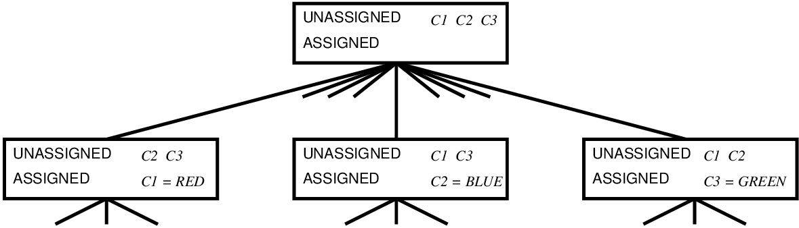

---
## Độ phức tạp của phương pháp ngốc nghếch

<u>Độ sâu tối đa của không gian $m = {</u>??$}

<u>Độ sâu của trạng thái đích $d = {</u>??$}

<u>Thuật toán tìm kiếm sử dụng</u>??

<u>Hệ số phân nhánh $b = {</u>??$}

Điều này có thể được cải thiện đáng kể bằng cách lưu ý những điều sau:

1) Thứ tự gán không quan trọng, do đó nhiều đường đi là tương đương nhau

2) Việc thêm các phép gán không thể khắc phục một ràng buộc đã bị vi phạm

---
## Độ phức tạp của phương pháp ngốc nghếch

<u>Độ sâu tối đa của không gian $m = {</u>??$} $n$ (số lượng biến)

<u>Độ sâu của trạng thái đích $d = {</u>??$} $n$ (tất cả các biến đều được gán)

<u>Thuật toán tìm kiếm sử dụng</u>?? tìm kiếm theo chiều sâu (depth-first)

<u>Hệ số phân nhánh $b = {</u>??$} $\mysum_i |D_i|$ (ở trên cùng của cây)

Điều này có thể được cải thiện đáng kể bằng cách lưu ý những điều sau:

1) Thứ tự gán không quan trọng, do đó nhiều đường đi là tương đương nhau

2) Việc thêm các phép gán không thể khắc phục một ràng buộc đã bị vi phạm

---
## Tìm kiếm quay lui (Backtracking search)

Sử dụng tìm kiếm theo chiều sâu, nhưng
  
1) cố định thứ tự gán, ${} \implies b = |D_i|$
    
   (có thể được thực hiện trong hàm **Successors**)
  
2) kiểm tra sự vi phạm ràng buộc

Kiểm tra vi phạm ràng buộc có thể được thực hiện theo hai cách:
  
1) sửa đổi hàm **Successors** để chỉ gán những giá trị
    
   được phép, với những giá trị đã được gán trước đó
  
hoặc 2) kiểm tra các ràng buộc có được thỏa mãn trước khi phát triển một trạng thái

Tìm kiếm quay lui là thuật toán không có thông tin cơ bản cho các CSP

Có thể giải bài toán $n$-quân hậu với $n \approx 15$

---
## Kiểm tra tới (Forward checking)

<u>Ý tưởng</u>: Theo dõi các giá trị hợp lệ còn lại cho các biến chưa được gán

\phantom{<u>Ý tưởng</u>: }Dừng tìm kiếm khi bất kỳ biến nào không còn giá trị hợp lệ nào

Ví dụ tô màu bản đồ được đơn giản hóa:

\hline
   **đỏ**   **xanh\ dương**   **xanh\ lá** 

\hline
$C_1$          

\hline
$C_2$          

\hline
$C_3$          

\hline
$C_4$          

\hline
$C_5$          

\hline

&
in
\raisebox{-1in}[0pt][0pt]{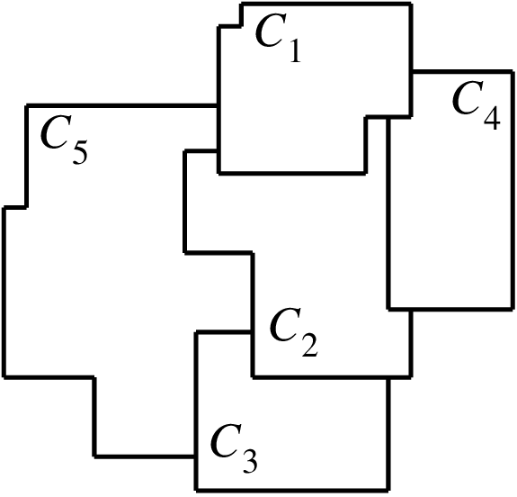}

Có thể giải bài toán $n$-quân hậu lên đến $n \approx 30$

\pheading{}

.

.

.

\hline
   \phantom{**đỏ**}   \phantom{**xanh\ dương**}   \phantom{**xanh\ lá**} 

\hline
\phantom{$C_1$}   \tick        

\hline
\phantom{$C_2$}   \cross       

\hline
\phantom{$C_3$}          

\hline
\phantom{$C_4$}   \cross       

\hline
\phantom{$C_5$}   \cross       

\hline

&

\pheading{}

.

.

.

\hline
   \phantom{**đỏ**}   \phantom{**xanh\ dương**}   \phantom{**xanh\ lá**} 

\hline
\phantom{$C_1$}          

\hline
\phantom{$C_2$}      \tick    

\hline
\phantom{$C_3$}      \cross    

\hline
\phantom{$C_4$}      \cross    

\hline
\phantom{$C_5$}      \cross    

\hline

&

\pheading{}

.

.

.

\hline
   \phantom{**đỏ**}   \phantom{**xanh\ dương**}   \phantom{**xanh\ lá**} 

\hline
\phantom{$C_1$}          

\hline
\phantom{$C_2$}          

\hline
\phantom{$C_3$}         \tick 

\hline
\phantom{$C_4$}          

\hline
\phantom{$C_5$}         \cross 

\hline

&

---
## Heuristic cho CSP

Các quyết định thông minh hơn về việc
  
chọn giá trị nào cho mỗi biến
  
biến nào sẽ được gán tiếp theo

<u>Cho $C_1 \eq Đỏ$, $C_2 \eq Xanh\ lá$, chọn $C_3 \eq$</u>??
  
.

<u>Cho $C_1 \eq Đỏ$, $C_2 \eq Xanh\ lá$, tiếp theo chọn biến nào</u>??
  
.

 
in


Có thể giải bài toán $n$-quân hậu cho $n \approx 1000$

---
## Heuristic cho CSP

Các quyết định thông minh hơn về việc
  
chọn giá trị nào cho mỗi biến
  
biến nào sẽ được gán tiếp theo

<u>Cho $C_1 \eq Đỏ$, $C_2 \eq Xanh\ lá$, chọn $C_3 \eq$</u>??
  
$C_3 \eq Xanh\ lá$: *giá-trị-ràng-buộc-ít-nhất (least-constraining-value)*

<u>Cho $C_1 \eq Đỏ$, $C_2 \eq Xanh\ lá$, tiếp theo chọn biến nào</u>??
  
$C_5$: *biến-bị-ràng-buộc-nhiều-nhất (most-constrained-variable)*

 
in


Có thể giải bài toán $n$-quân hậu cho $n \approx 1000$

---
## Thuật toán lặp cho CSP

Leo đồi, luyện kim mô phỏng thường hoạt động với

các trạng thái "đầy đủ", tức là tất cả các biến đã được gán

Để áp dụng cho CSP:
  
cho phép các trạng thái với các ràng buộc không được thỏa mãn
  
toán tử *gán lại* (reassign) các giá trị của biến

Lựa chọn biến: chọn ngẫu nhiên bất kỳ biến nào đang có xung đột

<u>Heuristic *xung-đột-nhỏ-nhất</u> (min-conflicts)*:
  
chọn giá trị vi phạm ít ràng buộc nhất
  
tức là leo đồi với $h(n)$ = tổng số ràng buộc bị vi phạm

---
## Ví dụ: Bài toán 4 quân hậu

<u>Trạng thái</u>: 4 quân hậu trong 4 cột (có $4^4 = 256$ trạng thái)

<u>Toán tử</u>: di chuyển quân hậu trong cột

<u>Kiểm tra đích</u>: không có sự tấn công nào

<u>Đánh giá</u>: $h(n)$ = số lượng các cuộc tấn công

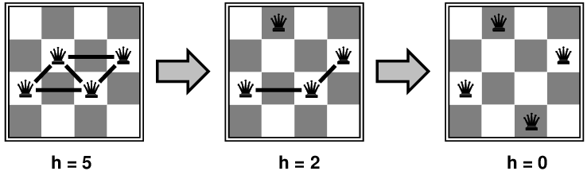

---
## Hiệu suất của min-conflicts

Với trạng thái khởi tạo ngẫu nhiên, có thể giải bài toán $n$-quân hậu trong thời gian
gần như hằng số đối với bất kỳ $n$ nào với xác suất cao (ví dụ: $n$ = 10,000,000)

Điều tương tự có vẻ cũng đúng cho bất kỳ CSP được sinh ngẫu nhiên nào

<u>ngoại trừ</u> trong một phạm vi hẹp của tỷ lệ
\[
R = \frac{\mbox{số lượng ràng buộc}}{\mbox{số lượng biến}}
\]

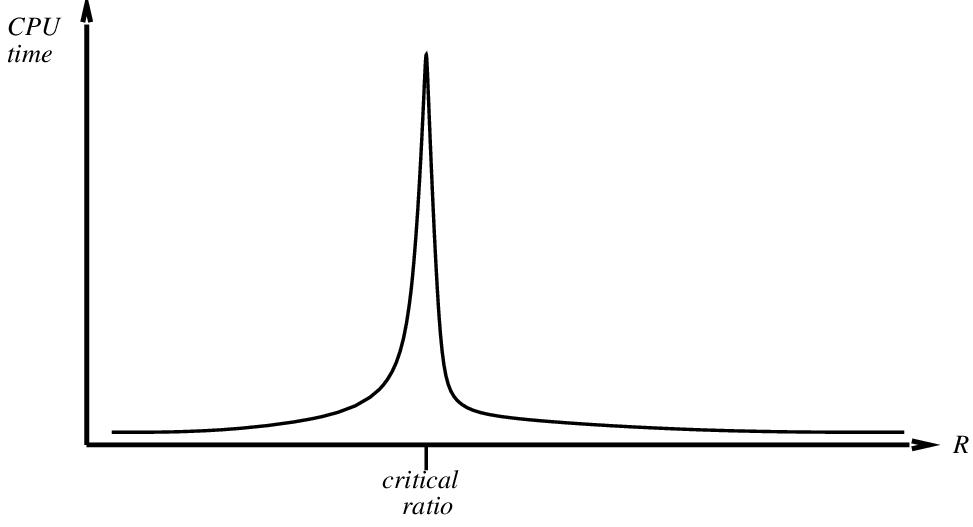

---
## CSP có cấu trúc cây (Tree-structured CSPs)

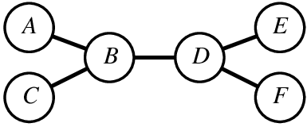

<u>Định lý</u>: nếu đồ thị ràng buộc không có vòng lặp (loop), CSP có thể được giải trong 
thời gian $O(n|D|^2)$

So sánh với các CSP tổng quát, nơi thời gian xấu nhất là $O(|D|^n)$

Thuộc tính này cũng áp dụng cho suy luận logic và xác suất:

một ví dụ quan trọng về mối quan hệ giữa
những hạn chế về cú pháp và độ phức tạp của suy luận.

---
## Thuật toán cho các CSP có cấu trúc cây

Bước cơ bản được gọi là *lọc (filtering)*:

$**Filter**(V_i,\, V_j)$
  
loại bỏ các giá trị của $V_i$ không nhất quán với TẤT CẢ các giá trị của $V_j$

Ví dụ về lọc:

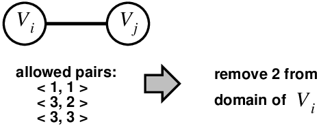

---
## Thuật toán (tiếp)


1) Sắp xếp các nút theo chiều rộng (breadth-first) bắt đầu từ bất kỳ nút lá nào:

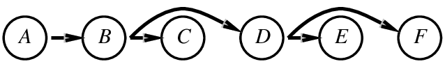

2) Đối với $j = n$ giảm xuống $1$, áp dụng $**Filter**(V_i,\, V_j)$
trong đó $V_i$ là nút cha của $V_j$

3) Đối với $j = 1$ tăng lên $n$, chọn giá trị hợp lệ cho $V_j$ với giá trị của nút cha đã cho

---
## Tóm tắt

CSP là một loại bài toán đặc biệt:
  
trạng thái được xác định bằng các giá trị của một tập hợp các biến cố định
  
kiểm tra đích được xác định bởi các *ràng buộc* trên giá trị của các biến

Quay lui (Backtracking) = tìm kiếm theo chiều sâu với
  
1) thứ tự biến cố định
  
2) chỉ có các trạng thái kế tiếp hợp lệ

Kiểm tra tới (Forward checking) ngăn chặn các phép gán chắc chắn dẫn đến thất bại sau này

Heuristic để chọn thứ tự biến và chọn giá trị giúp ích đáng kể

Cải tiến lặp min-conflicts <u>thường</u> có hiệu quả trong thực tế

Các CSP có cấu trúc cây <u>luôn luôn</u> có thể được giải quyết rất hiệu quả


#### **Trắc nghiệm**
*(Chưa có bài tập trắc nghiệm)*

#### **Pseudocode**
- [HILL-CLIMBING](codeAndExercises/aima-pseudocode-master/md/Hill-Climbing.md)
- [SIMULATED-ANNEALING](codeAndExercises/aima-pseudocode-master/md/Simulated-Annealing.md)
- [GENETIC-ALGORITHM](codeAndExercises/aima-pseudocode-master/md/Genetic-Algorithm.md)
- [AND-OR-GRAPH-SEARCH](codeAndExercises/aima-pseudocode-master/md/And-Or-Graph-Search.md)
- [ONLINE-DFS-AGENT](codeAndExercises/aima-pseudocode-master/md/Online-DFS-Agent.md)
- [LRTA*-AGENT](codeAndExercises/aima-pseudocode-master/md/LRTAStar-Agent.md)

*(Thư mục chứa mã giả cho các thuật toán trong sách: `codeAndExercises/aima-pseudocode-master/md`)*

#### **Python**
- [Search](codeAndExercises/aima-python-master/notebooks/search.ipynb)
- [Search (Python File)](codeAndExercises/aima-python-master/notebooks/search.py)


#### **Bài tập**

##### Bài tập 4.1

Give the name of the algorithm that results from each of the following
special cases:<br>

1.  Local beam search with $k = 1$.<br>

2.  Local beam search with one initial state and no limit on the number
    of states retained.<br>

3.  Simulated annealing with $T = 0$ at all times (and omitting the
    termination test).<br>

4.  Simulated annealing with $T=\infty$ at all times.<br>

5.  Genetic algorithm with population size $N = 1$.<br>


---

##### Bài tập 4.2

Exercise <a class="exerciseRef" href="{{ site.baseurl }}/search-exercises/ex_19/">brio-exercise</a> considers the problem of
building railway tracks under the assumption that pieces fit exactly
with no slack. Now consider the real problem, in which pieces don’t fit
exactly but allow for up to 10 degrees of rotation to either side of the
“proper” alignment. Explain how to formulate the problem so it could be
solved by simulated annealing.


---

##### Bài tập 4.3

In this exercise, we explore the use of local search methods to solve
TSPs of the type defined in Exercise <a class="exerciseRef" href="{{ site.baseurl }}/search-exercises/ex_38/">tsp-mst-exercise</a><br>

1.  Implement and test a hill-climbing method to solve TSPs. Compare the
    results with optimal solutions obtained from the A* algorithm with
    the MST heuristic (Exercise <a class="exerciseRef" href="{{ site.baseurl }}/search-exercises/ex_38/">tsp-mst-exercise</a>)<br>

2.  Repeat part (a) using a genetic algorithm instead of hill climbing.
    You may want to consult @Larranaga+al:1999 for some suggestions for representations.


---

##### Bài tập 4.4

Generate a large number of 8-puzzle and
8-queens instances and solve them (where possible) by hill climbing
(steepest-ascent and first-choice variants), hill climbing with random
restart, and simulated annealing. Measure the search cost and percentage
of solved problems and graph these against the optimal solution cost.
Comment on your results.


---

##### Bài tập 4.5

The <b>And-Or-Graph-Search</b> algorithm in
Figure <a class="insideBookFigRef" target="_blank" href="https://aimacode.github.io/aima-exercises/figures/and-or-graph-search-algorithm.png">and-or-graph-search-algorithm</a> checks for
repeated states only on the path from the root to the current state.
Suppose that, in addition, the algorithm were to store
<i>every</i> visited state and check against that list. (See in
Figure <a class="insideBookFigRef" href="#">breadth-first-search-algorithm</a> for an example.)
Determine the information that should be stored and how the algorithm
should use that information when a repeated state is found.
(*Hint*: You will need to distinguish at least between
states for which a successful subplan was constructed previously and
states for which no subplan could be found.) Explain how to use labels,
as defined in Section <a class="sectionRef" title="" href="#">cyclic-plan-section</a>, to avoid
having multiple copies of subplans.


---

##### Bài tập 4.6

Explain precisely how to modify the <b>And-Or-Graph-Search</b> algorithm to
generate a cyclic plan if no acyclic plan exists. You will need to deal
with three issues: labeling the plan steps so that a cyclic plan can
point back to an earlier part of the plan, modifying <b>Or-Search</b> so that it
continues to look for acyclic plans after finding a cyclic plan, and
augmenting the plan representation to indicate whether a plan is cyclic.
Show how your algorithm works on (a) the slippery vacuum world, and (b)
the slippery, erratic vacuum world. You might wish to use a computer
implementation to check your results.


---

##### Bài tập 4.7

In Section <a class="sectionRef" title="" href="#">conformant-section</a> we introduced belief
states to solve sensorless search problems. A sequence of actions solves
a sensorless problem if it maps every physical state in the initial
belief state $b$ to a goal state. Suppose the agent knows $h^\*(s)$, the
true optimal cost of solving the physical state $s$ in the fully
observable problem, for every state $s$ in $b$. Find an admissible
heuristic $h(b)$ for the sensorless problem in terms of these costs, and
prove its admissibilty. Comment on the accuracy of this heuristic on the
sensorless vacuum problem of
Figure <a class="insideBookFigRef" target="_blank" href="https://aimacode.github.io/aima-exercises/figures/vacuum2-sets-figure.png">vacuum2-sets-figure</a>. How well does A* perform?


---

##### Bài tập 4.8

This exercise explores
subset–superset relations between belief states in sensorless or
partially observable environments.<br>

1.  Prove that if an action sequence is a solution for a belief state
    $b$, it is also a solution for any subset of $b$. Can anything be
    said about supersets of $b$?<br>

2.  Explain in detail how to modify graph search for sensorless problems
    to take advantage of your answers in (a).<br>

3.  Explain in detail how to modify and–or search for
    partially observable problems, beyond the modifications you describe
    in (b).<br>


---

##### Bài tập 4.9

On page <a class="pageRef" title="" href="#">multivalued-sensorless-page</a> it was assumed
that a given action would have the same cost when executed in any
physical state within a given belief state. (This leads to a
belief-state search problem with well-defined step costs.) Now consider
what happens when the assumption does not hold. Does the notion of
optimality still make sense in this context, or does it require
modification? Consider also various possible definitions of the “cost”
of executing an action in a belief state; for example, we could use the
<i>minimum</i> of the physical costs; or the
<i>maximum</i>; or a cost <i>interval</i> with the lower
bound being the minimum cost and the upper bound being the maximum; or
just keep the set of all possible costs for that action. For each of
these, explore whether A* (with modifications if necessary) can return
optimal solutions.


---

##### Bài tập 4.10

Consider the sensorless version of the
erratic vacuum world. Draw the belief-state space reachable from the
initial belief state $\{1,2,3,4,5,6,7,8\}$, and explain why the
problem is unsolvable.


---

##### Bài tập 4.11

Consider the sensorless version of the
erratic vacuum world. Draw the belief-state space reachable from the
initial belief state $\{ 1,3,5,7 \}$, and explain why the problem
is unsolvable.


---

##### Bài tập 4.12

We can turn the navigation problem in
Exercise <a class="exerciseRef" href="{{ site.baseurl }}/search-exercises/ex_9/">path-planning-exercise</a> into an environment as
follows:<br>

-   The percept will be a list of the positions, <i>relative to the
    agent</i>, of the visible vertices. The percept does
    <i>not</i> include the position of the robot! The robot must
    learn its own position from the map; for now, you can assume that
    each location has a different “view.”<br>

-   Each action will be a vector describing a straight-line path
    to follow. If the path is unobstructed, the action succeeds;
    otherwise, the robot stops at the point where its path first
    intersects an obstacle. If the agent returns a zero motion vector
    and is at the goal (which is fixed and known), then the environment
    teleports the agent to a <i>random location</i> (not inside
    an obstacle).<br>

-   The performance measure charges the agent 1 point for each unit of
    distance traversed and awards 1000 points each time the goal
    is reached.<br>

1.  Implement this environment and a problem-solving agent for it. After
    each teleportation, the agent will need to formulate a new problem,
    which will involve discovering its current location.<br>

2.  Document your agent’s performance (by having the agent generate
    suitable commentary as it moves around) and report its performance
    over 100 episodes.<br>

3.  Modify the environment so that 30% of the time the agent ends up at
    an unintended destination (chosen randomly from the other visible
    vertices if any; otherwise, no move at all). This is a crude model
    of the motion errors of a real robot. Modify the agent so that when
    such an error is detected, it finds out where it is and then
    constructs a plan to get back to where it was and resume the
    old plan. Remember that sometimes getting back to where it was might
    also fail! Show an example of the agent successfully overcoming two
    successive motion errors and still reaching the goal.<br>

4.  Now try two different recovery schemes after an error: (1) head for
    the closest vertex on the original route; and (2) replan a route to
    the goal from the new location. Compare the performance of the three
    recovery schemes. Would the inclusion of search costs affect the
    comparison?<br>

5.  Now suppose that there are locations from which the view
    is identical. (For example, suppose the world is a grid with
    square obstacles.) What kind of problem does the agent now face?
    What do solutions look like?


---

##### Bài tập 4.13

Suppose that an agent is in a $3 \times 3$
maze environment like the one shown in
Figure <a class="insideBookFigRef"  target="_blank" href="https://aimacode.github.io/aima-exercises/figures/maze-3x3-figure.png">maze-3x3-figure</a>. The agent knows that its
initial location is (1,1), that the goal is at (3,3), and that the
actions <i>Up</i>, <i>Down</i>, <i>Left</i>, <i>Right</i> have their usual
effects unless blocked by a wall. The agent does <i>not</i> know
where the internal walls are. In any given state, the agent perceives
the set of legal actions; it can also tell whether the state is one it
has visited before.<br>

1.  Explain how this online search problem can be viewed as an offline
    search in belief-state space, where the initial belief state
    includes all possible environment configurations. How large is the
    initial belief state? How large is the space of belief states?<br>

2.  How many distinct percepts are possible in the initial state?<br>

3.  Describe the first few branches of a contingency plan for this
    problem. How large (roughly) is the complete plan?<br>

Notice that this contingency plan is a solution for <i>every
possible environment</i> fitting the given description. Therefore,
interleaving of search and execution is not strictly necessary even in
unknown environments.


---

##### Bài tập 4.14

Suppose that an agent is in a $3 \times 3$
maze environment like the one shown in
Figure <a class="insideBookFigRef" target="_blank" href="https://aimacode.github.io/aima-exercises/figures/maze-3x3-figure.png">maze-3x3-figure</a>. The agent knows that its
initial location is (3,3), that the goal is at (1,1), and that the four
actions *Up*, *Down*, *Left*, *Right* have their usual
effects unless blocked by a wall. The agent does *not* know
where the internal walls are. In any given state, the agent perceives
the set of legal actions; it can also tell whether the state is one it
has visited before or is a new state.<br>

1.  Explain how this online search problem can be viewed as an offline
    search in belief-state space, where the initial belief state
    includes all possible environment configurations. How large is the
    initial belief state? How large is the space of belief states?<br>

2.  How many distinct percepts are possible in the initial state?<br>

3.  Describe the first few branches of a contingency plan for this
    problem. How large (roughly) is the complete plan?<br>

Notice that this contingency plan is a solution for *every
possible environment* fitting the given description. Therefore,
interleaving of search and execution is not strictly necessary even in
unknown environments.


---

##### Bài tập 4.15

In this exercise, we examine hill climbing
in the context of robot navigation, using the environment in
Figure <a class="insideBookFigRef" target="_blank" href="https://aimacode.github.io/aima-exercises/figures/geometric-scene-figure.png">geometric-scene-figure</a> as an example.<br>

1.  Repeat Exercise <a class="exerciseRef" href="{{ site.baseurl }}/advanced-search-exercises/ex_11/">path-planning-agent-exercise</a> using
    hill climbing. Does your agent ever get stuck in a local minimum? Is
    it *possible* for it to get stuck with convex
    obstacles?<br>

2.  Construct a nonconvex polygonal environment in which the agent
    gets stuck.<br>

3.  Modify the hill-climbing algorithm so that, instead of doing a
    depth-1 search to decide where to go next, it does a
    depth-$k$ search. It should find the best $k$-step path and do one
    step along it, and then repeat the process.<br>

4.  Is there some $k$ for which the new algorithm is guaranteed to
    escape from local minima?<br>

5.  Explain how LRTA enables the agent to escape from local minima in
    this case.<br>


---

##### Bài tập 4.16

Like DFS, online DFS is incomplete for reversible state spaces with
infinite paths. For example, suppose that states are points on the
infinite two-dimensional grid and actions are unit vectors $(1,0)$,
$(0,1)$, $(-1,0)$, $(0,-1)$, tried in that order. Show that online DFS
starting at $(0,0)$ will not reach $(1,-1)$. Suppose the agent can
observe, in addition to its current state, all successor states and the
actions that would lead to them. Write an algorithm that is complete
even for bidirected state spaces with infinite paths. What states does
it visit in reaching $(1,-1)$?


---

##### Bài tập 4.17

Relate the time complexity of LRTA* to its space complexity.


---


<!-- tabs:end -->
