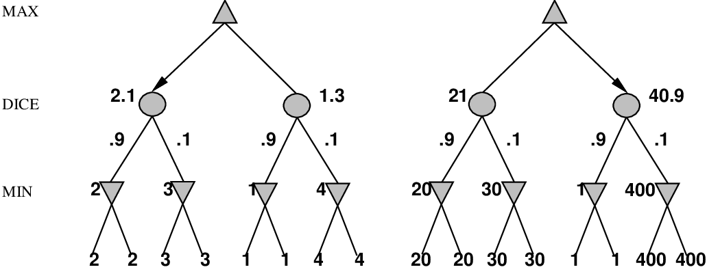

# Chapter 05 Constraint Satisfaction Problems

<!-- tabs:start -->

#### **Tiếng Việt**
<div class="pdf-container">
  <iframe src="TaiLieu/ebooks_Chapters_Vi3/Chapter_05/chapter_05_vi.html" width="100%" height="100%"></iframe>
</div>

#### **Tiếng Anh**
<div class="pdf-container">
  <iframe src="TaiLieu/ebooks_Chapters/Chapter_05_Constraint%20Satisfaction%20Problems.pdf" width="100%" height="100%"></iframe>
</div>

#### **Slide**

\usepackage{aima-slides}
\usepackage[utf8]{inputenc}
\usepackage[T5]{fontenc}
\usepackage{lmodern}

# Chơi trò chơi (Game playing)

## Chương 5, Phần 1--5

---
## Nội dung

- Chơi hoàn hảo (Perfect play)

- Giới hạn tài nguyên (Resource limits)

- Tỉa nhánh $
  pha$--$\beta$ ($
  pha$--$\beta$ pruning)

- Trò chơi may rủi (Games of chance)

---
## Trò chơi so với Bài toán tìm kiếm

Đối thủ "không thể đoán trước" $\Rightarrow$ giải pháp là một kế hoạch dự phòng

Giới hạn thời gian $\Rightarrow$ khó có thể tìm thấy đích, phải xấp xỉ

Kế hoạch tấn công:
\begin{itemize}
\item thuật toán chơi hoàn hảo (Von Neumann, 1944)
\item chân trời hữu hạn (finite horizon), đánh giá xấp xỉ (Zuse, 1945; Shannon, 1950; Samuel, 1952--57)
\item tỉa nhánh để giảm chi phí (McCarthy, 1956)
\end{itemize}

---
## Các loại trò chơi


---
## Minimax

Chơi hoàn hảo đối với các trò chơi tất định, thông tin hoàn hảo

Ý tưởng: chọn bước đi đến vị trí có *giá trị minimax* cao nhất
    
= phần thưởng đạt được tốt nhất khi chống lại lối chơi tốt nhất của đối thủ

Ví dụ, trò chơi 2 lượt (2-ply):


---
## Thuật toán Minimax

```text
function Minimax-Decision(game) returns một toán tử

    for each op in Operators[game] do
          Value[op] <- Minimax-Value(Apply(op, game), game)
    end
    return op có Value[op] cao nhất
\fnsep
function Minimax-Value(state, game) returns một giá trị tiện ích

    if Terminal-Test[game](state) then
          return Utility[game](state)
    else if đến lượt **max** di chuyển trong state then
          return Minimax-Value cao nhất của Successors(state)
    else 
          return Minimax-Value thấp nhất của Successors(state)
```

---
## Thuộc tính của minimax

<u>Đầy đủ (Complete)</u>??

<u>Tối ưu (Optimal)</u>??

<u>Độ phức tạp thời gian (Time complexity)</u>??

<u>Độ phức tạp không gian (Space complexity)</u>??

---
## Thuộc tính của minimax

<u>Đầy đủ</u>?? Có, nếu cây là hữu hạn (cờ vua có các quy tắc cụ thể cho việc này)

<u>Tối ưu</u>?? Có, khi chơi với một đối thủ tối ưu. Nếu không thì sao??

<u>Độ phức tạp thời gian</u>?? $O(b^m)$

<u>Độ phức tạp không gian</u>?? $O(bm)$ (duyệt theo chiều sâu)

Đối với cờ vua, $b\approx 35$, $m \approx 100$ cho các ván cờ "hợp lý"
    
$\Rightarrow$ giải pháp chính xác là hoàn toàn không khả thi

---
## Giới hạn tài nguyên

Giả sử chúng ta có 100 giây, duyệt $10^4$ nút/giây
    
$\Rightarrow$ <u>$10^6$</u> nút mỗi nước đi

Phương pháp tiêu chuẩn:
\begin{itemize}
\item *kiểm tra cắt cụt (cutoff test)*
    
ví dụ, giới hạn độ sâu (có thể thêm *tìm kiếm tĩnh - quiescence search*)
\item *hàm đánh giá (evaluation function)*
    
= mức độ mong muốn ước tính của vị trí
\end{itemize}

---
## Hàm đánh giá


Đối với cờ vua, thông thường là tổng trọng số *tuyến tính* của các <u>đặc trưng</u> (features)
\[
**Eval**(s) = w_1 f_1(s) + w_2 f_2(s) + \ldots + w_n f_n(s)
\]
ví dụ, $w_1 = 9$ với 

$f_1(s)$ = (số lượng quân hậu trắng) -- (số lượng quân hậu đen)

v.v.

---
## Bàn luận: Các giá trị chính xác không quan trọng


Hành vi được bảo toàn dưới bất kỳ phép biến đổi *đơn điệu* (monotonic) nào của
**Eval**

Chỉ có thứ tự là quan trọng:
    
phần thưởng trong các trò chơi tất định hoạt động như một hàm *hữu dụng thứ bậc* (ordinal utility)

---
## Cắt cụt tìm kiếm

**MinimaxCutoff** giống hệt **MinimaxValue** ngoại trừ
    
1. **Terminal?** được thay thế bằng **Cutoff?**
    
2. **Utility** được thay thế bằng **Eval**

Nó có hoạt động trong thực tế không?
\[
b^m = 10^6, &nbsp;&nbsp;  b=35 &nbsp;&nbsp;  \Rightarrow  &nbsp;&nbsp;  m=4
\]
Dự đoán trước 4 lượt (4-ply) là một người chơi cờ vô vọng!

4-ply $\approx$ người mới chơi

8-ply $\approx$ PC điển hình, kiện tướng con người

12-ply $\approx$ Deep Blue, Kasparov

---
## Ví dụ tỉa nhánh $
  pha$--$\beta$


---
## Ví dụ tỉa nhánh $
  pha$--$\beta$


---
## Ví dụ tỉa nhánh $
  pha$--$\beta$


---
## Ví dụ tỉa nhánh $
  pha$--$\beta$


---
## Ví dụ tỉa nhánh $
  pha$--$\beta$


---
## Thuộc tính của $
  pha$--$\beta$

Tỉa nhánh *không* ảnh hưởng đến kết quả cuối cùng

Thứ tự nước đi tốt sẽ cải thiện hiệu quả của việc tỉa nhánh

Với "thứ tự hoàn hảo", độ phức tạp thời gian = $O(b^{m/2})$
    
$\Rightarrow$ *tăng gấp đôi* độ sâu tìm kiếm
    
$\Rightarrow$ có thể dễ dàng đạt đến độ sâu 8 và chơi cờ tốt

Một ví dụ đơn giản về giá trị của việc suy luận xem tính toán nào là 
có liên quan (một dạng *siêu suy luận - metareasoning*)

---
## Tại sao nó được gọi là $
  pha$--$\beta$?


$
  pha$ là giá trị tốt nhất (đối với **max**) được tìm thấy cho đến nay ngoài đường đi hiện tại

Nếu $V$ tệ hơn $
  pha$, **max** sẽ tránh nó
$\Rightarrow$ tỉa bỏ nhánh đó

Định nghĩa $\beta$ tương tự cho **min**

---
## Thuật toán $
  pha$--$\beta$

Về cơ bản là **Minimax** + theo dõi $
  pha$, $\beta$ + tỉa nhánh

```text
function Max-Value(state, game, $
  pha$, $\beta$) returns giá trị minimax của state
      inputs: state, trạng thái hiện tại trong trò chơi
      inputs: game, mô tả trò chơi
      inputs: $
  pha$, điểm tốt nhất cho **max dọc theo đường đi đến state**
      inputs: $\beta$, điểm tốt nhất cho **min dọc theo đường đi đến state**

    if Cutoff-Test(state) then return Eval(state)
    for each s in Successors(state) do
          $
  pha$ <- Max($
  pha$, Min-Value(s, game, $
  pha$, $\beta$))
          if $
  pha \geq \beta$ then return $\beta$ 
    end
    return $
  pha$
\fnsep
function Min-Value(state, game, $
  pha$, $\beta$) returns giá trị minimax của state

    if Cutoff-Test(state) then return Eval(state)
    for each s in Successors(state) do
          $\beta$ <- Min($\beta$, Max-Value(s, game, $
  pha$, $\beta$))
          if $\beta \leq 
  pha$ then return $
  pha$ 
    end
    return $\beta$
```

---
## Các trò chơi tất định trong thực tế

Cờ đam (Checkers): Chinook đã chấm dứt sự thống trị 40 năm của nhà vô địch thế giới con người Marion
Tinsley vào năm 1994. Đã sử dụng một cơ sở dữ liệu tàn cuộc xác định lối chơi hoàn hảo cho
tất cả các vị trí có từ 8 quân cờ trở xuống trên bàn, tổng cộng
443.748.401.247 vị trí.

Cờ vua (Chess): Deep Blue đã đánh bại nhà vô địch thế giới con người Gary Kasparov
trong một trận đấu sáu ván vào năm 1997. Deep Blue tìm kiếm 200 triệu vị trí
mỗi giây, sử dụng đánh giá rất tinh vi và các phương pháp không được tiết lộ để
mở rộng một số nhánh tìm kiếm lên đến 40 lượt (40 ply).

Othello: các nhà vô địch con người từ chối thi đấu với máy tính, vì chúng
quá giỏi.

Cờ vây (Go): các nhà vô địch con người từ chối thi đấu với máy tính, vì chúng quá
tệ. Trong cờ vây, $b > 300$, vì vậy hầu hết các chương trình sử dụng cơ sở tri thức mẫu (pattern) để
đề xuất các nước đi hợp lý.

---
## Các trò chơi không tất định (Nondeterministic games)

Ví dụ, trong cờ sáu trong (backgammon), việc tung xúc xắc quyết định các nước đi hợp lệ

Ví dụ đơn giản hóa với việc tung đồng xu thay vì tung xúc xắc:


---
## Thuật toán cho các trò chơi không tất định

**Expectiminimax** đưa ra lối chơi hoàn hảo

Giống hệt như **Minimax**, ngoại trừ việc chúng ta cũng phải xử lý các nút cơ hội (chance nodes):

$\ldots$

\key{if} \var{state} là một nút cơ hội \key{then}
    
   \key{return} trung bình của **ExpectiMinimax-Value** của **Successors**(\var{state})

$\ldots$

Một phiên bản tỉa nhánh $
  pha$--$\beta$ là có thể

nhưng chỉ khi các giá trị ở nút lá bị giới hạn. <u>Tại sao?</u>??

---
## Các trò chơi không tất định trong thực tế

Việc tung xúc xắc làm tăng $b$: có 21 kết quả có thể xảy ra khi tung 2 xúc xắc

Cờ sáu trong (Backgammon) $\approx$ 20 nước đi hợp lệ (có thể lên tới 6.000 với kết quả tung là 1-1)
\[
\mbox{độ sâu}\ 4 = 20 \times (21 \times 20)^3 \approx 1.2\times 10^9
\]

Khi độ sâu tăng lên, xác suất đạt tới một nút cụ thể sẽ co lại
    
$\Rightarrow$ giá trị của việc dự đoán trước (lookahead) bị giảm đi

Tỉa nhánh $
  pha$--$\beta$ ít hiệu quả hơn nhiều

**TDGammon** sử dụng tìm kiếm ở độ sâu 2 + **Eval** rất tốt
    
$\approx$ ở mức độ vô địch thế giới

---
## Bàn luận: Các giá trị chính xác CÓ quan trọng



Hành vi chỉ được bảo toàn qua phép biến đổi *tuyến tính dương* của
**Eval**

Do đó, **Eval** nên tỷ lệ thuận với phần thưởng kỳ vọng (expected payoff)

---
## Tóm tắt

Các trò chơi rất thú vị để nghiên cứu! (và nguy hiểm)

Chúng minh họa một số điểm quan trọng về AI

- sự hoàn hảo là không thể đạt được $\Rightarrow$ phải xấp xỉ

- một ý tưởng hay là nghĩ về việc cần suy nghĩ về điều gì

- sự không chắc chắn ràng buộc việc gán các giá trị cho các trạng thái

Trò chơi đối với AI cũng giống như đua xe grand prix đối với thiết kế ô tô


#### **Trắc nghiệm**
*(Chưa có bài tập trắc nghiệm)*

#### **Pseudocode**
- [MINIMAX-SEARCH](codeAndExercises/aima-pseudocode-master/md/Minimax-Decision.md)
- [ALPHA-BETA-SEARCH](codeAndExercises/aima-pseudocode-master/md/Alpha-Beta-Search.md)
- [MONTE-CARLO-TREE-SEARCH](codeAndExercises/aima-pseudocode-master/md/Monte-Carlo-Tree-Search.md)

*(Thư mục chứa mã giả cho các thuật toán trong sách: `codeAndExercises/aima-pseudocode-master/md`)*

#### **Python**
- [Csp](codeAndExercises/aima-python-master/notebooks/csp.ipynb)
- [Csp (Python File)](codeAndExercises/aima-python-master/notebooks/csp.py)
- [Arc Consistency Heuristics](codeAndExercises/aima-python-master/notebooks/arc_consistency_heuristics.ipynb)
- [Arc Consistency Heuristics (Python File)](codeAndExercises/aima-python-master/notebooks/arc_consistency_heuristics.py)


#### **Bài tập**

##### Bài tập 5.1

Suppose you have an oracle, $OM(s)$, that correctly predicts the
opponent’s move in any state. Using this, formulate the definition of a
game as a (single-agent) search problem. Describe an algorithm for
finding the optimal move.


---

##### Bài tập 5.2

Consider the problem of solving two 8-puzzles.<br>

1.  Give a complete problem formulation in the style of
    Chapter <a class="chapterRef" title="" href="{{site.baseurl}}/search-exercises/">search-chapter.</a><br>

2.  How large is the reachable state space? Give an exact
    numerical expression.<br>

3.  Suppose we make the problem adversarial as follows: the two players
    take turns moving; a coin is flipped to determine the puzzle on
    which to make a move in that turn; and the winner is the first to
    solve one puzzle. Which algorithm can be used to choose a move in
    this setting?<br>

4.  Does the game eventually end, given optimal play? Explain.<br>
(a) A map where the cost of every edge is 1. Initially the pursuer $P$ is at
node <b>b</b> and the evader $E$ is at node <b>d</b> <br>(b) A partial game tree for this map.
Each node is labeled with the $P,E$ positions. $P$ moves first. Branches marked "?" have yet to be explored.
<figure>
  
  <figcaption><center><b>Pursuit evasion game Figure</b></center></figcaption>
</figure>


---

##### Bài tập 5.3

Imagine that, in Exercise <a class="exerciseRef" href="{{ site.baseurl }}/search-exercises/ex_5/">two-friends-exercise</a>, one of
the friends wants to avoid the other. The problem then becomes a
two-player game. We assume now that the players take turns moving. The
game ends only when the players are on the same node; the terminal
payoff to the pursuer is minus the total time taken. (The evader “wins”
by never losing.) An example is shown in Figure.
<a href="#pursuit-evasion-game-figure">pursuit-evasion-game-figure</a><br>


1.  Copy the game tree and mark the values of the terminal nodes.<br>

2.  Next to each internal node, write the strongest fact you can infer
    about its value (a number, one or more inequalities such as
    “$\geq 14$”, or a “?”).<br>

3.  Beneath each question mark, write the name of the node reached by
    that branch.<br>

4.  Explain how a bound on the value of the nodes in (c) can be derived
    from consideration of shortest-path lengths on the map, and derive
    such bounds for these nodes. Remember the cost to get to each leaf
    as well as the cost to solve it.<br>

5.  Now suppose that the tree as given, with the leaf bounds from (d),
    is evaluated from left to right. Circle those “?” nodes that would
    <i>not</i> need to be expanded further, given the bounds
    from part (d), and cross out those that need not be considered
    at all.<br>

6.  Can you prove anything in general about who wins the game on a map
    that is a tree?<br>


---

##### Bài tập 5.4

Describe and implement state
descriptions, move generators, terminal tests, utility functions, and
evaluation functions for one or more of the following stochastic games:
Monopoly, Scrabble, bridge play with a given contract, or Texas hold’em
poker.
<div id="game-playing-chance-exercise"></div>


---

##### Bài tập 5.5

Describe and implement a <i>real-time</i>,
<i>multiplayer</i> game-playing environment, where time is part
of the environment state and players are given fixed time allocations.


---

##### Bài tập 5.6

Discuss how well the standard approach to game playing would apply to
games such as tennis, pool, and croquet, which take place in a
continuous physical state space.


---

##### Bài tập 5.7

Prove the following assertion: For every
game tree, the utility obtained by max using minimax
decisions against a suboptimal min will never be lower than
the utility obtained playing against an optimal min. Can
you come up with a game tree in which max can do still
better using a <i>suboptimal</i> strategy against a suboptimal
min?
<br>
Player $A$ moves first. The two players take turns moving, and each
player must move his token to an open adjacent space in either
direction.  If the opponent occupies an adjacent space, then a player
may jump over the opponent to the next open space if any. (For
example, if $A$ is on 3 and $B$ is on 2, then $A$ may move back to 1.)
The game ends when one player reaches the opposite end of the board.
If player $A$ reaches space 4 first, then the value of the game to $A$
is $+1$; if player $B$ reaches space 1 first, then the value of the
game to $A$ is $-1$.
<figure>
  
  <figcaption><center><b>The starting position of a simple game.</b></center></figcaption>
</figure>


---

##### Bài tập 5.8

Consider the two-player game described in
Figure <a class="insideExerciseFigRef" href="#line-game4-figure">line-game4-figure</a><br>

1.  Draw the complete game tree, using the following conventions:<br>

    -   Write each state as $(s_A,s_B)$, where $s_A$ and $s_B$ denote
        the token locations.<br>

    -   Put each terminal state in a square box and write its game value
        in a circle.<br>

    -   Put <i>loop states</i> (states that already appear on
        the path to the root) in double square boxes. Since their value
        is unclear, annotate each with a “?” in a circle.<br>

2.  Now mark each node with its backed-up minimax value (also in
    a circle). Explain how you handled the “?” values and why.<br>

3.  Explain why the standard minimax algorithm would fail on this game
    tree and briefly sketch how you might fix it, drawing on your answer
    to (b). Does your modified algorithm give optimal decisions for all
    games with loops?<br>

4.  This 4-square game can be generalized to $n$ squares for any
    $n > 2$. Prove that $A$ wins if $n$ is even and loses if $n$ is odd.


---

##### Bài tập 5.9

This problem exercises the basic concepts of game playing, using
tic-tac-toe (noughts and crosses) as an example. We define
$X_n$ as the number of rows, columns, or diagonals with exactly $n$
$X$’s and no $O$’s. Similarly, $O_n$ is the number of rows, columns, or
diagonals with just $n$ $O$’s. The utility function assigns $+1$ to any
position with $X_3=1$ and $-1$ to any position with $O_3 = 1$. All other
terminal positions have utility 0. For nonterminal positions, we use a
linear evaluation function defined as ${Eval}(s) = 3X_2(s) + X_1(s) - (3O_2(s) + O_1(s))$. <br>

1.  Approximately how many possible games of tic-tac-toe are there?<br>

2.  Show the whole game tree starting from an empty board down to depth
    2 (i.e., one $X$ and one $O$ on the board), taking symmetry
    into account.<br>

3.  Mark on your tree the evaluations of all the positions at depth 2.<br>

4.  Using the minimax algorithm, mark on your tree the backed-up values
    for the positions at depths 1 and 0, and use those values to choose
    the best starting move.<br>

5.  Circle the nodes at depth 2 that would <i>not</i> be
    evaluated if alpha–beta pruning were applied, assuming the nodes are
    generated in the optimal order for alpha–beta pruning.<br>


---

##### Bài tập 5.10

Consider the family of generalized tic-tac-toe games, defined as
follows. Each particular game is specified by a set $\mathcal S$ of
<i>squares</i> and a collection $\mathcal W$ of <i>winning
positions.</i> Each winning position is a subset of $\mathcal S$.
For example, in standard tic-tac-toe, $\mathcal S$ is a set of 9 squares
and $\mathcal W$ is a collection of 8 subsets of $\cal W$: the three
rows, the three columns, and the two diagonals. In other respects, the
game is identical to standard tic-tac-toe. Starting from an empty board,
players alternate placing their marks on an empty square. A player who
marks every square in a winning position wins the game. It is a tie if
all squares are marked and neither player has won.<br>

1.  Let $N= |{\mathcal S}|$, the number of squares. Give an upper bound
    on the number of nodes in the complete game tree for generalized
    tic-tac-toe as a function of $N$.<br>

2.  Give a lower bound on the size of the game tree for the worst case,
    where ${\mathcal W} = {\{\,\}}$.<br>

3.  Propose a plausible evaluation function that can be used for any
    instance of generalized tic-tac-toe. The function may depend on
    $\mathcal S$ and $\mathcal W$.<br>

4.  Assume that it is possible to generate a new board and check whether
    it is a winning position in 100$N$ machine instructions and assume a
    2 gigahertz processor. Ignore memory limitations. Using your
    estimate in (a), roughly how large a game tree can be completely
    solved by alpha–beta in a second of CPU time? a minute? an hour?


---

##### Bài tập 5.11

Develop a general game-playing program, capable of playing a variety of
games.<br>

1.  Implement move generators and evaluation functions for one or more
    of the following games: Kalah, Othello, checkers, and chess.<br>

2.  Construct a general alpha–beta game-playing agent.<br>

3.  Compare the effect of increasing search depth, improving move
    ordering, and improving the evaluation function. How close does your
    effective branching factor come to the ideal case of perfect move
    ordering?<br>

4.  Implement a selective search algorithm, such as B\* <a class="paperRef" title="" href="">Berliner:1979</a>,
    conspiracy number search @McAllester:1988, or MGSS\*
    <a class="paperRef" title="" href="">Russell+Wefald:1989</a> and compare its performance to A\*.


---

##### Bài tập 5.12

Describe how the minimax and alpha–beta algorithms change for
two-player, non-zero-sum games in which each player has a distinct
utility function and both utility functions are known to both players.
If there are no constraints on the two terminal utilities, is it
possible for any node to be pruned by alpha–beta? What if the player’s
utility functions on any state differ by at most a constant $k$, making
the game almost cooperative?


---

##### Bài tập 5.13

Describe how the minimax and alpha–beta algorithms change for
two-player, non-zero-sum games in which each player has a distinct
utility function and both utility functions are known to both players.
If there are no constraints on the two terminal utilities, is it
possible for any node to be pruned by alpha–beta? What if the player’s
utility functions on any state sum to a number between constants $-k$
and $k$, making the game almost zero-sum?


---

##### Bài tập 5.14

Develop a formal proof of correctness for alpha–beta pruning. To do
this, consider the situation shown in
Figure <a class="insideExerciseFigRef" href="#alpha-beta-proof-figure">alpha-beta-proof-figure</a>. The question is whether
to prune node $n_j$, which is a max-node and a descendant of node $n_1$.
The basic idea is to prune it if and only if the minimax value of $n_1$
can be shown to be independent of the value of $n_j$.<br>

1.  Mode $n_1$ takes on the minimum value among its children:
    $n_1 = \min(n_2,n_{{21}},\ldots,n_{2b_2})$. Find a similar
    expression for $n_2$ and hence an expression for $n_1$ in terms of
    $n_j$.<br>

2.  Let $l_i$ be the minimum (or maximum) value of the nodes to the
    <i>left</i> of node $n_i$ at depth $i$, whose minimax value
    is already known. Similarly, let $r_i$ be the minimum (or maximum)
    value of the unexplored nodes to the right of $n_i$ at depth $i$.
    Rewrite your expression for $n_1$ in terms of the $l_i$ and
    $r_i$ values.<br>

3.  Now reformulate the expression to show that in order to affect
    $n_1$, $n_j$ must not exceed a certain bound derived from the
    $l_i$ values.<br>

4.  Repeat the process for the case where $n_j$ is a min-node.<br>
<figure>
  
  <figcaption><center><b>Situation when considering whether to prune node $n_j$.</b></center></figcaption>
</figure>


---

##### Bài tập 5.15

Prove that the alpha–beta algorithm takes time $O(b^{m/2})$ with optimal
move ordering, where $m$ is the maximum depth of the game tree.


---

##### Bài tập 5.16

Suppose you have a chess program that can evaluate 5 million nodes per
second. Decide on a compact representation of a game state for storage
in a transposition table. About how many entries can you fit in a
1-gigabyte in-memory table? Will that be enough for the three minutes of
search allocated for one move? How many table lookups can you do in the
time it would take to do one evaluation? Now suppose the transposition
table is stored on disk. About how many evaluations could you do in the
time it takes to do one disk seek with standard disk hardware?


---

##### Bài tập 5.17

Suppose you have a chess program that can evaluate 10 million nodes per
second. Decide on a compact representation of a game state for storage
in a transposition table. About how many entries can you fit in a
2-gigabyte in-memory table? Will that be enough for the three minutes of
search allocated for one move? How many table lookups can you do in the
time it would take to do one evaluation? Now suppose the transposition
table is stored on disk. About how many evaluations could you do in the
time it takes to do one disk seek with standard disk hardware?<br>


<figure>
  
  <figcaption><center><b>The complete game tree for a trivial game with chance nodes..</b></center></figcaption>
</figure>


---

##### Bài tập 5.18

This question considers pruning in games with chance nodes.
Figure <a class="insideExerciseFigRef" href="#trivial-chance-game-figure">trivial-chance-game-figure</a> shows the complete
game tree for a trivial game. Assume that the leaf nodes are to be
evaluated in left-to-right order, and that before a leaf node is
evaluated, we know nothing about its value—the range of possible values
is $-\infty$ to $\infty$.<br>

1.  Copy the figure, mark the value of all the internal nodes, and
    indicate the best move at the root with an arrow.<br>

2.  Given the values of the first six leaves, do we need to evaluate the
    seventh and eighth leaves? Given the values of the first seven
    leaves, do we need to evaluate the eighth leaf? Explain
    your answers.<br>

3.  Suppose the leaf node values are known to lie between –2 and 2
    inclusive. After the first two leaves are evaluated, what is the
    value range for the left-hand chance node?<br>

4.  Circle all the leaves that need not be evaluated under the
    assumption in (c).<br>


---

##### Bài tập 5.19

Implement the expectiminimax algorithm and the \*-alpha–beta algorithm,
which is described by <a class="paperRef" title="" href="">Ballard:1983</a>, for pruning game trees with chance nodes. Try
them on a game such as backgammon and measure the pruning effectiveness
of \*-alpha–beta.


---

##### Bài tập 5.20

Prove that with a positive linear
transformation of leaf values (i.e., transforming a value $x$ to
$ax + b$ where $a > 0$), the choice of move remains unchanged in a game
tree, even when there are chance nodes.


---

##### Bài tập 5.21

Consider the following procedure
for choosing moves in games with chance nodes:<br>

-   Generate some dice-roll sequences (say, 50) down to a suitable depth
    (say, 8).<br>

-   With known dice rolls, the game tree becomes deterministic. For each
    dice-roll sequence, solve the resulting deterministic game tree
    using alpha–beta.<br>

-   Use the results to estimate the value of each move and to choose
    the best.<br>

Will this procedure work well? Why (or why not)?<br>


---

##### Bài tập 5.22

In the following, a “max” tree consists only of max nodes, whereas an
“expectimax” tree consists of a max node at the root with alternating
layers of chance and max nodes. At chance nodes, all outcome
probabilities are nonzero. The goal is to <i>find the value of the
root</i> with a bounded-depth search. For each of (a)–(f), either
give an example or explain why this is impossible.<br>

1.  Assuming that leaf values are finite but unbounded, is pruning (as
    in alpha–beta) ever possible in a max tree?<br>

2.  Is pruning ever possible in an expectimax tree under the same
    conditions?<br>

3.  If leaf values are all nonnegative, is pruning ever possible in a
    max tree? Give an example, or explain why not.<br>

4.  If leaf values are all nonnegative, is pruning ever possible in an
    expectimax tree? Give an example, or explain why not.<br>

5.  If leaf values are all in the range $[0,1]$, is pruning ever
    possible in a max tree? Give an example, or explain why not.<br>

6.  If leaf values are all in the range $[0,1]$, is pruning ever
    possible in an expectimax tree?1<br>

7.  Consider the outcomes of a chance node in an expectimax tree. Which
    of the following evaluation orders is most likely to yield pruning
    opportunities?<br>

    i.  Lowest probability first<br>

    ii.  Highest probability first<br>

    iii.  Doesn’t make any difference<br>


---

##### Bài tập 5.23

In the following, a “max” tree consists only of max nodes, whereas an
“expectimax” tree consists of a max node at the root with alternating
layers of chance and max nodes. At chance nodes, all outcome
probabilities are nonzero. The goal is to <i>find the value of the
root</i> with a bounded-depth search.<br>

1.  Assuming that leaf values are finite but unbounded, is pruning (as
    in alpha–beta) ever possible in a max tree? Give an example, or
    explain why not.<br>

2.  Is pruning ever possible in an expectimax tree under the same
    conditions? Give an example, or explain why not.<br>

3.  If leaf values are constrained to be in the range $[0,1]$, is
    pruning ever possible in a max tree? Give an example, or explain
    why not.<br>

4.  If leaf values are constrained to be in the range $[0,1]$, is
    pruning ever possible in an expectimax tree? Give an example
    (qualitatively different from your example in (e), if any), or
    explain why not.<br>

5.  If leaf values are constrained to be nonnegative, is pruning ever
    possible in a max tree? Give an example, or explain why not.<br>

6.  If leaf values are constrained to be nonnegative, is pruning ever
    possible in an expectimax tree? Give an example, or explain why not.<br>

7.  Consider the outcomes of a chance node in an expectimax tree. Which
    of the following evaluation orders is most likely to yield pruning
    opportunities: (i) Lowest probability first; (ii) Highest
    probability first; (iii) Doesn’t make any difference?


---

##### Bài tập 5.24

Which of the following are true and which are false? Give brief
explanations.<br>

1.  In a fully observable, turn-taking, zero-sum game between two
    perfectly rational players, it does not help the first player to
    know what strategy the second player is using—that is, what move the
    second player will make, given the first player’s move.<br>

2.  In a partially observable, turn-taking, zero-sum game between two
    perfectly rational players, it does not help the first player to
    know what move the second player will make, given the first
    player’s move.<br>

3.  A perfectly rational backgammon agent never loses.<br>


---

##### Bài tập 5.25

Consider carefully the interplay of chance events and partial
information in each of the games in
Exercise <a class="exerciseRef" href="{{ site.baseurl }}/game-playing-exercises/ex_4/">game-playing-chance-exercise</a>.<br>

1.  For which is the standard expectiminimax model appropriate?
    Implement the algorithm and run it in your game-playing agent, with
    appropriate modifications to the game-playing environment.<br>

2.  For which would the scheme described in
    Exercise <a href="#ex5.21">game-playing-monte-carlo-exercise</a> be
    appropriate?<br>

3.  Discuss how you might deal with the fact that in some of the games,
    the players do not have the same knowledge of the current state.<br>


---


<!-- tabs:end -->
