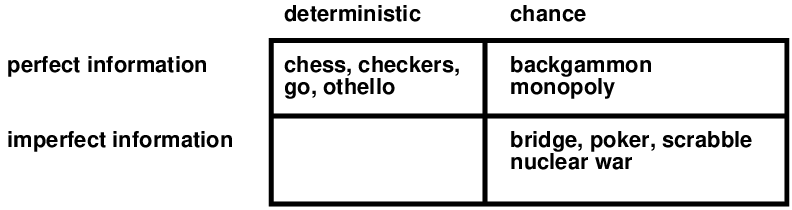
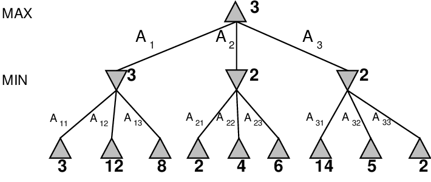
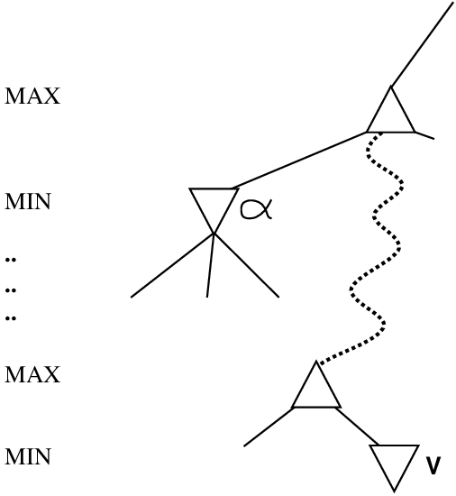
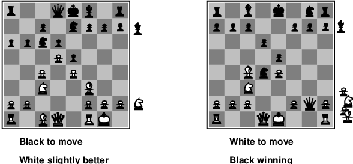
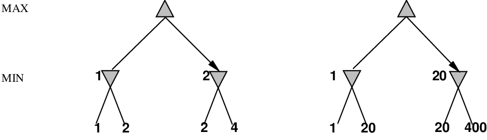
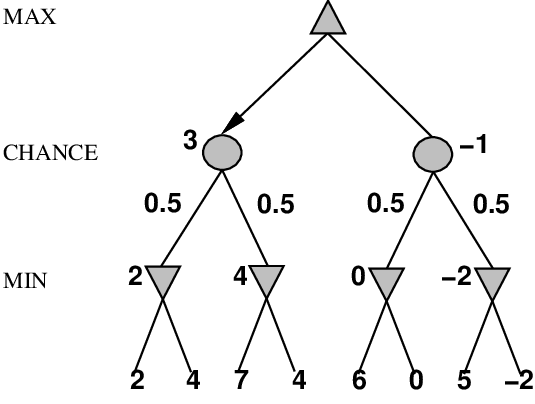

# Chapter 06 Adversarial Search And Games

<!-- tabs:start -->

#### **Tiếng Việt**
<div class="pdf-container">
  <iframe src="TaiLieu/ebooks_Chapters_Vi3/Chapter_06/chapter_06_vi.html" width="100%" height="100%"></iframe>
</div>

#### **Tiếng Anh**
<div class="pdf-container">
  <iframe src="TaiLieu/ebooks_Chapters/Chapter_06_Adversarial%20Search%20And%20Games.pdf" width="100%" height="100%"></iframe>
</div>

#### **Slide**

\usepackage{fleqn}
\usepackage{epsf}
\usepackage[dvips]{color}
\usepackage{aima2e-slides}

# Game playing

## Chapter 6

---
## Phác thảo

- Trò chơi

- Lối chơi hoàn hảo
    
-- quyết định tối đa 
    
-- $
  pha$--$\beta$ cắt tỉa

- Giới hạn tài nguyên và đánh giá gần đúng

- Trò chơi may rủi

- Trò chơi thông tin không hoàn hảo

---
## Trò chơi và  vấn đề tìm kiếm

Giải pháp "Không thể đoán trước" đối thủ $\Rightarrow$ là \note{chiến lược}

chỉ định một nước đi cho mọi câu trả lời có thể có của đối thủ

Giới hạn thời gian $\Rightarrow$ khó có thể tìm được mục tiêu, phải xấp xỉ

Kế hoạch tấn công:
\begin{itemize}
\item Máy tính xem xét các lối chơi có thể có (Babbage, 1846)
\item Thuật toán chơi hoàn hảo (Zermelo, 1912; Von Neumann, 1944)
\item Chân trời hữu hạn, đánh giá gần đúng (Zuse, 1945; Wiener, 1948; 

      Shannon, 1950)
\item Chương trình cờ vua đầu tiên (Turing, 1951)
\item Học máy để nâng cao độ chính xác trong đánh giá (Samuel, 1952--57)
\item Cắt tỉa để cho phép tìm kiếm sâu hơn (McCarthy, 1956)
\end{itemize}

---
## Các loại trò chơi



---
## Cây trò chơi (2 người chơi, xác định, lượt)


---
## Cực tiểu

Chơi hoàn hảo cho các trò chơi xác định, thông tin hoàn hảo

Ý tưởng: chọn di chuyển đến vị trí có giá trị \defn{minimax cao nhất}
    
= phần thưởng tốt nhất có thể đạt được khi chơi tốt nhất

Ví dụ: trò chơi 2 lớp:

,8\textwidth


---
## Thuật toán Minimax

```text
function Minimax-Decision(state) returns an action
      inputs: state, current state in game

    return the a in Actions(state) maximizing Min-Value(Result(a, state))
\fnsep
function Max-Value(state) returns a utility value
    if Terminal-Test(state) then return Utility(state)
    v <- \(-infinity\)
    for a, s in Successors(state) do v <- Max(v, Min-Value(s))
    return v
\fnsep
function Min-Value(state) returns a utility value
    if Terminal-Test(state) then return Utility(state)
    v <- \(infinity\)
    for a, s in Successors(state) do v <- Min(v, Max-Value(s))
    return v
```

---
## Tính chất của minimax

<u>Hoàn thành</u>?? 

---
## Tính chất của minimax

<u>Hoàn thành</u>?? Chỉ khi cây là hữu hạn (cờ vua có các quy tắc cụ thể cho việc này).
    
NB một chiến lược hữu hạn có thể tồn tại ngay cả trong một cây vô hạn!

<u>Tối ưu</u>?? 

---
## Tính chất của minimax

<u>Complete</u>?? Có, nếu cây hữu hạn (cờ vua có các quy tắc cụ thể cho việc này)

<u>Tối ưu</u>?? Có, chống lại đối thủ tối ưu. Nếu không thì??

<u>Độ phức tạp về thời gian</u>?? 

---
## Tính chất của minimax

<u>Complete</u>?? Có, nếu cây hữu hạn (cờ vua có các quy tắc cụ thể cho việc này)

<u>Tối ưu</u>?? Có, chống lại đối thủ tối ưu. Nếu không thì??

<u>Độ phức tạp về thời gian</u>?? \mat{$O(b^m)$}

<u>Độ phức tạp của không gian</u>?? 

---
## Tính chất của minimax

<u>Complete</u>?? Có, nếu cây hữu hạn (cờ vua có các quy tắc cụ thể cho việc này)

<u>Tối ưu</u>?? Có, chống lại đối thủ tối ưu. Nếu không thì??

<u>Độ phức tạp về thời gian</u>?? \mat{$O(b^m)$}

<u>Độ phức tạp của không gian</u>?? \mat{$O(bm)$} (khám phá theo chiều sâu)

Đối với cờ vua, \mat{$b\approx 35$}, \mat{$m \approx 100$} dành cho các trò chơi "hợp lý"
    
$\Rightarrow$ giải pháp chính xác hoàn toàn không khả thi

Nhưng chúng ta có cần khám phá mọi con đường không?

---
## $
  pha$--$\beta$ ví dụ về cắt tỉa

$\beta$


---
## $
  pha$--$\beta$ ví dụ về cắt tỉa


---
## $
  pha$--$\beta$ ví dụ về cắt tỉa


---
## $
  pha$--$\beta$ ví dụ về cắt tỉa


---
## $
  pha$--$\beta$ ví dụ về cắt tỉa


---
## Tại sao lại gọi là $
  pha$--

,4\textwidth


\mat{$
  pha$} là giá trị tốt nhất (đến **max**) được tìm thấy ở xa đường dẫn hiện tại

Nếu \mat{$V$} tệ hơn \mat{$
  pha$}, **max** sẽ tránh được
$\Rightarrow$ Tỉa cành đó đi

Xác định \mat{$\beta$} tương tự cho **min**

---
## Thuật toán $
  pha$--

```text
function Alpha-Beta-Decision(state) returns an action
    return the a in Actions(state) maximizing Min-Value(Result(a, state))
\fnsep
function Max-Value(state, \(
  pha\), \(\beta\)) returns a utility value
      inputs: state, current state in game
      inputs: \(
  pha\), the value of the best alternative for **max along the path to state**
      inputs: \(\beta\), the value of the best alternative for **min along the path to state**

    if Terminal-Test(state) then return Utility(state)
    v <- \(-infinity\)
    for a, s in Successors(state) do
        v <- Max(v, Min-Value(s, \(
  pha\), \(\beta\)))
        if \(v \ge \beta\) then return v
        \(
  pha\) <- Max(\(
  pha\), v)
    return v
\fnsep
function Min-Value(state, \(
  pha\), \(\beta\)) returns a utility value
    same as Max-Value but with roles of \(
  pha\), \(\beta\) reversed
```

---
## Thuộc tính của $
  pha$--$\beta$

Cắt tỉa *không * ảnh hưởng đến kết quả cuối cùng

Thứ tự di chuyển tốt sẽ nâng cao hiệu quả của việc cắt tỉa

Với "thứ tự hoàn hảo", độ phức tạp về thời gian = \mat{$O(b^{m/2})$}
    
$\Rightarrow$ *tăng gấp đôi* độ sâu có thể giải được

Một ví dụ đơn giản về giá trị của lý luận về điều gì 
các tính toán có liên quan (một dạng \note{siêu lý luận})

Thật không may, \mat{$35^{50}$} vẫn không thể thực hiện được!

---
## Giới hạn tài nguyên

Cách tiếp cận tiêu chuẩn:
\begin{itemize}
\item Sử dụng **Cutoff-Test** thay vì **Terminal-Test
    
ví dụ: giới hạn độ sâu (có thể thêm \defn{tìm kiếm tĩnh **)
\item Sử dụng **Eval** thay vì **Utility
    
tức là, \defn{hàm đánh giá ** ước tính mức độ mong muốn của vị trí
\end{itemize}

Giả sử chúng ta có \mat{$100$} giây, hãy khám phá \mat{$10^4$} nút/giây
    
$\Rightarrow$ \mat{$10^6$} nút mỗi lần di chuyển $\approx$ \mat{$35^{8/2}$}
    
$\Rightarrow$ $
  pha$--$\beta$ đạt độ sâu 8 $\Rightarrow$ chương trình cờ vua khá hay

---
## Chức năng đánh giá

,95\textwidth


Đối với cờ vua, thường là tổng trọng số \note{tuyến tính} của \defn{features}
\mat{\[
**Eval**(s) = w_1 f_1(s) + w_2 f_2(s) + \ldots + w_n f_n(s)
\]}
ví dụ: \mat{$w_1 = 9$} với 

\mat{$f_1(s)$} = (số quân hậu trắng) -- (số quân hậu đen),\ \ v.v.

---
## Lạc đề: Giá trị chính xác không quan trọng



Hành vi được bảo toàn dưới bất kỳ phép biến đổi *đơn điệu* nào của
**Đánh giá**

Chỉ có thứ tự là quan trọng:
    
phần thưởng trong trò chơi xác định đóng vai trò như một hàm \defn{tiện ích thứ tự}

---
## Trò chơi xác định trong thực tế

Cờ đam: Chinook chấm dứt 40 năm thống trị của nhà vô địch thế giới loài người Marion
Tinsley vào năm 1994. Đã sử dụng cơ sở dữ liệu tàn cuộc để xác định cách chơi hoàn hảo cho
tất cả các vị trí liên quan đến 8 quân cờ trở xuống trên bàn cờ, tổng cộng
443.748.401.247 vị trí.

Cờ vua: Deep Blue đánh bại nhà vô địch thế giới loài người Gary Kasparov
trong một trận đấu sáu ván vào năm 1997. Deep Blue tìm kiếm 200 triệu vị trí
mỗi giây, sử dụng sự đánh giá rất phức tạp và các phương pháp chưa được tiết lộ để
mở rộng một số dòng tìm kiếm lên tới 40 lớp.

Othello: những nhà vô địch của con người từ chối cạnh tranh với máy tính, những kẻ
quá tốt.

Đi: những nhà vô địch của con người từ chối cạnh tranh với máy tính, những người cũng vậy
tệ. Trong go, $b > 300$, vì vậy hầu hết các chương trình đều sử dụng cơ sở kiến thức mẫu để
đề xuất những động thái hợp lý.

---
## Trò chơi không xác định: cờ thỏ cáo

,65\maxfigwidth


---
## Trò chơi không xác định nói chung

Trong các trò chơi không xác định, cơ hội được tạo ra bởi xúc xắc, xáo bài

Ví dụ đơn giản hóa với việc lật đồng xu:

,65\textwidth


---
## Thuật toán cho trò chơi không xác định

**Expectiminimax** chơi hoàn hảo

Giống như **Minimax**, ngoại trừ việc chúng ta cũng phải xử lý các nút ngẫu nhiên:

$\ldots$

\key{if} \var{state} là một nút **Max** \key{then
    
   \key{return} **ExpectiMinimax-Value** cao nhất trong số **Successors**(\var{state})

\key{if} \var{state} là một nút **Min** \key{then
    
   \key{return} **ExpectiMinimax-Value** thấp nhất của **Successors**(\var{state})

\key{if} \var{state} là một nút cơ hội \key{then
    
   \key{return} trung bình của **ExpectiMinimax-Value** của **Successors**(\var{state})

$\ldots$

---
## Trò chơi bất định trong thực tế

Tăng xúc xắc $b$: 21 lần tung xúc xắc có thể có 2 xúc xắc

Backgammon $\approx$ 20 nước đi hợp pháp (có thể là 6.000 với 1-1 lần tung)
\[
{\rm depth}\ 4 = 20 \times (21 \times 20)^3 \approx 1.2\times 10^9
\]

Khi độ sâu tăng lên, xác suất tiếp cận một nút nhất định sẽ giảm 
    
$\Rightarrow$ giá trị của lookahead bị giảm đi

$
  pha$--$\beta$ việc cắt tỉa kém hiệu quả hơn nhiều

**TDGammon** sử dụng tìm kiếm theo độ sâu 2 + rất tốt **Eval
    
$\approx$ cấp độ vô địch thế giới

---
## Lạc đề: Giá trị chính xác DO quan trọng**

 của
**Đánh giá**

Do đó **Eval** phải tỷ lệ thuận với mức hoàn trả dự kiến

---
## Trò chơi thông tin không hoàn hảo

Ví dụ: trò chơi bài, trong đó quân bài đầu tiên của đối thủ không xác định được

Thông thường chúng ta có thể tính toán xác suất cho mỗi giao dịch có thể xảy ra

Có vẻ giống như có một lần tung xúc xắc lớn vào đầu trò chơi\mat{$^*$}

\note{Idea}: tính giá trị tối thiểu của từng hành động trong mỗi giao dịch,
    
   sau đó chọn hành động có giá trị mong đợi cao nhất trong tất cả các giao dịch\mat{$^*$}

Trường hợp đặc biệt: nếu một hành động là tối ưu cho tất cả các giao dịch thì đó là hành động tối ưu.\mat{$^*$}

GIB, chương trình cầu nối tốt nhất hiện nay, gần đúng với ý tưởng này bằng 
  
1) tạo 100 giao dịch phù hợp với thông tin đấu thầu
  
2) chọn hành động thắng trung bình hầu hết các thủ thuật 

---
## Ví dụ

Bài bốn lá bài/tay bài huýt sáo/trái tim, **Max** chơi trước


---
## Ví dụ

Bài bốn lá bài/tay bài huýt sáo/trái tim, **Max** chơi trước


---
## Ví dụ

Bài bốn lá bài/tay bài huýt sáo/trái tim, **Max** chơi trước


---
## Ví dụ thông thường

Đường A dẫn tới một đống vàng nhỏ

Đường B dẫn tới một ngã ba:
    
   rẽ trái và bạn sẽ tìm thấy một đống đá quý;
    
   rẽ phải và bạn sẽ bị xe buýt cán qua.

---
## Ví dụ thông thường

Đường A dẫn tới một đống vàng nhỏ

Đường B dẫn tới một ngã ba:
    
   rẽ trái và bạn sẽ tìm thấy một đống đá quý;
    
   rẽ phải và bạn sẽ bị xe buýt cán qua.

Đường A dẫn tới một đống vàng nhỏ

Đường B dẫn tới một ngã ba:
    
   rẽ trái và bạn sẽ bị xe buýt cán qua;
    
   lấy cái nĩa bên phải và bạn sẽ tìm thấy một đống đồ trang sức.

---
## Ví dụ thông thường

Đường A dẫn tới một đống vàng nhỏ

Đường B dẫn tới một ngã ba:
    
   rẽ trái và bạn sẽ tìm thấy một đống đá quý;
    
   rẽ phải và bạn sẽ bị xe buýt cán qua.

Đường A dẫn tới một đống vàng nhỏ

Đường B dẫn tới một ngã ba:
    
   rẽ trái và bạn sẽ bị xe buýt cán qua;
    
   lấy cái nĩa bên phải và bạn sẽ tìm thấy một đống đồ trang sức.

Đường A dẫn tới một đống vàng nhỏ

Đường B dẫn tới một ngã ba:
    
   đoán đúng và bạn sẽ tìm thấy một đống ngọc;
    
   đoán sai và bạn sẽ bị xe buýt cán qua.

---
## Phân tích thích hợp

\mat{*} Trực giác rằng giá trị của một hành động là trung bình của các giá trị của nó

ở tất cả các trạng thái thực tế là *WRONG*

Với khả năng quan sát một phần, giá trị của một hành động phụ thuộc vào 

\defn{trạng thái thông tin} hoặc \defn{trạng thái niềm tin} tác nhân đang ở

Có thể tạo và tìm kiếm một cây trạng thái thông tin

Dẫn đến những hành vi hợp lý như 
  
- Hành động để lấy thông tin
  
- Ra hiệu cho đồng đội
  
- Hành động ngẫu nhiên để giảm thiểu tiết lộ thông tin

---
## Tóm tắt

Trò chơi rất thú vị để làm việc! (và nguy hiểm)

Chúng minh họa một số điểm quan trọng về AI

- sự hoàn hảo là không thể đạt được $\Rightarrow$ phải gần đúng

- suy nghĩ về điều cần suy nghĩ là một ý tưởng hay

- sự không chắc chắn hạn chế việc gán giá trị cho các trạng thái

- quyết định tối ưu phụ thuộc vào trạng thái thông tin, không phải trạng thái thực

Trò chơi dành cho AI cũng như giải đua xe lớn dành cho thiết kế ô tô

---
## Cắt tỉa cây trò chơi không xác định

Có thể sử dụng phiên bản cắt tỉa $
  pha$-$\beta$:


---
## Cắt tỉa cây trò chơi không xác định

Có thể sử dụng phiên bản cắt tỉa $
  pha$-$\beta$:


---
## Cắt tỉa cây trò chơi không xác định

Có thể sử dụng phiên bản cắt tỉa $
  pha$-$\beta$:


---
## Cắt tỉa cây trò chơi không xác định

Có thể sử dụng phiên bản cắt tỉa $
  pha$-$\beta$:


---
## Cắt tỉa cây trò chơi không xác định

Có thể sử dụng phiên bản cắt tỉa $
  pha$-$\beta$:


---
## Cắt tỉa cây trò chơi không xác định

Có thể sử dụng phiên bản cắt tỉa $
  pha$-$\beta$:


---
## Cắt tỉa cây trò chơi không xác định

Có thể sử dụng phiên bản cắt tỉa $
  pha$-$\beta$:


---
## Cắt tỉa cây trò chơi không xác định

Có thể sử dụng phiên bản cắt tỉa $
  pha$-$\beta$:


---
## Tiếp tục cắt tỉa

Việc cắt tỉa xảy ra nhiều hơn nếu chúng ta có thể ràng buộc các giá trị lá


---
## Tiếp tục cắt tỉa

Việc cắt tỉa xảy ra nhiều hơn nếu chúng ta có thể ràng buộc các giá trị lá


---
## Tiếp tục cắt tỉa

Việc cắt tỉa xảy ra nhiều hơn nếu chúng ta có thể ràng buộc các giá trị lá


---
## Tiếp tục cắt tỉa

Việc cắt tỉa xảy ra nhiều hơn nếu chúng ta có thể ràng buộc các giá trị lá


---
## Tiếp tục cắt tỉa

Việc cắt tỉa xảy ra nhiều hơn nếu chúng ta có thể ràng buộc các giá trị lá


---
## Tiếp tục cắt tỉa

Việc cắt tỉa xảy ra nhiều hơn nếu chúng ta có thể ràng buộc các giá trị lá


#### **Trắc nghiệm**
*(Chưa có bài tập trắc nghiệm)*

#### **Pseudocode**
- [AC-3](codeAndExercises/aima-pseudocode-master/md/AC-3.md)
- [BACKTRACKING-SEARCH](codeAndExercises/aima-pseudocode-master/md/Backtracking-Search.md)
- [MIN-CONFLICTS](codeAndExercises/aima-pseudocode-master/md/Min-Conflicts.md)
- [TREE-CSP-SOLVER](codeAndExercises/aima-pseudocode-master/md/Tree-CSP-Solver.md)

*(Thư mục chứa mã giả cho các thuật toán trong sách: `codeAndExercises/aima-pseudocode-master/md`)*

#### **Python**
- [Games](codeAndExercises/aima-python-master/notebooks/games.ipynb)
- [Games (Python File)](codeAndExercises/aima-python-master/notebooks/games.py)


#### **Bài tập**

##### Bài tập 6.1

How many solutions are there for the map-coloring problem in
Figure <a class="insideBookFigRef" target="_blank" href="https://aimacode.github.io/aima-exercises/figures/australia-figure.png">australia-figure</a>? How many solutions if four
colors are allowed? Two colors?


---

##### Bài tập 6.2

Consider the problem of placing $k$ knights on an $n\times n$
chessboard such that no two knights are attacking each other, where $k$
is given and $k\leq n^2$.<br>

1.  Choose a CSP formulation. In your formulation, what are the
    variables?<br>

2.  What are the possible values of each variable?<br>

3.  What sets of variables are constrained, and how?<br>

4.  Now consider the problem of putting *as many knights as
    possible* on the board without any attacks. Explain how to
    solve this with local search by defining appropriate ACTIONS and RESULT functions
    and a sensible objective function.<br>


---

##### Bài tập 6.3

Consider the problem of <a href="#footnote1">constructing</a> (not solving)
crossword puzzles fitting words into a rectangular grid. The grid,
which is given as part of the problem, specifies which squares are blank
and which are shaded. Assume that a list of words (i.e., a dictionary)
is provided and that the task is to fill in the blank squares by using
any subset of the list. Formulate this problem precisely in two ways:<br>

1.  As a general search problem. Choose an appropriate search algorithm
    and specify a heuristic function. Is it better to fill in blanks one
    letter at a time or one word at a time?<br>

2.  As a constraint satisfaction problem. Should the variables be words
    or letters?<br>

Which formulation do you think will be better? Why?<br>


---

##### Bài tập 6.4

Give precise formulations for each of the
following as constraint satisfaction problems:<br>

1.  Rectilinear floor-planning: find non-overlapping places in a large
    rectangle for a number of smaller rectangles.<br>

2.  Class scheduling: There is a fixed number of professors and
    classrooms, a list of classes to be offered, and a list of possible
    time slots for classes. Each professor has a set of classes that he
    or she can teach.<br>

3.  Hamiltonian tour: given a network of cities connected by roads,
    choose an order to visit all cities in a country without
    repeating any.<br>


---

##### Bài tập 6.5

Solve the cryptarithmetic problem in
Figure <a class="insideBookFigRef" target="_blank" href="https://aimacode.github.io/aima-exercises/figures/cryptarithmetic-figure.png">cryptarithmetic-figure</a> by hand, using the
strategy of backtracking with forward checking and the MRV and
least-constraining-value heuristics.


---

##### Bài tập 6.6

Show how a single ternary constraint such as
“$A + B = C$” can be turned into three binary constraints by using an
auxiliary variable. You may assume finite domains. (*Hint:*
Consider a new variable that takes on values that are pairs of other
values, and consider constraints such as “$X$ is the first element of
the pair $Y$.”) Next, show how constraints with more than three
variables can be treated similarly. Finally, show how unary constraints
can be eliminated by altering the domains of variables. This completes
the demonstration that any CSP can be transformed into a CSP with only
binary constraints.


---

##### Bài tập 6.7

Consider the following logic puzzle: In five houses,
each with a different color, live five persons of different
nationalities, each of whom prefers a different brand of candy, a
different drink, and a different pet. Given the following facts, the
questions to answer are “Where does the zebra live, and in which house
do they drink water?”<br>

The Englishman lives in the red house.<br>

The Spaniard owns the dog.<br>

The Norwegian lives in the first house on the left.<br>

The green house is immediately to the right of the ivory house.<br>

The man who eats Hershey bars lives in the house next to the man with
the fox.<br>

Kit Kats are eaten in the yellow house.<br>

The Norwegian lives next to the blue house.<br>

The Smarties eater owns snails.<br>

The Snickers eater drinks orange juice.<br>

The Ukrainian drinks tea.<br>

The Japanese eats Milky Ways.<br>

Kit Kats are eaten in a house next to the house where the horse is kept.<br>

Coffee is drunk in the green house.<br>

Milk is drunk in the middle house.<br>

Discuss different representations of this problem as a CSP. Why would
one prefer one representation over another?


---

##### Bài tập 6.8

Consider the graph with 8 nodes $A_1$, $A_2$, $A_3$, $A_4$, $H$, $T$,
$F_1$, $F_2$. $A_i$ is connected to $A_{i+1}$ for all $i$, each $A_i$ is
connected to $H$, $H$ is connected to $T$, and $T$ is connected to each
$F_i$. Find a 3-coloring of this graph by hand using the following
strategy: backtracking with conflict-directed backjumping, the variable
order $A_1$, $H$, $A_4$, $F_1$, $A_2$, $F_2$, $A_3$, $T$, and the value
order $R$, $G$, $B$.


---

##### Bài tập 6.9

Explain why it is a good heuristic to choose the variable that is
*most* constrained but the value that is
*least* constraining in a CSP search.


---

##### Bài tập 6.10

Generate random instances of map-coloring problems as follows: scatter
$n$ points on the unit square; select a point $X$ at random, connect $X$
by a straight line to the nearest point $Y$ such that $X$ is not already
connected to $Y$ and the line crosses no other line; repeat the previous
step until no more connections are possible. The points represent
regions on the map and the lines connect neighbors. Now try to find
$k$-colorings of each map, for both $k3$ and
$k4$, using min-conflicts, backtracking, backtracking with
forward checking, and backtracking with MAC. Construct a table of
average run times for each algorithm for values of $n$ up to the largest
you can manage. Comment on your results.


---

##### Bài tập 6.11

Use the AC-3 algorithm to show that arc consistency can detect the
inconsistency of the partial assignment
${{WA}}{green},V{red}$ for the problem
shown in Figure <a class="insideBookFigRef" target="_blank" href="https://aimacode.github.io/aima-exercises/figures/australia-figure.png">australia-figure</a>.


---

##### Bài tập 6.12

Use the AC-3 algorithm to show that arc consistency can detect the
inconsistency of the partial assignment
${{WA}}{red},V{blue}$ for the problem
shown in Figure <a class="insideBookFigRef" target="_blank" href="https://aimacode.github.io/aima-exercises/figures/australia-figure.png">australia-figure</a>.


---

##### Bài tập 6.13

What is the worst-case complexity of running AC-3 on a tree-structured
CSP?


---

##### Bài tập 6.14

AC-3 puts back on the queue <i>every</i> arc
($X_{k}, X_{i}$) whenever <i>any</i> value is deleted from the
domain of $X_{i}$, even if each value of $X_{k}$ is consistent with
several remaining values of $X_{i}$. Suppose that, for every arc
($X_{k}, X_{i}$), we keep track of the number of remaining values of
$X_{i}$ that are consistent with each value of $X_{k}$. Explain how to
update these numbers efficiently and hence show that arc consistency can
be enforced in total time $O(n^2d^2)$.


---

##### Bài tập 6.15

The Tree-CSP-Solver (Figure <a class="insideBookFigRef" target="_blank" href="https://aimacode.github.io/aima-exercises/figures/tree-csp-figure.png">tree-csp-figure</a>) makes arcs consistent
starting at the leaves and working backwards towards the root. Why does
it do that? What would happen if it went in the opposite direction?


---

##### Bài tập 6.16

We introduced Sudoku as a CSP to be solved by search over partial
assignments because that is the way people generally undertake solving
Sudoku problems. It is also possible, of course, to attack these
problems with local search over complete assignments. How well would a
local solver using the min-conflicts heuristic do on Sudoku problems?


---

##### Bài tập 6.17

Define in your own words the terms constraint, backtracking search, arc
consistency, backjumping, min-conflicts, and cycle cutset.


---

##### Bài tập 6.18

Define in your own words the terms constraint, commutativity, arc
consistency, backjumping, min-conflicts, and cycle cutset.


---

##### Bài tập 6.19

Suppose that a graph is known to have a cycle cutset of no more than $k$
nodes. Describe a simple algorithm for finding a minimal cycle cutset
whose run time is not much more than $O(n^k)$ for a CSP with $n$
variables. Search the literature for methods for finding approximately
minimal cycle cutsets in time that is polynomial in the size of the
cutset. Does the existence of such algorithms make the cycle cutset
method practical?


---

##### Bài tập 6.20

Consider the problem of tiling a surface (completely and exactly
covering it) with $n$ dominoes ($2\times 1$ rectangles). The surface is an arbitrary edge-connected (i.e.,
adjacent along an edge, not just a corner) collection of $2n$
$1\times 1$ squares (e.g., a checkerboard, a checkerboard with some
squares missing, a $10\times 1$ row of squares, etc.).<br>

1.  Formulate this problem precisely as a CSP where the dominoes are
    the variables.<br>

2.  Formulate this problem precisely as a CSP where the squares are the
    variables, keeping the state space as small as possible.
    (*Hint:* does it matter which particular domino goes on
    a given pair of squares?)<br>

3.  Construct a surface consisting of 6 squares such that your CSP
    formulation from part (b) has a *tree-structured*
    constraint graph.<br>

4.  Describe exactly the set of solvable instances that have a
    tree-structured constraint graph.<br>


---


<!-- tabs:end -->
