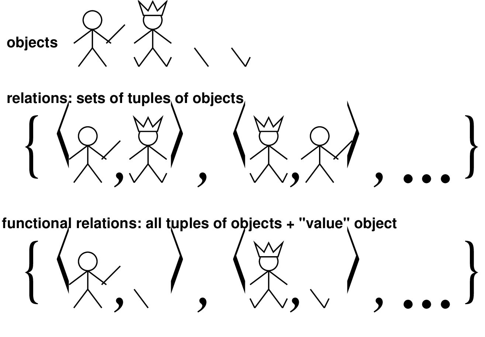
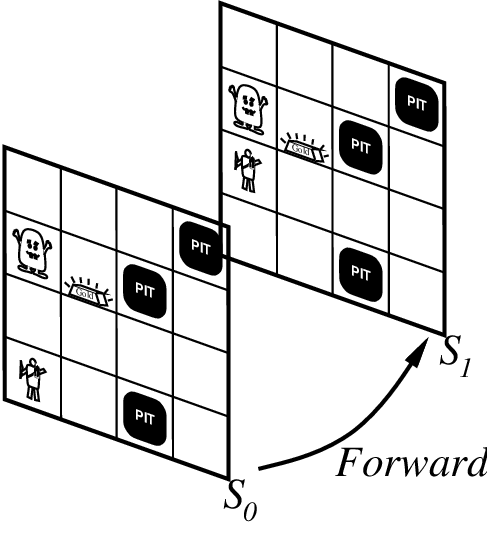

# Chapter 07 Logical Agents

<!-- tabs:start -->

#### **Tiếng Việt**

  <iframe src="TaiLieu/ebooks_Chapters_Vi3/Chapter_07/chapter_07_vi.html" width="100%" height="100%"></iframe>

#### **Tiếng Anh**

  <iframe src="TaiLieu/ebooks_Chapters/Chapter_07_Logical%20Agents.pdf" width="100%" height="100%"></iframe>

#### **Slide**

\usepackage{aima-slides}
\usepackage[utf8]{inputenc}
\usepackage[T5]{fontenc}
\usepackage{lmodern}

# Logic bậc một (First-order logic)

## Chương 7

---
## Nội dung

- Cú pháp và ngữ nghĩa của FOL

- Vui với các câu

- Thế giới Wumpus trong FOL

---
## Cú pháp của FOL: Các phần tử cơ bản

| &nbsp; | &nbsp; |
|---|---|
| Hằng số (Constants) | $KingJohn,\ 2,\ UCB,\ldots$ |
| Vị từ (Predicates) | $Brother,\ >,\ldots$ |
| Hàm số (Functions) | $Sqrt,\ LeftLegOf,\ldots$ |
| Biến (Variables) | $x,\ y,\ a,\ b,\ldots$ |
| Ký hiệu nối (Connectives) | $\land\ \lor\ \lnot\ \implies\ \lequiv$ |
| Bằng nhau (Equality) | $=$ |
| Lượng từ (Quantifiers) | $\forall\ \exists$ |

---
## Câu nguyên thủy (Atomic sentences)

| &nbsp; | &nbsp; | &nbsp; |
|---|---|---|
| Câu nguyên thủy | = | $predicate(term_1,\ldots,term_n)$ |
|  |  | hoặc $term_1 = term_2$ |
|  |  |  |
| Hạng thức (Term) | = | $function(term_1,\ldots,term_n)$ |
|  |  | hoặc $constant$ hoặc $variable$ |

| &nbsp; | &nbsp; |
|---|---|
| Ví dụ: | $Brother(KingJohn,RichardTheLionheart)$ |
|  | $>(Length(LeftLegOf(Richard)),Length(LeftLegOf(KingJohn)))$ |

---
## Câu phức hợp (Complex sentences)

Các câu phức hợp được tạo từ các câu nguyên thủy bằng cách sử dụng các ký hiệu nối
\[
\lnot S, &nbsp;&nbsp;  S_1\land S_2, &nbsp;&nbsp;  S_1 \lor S_2, &nbsp;&nbsp;  
S_1 \implies S_2, &nbsp;&nbsp;  S_1 \lequiv S_2
\]

| &nbsp; | &nbsp; |
|---|---|
| Ví dụ: | $Sibling(KingJohn,Richard) \implies Sibling(Richard,KingJohn)$ |
|  | ${>}(1,2) \lor {\leq}(1,2)$ |
|  | ${>}(1,2) \land \lnot {>}(1,2)$ |

---
## Tính chân lý trong logic bậc một

Các câu là đúng đối với một <u>mô hình (model)</u> và một <u>diễn dịch (interpretation)</u>

Mô hình chứa các đối tượng và các quan hệ giữa chúng

Diễn dịch chỉ định các vật sở chỉ (referents) cho
  
*các ký hiệu hằng* $\rightarrow$ <u>các đối tượng</u>
  
*các ký hiệu vị từ* $\rightarrow$ <u>các quan hệ</u>
  
*các ký hiệu hàm* $\rightarrow$ <u>các quan hệ hàm</u>

Một câu nguyên thủy $predicate(term_1,\ldots,term_n)$ là đúng

khi và chỉ khi các <u>đối tượng</u> được chỉ tới bởi $term_1,\ldots,term_n$

nằm trong <u>quan hệ</u> được chỉ tới bởi $predicate$

---
## Các mô hình cho FOL: Ví dụ

---
## Lượng từ phổ dụng (Universal quantification)

$\All{\<variables\>} \<sentence\>$

Mọi người ở Berkeley đều thông minh:

$\All{x} At(x,Berkeley) \implies Smart(x)$

$\All{x} P$ &nbsp;&nbsp;  tương đương với <u>phép hội</u> của các <u>thực thể hóa (instantiations)</u> của $P$
\[
\begin{array}{rl}
     & At(KingJohn,Berkeley) \implies Smart(KingJohn) 

\land& At(Richard,Berkeley) \implies Smart(Richard) 

\land& At(Berkeley,Berkeley) \implies Smart(Berkeley) 

\land& \ldots
\end{array}\]
Thông thường, $\implies$ là ký hiệu nối chính với $\forall$.

Lỗi phổ biến: sử dụng $\land$ làm ký hiệu nối chính với $\forall$:
\[\All{x} At(x,Berkeley) \land Smart(x)\]
có nghĩa là "Tất cả mọi người đều ở Berkeley và tất cả mọi người đều thông minh"

---
## Lượng từ tồn tại (Existential quantification)

$\Exi{\<variables\>} \<sentence\>$

Một ai đó ở Stanford rất thông minh:

$\Exi{x} At(x,Stanford) \land Smart(x)$

$\Exi{x} P$ &nbsp;&nbsp;  tương đương với <u>phép tuyển</u> của các <u>thực thể hóa</u> của $P$
\[
\begin{array}{rl}
     & At(KingJohn,Stanford) \land Smart(KingJohn) 

\lor& At(Richard,Stanford) \land Smart(Richard) 

\lor& At(Stanford,Stanford) \land Smart(Stanford) 

\lor& \ldots
\end{array}\]
Thông thường, $\land$ là ký hiệu nối chính với $\exists$.

Lỗi phổ biến: sử dụng $\implies$ làm ký hiệu nối chính với $\exists$:
\[\Exi{x} At(x,Stanford) \implies Smart(x)\]
là đúng nếu có bất kỳ ai đó \textbf{không} ở Stanford!

---
## Đặc tính của các lượng từ

$\All{x}\All{y}$ giống với $\All{y}\All{x}$ (<u>tại sao?</u>??)

$\Exi{x}\Exi{y}$ giống với $\Exi{y}\Exi{x}$ (<u>tại sao?</u>??)

$\Exi{x}\All{y}$ <u>không</u> giống với $\All{y}\Exi{x}$

$\Exi{x}\All{y} Loves(x,y)$

"Có một người yêu thương mọi người trên thế giới"

$\All{y}\Exi{x} Loves(x,y)$

"Mọi người trên thế giới đều được ít nhất một người yêu thương"

<u>Tính đối ngẫu của lượng từ</u>: mỗi cái có thể được biểu diễn bằng cách sử dụng cái kia

$\All{x} Likes(x,IceCream)$  &nbsp;&nbsp;&nbsp;&nbsp;  $\lnot \Exi{x} \lnot Likes(x,IceCream)$ 

$\Exi{x} Likes(x,Broccoli)$  &nbsp;&nbsp;&nbsp;&nbsp;  $\lnot \All{x} \lnot Likes(x,Broccoli)$ 

---
## Vui với các câu

Anh em trai là anh em ruột (siblings)

.

"Anh em ruột" có tính phản xạ

.

Mẹ của một người là cha mẹ nữ của người đó

.

Anh em họ thứ nhất là con của anh em ruột của cha mẹ

.

---
## Vui với các câu

.

$\All{x,y} Brother(x,y) \lequiv Sibling(x,y)$.

.

$\All{x,y} Sibling(x,y) \lequiv Sibling(y,x)$

.

$\All{x,y} Mother(x,y) \lequiv (Female(x) \land Parent(x,y))$

.

$\All{x,y} FirstCousin(x,y) \lequiv 
\Exi{p,ps} Parent(p,x) \land Sibling(ps,p) \land Parent(ps,y)$

---
## Sự bằng nhau (Equality)

$term_1 = term_2$ là đúng dưới một diễn dịch đã cho

khi và chỉ khi $term_1$ và $term_2$ cùng chỉ một đối tượng

| &nbsp; | &nbsp; |
|---|---|
| Ví dụ: | $1=2$ và $\All{x} {\times}(Sqrt(x),Sqrt(x)) = x$ là thỏa mãn được |
|  | $2=2$ là hợp lệ |

Ví dụ: định nghĩa (đầy đủ) của $Sibling$ (anh em ruột) theo $Parent$ (cha mẹ):
  
$\All{x,y} Sibling(x,y) \lequiv [\lnot(x\eq y) \land \Exi{m,f} \lnot(m\eq f) \land {}$
    
$Parent(m,x) \land Parent(f,x) \land Parent(m,y) \land Parent(f,y)]$

---
## Tương tác với KB của FOL

Giả sử một tác tử thế giới wumpus đang sử dụng một KB của FOL

và nhận thấy một mùi và một luồng gió (nhưng không lấp lánh) tại $t=5$:

$**Tell**(KB,Percept([Smell,Breeze,None],5))$

$**Ask**(KB,\Exi{a} Action(a,5))$

Nghĩa là, liệu KB có kéo theo bất kỳ hành động cụ thể nào tại $t=5$ không?

Trả lời: $Có,\ \{a/Shoot\}$ &nbsp;&nbsp;&nbsp;&nbsp;  $\leftarrow$ <u>phép thế (substitution)</u> (danh sách ràng buộc)

Cho một câu $S$ và một phép thế $\sigma$,

$S\sigma$ biểu thị kết quả của việc áp dụng $\sigma$ vào $S$; ví dụ:

$S = Smarter(x,y)$

$\sigma = \{x/Hillary,y/Bill\}$

$S\sigma = Smarter(Hillary,Bill)$

$**Ask(KB,S)**$ trả về một số/tất cả $\sigma$ sao cho $KB \models S\sigma$

---
## Cơ sở tri thức cho thế giới wumpus

<u>"Nhận thức (Perception)"</u>

$\All{b,g,t} Percept([Smell,b,g],t) \implies Smelt(t)$

$\All{s,b,t} Percept([s,b,Glitter],t) \implies AtGold(t)$

<u>Phản xạ (Reflex)</u>: $\All{t} AtGold(t) \implies Action(Grab,t)$

<u>Phản xạ với trạng thái nội bộ (Reflex with internal state)</u>: chúng ta đã có vàng chưa?

$\All{t} AtGold(t) \land \lnot Holding(Gold,t) \implies Action(Grab,t)$

$Holding(Gold,t)$ không thể quan sát được
    
$\Rightarrow$ việc theo dõi sự thay đổi là cần thiết

---
## Suy diễn các thuộc tính ẩn

Các thuộc tính của vị trí:

$\All{l,t} At(Agent,l,t) \land Smelt(t) \implies Smelly(l)$

$\All{l,t} At(Agent,l,t) \land Breeze(t) \implies Breezy(l)$

Các ô gần hố thì có gió nhẹ:

<u>Quy tắc chẩn đoán (Diagnostic rule)</u>---suy diễn nguyên nhân từ kết quả
    
      $\All{y} Breezy(y) \implies \Exi{x} Pit(x) \land Adjacent(x,y)$

<u>Quy tắc nhân quả (Causal rule)</u>---suy diễn kết quả từ nguyên nhân
    
      $\All{x,y} Pit(x) \land Adjacent(x,y) \implies Breezy(y)$

Không có quy tắc nào trong số này là đầy đủ---ví dụ, quy tắc nhân quả không nói
rằng liệu các ô ở xa hố có gió nhẹ hay không

<u>Định nghĩa (Definition)</u> cho vị từ $Breezy$:
    
      $\All{y}  Breezy(y)  \lequiv [\Exi{x} Pit(x) \land Adjacent(x,y)]$

---
## Theo dõi sự thay đổi

Các sự kiện (Facts) diễn ra trong các <u>tình huống (situations)</u>, thay vì vĩnh viễn

Ví dụ, $Holding(Gold,Now)$ thay vì chỉ $Holding(Gold)$

<u>Phép tính tình huống (Situation calculus)</u> là một cách để biểu diễn sự thay đổi trong FOL:
    
   Thêm một đối số tình huống vào mỗi vị từ không vĩnh viễn
    
   Ví dụ, $Now$ trong $Holding(Gold,Now)$ biểu thị một tình huống

Các tình huống được kết nối bởi hàm $Result$

$Result(a,s)$ là tình huống sinh ra từ việc thực hiện $a$ trong $s$

---
## Mô tả các hành động I

Tiên đề "Kết quả (Effect)"---mô tả các thay đổi do hành động

$\All{s} AtGold(s) \implies Holding(Gold,Result(Grab,s))$

Tiên đề "Khung (Frame)"---mô tả <u>không thay đổi</u> do hành động

$\All{s} HaveArrow(s) \implies HaveArrow(Result(Grab,s))$

<u>Vấn đề khung (Frame problem)</u>: tìm một cách thanh lịch để xử lý sự không thay đổi
    
   (a) biểu diễn---tránh các tiên đề khung
    
   (b) suy diễn---tránh "sao chép qua (copy-overs)" liên tục để theo dõi trạng thái

<u>Vấn đề ngoại lệ (Qualification problem)</u>: mô tả đúng về các hành động thực tế đòi hỏi vô số các ngoại lệ---điều gì xảy ra nếu vàng bị trơn trượt hoặc bị đóng đinh hoặc $\ldots$

<u>Vấn đề hệ quả (Ramification problem)</u>: các hành động thực tế có nhiều hệ quả phụ---thế còn bụi trên vàng, hao mòn trên găng tay, $\ldots$

---
## Mô tả các hành động II

<u>Các tiên đề trạng thái kế tiếp (Successor-state axioms)</u> giải quyết vấn đề khung biểu diễn

Mỗi tiên đề nói "về" một <u>vị từ</u> (không phải bản thân một hành động):
\begin{eqnarray*}
\mbox{P đúng sau đó}&\lequiv& [\mbox{một hành động làm P đúng}

                      &\lor   & \mbox{P đã đúng và không có hành động nào
                                  làm P sai}]
\end{eqnarray*}

Để cầm được vàng:
  
   $\All{a,s} Holding(Gold,Result(a,s)) \lequiv {}$
    
      $[(a\eq Grab \land AtGold(s))$
    
      ${}\lor (Holding(Gold,s) \land a\neq Release)]$

---
## Lập kế hoạch

Điều kiện ban đầu trong KB:
    
   $At(Agent,[1,1],S_0)$
    
   $At(Gold,[1,2],S_0)$

Truy vấn: $**Ask**(KB,\Exi{s} Holding(Gold,s))$
    
   nghĩa là, trong tình huống nào tôi sẽ cầm vàng?

Trả lời: $\{s/Result(Grab,Result(Forward,S_0))\}$
    
   nghĩa là, đi tới và sau đó nhặt vàng

Điều này giả định rằng tác tử quan tâm đến các kế hoạch bắt đầu tại $S_0$
và rằng $S_0$ là tình huống duy nhất được mô tả trong KB

---
## Lập kế hoạch: Một cách tốt hơn

Biểu diễn <u>các kế hoạch (plans)</u> dưới dạng các chuỗi hành động $[a_1,a_2,\ldots,a_n]$

$PlanResult(p,s)$ là kết quả của việc thực thi $p$ trong $s$

Sau đó truy vấn $**Ask**(KB,\Exi{p} Holding(Gold,PlanResult(p,S_0)))$

có giải pháp là $\{p/[Forward,Grab]\}$

Định nghĩa của $PlanResult$ theo $Result$:
  
   $\All{s} PlanResult([],s) = s$
  
   $\All{a,p,s} PlanResult([a|p],s) = PlanResult(p,Result(a,s))$

<u>Hệ thống lập kế hoạch (Planning systems)</u> là các công cụ suy diễn có mục đích đặc biệt được thiết kế để thực hiện
loại suy diễn này hiệu quả hơn công cụ suy diễn mục đích chung

---
## Tóm tắt

Logic bậc một: 
  
-- các đối tượng và quan hệ là các nguyên thủy ngữ nghĩa
  
-- cú pháp: hằng số, hàm số, vị từ, bằng nhau, lượng từ

Tăng sức mạnh biểu đạt: đủ để định nghĩa thế giới wumpus

Phép tính tình huống:
  
-- các quy ước để mô tả các hành động và thay đổi trong FOL
  
-- có thể diễn đạt việc lập kế hoạch như sự suy diễn trên một KB phép tính tình huống

#### **Trắc nghiệm**
*(Chưa có bài tập trắc nghiệm)*

#### **Pseudocode**
- [KB-AGENT](codeAndExercises/aima-pseudocode-master/md/KB-Agent.md)
- [TT-ENTAILS](codeAndExercises/aima-pseudocode-master/md/TT-Entails.md)
- [PL-RESOLUTION](codeAndExercises/aima-pseudocode-master/md/PL-Resolution.md)
- [PL-FC-ENTAILS?](codeAndExercises/aima-pseudocode-master/md/PL-FC-Entails.md)
- [DPLL-SATISFIABLE?](codeAndExercises/aima-pseudocode-master/md/DPLL-Satisfiable.md)
- [WALKSAT](codeAndExercises/aima-pseudocode-master/md/WalkSAT.md)
- [HYBRID-WUMPUS-AGENT](codeAndExercises/aima-pseudocode-master/md/Hybrid-Wumpus-Agent.md)
- [SATPLAN](codeAndExercises/aima-pseudocode-master/md/SATPlan.md)

*(Thư mục chứa mã giả cho các thuật toán trong sách: `codeAndExercises/aima-pseudocode-master/md`)*

#### **Python**
- [Logic](codeAndExercises/aima-python-master/notebooks/logic.ipynb)
- [Logic (Python File)](codeAndExercises/aima-python-master/notebooks/logic.py)
- [Improving Sat Algorithms](codeAndExercises/aima-python-master/notebooks/improving_sat_algorithms.ipynb)
- [Improving Sat Algorithms (Python File)](codeAndExercises/aima-python-master/notebooks/improving_sat_algorithms.py)

#### **Bài tập**

##### Bài tập 7.1

Suppose the agent has progressed to the point shown in
Figure <a class="insideBookFigRef" target="_blank" href="https://aimacode.github.io/aima-exercises/figures/wumpus-seq35-figure.png">wumpus-seq35-figure</a>(a), page <a class="pageRef" title="" href="#">wumpus-seq35-figure</a>,
having perceived nothing in [1,1], a breeze in [2,1], and a stench
in [1,2], and is now concerned with the contents of [1,3], [2,2],
and [3,1]. Each of these can contain a pit, and at most one can
contain a wumpus. Following the example of
Figure <a class="insideBookFigRef" target="_blank" href="https://aimacode.github.io/aima-exercises/figures/wumpus-entailment-figure.png">wumpus-entailment-figure</a>, construct the set of
possible worlds. (You should find 32 of them.) Mark the worlds in which
the KB is true and those in which each of the following sentences is
true: 

$\alpha_2$ = “There is no pit in [2,2].” 

$\alpha_3$ = “There is a wumpus in [1,3].” 

Hence show that ${KB} {\models}\alpha_2$ and
${KB} {\models}\alpha_3$.

---

##### Bài tập 7.2

(Adapted from <a class="paperRef" title="" href="">Barwise+Etchemendy:1993</a> .) Given the following, can you prove that the unicorn is
mythical? How about magical? Horned? 

Note: If the unicorn is mythical, then it is immortal, but if it is not
 mythical, then it is a mortal mammal. If the unicorn is either
 immortal or a mammal, then it is horned. The unicorn is magical if it
 is horned.

---

##### Bài tập 7.3

Consider the problem of deciding whether a
propositional logic sentence is true in a given model. 

1.  Write a recursive algorithm PL-True?$ (s, m )$ that returns ${true}$ if and
    only if the sentence $s$ is true in the model $m$ (where $m$ assigns
    a truth value for every symbol in $s$). The algorithm should run in
    time linear in the size of the sentence. (Alternatively, use a
    version of this function from the online code repository.) 

2.  Give three examples of sentences that can be determined to be true
    or false in a <i>partial</i> model that does not specify a
    truth value for some of the symbols. 

3.  Show that the truth value (if any) of a sentence in a partial model
    cannot be determined efficiently in general. 

4.  Modify your algorithm so that it can sometimes judge truth from
    partial models, while retaining its recursive structure and linear
    run time. Give three examples of sentences whose truth in a partial
    model is <i>not</i> detected by your algorithm. 

5.  Investigate whether the modified algorithm makes $TT-Entails?$ more efficient.

---

##### Bài tập 7.4

Which of the following are correct? 

1.  ${False} \models {True}$. 

2.  ${True} \models {False}$. 

3.  $(A\land B)  \models (A{\;\;{\Leftrightarrow}\;\;}B)$. 

4.  $A{\;\;{\Leftrightarrow}\;\;}B \models A \lor B$. 

5.  $A{\;\;{\Leftrightarrow}\;\;}B \models \lnot A \lor B$. 

6.  $(A\land B){\:\;{\Rightarrow}\:\;}C \models (A{\:\;{\Rightarrow}\:\;}C)\lor(B{\:\;{\Rightarrow}\:\;}C)$. 

7.  $(C\lor (\lnot A \land \lnot B)) \equiv ((A{\:\;{\Rightarrow}\:\;}C) \land (B {\:\;{\Rightarrow}\:\;}C))$. 

8.  $(A\lor B) \land (\lnot C\lor\lnot D\lor E) \models (A\lor B)$. 

9.  $(A\lor B) \land (\lnot C\lor\lnot D\lor E) \models (A\lor B) \land (\lnot D\lor E)$. 

10. $(A\lor B) \land \lnot(A {\:\;{\Rightarrow}\:\;}B)$ is satisfiable. 

11. $(A{\;\;{\Leftrightarrow}\;\;}B) \land (\lnot A \lor B)$
    is satisfiable. 

12. $(A{\;\;{\Leftrightarrow}\;\;}B) {\;\;{\Leftrightarrow}\;\;}C$ has
    the same number of models as $(A{\;\;{\Leftrightarrow}\;\;}B)$ for
    any fixed set of proposition symbols that includes $A$, $B$, $C$. 

---

##### Bài tập 7.5

Which of the following are correct? 

1.  ${False} \models {True}$. 

2.  ${True} \models {False}$. 

3.  $(A\land B)  \models (A{\;\;{\Leftrightarrow}\;\;}B)$. 

4.  $A{\;\;{\Leftrightarrow}\;\;}B \models A \lor B$. 

5.  $A{\;\;{\Leftrightarrow}\;\;}B \models \lnot A \lor B$. 

6.  $(A\lor B) \land (\lnot C\lor\lnot D\lor E) \models (A\lor B\lor C) \land (B\land C\land D{\:\;{\Rightarrow}\:\;}E)$. 

7.  $(A\lor B) \land (\lnot C\lor\lnot D\lor E) \models (A\lor B) \land (\lnot D\lor E)$. 

8.  $(A\lor B) \land \lnot(A {\:\;{\Rightarrow}\:\;}B)$ is satisfiable. 

9.  $(A\land B){\:\;{\Rightarrow}\:\;}C \models (A{\:\;{\Rightarrow}\:\;}C)\lor(B{\:\;{\Rightarrow}\:\;}C)$. 

10. $(C\lor (\lnot A \land \lnot B)) \equiv ((A{\:\;{\Rightarrow}\:\;}C) \land (B {\:\;{\Rightarrow}\:\;}C))$. 

11. $(A{\;\;{\Leftrightarrow}\;\;}B) \land (\lnot A \lor B)$
    is satisfiable. 

12. $(A{\;\;{\Leftrightarrow}\;\;}B) {\;\;{\Leftrightarrow}\;\;}C$ has
    the same number of models as $(A{\;\;{\Leftrightarrow}\;\;}B)$ for
    any fixed set of proposition symbols that includes $A$, $B$, $C$. 

---

##### Bài tập 7.6

Prove each of the following assertions: 

1.  $\alpha$ is valid if and only if ${True}{\models}\alpha$. 

2.  For any $\alpha$, ${False}{\models}\alpha$. 

3.  $\alpha{\models}\beta$ if and only if the sentence
    $(\alpha {\:\;{\Rightarrow}\:\;}\beta)$ is valid. 

4.  $\alpha \equiv \beta$ if and only if the sentence
    $(\alpha{\;\;{\Leftrightarrow}\;\;}\beta)$ is valid. 

5.  $\alpha{\models}\beta$ if and only if the sentence
    $(\alpha \land \lnot \beta)$ is unsatisfiable.

---

##### Bài tập 7.7

Prove, or find a counterexample to, each of the following assertions: 

1.  If $\alpha\models\gamma$ or $\beta\models\gamma$ (or both) then
    $(\alpha\land \beta)\models\gamma$ 

2.  If $(\alpha\land \beta)\models\gamma$ then $\alpha\models\gamma$ or
    $\beta\models\gamma$ (or both). 

3.  If $\alpha\models (\beta \lor \gamma)$ then $\alpha \models \beta$
    or $\alpha \models \gamma$ (or both). 

---

##### Bài tập 7.8

Prove, or find a counterexample to, each of the following assertions: 

1.  If $\alpha\models\gamma$ or $\beta\models\gamma$ (or both) then
    $(\alpha\land \beta)\models\gamma$ 

2.  If $\alpha\models (\beta \land \gamma)$ then $\alpha \models \beta$
    and $\alpha \models \gamma$. 

3.  If $\alpha\models (\beta \lor \gamma)$ then $\alpha \models \beta$
    or $\alpha \models \gamma$ (or both). 

---

##### Bài tập 7.9

Consider a vocabulary with only four propositions, $A$, $B$, $C$, and
$D$. How many models are there for the following sentences? 

1.  $B\lor C$. 

2.  $\lnot A\lor \lnot B \lor \lnot C \lor \lnot D$. 

3.  $(A{\:\;{\Rightarrow}\:\;}B) \land A \land \lnot B \land C \land D$. 

---

##### Bài tập 7.10

We have defined four binary logical connectives. 

1.  Are there any others that might be useful? 

2.  How many binary connectives can there be? 

3.  Why are some of them not very useful? 

---

##### Bài tập 7.11

Using a method of your choice, verify
each of the equivalences in
Table <a class="insideBookFigRef" target="_blank" href="https://aimacode.github.io/aima-exercises/figures/logical-equivalence-table.png">logical-equivalence-table</a> (page <a class="pageRef" title="" href="#">logical-equivalence-table</a>).

---

##### Bài tập 7.12

Decide whether each of the following
sentences is valid, unsatisfiable, or neither. Verify your decisions
using truth tables or the equivalence rules of
Table <a class="insideBookFigRef" target="_blank" href="https://aimacode.github.io/aima-exercises/figures/logical-equivalence-table.png">logical-equivalence-table</a> (page <a class="pageRef" title="" href="#">logical-equivalence-table</a>).

1.  ${Smoke} {\:\;{\Rightarrow}\:\;}{Smoke}$ 

2.  ${Smoke} {\:\;{\Rightarrow}\:\;}{Fire}$ 

3.  $({Smoke} {\:\;{\Rightarrow}\:\;}{Fire}) {\:\;{\Rightarrow}\:\;}(\lnot {Smoke} {\:\;{\Rightarrow}\:\;}\lnot {Fire})$ 

4.  ${Smoke} \lor {Fire} \lor \lnot {Fire}$ 

5.  $(({Smoke} \land {Heat}) {\:\;{\Rightarrow}\:\;}{Fire}) {\;\;{\Leftrightarrow}\;\;}(({Smoke} {\:\;{\Rightarrow}\:\;}{Fire}) \lor ({Heat} {\:\;{\Rightarrow}\:\;}{Fire}))$ 

6.  $({Smoke} {\:\;{\Rightarrow}\:\;}{Fire}) {\:\;{\Rightarrow}\:\;}(({Smoke} \land {Heat}) {\:\;{\Rightarrow}\:\;}{Fire}) $ 

7.  ${Big} \lor {Dumb} \lor ({Big} {\:\;{\Rightarrow}\:\;}{Dumb})$ 

---

##### Bài tập 7.13

Decide whether each of the following
sentences is valid, unsatisfiable, or neither. Verify your decisions
using truth tables or the equivalence rules of
Table <a class="insideBookFigRef" target="_blank" href="https://aimacode.github.io/aima-exercises/figures/logical-equivalence-table.png">logical-equivalence-table</a> (page <a class="pageRef" title="" href="#">logical-equivalence-table</a>). 

1.  ${Smoke} {\:\;{\Rightarrow}\:\;}{Smoke}$ 

2.  ${Smoke} {\:\;{\Rightarrow}\:\;}{Fire}$ 

3.  $({Smoke} {\:\;{\Rightarrow}\:\;}{Fire}) {\:\;{\Rightarrow}\:\;}(\lnot {Smoke} {\:\;{\Rightarrow}\:\;}\lnot {Fire})$ 

4.  ${Smoke} \lor {Fire} \lor \lnot {Fire}$ 

5.  $(({Smoke} \land {Heat}) {\:\;{\Rightarrow}\:\;}{Fire}) {\;\;{\Leftrightarrow}\;\;}(({Smoke} {\:\;{\Rightarrow}\:\;}{Fire}) \lor ({Heat} {\:\;{\Rightarrow}\:\;}{Fire}))$ 

6.  ${Big} \lor {Dumb} \lor ({Big} {\:\;{\Rightarrow}\:\;}{Dumb})$ 

7.  $({Big} \land {Dumb}) \lor \lnot {Dumb}$ 

---

##### Bài tập 7.14

Any propositional logic sentence is logically
equivalent to the assertion that each possible world in which it would
be false is not the case. From this observation, prove that any sentence
can be written in CNF.

---

##### Bài tập 7.15

Use resolution to prove the sentence $\lnot A \land \lnot B$ from the
clauses in Exercise <a class="exerciseRef" href="{{ site.baseurl }}/knowledge-logic-exercises/ex_25/">convert-clausal-exercise</a>.

---

##### Bài tập 7.16

This exercise looks into the relationship between
clauses and implication sentences. 

1.  Show that the clause $(\lnot P_1 \lor \cdots \lor \lnot P_m \lor Q)$
    is logically equivalent to the implication sentence
    $(P_1 \land \cdots \land P_m) {\;{\Rightarrow}\;}Q$. 

2.  Show that every clause (regardless of the number of
    positive literals) can be written in the form
    $(P_1 \land \cdots \land P_m) {\;{\Rightarrow}\;}(Q_1 \lor \cdots \lor Q_n)$,
    where the $P$s and $Q$s are proposition symbols. A knowledge base
    consisting of such sentences is in implicative normal form or <b>Kowalski
    form</b> <a class="paperRef" title="" href="">Kowalski:1979</a>. 

3.  Write down the full resolution rule for sentences in implicative
    normal form. 

---

##### Bài tập 7.17

According to some political pundits, a person who is radical ($R$) is
electable ($E$) if he/she is conservative ($C$), but otherwise is not
electable. 

1.  Which of the following are correct representations of this
    assertion? 

    1.  $(R\land E)\iff C$ 

    2.  $R{\:\;{\Rightarrow}\:\;}(E\iff C)$ 

    3.  $R{\:\;{\Rightarrow}\:\;}((C{\:\;{\Rightarrow}\:\;}E) \lor \lnot E)$ 

2.  Which of the sentences in (a) can be expressed in Horn form?

---

##### Bài tập 7.18

This question considers representing satisfiability (SAT) problems as
CSPs. 

1.  Draw the constraint graph corresponding to the SAT problem
    $$(\lnot X_1 \lor X_2) \land (\lnot X_2 \lor X_3) \land \ldots \land (\lnot X_{n-1} \lor X_n)$$
    for the particular case $n{{\,=\,}}5$. 

2.  How many solutions are there for this general SAT problem as a
    function of $n$? 

3.  Suppose we apply {Backtracking-Search} (page <a class="pageRef" title="" href="#">backtracking-search-algorithm</a>) to find <i>all</i>
    solutions to a SAT CSP of the type given in (a). (To find
    <i>all</i> solutions to a CSP, we simply modify the basic
    algorithm so it continues searching after each solution is found.)
    Assume that variables are ordered $X_1,\ldots,X_n$ and ${false}$
    is ordered before ${true}$. How much time will the algorithm take
    to terminate? (Write an $O(\cdot)$ expression as a function of $n$.) 

4.  We know that SAT problems in Horn form can be solved in linear time
    by forward chaining (unit propagation). We also know that every
    tree-structured binary CSP with discrete, finite domains can be
    solved in time linear in the number of variables
    (Section <a class="sectionRef" title="" href="#">csp-structure-section</a>). Are these two
    facts connected? Discuss. 

---

##### Bài tập 7.19

This question considers representing satisfiability (SAT) problems as
CSPs. 

1.  Draw the constraint graph corresponding to the SAT problem
    $$(\lnot X_1 \lor X_2) \land (\lnot X_2 \lor X_3) \land \ldots \land (\lnot X_{n-1} \lor X_n)$$
    for the particular case $n{{\,=\,}}4$. 

2.  How many solutions are there for this general SAT problem as a
    function of $n$? 

3.  Suppose we apply {Backtracking-Search} (page <a class="pageRef" title="" href="#">backtracking-search-algorithm</a>) to find <i>all</i>
    solutions to a SAT CSP of the type given in (a). (To find
    <i>all</i> solutions to a CSP, we simply modify the basic
    algorithm so it continues searching after each solution is found.)
    Assume that variables are ordered $X_1,\ldots,X_n$ and ${false}$
    is ordered before ${true}$. How much time will the algorithm take
    to terminate? (Write an $O(\cdot)$ expression as a function of $n$.) 

4.  We know that SAT problems in Horn form can be solved in linear time
    by forward chaining (unit propagation). We also know that every
    tree-structured binary CSP with discrete, finite domains can be
    solved in time linear in the number of variables
    (Section <a class="sectionRef" title="" href="#">csp-structure-section</a>). Are these two
    facts connected? Discuss.

---

##### Bài tập 7.20

Explain why every nonempty propositional clause, by itself, is
satisfiable. Prove rigorously that every set of five 3-SAT clauses is
satisfiable, provided that each clause mentions exactly three distinct
variables. What is the smallest set of such clauses that is
unsatisfiable? Construct such a set.

---

##### Bài tập 7.21

A propositional <i>2-CNF</i> expression is a conjunction of
clauses, each containing <i>exactly 2</i> literals, e.g.,
$$(A\lor B) \land (\lnot A \lor C) \land (\lnot B \lor D) \land (\lnot
  C \lor G) \land (\lnot D \lor G)\ .$$ 

1.  Prove using resolution that the above sentence entails $G$. 

2.  Two clauses are <i>semantically distinct</i> if they are not
    logically equivalent. How many semantically distinct 2-CNF clauses
    can be constructed from $n$ proposition symbols? 

3.  Using your answer to (b), prove that propositional resolution always
    terminates in time polynomial in $n$ given a 2-CNF sentence
    containing no more than $n$ distinct symbols. 

4.  Explain why your argument in (c) does not apply to 3-CNF. 

---

##### Bài tập 7.22

Prove each of the following assertions: 

1.  Every pair of propositional clauses either has no resolvents, or all
    their resolvents are logically equivalent. 

2.  There is no clause that, when resolved with itself, yields
    (after factoring) the clause $(\lnot P \lor \lnot Q)$. 

3.  If a propositional clause $C$ can be resolved with a copy of itself,
    it must be logically equivalent to $ True $. 

---

##### Bài tập 7.23

Consider the following sentence: 
$$[ ({Food} {\:\;{\Rightarrow}\:\;}{Party}) \lor ({Drinks} {\:\;{\Rightarrow}\:\;}{Party}) ] {\:\;{\Rightarrow}\:\;}[ ( {Food} \land {Drinks} )  {\:\;{\Rightarrow}\:\;}{Party}]\ .$$ 

1.  Determine, using enumeration, whether this sentence is valid,
    satisfiable (but not valid), or unsatisfiable. 

2.  Convert the left-hand and right-hand sides of the main implication
    into CNF, showing each step, and explain how the results confirm
    your answer to (a). 

3.  Prove your answer to (a) using resolution.

---

##### Bài tập 7.24

A sentence is in disjunctive normal form(DNF) if it is the disjunction of
conjunctions of literals. For example, the sentence
$(A \land B \land \lnot C) \lor (\lnot A \land C) \lor (B \land \lnot C)$
is in DNF. 

1.  Any propositional logic sentence is logically equivalent to the
    assertion that some possible world in which it would be true is in
    fact the case. From this observation, prove that any sentence can be
    written in DNF. 

2.  Construct an algorithm that converts any sentence in propositional
    logic into DNF. (<i>Hint</i>: The algorithm is similar to
    the algorithm for conversion to CNF iven in
    Sectio <a class="sectionRef" title="" href="#">pl-resolution-section</a>.) 

3.  Construct a simple algorithm that takes as input a sentence in DNF
    and returns a satisfying assignment if one exists, or reports that
    no satisfying assignment exists. 

4.  Apply the algorithms in (b) and (c) to the following set of
    sentences: 

 $A {\Rightarrow} B$ 

 $B {\Rightarrow} C$ 

 $C {\Rightarrow} A$ 

5.  Since the algorithm in (b) is very similar to the algorithm for
    conversion to CNF, and since the algorithm in (c) is much simpler
    than any algorithm for solving a set of sentences in CNF, why is
    this technique not used in automated reasoning?

---

##### Bài tập 7.25

Convert the following set of sentences to
clausal form. 

1.  S1: $A {\;\;{\Leftrightarrow}\;\;}(B \lor E)$. 

2.  S2: $E {\:\;{\Rightarrow}\:\;}D$. 

3.  S3: $C \land F {\:\;{\Rightarrow}\:\;}\lnot B$. 

4.  S4: $E {\:\;{\Rightarrow}\:\;}B$. 

5.  S5: $B {\:\;{\Rightarrow}\:\;}F$. 

6.  S6: $B {\:\;{\Rightarrow}\:\;}C$ 

Give a trace of the execution of DPLL on the conjunction of these
clauses.

---

##### Bài tập 7.26

Convert the following set of sentences to
clausal form. 

1.  S1: $A {\;\;{\Leftrightarrow}\;\;}(B \lor E)$. 

2.  S2: $E {\:\;{\Rightarrow}\:\;}D$. 

3.  S3: $C \land F {\:\;{\Rightarrow}\:\;}\lnot B$. 

4.  S4: $E {\:\;{\Rightarrow}\:\;}B$. 

5.  S5: $B {\:\;{\Rightarrow}\:\;}F$. 

6.  S6: $B {\:\;{\Rightarrow}\:\;}C$ 

Give a trace of the execution of DPLL on the conjunction of these
clauses.

---

##### Bài tập 7.27

Is a randomly generated 4-CNF sentence with $n$ symbols and $m$ clauses
more or less likely to be solvable than a randomly generated 3-CNF
sentence with $n$ symbols and $m$ clauses? Explain.

---

##### Bài tập 7.28

Minesweeper, the well-known computer game, is
closely related to the wumpus world. A minesweeper world is
a rectangular grid of $N$ squares with $M$ invisible mines scattered
among them. Any square may be probed by the agent; instant death follows
if a mine is probed. Minesweeper indicates the presence of mines by
revealing, in each probed square, the <i>number</i> of mines
that are directly or diagonally adjacent. The goal is to probe every
unmined square.

1.  Let $X_{i,j}$ be true iff square $[i,j]$ contains a mine. Write down
    the assertion that exactly two mines are adjacent to \[1,1\] as a
    sentence involving some logical combination of
    $X_{i,j}$ propositions.

2.  Generalize your assertion from (a) by explaining how to construct a
    CNF sentence asserting that $k$ of $n$ neighbors contain mines.

3.  Explain precisely how an agent can use {DPLL} to prove that a given square
    does (or does not) contain a mine, ignoring the global constraint
    that there are exactly $M$ mines in all.

4.  Suppose that the global constraint is constructed from your method
    from part (b). How does the number of clauses depend on $M$ and $N$?
    Suggest a way to modify {DPLL} so that the global constraint does not need
    to be represented explicitly.

5.  Are any conclusions derived by the method in part (c) invalidated
    when the global constraint is taken into account?

6.  Give examples of configurations of probe values that induce
    <i>long-range dependencies</i> such that the contents of a
    given unprobed square would give information about the contents of a
    far-distant square. (<i>Hint</i>: consider an
    $N\times 1$ board.)

---

##### Bài tập 7.29

How long does it take to prove
${KB}{\models}\alpha$ using {DPLL} when $\alpha$ is a literal <i>already
contained in</i> ${KB}$? Explain.

---

##### Bài tập 7.30

Trace the behavior of {DPLL} on the knowledge base in
Figure <a class="insideBookFigRef" target="_blank" href="https://aimacode.github.io/aima-exercises/figures/pl-horn-example-figure.png">pl-horn-example-figure</a> when trying to prove $Q$,
and compare this behavior with that of the forward-chaining algorithm.

---

##### Bài tập 7.31

Write a successor-state axiom for the ${Locked}$ predicate, which
applies to doors, assuming the only actions available are ${Lock}$ and
${Unlock}$.

---

##### Bài tập 7.32

Discuss what is meant by <i>optimal</i> behavior in the wumpus
world. Show that the {Hybrid-Wumpus-Agent} is not optimal, and suggest ways to improve it.

---

##### Bài tập 7.33

Suppose an agent inhabits a world with two states, $S$ and $\lnot S$,
and can do exactly one of two actions, $a$ and $b$. Action $a$ does
nothing and action $b$ flips from one state to the other. Let $S^t$ be
the proposition that the agent is in state $S$ at time $t$, and let
$a^t$ be the proposition that the agent does action $a$ at time $t$
(similarly for $b^t$). 

1.  Write a successor-state axiom for $S^{t+1}$. 

2.  Convert the sentence in (a) into CNF. 

3.  Show a resolution refutation proof that if the agent is in $\lnot S$
    at time $t$ and does $a$, it will still be in $\lnot S$ at time
    $t+1$.

---

##### Bài tập 7.34

Section <a class="sectionRef" title="" href="#">successor-state-section</a>
provides some of the successor-state axioms required for the wumpus
world. Write down axioms for all remaining fluent symbols.

---

##### Bài tập 7.35

Modify the {Hybrid-Wumpus-Agent} to use the 1-CNF logical state
estimation method described on page <a class="pageRef" title="" href="#">1cnf-belief-state-page</a>. We noted on that page
that such an agent will not be able to acquire, maintain, and use more
complex beliefs such as the disjunction $P_{3,1}\lor P_{2,2}$. Suggest a
method for overcoming this problem by defining additional proposition
symbols, and try it out in the wumpus world. Does it improve the
performance of the agent?

---

<!-- tabs:end -->
