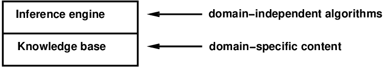
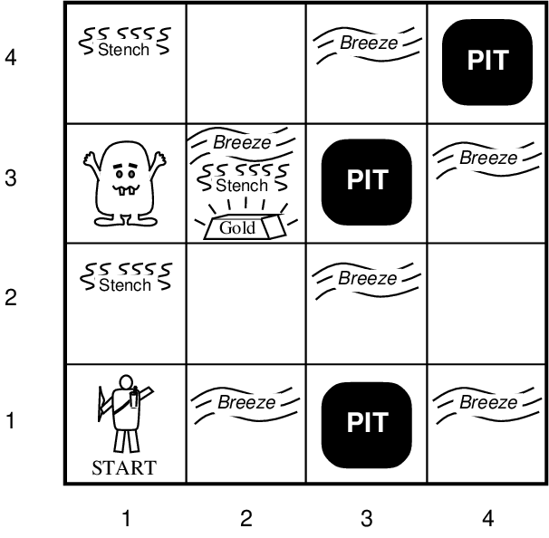
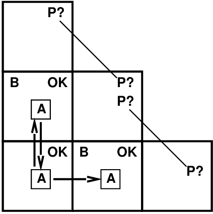
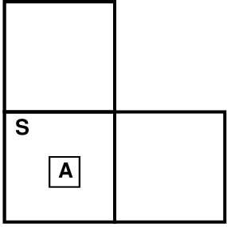
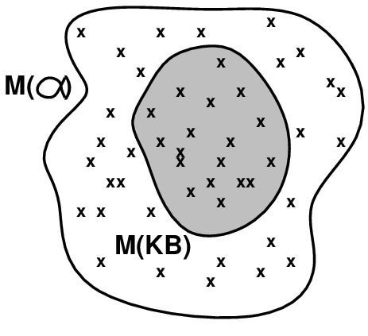
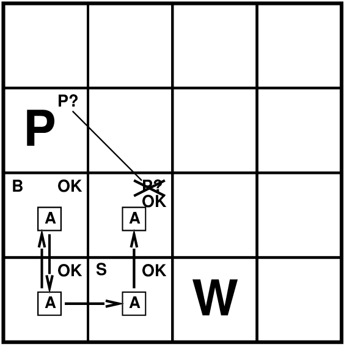

# Chapter 07 Logical Agents

<!-- tabs:start -->

#### **Tiếng Việt**
<div class="pdf-container">
  <iframe src="TaiLieu/ebooks_Chapters_Vi3/Chapter_07/chapter_07_vi.html" width="100%" height="100%"></iframe>
</div>

#### **Tiếng Anh**
<div class="pdf-container">
  <iframe src="TaiLieu/ebooks_Chapters/Chapter_07_Logical%20Agents.pdf" width="100%" height="100%"></iframe>
</div>

#### **Slide**

\usepackage{fleqn}
\usepackage{epsf}
\usepackage[dvips]{color}
\usepackage{aima2e-slides}

# Logical agents

## Chapter 7

---
## Phác thảo

- Tác nhân dựa trên tri thức

- Thế giới Wumpus

- Logic nói chung---mô hình và sự kế thừa

- Logic mệnh đề (Boolean)

- Tính tương đương, giá trị, sự thỏa mãn

- Quy tắc suy luận và chứng minh định lý
    
 -- xâu chuỗi về phía trước 
    
 -- xâu chuỗi ngược
    
 -- độ phân giải

---
## Cơ sở kiến thức



\defn{Cơ sở kiến thức} = tập hợp \defn{câu} trong ngôn ngữ *trang trọng*

\defn{Cách tiếp cận khai báo} để xây dựng tác nhân (hoặc hệ thống khác):
    
   \defprog{Nói cho nó biết điều nó cần biết

Sau đó, nó có thể tự \defprog{Hỏi} phải làm gì---các câu trả lời sẽ được đưa ra từ KB

Đại lý có thể được xem ở cấp độ kiến ​​thức \defn{} 
    
   tức là, *những gì họ biết*, bất kể được triển khai như thế nào

Hoặc ở cấp độ triển khai \defn{}
    
   tức là cấu trúc dữ liệu trong KB và các thuật toán thao tác chúng

---
## Một tác nhân dựa trên kiến thức đơn giản

```text
function KB-Agent(percept) returns an action
      static: KB, a knowledge base
      static: t, a counter, initially 0, indicating time

    Tell(KB, Make-Percept-Sentence(percept, t))
    action <- Ask(KB, Make-Action-Query(t))
    Tell(KB, Make-Action-Sentence(action, t))
    t <- t + 1
    return action
```

Đại lý phải có khả năng:
  
Đại diện cho các trạng thái, hành động, v.v.
  
Kết hợp các nhận thức mới
  
Cập nhật các biểu diễn nội bộ của thế giới
  
Suy ra những thuộc tính ẩn giấu của thế giới
  
Suy ra những hành động phù hợp

---
## Mô tả Wumpus World PEAS

\note{Thước đo hiệu suất} 
  
  vàng +1000, chết -1000
  
  -1 mỗi bước, -10 khi sử dụng mũi tên

\note{Môi trường}
  
Các ô vuông cạnh wumpus có mùi hôi
  
Ô vuông cạnh hố thoáng mát
  
Vàng lấp lánh nằm trong cùng một ô vuông
  
Bắn giết wumpus nếu bạn đang đối mặt với nó
  
Việc bắn súng sử dụng hết mũi tên duy nhất
  
Nắm lấy vàng nếu ở cùng một ô vuông
  
Thả vàng rơi vào cùng một ô vuông

 
,34\textwidth


\note{Thiết bị truyền động} Rẽ trái, Rẽ phải,
    
    Tiến, nắm, thả, bắn

\note{Cảm biến} Gió, Long lanh, Mùi

---
## Đặc điểm thế giới Wumpus

<u>Có thể quan sát được</u>?? 

---
## Đặc điểm thế giới Wumpus

<u>Có thể quan sát được</u>?? Không---chỉ nhận thức \note{cục bộ}

<u>Xác định</u>?? 

---
## Đặc điểm thế giới Wumpus

<u>Có thể quan sát được</u>?? Không---chỉ nhận thức \note{cục bộ}

<u>Xác định</u>?? Có---kết quả được chỉ định chính xác

<u>Tập </u>?? 

---
## Đặc điểm thế giới Wumpus

<u>Có thể quan sát được</u>?? Không---chỉ nhận thức \note{cục bộ}

<u>Xác định</u>?? Có---kết quả được chỉ định chính xác

<u>Theo từng tập</u>?? Không---tuần tự ở cấp độ hành động

<u>Tĩnh</u>??  

---
## Đặc điểm thế giới Wumpus

<u>Có thể quan sát được</u>?? Không---chỉ nhận thức \note{cục bộ}

<u>Xác định</u>?? Có---kết quả được chỉ định chính xác

<u>Theo từng tập</u>?? Không---tuần tự ở cấp độ hành động

<u>Tĩnh</u>?? Có---Wumpus và Pits không di chuyển

<u>Rời rạc</u>?? 

---
## Đặc điểm thế giới Wumpus

<u>Có thể quan sát được</u>?? Không---chỉ nhận thức \note{cục bộ}

<u>Xác định</u>?? Có---kết quả được chỉ định chính xác

<u>Theo từng tập</u>?? Không---tuần tự ở cấp độ hành động

<u>Tĩnh</u>?? Có---Wumpus và Pits không di chuyển

<u>Rời rạc</u>?? Có

<u>Đại lý đơn lẻ</u>?? 

---
## Đặc điểm thế giới Wumpus

<u>Có thể quan sát được</u>?? Không---chỉ nhận thức \note{cục bộ}

<u>Xác định</u>?? Có---kết quả được chỉ định chính xác

<u>Theo từng tập</u>?? Không---tuần tự ở cấp độ hành động

<u>Tĩnh</u>?? Có---Wumpus và Pits không di chuyển

<u>Rời rạc</u>?? Có

<u>Single-agent</u>?? Có---Wumpus về cơ bản là một tính năng tự nhiên

---
## Khám phá thế giới wumpus

,6\textwidth


---
## Khám phá thế giới wumpus

,6\textwidth


---
## Khám phá thế giới wumpus

,6\textwidth


---
## Khám phá thế giới wumpus

,6\textwidth


---
## Khám phá thế giới wumpus

,6\textwidth


---
## Khám phá thế giới wumpus

,6\textwidth


---
## Khám phá thế giới wumpus

,6\textwidth


---
## Khám phá thế giới wumpus

,6\textwidth


---
## Các điểm chật khác

,7in
\raisebox{-0.5in[2.5in]{}
 

Gió vào (1,2) và (2,1)
  
$\implies$ không có hành động an toàn

Giả sử các hố phân bố đồng đều,

(2,2) có điểm thấp với thăm dò 0,86, so với   0,31

     

,8in

 

Mùi trong (1,1) 
  
$\implies$ không thể di chuyển

Có thể sử dụng chiến lược \defn{ép buộc}:
  
  bắn thẳng về phía trước
  
  wumpus đã ở đó $\implies$ đã chết $\implies$ an toàn 
  
  wumpus không có ở đó $\implies$ an toàn
  

---
## Logic nói chung

\defn{Logic} là ngôn ngữ hình thức để biểu diễn thông tin
  
   để có thể rút ra kết luận

\defn{Cú pháp} xác định các câu trong ngôn ngữ

\defn{Ngữ nghĩa} xác định "ý nghĩa" của câu;
  
   tức là xác định \defn{sự thật} của một câu trong một thế giới

Ví dụ, ngôn ngữ của số học

\mat{$x+2 \geq y$} là một câu; \mat{$x2+y>{}$} không phải là một câu

\mat{$x+2 \geq y$} đúng nếu số \mat{$x+2$} không nhỏ hơn
hơn số \mat{$y$}

\mat{$x+2 \geq y$} đúng trong một thế giới nơi \mat{$x\eq 7,\ y\eq 1$}

\mat{$x+2 \geq y$} là sai trong một thế giới nơi \mat{$x\eq 0,\ y\eq 6$}

---
## Yêu cầu

\defn{Entailment} có nghĩa là một thứ *tiếp nối từ* một thứ khác:
\mat{\[KB \models 
  pha\]}

Cơ sở tri thức \mat{$KB$} bao gồm câu \mat{$
  pha$}
    
   nếu và chỉ khi

\mat{$
  pha$} đúng ở mọi thế giới nơi \mat{$KB$} đúng

Ví dụ: KB chứa " the Giants won " và " The Reds won "

đòi hỏi "Hoặc Người khổng lồ thắng hoặc Quỷ đỏ thắng"

Ví dụ: \mat{$x+y\eq 4$} đòi hỏi \mat{$4\eq x+y$}

Yêu cầu là mối quan hệ giữa các câu (tức là *cú pháp*)

dựa trên *ngữ nghĩa*

Lưu ý: bộ não xử lý cú pháp *cú pháp * (thuộc loại nào đó)

---
## Mẫu 

Các nhà logic học thường nghĩ theo các mô hình \defn{}, chính thức là 

thế giới có cấu trúc mà sự thật có thể được đánh giá

Ta nói \mat{$m$} \note{ là mô hình của } một câu \mat{$
  pha$}
nếu \mat{$
  pha$} đúng trong \mat{$m$}

\mat{$M(
  pha)$} là tập hợp tất cả các model của \mat{$
  pha$}

Khi đó \mat{$KB \models 
  pha$} khi và chỉ khi \mat{$M(KB) \subseteq M(
  pha)$}

Ví dụ: \mat{$KB$} = Người khổng lồ thắng và Quỷ đỏ thắng
    
     \mat{$
  pha$} = Người khổng lồ đã thắng

 
,2in
\raisebox{-2in[0in]{}

---
## Sự đòi hỏi trong thế giới wumpus

Tình huống sau khi không phát hiện được gì trong [1,1],

di chuyển sang phải, gió thổi vào [2,1] 

Xem xét các mô hình có thể có cho ?s

giả sử chỉ có hố 

 
,4\textwidth


3 lựa chọn Boolean $\implies$ 8 mô hình có thể

---
## Mẫu Wumpus

,75\textwidth


---
## Mẫu Wumpus

,75\textwidth


\mat{$KB$} = quy tắc của thế giới wumpus + quan sát

---
## Mẫu Wumpus

,75\textwidth


\mat{$KB$} = quy tắc của thế giới wumpus + quan sát

\mat{$
  pha_1$} = "[1,2] là an toàn", \mat{$KB \models 
  pha_1$}, được chứng minh bằng \defn{kiểm tra mô hình}

---
## Mẫu Wumpus

,75\textwidth


\mat{$KB$} = quy tắc của thế giới wumpus + quan sát

---
## Mẫu Wumpus

,75\textwidth


\mat{$KB$} = quy tắc của thế giới wumpus + quan sát

\mat{$
  pha_2$} = "[2,2] an toàn", \mat{$KB  \not\models 
  pha_2$}

---
## Suy luận

\mat{$KB\vdash_i
  pha$} = câu \mat{$
  pha$} có thể được suy ra từ \mat{$KB$} bằng thủ tục \mat{$i$}

Hậu quả của \mat{$KB$} là đống cỏ khô; \mat{$
  pha$} là một cây kim.

Đòi hỏi = kim đáy bể; suy luận = tìm ra nó

\defn{Âm thanh}: \mat{$i$} là âm thanh nếu
    
bất cứ khi nào \mat{$KB\vdash_i
  pha$}, thì cũng đúng là \mat{$KB\models
  pha$}

\defn{Tính đầy đủ}: \mat{$i$} hoàn tất nếu
    
bất cứ khi nào \mat{$KB\models
  pha$}, thì cũng đúng là \mat{$KB\vdash_i
  pha$}

Xem trước: chúng ta sẽ định nghĩa một logic (logic bậc nhất)
đủ biểu cảm để nói lên hầu hết mọi điều đáng quan tâm, và để làm được điều đó
tồn tại một thủ tục suy luận hợp lý và đầy đủ.

Nghĩa là, quy trình sẽ trả lời bất kỳ câu hỏi nào có câu trả lời sau
từ những gì được biết bởi \mat{$KB$}.

---
## Logic mệnh đề: Cú pháp

Logic mệnh đề là logic đơn giản nhất---minh họa những ý tưởng cơ bản

Các ký hiệu mệnh đề \mat{$P_1$}, \mat{$P_2$} v.v. là các câu

Nếu \mat{$S$} là một câu thì \mat{$\lnot S$} là một câu (\defn{phủ định})

Nếu \mat{$S_1$} và \mat{$S_2$} là câu thì \mat{$S_1 \land S_2$} là một câu (\defn{liên từ})
 
Nếu \mat{$S_1$} và \mat{$S_2$} là câu thì \mat{$S_1 \lor S_2$} là câu (\defn{phân cách})

Nếu \mat{$S_1$} và \mat{$S_2$} là câu thì \mat{$S_1 \implies S_2$} là một câu (\defn{ngụ ý})

Nếu \mat{$S_1$} và \mat{$S_2$} là câu thì \mat{$S_1 \lequiv S_2$} là câu (\defn{hai điều kiện})

---
## Logic mệnh đề: Ngữ nghĩa

Mỗi mô hình chỉ định đúng/sai cho từng ký hiệu mệnh đề

| &nbsp; | &nbsp; | &nbsp; | &nbsp; |
|---|---|---|---|
| Ví dụ: | \mat{$P_{1,2}$} | \mat{$P_{2,2}$} | \mat{$P_{3,1}$} |
|  | \mat{$true$} | \mat{$true$} | \mat{$false$} |

(Với những ký hiệu này, 8 mẫu có thể được liệt kê tự động.)

Quy tắc đánh giá sự thật đối với một mô hình \mat{$m$}:

| &nbsp; | &nbsp; | &nbsp; | &nbsp; | &nbsp; | &nbsp; |
|---|---|---|---|---|---|
| \mat{$\lnot S$} | đúng iff | \mat{$S$} | sai |  |  |
| \mat{$S_1 \land S_2$} | là đúng iff | \mat{$S_1$} | là đúng *và* | \mat{$S_2$} | là đúng |
| \mat{$S_1 \lor S_2$} | là đúng iff | \mat{$S_1$} | là đúng * hoặc * | \mat{$S_2$} | là đúng |
| \mat{$S_1 \implies S_2$} | là đúng iff | \mat{$S_1$} | là sai * hoặc * | \mat{$S_2$} | là đúng |
|  &nbsp;&nbsp;&nbsp;&nbsp;  tức là | sai iff | \mat{$S_1$} | đúng * và * | \mat{$S_2$} | là sai |
| \mat{$S_1 \lequiv S_2$} | là đúng iff | \mat{$S_1\implies S_2$} | là đúng * và * | \mat{$S_2\implies S_1$} | là đúng |

Quá trình đệ quy đơn giản đánh giá một câu tùy ý, ví dụ:

\mat{$\lnot P_{1,2}\land (P_{2,2}\lor P_{3,1})$} = \mat{$true\land (false \lor true)\eq true\land
true \eq true$}

---
## Bảng chân lý cho liên từ

| &nbsp; | &nbsp; | &nbsp; | &nbsp; | &nbsp; | &nbsp; | &nbsp; |
|---|---|---|---|---|---|---|
| \(P\) | \(Q\) | \(\lnot P\) | \(P \land Q\) | \(P \lor Q\) | \(P {\Rightarrow} Q\) | \(P {\Leftrightarrow} Q\) |
| \txg{\(\J{false}\)} | \txg{\(\J{false}\)} | \txr{\(\J{true}\)} | \txg{\(\J{false}\)} | \txg{\(\J{false}\)} | \txr{\(\J{true}\)} | \txr{\(\J{true}\)} |
| \txg{\(\J{false}\)} | \txr{\(\J{true}\)} | \txr{\(\J{true}\)} | \txg{\(\J{false}\)} | \txr{\(\J{true}\)} | \txr{\(\J{true}\)} | \txg{\(\J{false}\)} |
| \txr{\(\J{true}\)} | \txg{\(\J{false}\)} | \txg{\(\J{false}\)} | \txg{\(\J{false}\)} | \txr{\(\J{true}\)} | \txg{\(\J{false}\)} | \txg{\(\J{false}\)} |
| \txr{\(\J{true}\)} | \txr{\(\J{true}\)} | \txg{\(\J{false}\)} | \txr{\(\J{true}\)} | \txr{\(\J{true}\)} | \txr{\(\J{true}\)} | \txr{\(\J{true}\)} |

 

---
## Câu thế giới Wumpus

Giả sử \mat{$P_{i,j}$} là đúng nếu có một hố trong \mat{$[i,j]$}.

Giả sử \mat{$B_{i,j}$} là đúng nếu có gió trong \mat{$[i,j]$}.
\mat{\begin{eqnarray*}
 \lnot P_{1,1}

 \lnot B_{1,1}

 B_{2,1}
\end{eqnarray*}}
"Hố gây gió ở ô liền kề"

---
## Câu thế giới Wumpus

Giả sử \mat{$P_{i,j}$} là đúng nếu có một hố trong \mat{$[i,j]$}.

Giả sử \mat{$B_{i,j}$} là đúng nếu có gió trong \mat{$[i,j]$}.
\mat{\begin{eqnarray*}
 \lnot P_{1,1}

 \lnot B_{1,1}

 B_{2,1}
\end{eqnarray*}}
"Hố gây gió ở ô liền kề"
\mat{\begin{eqnarray*}
 B_{1,1} &\lequiv& (P_{1,2} \lor P_{2,1})

 B_{2,1} &\lequiv& (P_{1,1} \lor P_{2,2}\lor P_{3,1})
\end{eqnarray*}}
"Một hình vuông sẽ mát mẻ *nếu và chỉ khi* có một cái hố liền kề"

---
## Bảng chân lý cho suy luận

| &nbsp; | &nbsp; | &nbsp; | &nbsp; | &nbsp; | &nbsp; | &nbsp; | &nbsp; | &nbsp; | &nbsp; | &nbsp; | &nbsp; | &nbsp; |
|---|---|---|---|---|---|---|---|---|---|---|---|---|
| \(B_{1,1}\) | \(B_{2,1}\) | \(P_{1,1}\) | \(P_{1,2}\) | \(P_{2,1}\) | \(P_{2,2}\) | \(P_{3,1}\) | \(R_{1}\) | \(R_{2}\) | \(R_{3}\) | \(R_{4}\) | \(R_{5}\) | \(\J{KB}\) |
| \(\J{false}\) | \(\J{false}\) | \(\J{false}\) | \(\J{false}\) | \(\J{false}\) | \(\J{false}\) | \(\J{false}\) | \(\J{true}\) | \(\J{true}\) | \(\J{true}\) | \(\J{true}\) | \(\J{false}\) | \(\J{false}\) |
| \(\J{false}\) | \(\J{false}\) | \(\J{false}\) | \(\J{false}\) | \(\J{false}\) | \(\J{false}\) | \(\J{true}\) | \(\J{true}\) | \(\J{true}\) | \(\J{false}\) | \(\J{true}\) | \(\J{false}\) | \(\J{false}\) |
| \(\vdots\) | \(\vdots\) | \(\vdots\) | \(\vdots\) | \(\vdots\) | \(\vdots\) | \(\vdots\) | \(\vdots\) | \(\vdots\) | \(\vdots\) | \(\vdots\) | \(\vdots\) | \(\vdots\) |
| \(\J{false}\) | \(\J{true}\) | \(\J{false}\) | \(\J{false}\) | \(\J{false}\) | \(\J{false}\) | \(\J{false}\) | \(\J{true}\) | \(\J{true}\) | \(\J{false}\) | \(\J{true}\) | \(\J{true}\) | \(\J{false}\) |
| \txg{\(\J{false}\)} | \txr{\(\J{true}\)} | \txg{\(\J{false}\)} | \txg{\(\J{false}\)} | \txg{\(\J{false}\)} | \txg{\(\J{false}\)} | \txr{\(\J{true}\)} | \(\J{true}\) | \(\J{true}\) | \(\J{true}\) | \(\J{true}\) | \(\J{true}\) | \mat{\(\underline{\J{true}}\)} |
| \txg{\(\J{false}\)} | \txr{\(\J{true}\)} | \txg{\(\J{false}\)} | \txg{\(\J{false}\)} | \txg{\(\J{false}\)} | \txr{\(\J{true}\)} | \txg{\(\J{false}\)} | \(\J{true}\) | \(\J{true}\) | \(\J{true}\) | \(\J{true}\) | \(\J{true}\) | \mat{\(\underline{\J{true}}\)} |
| \txg{\(\J{false}\)} | \txr{\(\J{true}\)} | \txg{\(\J{false}\)} | \txg{\(\J{false}\)} | \txg{\(\J{false}\)} | \txr{\(\J{true}\)} | \txr{\(\J{true}\)} | \(\J{true}\) | \(\J{true}\) | \(\J{true}\) | \(\J{true}\) | \(\J{true}\) | \mat{\(\underline{\J{true}}\)} |
| \(\J{false}\) | \(\J{true}\) | \(\J{false}\) | \(\J{false}\) | \(\J{true}\) | \(\J{false}\) | \(\J{false}\) | \(\J{true}\) | \(\J{false}\) | \(\J{false}\) | \(\J{true}\) | \(\J{true}\) | \(\J{false}\) |
| \(\vdots\) | \(\vdots\) | \(\vdots\) | \(\vdots\) | \(\vdots\) | \(\vdots\) | \(\vdots\) | \(\vdots\) | \(\vdots\) | \(\vdots\) | \(\vdots\) | \(\vdots\) | \(\vdots\) |
| \(\J{true}\) | \(\J{true}\) | \(\J{true}\) | \(\J{true}\) | \(\J{true}\) | \(\J{true}\) | \(\J{true}\) | \(\J{false}\) | \(\J{true}\) | \(\J{true}\) | \(\J{false}\) | \(\J{true}\) | \(\J{false}\) |

Liệt kê các hàng (các phép gán khác nhau cho các ký hiệu),

nếu \mat{KB} đúng trong hàng, hãy kiểm tra xem \mat{$
  pha$} có đúng không

---
## Suy luận bằng phép liệt kê

Việc liệt kê theo chiều sâu của tất cả các mô hình là hợp lý và đầy đủ 

```text
function TT-Entails?(\v{KB), \(
  pha\)}{\v{true} or \v{false}}
    \firstinputs{\v{KB}}{the knowledge base, a sentence in propositional logic}
      inputs: \(
  pha\), the query, a sentence in propositional logic

    \v{symbols}{a list of the proposition symbols in \v{KB} and \(
  pha\)}
    \k{return} TT-Check-All(\v{KB}, \(
  pha\), \v{symbols}, \([, ]\))
\fnsep
function TT-Check-All(\v{KB), \(
  pha\), \v{symbols}, \v{model}}{\v{true} or \v{false}}
    \k{if} Empty?(\v{symbols}) \k{then}
          \k{if} PL-True?(\v{KB}, \v{model}) \k{then return} PL-True?(\(
  pha\), \v{model})
          \k{else return} \v{true}
    \k{else do}
          \(P\) <- First(\v{symbols)}; \v{rest}{Rest(\v{symbols})}
          \k{return} TT-Check-All(\v{KB}, \(
  pha\), \v{rest}, Extend(\(P, \v{true}, \v{model}\))) \k{and}
                       TT-Check-All(\v{KB}, \(
  pha\), \v{rest}, Extend(\(P, \v{false}, \v{model}\)))
```

\mat{$O(2^n)$} cho ký hiệu \mat{$n$}; vấn đề là *co-NP-complete*

---
## Tương đương logic

Hai câu \defn{tương đương về mặt logic} nếu đúng trong cùng một mô hình:
  
\mat{$
  pha\equiv\beta$} khi và chỉ khi \mat{$
  pha\models\beta$} 
và \mat{$\beta\models
  pha$}

\FigBox{
\[\begin{array}{rcll}
(
  pha\land \beta) &\equiv& (\beta\land 
  pha)  &nbsp;&nbsp; \mbox{commutativity of }\land

(
  pha\lor \beta) &\equiv& (\beta\lor 
  pha)  &nbsp;&nbsp; \mbox{commutativity of }\lor

((
  pha\land \beta)\land \gamma) &\equiv& (
  pha\land (\beta\land \gamma))   &nbsp;&nbsp; \mbox{associativity of }\land

((
  pha\lor \beta)\lor \gamma) &\equiv& (
  pha\lor (\beta\lor \gamma))   &nbsp;&nbsp; \mbox{associativity of }\lor

\lnot(\lnot 
  pha) &\equiv& 
  pha  &nbsp;&nbsp; \mbox{double-negation elimination}

(
  pha\implies \beta) &\equiv& (\lnot \beta \implies \lnot 
  pha)  &nbsp;&nbsp; \mbox{contraposition}

(
  pha\implies \beta) &\equiv& (\lnot 
  pha \lor \beta)  &nbsp;&nbsp; \mbox{implication elimination}

(
  pha\lequiv \beta) &\equiv& ((
  pha\implies \beta)\land (\beta\implies 
  pha))  &nbsp;&nbsp; \mbox{biconditional elimination}

\lnot(
  pha\land \beta) &\equiv& (\lnot 
  pha \lor \lnot \beta)  &nbsp;&nbsp; \mbox{De Morgan}

\lnot(
  pha\lor \beta) &\equiv& (\lnot 
  pha \land \lnot \beta)  &nbsp;&nbsp; \mbox{De Morgan}

(
  pha\land (\beta\lor \gamma)) &\equiv& ((
  pha\land \beta)\lor (
  pha\land \gamma)) &nbsp;&nbsp; \mbox{distributivity of }\land\mbox{ over }\lor

(
  pha\lor (\beta\land \gamma)) &\equiv& ((
  pha\lor \beta)\land (
  pha\lor \gamma))  &nbsp;&nbsp; \mbox{distributivity of }\lor\mbox{ over }\land
\end{array}
\]}

---
## Tính hợp lệ và sự thỏa mãn

Một câu là \defn{valid} nếu nó đúng trong các mô hình *all*,
    
ví dụ: \mat{$True$}, &nbsp;&nbsp;  \mat{$A \lor \lnot A$},  &nbsp;&nbsp;  \mat{$A \implies A$},  &nbsp;&nbsp;  
      \mat{$(A \land (A \implies B)) \implies B$}

Hiệu lực được kết nối với suy luận thông qua \defn{Định lý suy diễn}:
    
      \mat{$KB \models 
  pha$} khi và chỉ khi \mat{$(KB \implies 
  pha)$} hợp lệ

Một câu là \defn{satisfiable} nếu nó đúng trong *some* model
    
ví dụ: \mat{$A\lor B$}, &nbsp;&nbsp;&nbsp;&nbsp;  \mat{$C$}

Một câu là \defn{unsatisfiable} nếu nó đúng trong *no* models
    
ví dụ: \mat{$A\land \lnot A$}

Sự thỏa mãn được kết nối với suy luận thông qua:
    
      \mat{$KB \models 
  pha$} khi và chỉ nếu \mat{$(KB \land \lnot 
  pha)$} không thỏa mãn

tức là chứng minh \mat{$
  pha$} bằng \note{{\it reductio ad vô lý}

---
## Phương pháp chứng minh

Các phương pháp chứng minh chia thành (đại khái) hai loại:
  

\note{Ứng dụng quy tắc suy luận}
  
    -- Tạo câu mới (âm thanh) hợp pháp từ câu cũ
  
    -- \defn{Proof} = một chuỗi các ứng dụng quy tắc suy luận
    
       Có thể sử dụng các quy tắc suy luận làm toán tử trong một thuật toán tìm kiếm tiêu chuẩn.
  
    -- Thông thường yêu cầu dịch câu sang dạng \defn{dạng thông thường}

\note{Kiểm tra mô hình}
  
    liệt kê bảng chân lý (luôn theo cấp số nhân trong \mat{$n$})
  
    việc quay lui được cải tiến, ví dụ: Davis--Putnam--Logemann--Loveland
  
    tìm kiếm heuristic trong không gian mô hình (âm thanh nhưng không đầy đủ)
    
       ví dụ: thuật toán leo đồi giống như xung đột tối thiểu

---
## Xích tiến và lùi

\defn{Dạng sừng} (bị hạn chế)
    
    KB = *liên từ* của *Mệnh đề Horn*
  
    Mệnh đề Horn = 
    
     - ký hiệu mệnh đề;  hoặc 
    
     - (kết hợp các ký hiệu) \mat{$\implies$} ký hiệu
  
    Ví dụ: \mat{$C \land (B \implies A) \land (C \land D \implies B)$}

\defn{Modus Ponens} (dành cho dạng Horn): hoàn thành cho KB Horn
\mat{\[\frac{
  pha_1,\ldots,
  pha_n, &nbsp;&nbsp;&nbsp;&nbsp;  
  pha_1\land \cdots \land 
  pha_n\implies \beta}{\beta} 
\]}
Có thể được sử dụng với \defn{xâu chuỗi thuận} hoặc \defn{xâu chuỗi lùi}.

Các thuật toán này rất tự nhiên và chạy trong thời gian *tuyến tính*

---
## Chuyển tiếp 

Ý tưởng: kích hoạt bất kỳ quy tắc nào có tiền đề được thỏa mãn trong \mat{$KB$},
    
   thêm kết luận của nó vào \mat{$KB$}, cho đến khi tìm thấy truy vấn

 
\tab\tab\tab\tab\tab\tab$P\implies Q$
[4pt]
\tab\tab\tab\tab\tab\tab$L\land M \implies P$
[4pt]
\tab\tab\tab\tab\tab\tab$B \land L \implies M$
[4pt]
\tab\tab\tab\tab\tab\tab$A \land P\implies L$
[4pt]
\tab\tab\tab\tab\tab\tab$A \land B\implies L$
[4pt]
\tab\tab\tab\tab\tab\tab$A$
[4pt]
\tab\tab\tab\tab\tab\tab$B$

,25\maxfigwidth
  

---
## Thuật toán chuỗi chuyển tiếp

```text
function PL-FC-Entails?(\v{KB), \v{q}}{\v{true} or \v{false}}
    \firstinputs{\v{KB}}{the knowledge base, a set of propositional Horn clauses}
    \inputs{\v{q}}{the query, a proposition symbol}
    \firstlocal{\v{count}}{a table, indexed by clause, initially the number of premises}
    \local{\v{inferred}}{a table, indexed by symbol, each entry initially \v{false}}
    \local{\v{agenda}}{a list of symbols, initially the symbols known in \v{KB}}

    \k{while} \v{agenda} is not empty \k{do}
          \v{p}{Pop(\v{agenda})}
          \k{unless} \v{inferred}[\v{p}] \k{do}
                \v{inferred[\v{p}]}{\v{true}}
                \k{for each} Horn clause \v{c} in whose premise \v{p} appears \k{do}
                      decrement \v{count}[\v{c}]
                      \k{if} \v{count}[\v{c}] = 0 \k{then do} 
                            \k{if} Head[\v{c}] = \v{q} \k{then return} \v{true}
                            Push(Head[\v{c}], \v{agenda})
    \k{return} \v{false}
```

---
##  Ví dụ về chuỗi chuyển tiếp 

,45\maxfigwidth


---
##  Ví dụ về chuỗi chuyển tiếp 

,45\maxfigwidth


---
##  Ví dụ về chuỗi chuyển tiếp 

,45\maxfigwidth


---
##  Ví dụ về chuỗi chuyển tiếp 

,45\maxfigwidth


---
##  Ví dụ về chuỗi chuyển tiếp 

,45\maxfigwidth


---
##  Ví dụ về chuỗi chuyển tiếp 

,45\maxfigwidth


---
##  Ví dụ về chuỗi chuyển tiếp 

,45\maxfigwidth


---
##  Ví dụ về chuỗi chuyển tiếp 

,45\maxfigwidth


---
## Bằng chứng về tính đầy đủ

FC rút ra mọi câu nguyên tử được yêu cầu bởi \mat{$KB$}

1. FC đạt đến \defn{điểm cố định} nơi không có câu nguyên tử mới nào được dẫn xuất

2. Xem trạng thái cuối cùng dưới dạng mô hình \mat{$m$}, gán đúng/sai cho các ký hiệu

3. Mọi mệnh đề trong bản gốc \mat{$KB$} đều đúng trong \mat{$m$}
  
   *Bằng chứng*: Giả sử mệnh đề \mat{$a_1\land\ldots\land a_k\textimplies b$} sai trong \mat{$m$}
  
   Khi đó \mat{$a_1\land\ldots\land a_k$} đúng trong \mat{$m$} và \mat{$b$} sai trong \mat{$m$}
  
   Do đó thuật toán chưa đạt đến điểm cố định!

4. Do đó \mat{$m$} là mô hình của \mat{$KB$}

5. Nếu \mat{$KB\models q$}, \mat{$q$} đúng trong *mọi mẫu * của \mat{$KB$}, bao gồm \mat{$m$}

\note{Ý tưởng chung}: xây dựng bất kỳ mô hình nào của \mat{$KB$} bằng suy luận âm thanh, kiểm tra \mat{$
  pha$}

---
## Xích ngược

Ý tưởng: làm ngược lại từ truy vấn \mat{$q$}:
  
   để chứng minh \mat{$q$} bởi BC,
    
      kiểm tra xem \mat{$q$} đã được biết chưa, hoặc 
    
      chứng minh bằng BC tất cả các tiền đề của một số quy tắc kết luận \mat{$q$}

Tránh vòng lặp: kiểm tra xem mục tiêu phụ mới đã có trong ngăn xếp mục tiêu chưa

Tránh làm việc lặp lại: kiểm tra xem mục tiêu phụ mới 
  
  1) đã được chứng minh là đúng, hoặc
  
  2) đã thất bại

---
## Ví dụ về chuỗi ngược

,45\maxfigwidth


---
## Ví dụ về chuỗi ngược

,45\maxfigwidth


---
## Ví dụ về chuỗi ngược

,45\maxfigwidth


---
## Ví dụ về chuỗi ngược

,45\maxfigwidth


---
## Ví dụ về chuỗi ngược

,45\maxfigwidth


---
## Ví dụ về chuỗi ngược

,45\maxfigwidth


---
## Ví dụ về chuỗi ngược

,45\maxfigwidth


---
## Ví dụ về chuỗi ngược

,45\maxfigwidth


---
## Ví dụ về chuỗi ngược

,45\maxfigwidth


---
## Ví dụ về chuỗi ngược

,45\maxfigwidth


---
## Ví dụ về chuỗi ngược

,45\maxfigwidth


---
## Xâu chuỗi tiến và  lùi 

FC là \defn{dựa trên dữ liệu}, cf. xử lý tự động, vô thức,
    
ví dụ: nhận dạng đối tượng, các quyết định thông thường

Có thể làm nhiều việc không liên quan đến mục tiêu

BC là \defn{định hướng theo mục tiêu}, thích hợp để giải quyết vấn đề,
    
ví dụ: Chìa khóa của tôi đâu? Làm thế nào để tôi vào được chương trình tiến sĩ?

Độ phức tạp của BC có thể *nhỏ hơn nhiều* so với kích thước tuyến tính của KB

---
## Độ phân giải

\defn{Dạng liên hợp thông thường} (CNF---phổ thông)
    
    *liên hợp* của $\underbrace{\mbox{*disjunctions* of *literals*}}$
    
    \phantom{*liên từ* của *disjuncti**mệnh đề*
    
    Ví dụ: \mat{$(A \lor \lnot B) \land (B \lor \lnot C \lor \lnot D)$}

\defn{Quy tắc suy luận Độ phân giải} (dành cho CNF): hoàn thành cho logic mệnh đề
\mat{\[\frac {\ell_1 \lor \cdots\lor \ell_k, &nbsp;&nbsp;&nbsp;&nbsp;  m_1 \lor \cdots\lor m_n}
        {\ell_1 \lor \cdots\lor \ell_{i-1}\lor \ell_{i+1}\lor\cdots\lor \ell_k
        \lor m_1 \lor \cdots \lor m_{j-1}\lor m_{j+1}\lor\cdots\lor m_n}
\]}
trong đó \mat{$\ell_i$} và \mat{$m_j$} là các chữ bổ sung. Ví dụ:in\raisebox{-1.5in[0pt][0pt]{}
\mat{\[
   \frac{P_{1,3} \lor P_{2,2}, &nbsp;&nbsp;&nbsp;&nbsp; \lnot P_{2,2}}
       {P_{1,3}}
\]}
Độ phân giải hợp lý và đầy đủ cho logic mệnh đề

---
## Chuyển đổi sang CNF

\mat{$B_{1,1} \textlequiv (P_{1,2} \lor P_{2,1})$}

1. Loại bỏ \mat{$\lequivsymbol$}, thay thế \mat{$
  pha\textlequiv \beta$} bằng \mat{$(
  pha\implies
\beta)\land (\beta\implies 
  pha)$}.
\mat{\[
   (B_{1,1} \implies (P_{1,2} \lor P_{2,1})) \land 
   ((P_{1,2} \lor P_{2,1})\implies B_{1,1})
\]}
2. Loại bỏ \mat{$\impliessymbol$}, thay thế \mat{$
  pha\textimplies \beta$} bằng \mat{$\lnot

  pha\lor \beta$}.
\mat{\[
   (\lnot B_{1,1} \lor P_{1,2} \lor P_{2,1}) \land 
   (\lnot(P_{1,2} \lor P_{2,1})\lor B_{1,1})
\]}
3. Di chuyển \mat{$\lnot$} vào trong bằng cách sử dụng quy tắc de Morgan và phủ định kép:
\mat{\[
   (\lnot B_{1,1} \lor P_{1,2} \lor P_{2,1}) \land 
   ((\lnot P_{1,2} \land \lnot P_{2,1})\lor B_{1,1})
\]}
4. Áp dụng luật phân phối (\mat{${\lor}$} trên \mat{${\land}$}) và làm phẳng:
\mat{\[
   (\lnot B_{1,1} \lor P_{1,2} \lor P_{2,1}) \land 
   (\lnot P_{1,2} \lor B_{1,1}) \land (\lnot P_{2,1} \lor B_{1,1})
\]}

---
## Thuật toán độ phân giải

Chứng minh bằng phản chứng, tức là chỉ ra \mat{$KB\land\lnot
  pha$} không thỏa mãn

```text
function PL-Resolution(\v{KB), \(
  pha\)}{\v{true} or \v{false}}
    \firstinputs{\v{KB}}{the knowledge base, a sentence in propositional logic}
      inputs: \(
  pha\), the query, a sentence in propositional logic

    \v{clauses}{the set of clauses in the CNF representation of \(\v{KB}\land\lnot
  pha\)}
    \v{new}{\(\{, \}\)}
    \k{loop do}
          \k{for each} \(C_i\), \(C_j\) \k{in} \v{clauses} \k{do}
                \v{resolvents}{PL-Resolve(\(C_i\), \(C_j\))}
                \k{if} \v{resolvents} contains the empty clause \k{then return} \v{true}
                \v{new}{\(\v{new}\union \v{resolvents}\)}
          \k{if} \(\v{new}\subseteq\v{clauses}\) \k{then return} \v{false}
          \v{clauses}{\(\v{clauses}\union\v{new}\)}
```

---
## Ví dụ về độ phân giải

\mat{$KB = (B_{1,1} \lequiv (P_{1,2} \lor P_{2,1})) \land \lnot B_{1,1}$}
\mat{$
  pha = \lnot P_{1,2}$}


---
## Tóm tắt

Các tác nhân logic áp dụng \defn{suy luận} cho cơ sở tri thức \defn{}
  
để thu thập thông tin mới và đưa ra quyết định

Các khái niệm cơ bản về logic:
  
-- \defn{cú pháp}: cấu trúc hình thức của \defn{câu}
  
-- \defn{ngữ nghĩa}: \defn{sự thật} của câu wrt \defn{models}
  
-- \defn{đòi hỏi}: sự thật cần thiết của câu này cho câu khác
  
-- \defn{suy luận}: suy ra câu từ các câu khác
  
-- \defn{soundess}: dẫn xuất chỉ tạo ra các câu kéo theo
  
-- \defn{tính đầy đủ}: dẫn xuất có thể tạo ra tất cả các câu kéo theo

Thế giới Wumpus đòi hỏi khả năng thể hiện một phần
và thông tin phủ định, lý do theo trường hợp, v.v.

Chuỗi tiến, lùi là thời gian tuyến tính, hoàn chỉnh cho mệnh đề Horn

Độ phân giải hoàn tất cho logic mệnh đề

Logic mệnh đề thiếu sức mạnh diễn đạt


#### **Trắc nghiệm**
*(Chưa có bài tập trắc nghiệm)*

#### **Pseudocode**
- [KB-AGENT](codeAndExercises/aima-pseudocode-master/md/KB-Agent.md)
- [TT-ENTAILS](codeAndExercises/aima-pseudocode-master/md/TT-Entails.md)
- [PL-RESOLUTION](codeAndExercises/aima-pseudocode-master/md/PL-Resolution.md)
- [PL-FC-ENTAILS?](codeAndExercises/aima-pseudocode-master/md/PL-FC-Entails.md)
- [DPLL-SATISFIABLE?](codeAndExercises/aima-pseudocode-master/md/DPLL-Satisfiable.md)
- [WALKSAT](codeAndExercises/aima-pseudocode-master/md/WalkSAT.md)
- [HYBRID-WUMPUS-AGENT](codeAndExercises/aima-pseudocode-master/md/Hybrid-Wumpus-Agent.md)
- [SATPLAN](codeAndExercises/aima-pseudocode-master/md/SATPlan.md)

*(Thư mục chứa mã giả cho các thuật toán trong sách: `codeAndExercises/aima-pseudocode-master/md`)*

#### **Python**
- [Logic](codeAndExercises/aima-python-master/notebooks/logic.ipynb)
- [Logic (Python File)](codeAndExercises/aima-python-master/notebooks/logic.py)
- [Improving Sat Algorithms](codeAndExercises/aima-python-master/notebooks/improving_sat_algorithms.ipynb)
- [Improving Sat Algorithms (Python File)](codeAndExercises/aima-python-master/notebooks/improving_sat_algorithms.py)


#### **Bài tập**

##### Bài tập 7.1

Suppose the agent has progressed to the point shown in
Figure <a class="insideBookFigRef" target="_blank" href="https://aimacode.github.io/aima-exercises/figures/wumpus-seq35-figure.png">wumpus-seq35-figure</a>(a), page <a class="pageRef" title="" href="#">wumpus-seq35-figure</a>,
having perceived nothing in [1,1], a breeze in [2,1], and a stench
in [1,2], and is now concerned with the contents of [1,3], [2,2],
and [3,1]. Each of these can contain a pit, and at most one can
contain a wumpus. Following the example of
Figure <a class="insideBookFigRef" target="_blank" href="https://aimacode.github.io/aima-exercises/figures/wumpus-entailment-figure.png">wumpus-entailment-figure</a>, construct the set of
possible worlds. (You should find 32 of them.) Mark the worlds in which
the KB is true and those in which each of the following sentences is
true:<br>

$\alpha_2$ = “There is no pit in [2,2].”<br>

$\alpha_3$ = “There is a wumpus in [1,3].”<br>

Hence show that ${KB} {\models}\alpha_2$ and
${KB} {\models}\alpha_3$.


---

##### Bài tập 7.2

(Adapted from <a class="paperRef" title="" href="">Barwise+Etchemendy:1993</a> .) Given the following, can you prove that the unicorn is
mythical? How about magical? Horned?<br>

Note: If the unicorn is mythical, then it is immortal, but if it is not
 mythical, then it is a mortal mammal. If the unicorn is either
 immortal or a mammal, then it is horned. The unicorn is magical if it
 is horned.


---

##### Bài tập 7.3

Consider the problem of deciding whether a
propositional logic sentence is true in a given model.<br>

1.  Write a recursive algorithm PL-True?$ (s, m )$ that returns ${true}$ if and
    only if the sentence $s$ is true in the model $m$ (where $m$ assigns
    a truth value for every symbol in $s$). The algorithm should run in
    time linear in the size of the sentence. (Alternatively, use a
    version of this function from the online code repository.)<br>

2.  Give three examples of sentences that can be determined to be true
    or false in a <i>partial</i> model that does not specify a
    truth value for some of the symbols.<br>

3.  Show that the truth value (if any) of a sentence in a partial model
    cannot be determined efficiently in general.<br>

4.  Modify your algorithm so that it can sometimes judge truth from
    partial models, while retaining its recursive structure and linear
    run time. Give three examples of sentences whose truth in a partial
    model is <i>not</i> detected by your algorithm.<br>

5.  Investigate whether the modified algorithm makes $TT-Entails?$ more efficient.


---

##### Bài tập 7.4

Which of the following are correct?<br>

1.  ${False} \models {True}$.<br>

2.  ${True} \models {False}$.<br>

3.  $(A\land B)  \models (A{\;\;{\Leftrightarrow}\;\;}B)$.<br>

4.  $A{\;\;{\Leftrightarrow}\;\;}B \models A \lor B$.<br>

5.  $A{\;\;{\Leftrightarrow}\;\;}B \models \lnot A \lor B$.<br>

6.  $(A\land B){\:\;{\Rightarrow}\:\;}C \models (A{\:\;{\Rightarrow}\:\;}C)\lor(B{\:\;{\Rightarrow}\:\;}C)$.<br>

7.  $(C\lor (\lnot A \land \lnot B)) \equiv ((A{\:\;{\Rightarrow}\:\;}C) \land (B {\:\;{\Rightarrow}\:\;}C))$.<br>

8.  $(A\lor B) \land (\lnot C\lor\lnot D\lor E) \models (A\lor B)$.<br>

9.  $(A\lor B) \land (\lnot C\lor\lnot D\lor E) \models (A\lor B) \land (\lnot D\lor E)$.<br>

10. $(A\lor B) \land \lnot(A {\:\;{\Rightarrow}\:\;}B)$ is satisfiable.<br>

11. $(A{\;\;{\Leftrightarrow}\;\;}B) \land (\lnot A \lor B)$
    is satisfiable.<br>

12. $(A{\;\;{\Leftrightarrow}\;\;}B) {\;\;{\Leftrightarrow}\;\;}C$ has
    the same number of models as $(A{\;\;{\Leftrightarrow}\;\;}B)$ for
    any fixed set of proposition symbols that includes $A$, $B$, $C$.<br>


---

##### Bài tập 7.5

Which of the following are correct?<br>

1.  ${False} \models {True}$.<br>

2.  ${True} \models {False}$.<br>

3.  $(A\land B)  \models (A{\;\;{\Leftrightarrow}\;\;}B)$.<br>

4.  $A{\;\;{\Leftrightarrow}\;\;}B \models A \lor B$.<br>

5.  $A{\;\;{\Leftrightarrow}\;\;}B \models \lnot A \lor B$.<br>

6.  $(A\lor B) \land (\lnot C\lor\lnot D\lor E) \models (A\lor B\lor C) \land (B\land C\land D{\:\;{\Rightarrow}\:\;}E)$.<br>

7.  $(A\lor B) \land (\lnot C\lor\lnot D\lor E) \models (A\lor B) \land (\lnot D\lor E)$.<br>

8.  $(A\lor B) \land \lnot(A {\:\;{\Rightarrow}\:\;}B)$ is satisfiable.<br>

9.  $(A\land B){\:\;{\Rightarrow}\:\;}C \models (A{\:\;{\Rightarrow}\:\;}C)\lor(B{\:\;{\Rightarrow}\:\;}C)$.<br>

10. $(C\lor (\lnot A \land \lnot B)) \equiv ((A{\:\;{\Rightarrow}\:\;}C) \land (B {\:\;{\Rightarrow}\:\;}C))$.<br>

11. $(A{\;\;{\Leftrightarrow}\;\;}B) \land (\lnot A \lor B)$
    is satisfiable.<br>

12. $(A{\;\;{\Leftrightarrow}\;\;}B) {\;\;{\Leftrightarrow}\;\;}C$ has
    the same number of models as $(A{\;\;{\Leftrightarrow}\;\;}B)$ for
    any fixed set of proposition symbols that includes $A$, $B$, $C$.<br>


---

##### Bài tập 7.6

Prove each of the following assertions:<br>

1.  $\alpha$ is valid if and only if ${True}{\models}\alpha$.<br>

2.  For any $\alpha$, ${False}{\models}\alpha$.<br>

3.  $\alpha{\models}\beta$ if and only if the sentence
    $(\alpha {\:\;{\Rightarrow}\:\;}\beta)$ is valid.<br>

4.  $\alpha \equiv \beta$ if and only if the sentence
    $(\alpha{\;\;{\Leftrightarrow}\;\;}\beta)$ is valid.<br>

5.  $\alpha{\models}\beta$ if and only if the sentence
    $(\alpha \land \lnot \beta)$ is unsatisfiable.


---

##### Bài tập 7.7

Prove, or find a counterexample to, each of the following assertions:<br>

1.  If $\alpha\models\gamma$ or $\beta\models\gamma$ (or both) then
    $(\alpha\land \beta)\models\gamma$<br>

2.  If $(\alpha\land \beta)\models\gamma$ then $\alpha\models\gamma$ or
    $\beta\models\gamma$ (or both).<br>

3.  If $\alpha\models (\beta \lor \gamma)$ then $\alpha \models \beta$
    or $\alpha \models \gamma$ (or both).<br>


---

##### Bài tập 7.8

Prove, or find a counterexample to, each of the following assertions:<br>

1.  If $\alpha\models\gamma$ or $\beta\models\gamma$ (or both) then
    $(\alpha\land \beta)\models\gamma$<br>

2.  If $\alpha\models (\beta \land \gamma)$ then $\alpha \models \beta$
    and $\alpha \models \gamma$.<br>

3.  If $\alpha\models (\beta \lor \gamma)$ then $\alpha \models \beta$
    or $\alpha \models \gamma$ (or both).<br>


---

##### Bài tập 7.9

Consider a vocabulary with only four propositions, $A$, $B$, $C$, and
$D$. How many models are there for the following sentences?<br>

1.  $B\lor C$.<br>

2.  $\lnot A\lor \lnot B \lor \lnot C \lor \lnot D$.<br>

3.  $(A{\:\;{\Rightarrow}\:\;}B) \land A \land \lnot B \land C \land D$.<br>


---

##### Bài tập 7.10

We have defined four binary logical connectives.<br>

1.  Are there any others that might be useful?<br>

2.  How many binary connectives can there be?<br>

3.  Why are some of them not very useful?<br>


---

##### Bài tập 7.11

Using a method of your choice, verify
each of the equivalences in
Table <a class="insideBookFigRef" target="_blank" href="https://aimacode.github.io/aima-exercises/figures/logical-equivalence-table.png">logical-equivalence-table</a> (page <a class="pageRef" title="" href="#">logical-equivalence-table</a>).


---

##### Bài tập 7.12

Decide whether each of the following
sentences is valid, unsatisfiable, or neither. Verify your decisions
using truth tables or the equivalence rules of
Table <a class="insideBookFigRef" target="_blank" href="https://aimacode.github.io/aima-exercises/figures/logical-equivalence-table.png">logical-equivalence-table</a> (page <a class="pageRef" title="" href="#">logical-equivalence-table</a>).

1.  ${Smoke} {\:\;{\Rightarrow}\:\;}{Smoke}$<br>

2.  ${Smoke} {\:\;{\Rightarrow}\:\;}{Fire}$<br>

3.  $({Smoke} {\:\;{\Rightarrow}\:\;}{Fire}) {\:\;{\Rightarrow}\:\;}(\lnot {Smoke} {\:\;{\Rightarrow}\:\;}\lnot {Fire})$<br>

4.  ${Smoke} \lor {Fire} \lor \lnot {Fire}$<br>

5.  $(({Smoke} \land {Heat}) {\:\;{\Rightarrow}\:\;}{Fire}) {\;\;{\Leftrightarrow}\;\;}(({Smoke} {\:\;{\Rightarrow}\:\;}{Fire}) \lor ({Heat} {\:\;{\Rightarrow}\:\;}{Fire}))$<br>

6.  $({Smoke} {\:\;{\Rightarrow}\:\;}{Fire}) {\:\;{\Rightarrow}\:\;}(({Smoke} \land {Heat}) {\:\;{\Rightarrow}\:\;}{Fire}) $<br>

7.  ${Big} \lor {Dumb} \lor ({Big} {\:\;{\Rightarrow}\:\;}{Dumb})$<br>


---

##### Bài tập 7.13

Decide whether each of the following
sentences is valid, unsatisfiable, or neither. Verify your decisions
using truth tables or the equivalence rules of
Table <a class="insideBookFigRef" target="_blank" href="https://aimacode.github.io/aima-exercises/figures/logical-equivalence-table.png">logical-equivalence-table</a> (page <a class="pageRef" title="" href="#">logical-equivalence-table</a>).<br>

1.  ${Smoke} {\:\;{\Rightarrow}\:\;}{Smoke}$<br>

2.  ${Smoke} {\:\;{\Rightarrow}\:\;}{Fire}$<br>

3.  $({Smoke} {\:\;{\Rightarrow}\:\;}{Fire}) {\:\;{\Rightarrow}\:\;}(\lnot {Smoke} {\:\;{\Rightarrow}\:\;}\lnot {Fire})$<br>

4.  ${Smoke} \lor {Fire} \lor \lnot {Fire}$<br>

5.  $(({Smoke} \land {Heat}) {\:\;{\Rightarrow}\:\;}{Fire}) {\;\;{\Leftrightarrow}\;\;}(({Smoke} {\:\;{\Rightarrow}\:\;}{Fire}) \lor ({Heat} {\:\;{\Rightarrow}\:\;}{Fire}))$<br>

6.  ${Big} \lor {Dumb} \lor ({Big} {\:\;{\Rightarrow}\:\;}{Dumb})$<br>

7.  $({Big} \land {Dumb}) \lor \lnot {Dumb}$<br>


---

##### Bài tập 7.14

Any propositional logic sentence is logically
equivalent to the assertion that each possible world in which it would
be false is not the case. From this observation, prove that any sentence
can be written in CNF.


---

##### Bài tập 7.15

Use resolution to prove the sentence $\lnot A \land \lnot B$ from the
clauses in Exercise <a class="exerciseRef" href="{{ site.baseurl }}/knowledge-logic-exercises/ex_25/">convert-clausal-exercise</a>.


---

##### Bài tập 7.16

This exercise looks into the relationship between
clauses and implication sentences.<br>

1.  Show that the clause $(\lnot P_1 \lor \cdots \lor \lnot P_m \lor Q)$
    is logically equivalent to the implication sentence
    $(P_1 \land \cdots \land P_m) {\;{\Rightarrow}\;}Q$.<br>

2.  Show that every clause (regardless of the number of
    positive literals) can be written in the form
    $(P_1 \land \cdots \land P_m) {\;{\Rightarrow}\;}(Q_1 \lor \cdots \lor Q_n)$,
    where the $P$s and $Q$s are proposition symbols. A knowledge base
    consisting of such sentences is in implicative normal form or <b>Kowalski
    form</b> <a class="paperRef" title="" href="">Kowalski:1979</a>.<br>

3.  Write down the full resolution rule for sentences in implicative
    normal form.<br>


---

##### Bài tập 7.17

According to some political pundits, a person who is radical ($R$) is
electable ($E$) if he/she is conservative ($C$), but otherwise is not
electable.<br>

1.  Which of the following are correct representations of this
    assertion?<br>

    1.  $(R\land E)\iff C$<br>

    2.  $R{\:\;{\Rightarrow}\:\;}(E\iff C)$<br>

    3.  $R{\:\;{\Rightarrow}\:\;}((C{\:\;{\Rightarrow}\:\;}E) \lor \lnot E)$<br>

2.  Which of the sentences in (a) can be expressed in Horn form?


---

##### Bài tập 7.18

This question considers representing satisfiability (SAT) problems as
CSPs.<br>

1.  Draw the constraint graph corresponding to the SAT problem
    $$(\lnot X_1 \lor X_2) \land (\lnot X_2 \lor X_3) \land \ldots \land (\lnot X_{n-1} \lor X_n)$$
    for the particular case $n{{\,=\,}}5$.<br>

2.  How many solutions are there for this general SAT problem as a
    function of $n$?<br>

3.  Suppose we apply {Backtracking-Search} (page <a class="pageRef" title="" href="#">backtracking-search-algorithm</a>) to find <i>all</i>
    solutions to a SAT CSP of the type given in (a). (To find
    <i>all</i> solutions to a CSP, we simply modify the basic
    algorithm so it continues searching after each solution is found.)
    Assume that variables are ordered $X_1,\ldots,X_n$ and ${false}$
    is ordered before ${true}$. How much time will the algorithm take
    to terminate? (Write an $O(\cdot)$ expression as a function of $n$.)<br>

4.  We know that SAT problems in Horn form can be solved in linear time
    by forward chaining (unit propagation). We also know that every
    tree-structured binary CSP with discrete, finite domains can be
    solved in time linear in the number of variables
    (Section <a class="sectionRef" title="" href="#">csp-structure-section</a>). Are these two
    facts connected? Discuss.<br>


---

##### Bài tập 7.19

This question considers representing satisfiability (SAT) problems as
CSPs.<br>

1.  Draw the constraint graph corresponding to the SAT problem
    $$(\lnot X_1 \lor X_2) \land (\lnot X_2 \lor X_3) \land \ldots \land (\lnot X_{n-1} \lor X_n)$$
    for the particular case $n{{\,=\,}}4$.<br>

2.  How many solutions are there for this general SAT problem as a
    function of $n$?<br>

3.  Suppose we apply {Backtracking-Search} (page <a class="pageRef" title="" href="#">backtracking-search-algorithm</a>) to find <i>all</i>
    solutions to a SAT CSP of the type given in (a). (To find
    <i>all</i> solutions to a CSP, we simply modify the basic
    algorithm so it continues searching after each solution is found.)
    Assume that variables are ordered $X_1,\ldots,X_n$ and ${false}$
    is ordered before ${true}$. How much time will the algorithm take
    to terminate? (Write an $O(\cdot)$ expression as a function of $n$.)<br>

4.  We know that SAT problems in Horn form can be solved in linear time
    by forward chaining (unit propagation). We also know that every
    tree-structured binary CSP with discrete, finite domains can be
    solved in time linear in the number of variables
    (Section <a class="sectionRef" title="" href="#">csp-structure-section</a>). Are these two
    facts connected? Discuss.


---

##### Bài tập 7.20

Explain why every nonempty propositional clause, by itself, is
satisfiable. Prove rigorously that every set of five 3-SAT clauses is
satisfiable, provided that each clause mentions exactly three distinct
variables. What is the smallest set of such clauses that is
unsatisfiable? Construct such a set.


---

##### Bài tập 7.21

A propositional <i>2-CNF</i> expression is a conjunction of
clauses, each containing <i>exactly 2</i> literals, e.g.,
$$(A\lor B) \land (\lnot A \lor C) \land (\lnot B \lor D) \land (\lnot
  C \lor G) \land (\lnot D \lor G)\ .$$<br>

1.  Prove using resolution that the above sentence entails $G$.<br>

2.  Two clauses are <i>semantically distinct</i> if they are not
    logically equivalent. How many semantically distinct 2-CNF clauses
    can be constructed from $n$ proposition symbols?<br>

3.  Using your answer to (b), prove that propositional resolution always
    terminates in time polynomial in $n$ given a 2-CNF sentence
    containing no more than $n$ distinct symbols.<br>

4.  Explain why your argument in (c) does not apply to 3-CNF.<br>


---

##### Bài tập 7.22

Prove each of the following assertions:<br>

1.  Every pair of propositional clauses either has no resolvents, or all
    their resolvents are logically equivalent.<br>

2.  There is no clause that, when resolved with itself, yields
    (after factoring) the clause $(\lnot P \lor \lnot Q)$.<br>

3.  If a propositional clause $C$ can be resolved with a copy of itself,
    it must be logically equivalent to $ True $.<br>


---

##### Bài tập 7.23

Consider the following sentence:<br>
$$[ ({Food} {\:\;{\Rightarrow}\:\;}{Party}) \lor ({Drinks} {\:\;{\Rightarrow}\:\;}{Party}) ] {\:\;{\Rightarrow}\:\;}[ ( {Food} \land {Drinks} )  {\:\;{\Rightarrow}\:\;}{Party}]\ .$$<br>

1.  Determine, using enumeration, whether this sentence is valid,
    satisfiable (but not valid), or unsatisfiable.<br>

2.  Convert the left-hand and right-hand sides of the main implication
    into CNF, showing each step, and explain how the results confirm
    your answer to (a).<br>

3.  Prove your answer to (a) using resolution.


---

##### Bài tập 7.24

A sentence is in disjunctive normal form(DNF) if it is the disjunction of
conjunctions of literals. For example, the sentence
$(A \land B \land \lnot C) \lor (\lnot A \land C) \lor (B \land \lnot C)$
is in DNF.<br>

1.  Any propositional logic sentence is logically equivalent to the
    assertion that some possible world in which it would be true is in
    fact the case. From this observation, prove that any sentence can be
    written in DNF.<br>

2.  Construct an algorithm that converts any sentence in propositional
    logic into DNF. (<i>Hint</i>: The algorithm is similar to
    the algorithm for conversion to CNF iven in
    Sectio <a class="sectionRef" title="" href="#">pl-resolution-section</a>.)<br>

3.  Construct a simple algorithm that takes as input a sentence in DNF
    and returns a satisfying assignment if one exists, or reports that
    no satisfying assignment exists.<br>

4.  Apply the algorithms in (b) and (c) to the following set of
    sentences:<br>

 $A {\Rightarrow} B$<bR>

 $B {\Rightarrow} C$<br>

 $C {\Rightarrow} A$<br>

5.  Since the algorithm in (b) is very similar to the algorithm for
    conversion to CNF, and since the algorithm in (c) is much simpler
    than any algorithm for solving a set of sentences in CNF, why is
    this technique not used in automated reasoning?


---

##### Bài tập 7.25

Convert the following set of sentences to
clausal form.<br>

1.  S1: $A {\;\;{\Leftrightarrow}\;\;}(B \lor E)$.<br>

2.  S2: $E {\:\;{\Rightarrow}\:\;}D$.<br>

3.  S3: $C \land F {\:\;{\Rightarrow}\:\;}\lnot B$.<br>

4.  S4: $E {\:\;{\Rightarrow}\:\;}B$.<br>

5.  S5: $B {\:\;{\Rightarrow}\:\;}F$.<br>

6.  S6: $B {\:\;{\Rightarrow}\:\;}C$<br>

Give a trace of the execution of DPLL on the conjunction of these
clauses.


---

##### Bài tập 7.26

Convert the following set of sentences to
clausal form.<br>

1.  S1: $A {\;\;{\Leftrightarrow}\;\;}(B \lor E)$.<br>

2.  S2: $E {\:\;{\Rightarrow}\:\;}D$.<br>

3.  S3: $C \land F {\:\;{\Rightarrow}\:\;}\lnot B$.<br>

4.  S4: $E {\:\;{\Rightarrow}\:\;}B$.<br>

5.  S5: $B {\:\;{\Rightarrow}\:\;}F$.<br>

6.  S6: $B {\:\;{\Rightarrow}\:\;}C$<br>

Give a trace of the execution of DPLL on the conjunction of these
clauses.


---

##### Bài tập 7.27

Is a randomly generated 4-CNF sentence with $n$ symbols and $m$ clauses
more or less likely to be solvable than a randomly generated 3-CNF
sentence with $n$ symbols and $m$ clauses? Explain.


---

##### Bài tập 7.28

Minesweeper, the well-known computer game, is
closely related to the wumpus world. A minesweeper world is
a rectangular grid of $N$ squares with $M$ invisible mines scattered
among them. Any square may be probed by the agent; instant death follows
if a mine is probed. Minesweeper indicates the presence of mines by
revealing, in each probed square, the <i>number</i> of mines
that are directly or diagonally adjacent. The goal is to probe every
unmined square.

1.  Let $X_{i,j}$ be true iff square $[i,j]$ contains a mine. Write down
    the assertion that exactly two mines are adjacent to \[1,1\] as a
    sentence involving some logical combination of
    $X_{i,j}$ propositions.

2.  Generalize your assertion from (a) by explaining how to construct a
    CNF sentence asserting that $k$ of $n$ neighbors contain mines.

3.  Explain precisely how an agent can use {DPLL} to prove that a given square
    does (or does not) contain a mine, ignoring the global constraint
    that there are exactly $M$ mines in all.

4.  Suppose that the global constraint is constructed from your method
    from part (b). How does the number of clauses depend on $M$ and $N$?
    Suggest a way to modify {DPLL} so that the global constraint does not need
    to be represented explicitly.

5.  Are any conclusions derived by the method in part (c) invalidated
    when the global constraint is taken into account?

6.  Give examples of configurations of probe values that induce
    <i>long-range dependencies</i> such that the contents of a
    given unprobed square would give information about the contents of a
    far-distant square. (<i>Hint</i>: consider an
    $N\times 1$ board.)


---

##### Bài tập 7.29

How long does it take to prove
${KB}{\models}\alpha$ using {DPLL} when $\alpha$ is a literal <i>already
contained in</i> ${KB}$? Explain.


---

##### Bài tập 7.30

Trace the behavior of {DPLL} on the knowledge base in
Figure <a class="insideBookFigRef" target="_blank" href="https://aimacode.github.io/aima-exercises/figures/pl-horn-example-figure.png">pl-horn-example-figure</a> when trying to prove $Q$,
and compare this behavior with that of the forward-chaining algorithm.


---

##### Bài tập 7.31

Write a successor-state axiom for the ${Locked}$ predicate, which
applies to doors, assuming the only actions available are ${Lock}$ and
${Unlock}$.


---

##### Bài tập 7.32

Discuss what is meant by <i>optimal</i> behavior in the wumpus
world. Show that the {Hybrid-Wumpus-Agent} is not optimal, and suggest ways to improve it.


---

##### Bài tập 7.33

Suppose an agent inhabits a world with two states, $S$ and $\lnot S$,
and can do exactly one of two actions, $a$ and $b$. Action $a$ does
nothing and action $b$ flips from one state to the other. Let $S^t$ be
the proposition that the agent is in state $S$ at time $t$, and let
$a^t$ be the proposition that the agent does action $a$ at time $t$
(similarly for $b^t$).<br>

1.  Write a successor-state axiom for $S^{t+1}$.<br>

2.  Convert the sentence in (a) into CNF.<br>

3.  Show a resolution refutation proof that if the agent is in $\lnot S$
    at time $t$ and does $a$, it will still be in $\lnot S$ at time
    $t+1$.


---

##### Bài tập 7.34

Section <a class="sectionRef" title="" href="#">successor-state-section</a>
provides some of the successor-state axioms required for the wumpus
world. Write down axioms for all remaining fluent symbols.


---

##### Bài tập 7.35

Modify the {Hybrid-Wumpus-Agent} to use the 1-CNF logical state
estimation method described on page <a class="pageRef" title="" href="#">1cnf-belief-state-page</a>. We noted on that page
that such an agent will not be able to acquire, maintain, and use more
complex beliefs such as the disjunction $P_{3,1}\lor P_{2,2}$. Suggest a
method for overcoming this problem by defining additional proposition
symbols, and try it out in the wumpus world. Does it improve the
performance of the agent?


---


<!-- tabs:end -->
