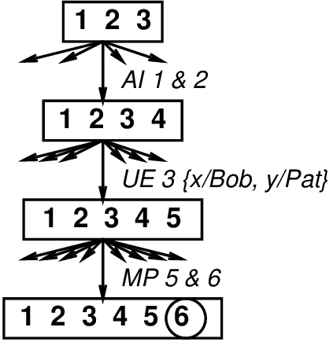
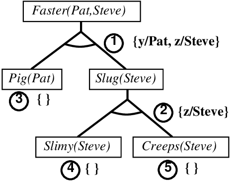
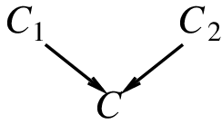
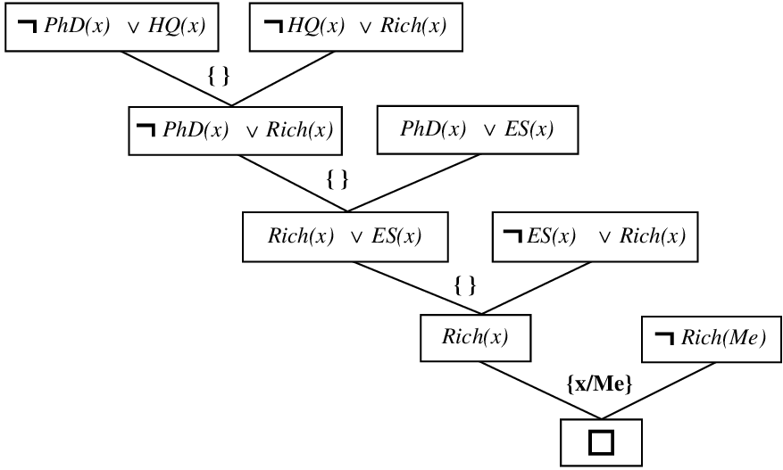

# Chapter 09 Inference in First-order Logic

<!-- tabs:start -->

#### **Tiếng Việt**
<div class="pdf-container">
  <iframe src="TaiLieu/ebooks_Chapters_Vi3/Chapter_09/chapter_09_vi.html" width="100%" height="100%"></iframe>
</div>

#### **Tiếng Anh**
<div class="pdf-container">
  <iframe src="TaiLieu/ebooks_Chapters/Chapter_09_Inference%20in%20First-order%20Logic.pdf" width="100%" height="100%"></iframe>
</div>

#### **Slide**

\usepackage{aima-slides}
\usepackage[utf8]{inputenc}
\usepackage[T5]{fontenc}
\usepackage{lmodern}

# Suy diễn trong logic bậc một (Inference in first-order logic)

## Chương 9, Phần 1--4

---
## Nội dung

- Các phép chứng minh (Proofs)

- Sự hợp nhất (Unification)

- Modus Ponens tổng quát (Generalized Modus Ponens)

- Suy diễn tiến và lùi (Forward and backward chaining)

---
## Các phép chứng minh

Suy diễn đúng đắn: tìm $
  pha$ sao cho $KB \models 
  pha$.

Quá trình chứng minh là một quá trình <u>tìm kiếm</u>, các toán tử là các quy tắc suy diễn.

Ví dụ, Modus Ponens (MP)
\[\displaystyle
\frac{
  pha, &nbsp;&nbsp;  
  pha\implies\beta}{\beta}  &nbsp;&nbsp;&nbsp;&nbsp; 
\frac{At(Joe,UCB) &nbsp;&nbsp;  At(Joe,UCB)\implies OK(Joe)}{OK(Joe)}
\]

Ví dụ, And-Introduction (AI)
\[\displaystyle
\frac{
  pha  &nbsp;&nbsp;  \beta}{
  pha \land \beta}  &nbsp;&nbsp;&nbsp;&nbsp; 
\frac{OK(Joe) &nbsp;&nbsp;  CSMajor(Joe)}{OK(Joe)\land CSMajor(Joe)}
\]

Ví dụ, Universal Elimination (UE)
\[\displaystyle
\frac{\All{x} 
  pha}{
  pha\{x/\tau\}}  &nbsp;&nbsp;&nbsp;&nbsp; 
\frac{\All{x} At(x,UCB)\implies OK(x)}{At(Pat,UCB)\implies OK(Pat)}
\]
$\tau$ phải là một hạng thức cơ sở (ground term) (tức là, không có biến số)

---
## Ví dụ chứng minh

| &nbsp; | &nbsp; | &nbsp; |
|---|---|---|
| Bob là một con trâu | 1. | $Buffalo(Bob)$ |
| Pat là một con lợn | 2. | $Pig(Pat)$ |
| Trâu chạy nhanh hơn lợn | 3. | $\All{x,y} Buffalo(x) \land Pig(y) \implies Faster(x,y)$ |
| Bob chạy nhanh hơn Pat |  | \phantom{$Buffalo(Bob) \land Pig(Pat) \implies Faster(Bob,Pat)$} |
| \phantom{UE 3, $\{x/Bob,y/Pat\}$} |  |  |

---
## Ví dụ chứng minh

| &nbsp; | &nbsp; | &nbsp; |
|---|---|---|
| \phantom{Bob là một con trâu} |  |  |
| \phantom{UE 3, $\{x/Bob,y/Pat\}$} |  |  |
| \phantom{Trâu chạy nhanh hơn lợn} |  |  |
| \phantom{Bob chạy nhanh hơn Pat} |  | \phantom{$Buffalo(Bob) \land Pig(Pat) \implies Faster(Bob,Pat)$} |
| AI 1 \ | 2 | 4. | $Buffalo(Bob) \land Pig(Pat)$ |

---
## Ví dụ chứng minh

| &nbsp; | &nbsp; | &nbsp; |
|---|---|---|
| \phantom{Bob là một con trâu} |  |  |
| \phantom{Pat là một con lợn} |  |  |
| \phantom{Trâu chạy nhanh hơn lợn} |  |  |
| \phantom{Bob chạy nhanh hơn Pat} |  | \phantom{$Buffalo(Bob) \land Pig(Pat) \implies Faster(Bob,Pat)$} |
| \phantom{AI 1 \ | 2} |  |  |
| UE 3, $\{x/Bob,y/Pat\}$ | 5. | $Buffalo(Bob) \land Pig(Pat) \implies Faster(Bob,Pat)$ |

---
## Ví dụ chứng minh

| &nbsp; | &nbsp; | &nbsp; |
|---|---|---|
| \phantom{Bob là một con trâu} |  |  |
| \phantom{Pat là một con lợn} |  |  |
| \phantom{Trâu chạy nhanh hơn lợn} |  |  |
| \phantom{Bob chạy nhanh hơn Pat} |  | \phantom{$Buffalo(Bob) \land Pig(Pat) \implies Faster(Bob,Pat)$} |
| \phantom{AI 1 \ | 2} |  |  |
| \phantom{UE 3, $\{x/Bob,y/Pat\}$} |  |  |
| MP 6 \ | 7 | 6. | $Faster(Bob,Pat)$ |

---
## Tìm kiếm với các quy tắc suy diễn nguyên thủy

Các toán tử là các quy tắc suy diễn

Các trạng thái là các tập hợp các câu

Kiểm tra đích kiểm tra trạng thái để xem nó có chứa câu truy vấn hay không


 

AI, UE, MP là một mẫu suy diễn phổ biến

<u>Vấn đề</u>: hệ số phân nhánh khổng lồ, đặc biệt đối với UE

<u>Ý tưởng</u>: tìm một phép thế làm cho tiền đề của quy tắc khớp với một số
sự kiện đã biết
  
$\Rightarrow$ một quy tắc suy diễn duy nhất, mạnh mẽ hơn

---
## Sự hợp nhất (Unification)

Một phép thế $\sigma$ hợp nhất các câu nguyên thủy $p$ và $q$ nếu
<u>\u{$p\sigma = q\sigma$</u>}
\[\begin{array}{l|l|l}
p & q & \sigma 

\hline
Knows(John,x) & Knows(John,Jane) & 

Knows(John,x) & Knows(y,OJ)      & 

Knows(John,x) & Knows(y,Mother(y)& \phantom{\{y/John,x/Mother(John)\}}

\end{array}\]

---
## Sự hợp nhất

.
\[\begin{array}{l|l|l}
 &  &  

\hline
\phantom{Knows(John,x)} & \phantom{Knows(John,Jane)} & \{x/Jane\}

\phantom{Knows(John,x)} & \phantom{Knows(y,OJ)}      & \{x/John,y/OJ\}

\phantom{Knows(John,x)} & \phantom{Knows(y,Mother(y)}& \{y/John,x/Mother(John)\}

\end{array}\]
<u>Ý tưởng</u>: Hợp nhất các tiền đề quy tắc với các sự kiện đã biết, áp dụng phép hợp nhất cho kết luận

| &nbsp; | &nbsp; |
|---|---|
| Ví dụ, nếu chúng ta biết $q$ và | $Knows(John,x) \implies Likes(John,x)$ |
| thì chúng ta kết luận | $Likes(John,Jane)$ |
|  | $Likes(John,OJ)$ |
|  | $Likes(John,Mother(John))$ |

---
## Modus Ponens tổng quát (Generalized Modus Ponens - GMP)

\[\frac{{p_1}', \;\; {p_2}', \; \ldots, \; {p_n}', \;\;
( p_1 \land p_2 \land \ldots \land p_n \Rightarrow q)}{q\sigma}
 &nbsp;&nbsp;&nbsp;&nbsp;  \mbox{trong đó }{p_i}'\sigma \eq p_i\sigma\mbox{ với mọi } i
\]

| &nbsp; | &nbsp; |
|---|---|
| Ví dụ ${p_1}'\eq$ | Faster(Bob,Pat) |
| ${p_2}'\eq$ | Faster(Pat,Steve) |
| $p_1 \land p_2 \implies q\ \eq$ | $Faster(x,y) \land Faster(y,z) \implies Faster(x,z)$ |
| $\sigma\eq$ | $\{x/Bob,y/Pat,z/Steve\}$ |
| $q\sigma\eq$ | $Faster(Bob,Steve)$ |

GMP được sử dụng với KB của <u>các mệnh đề xác định (definite clauses)</u> (*chính xác* một literal khẳng định):

hoặc là một câu nguyên thủy đơn hoặc
    
(phép hội của các câu nguyên thủy) $\Rightarrow$ (câu nguyên thủy)

Tất cả các biến được giả định là có lượng từ phổ dụng

---
## Tính đúng đắn của GMP

Cần phải chỉ ra rằng 
\[{p_1}', \; \ldots, \; {p_n}', \;\;
( p_1 \land \ldots \land p_n \Rightarrow q) \models q\sigma\]
với điều kiện là ${p_i}'\sigma \eq p_i\sigma$ với mọi $i$

Bổ đề: Đối với bất kỳ mệnh đề xác định $p$ nào, ta có $p \models p\sigma$ bằng UE

1. $( p_1 \land \ldots \land p_n \Rightarrow q) \models 
    ( p_1 \land \ldots \land p_n \Rightarrow q)\sigma \eq
    ( p_1\sigma \land \ldots \land p_n\sigma \Rightarrow q\sigma)$

2. $ {p_1}', \; \ldots, \; {p_n}' \models
     {p_1}' \land \ldots \land {p_n}' \models
     {p_1}'\sigma \land \ldots \land {p_n}'\sigma $

3. Từ 1 và 2, $q\sigma$ được rút ra bằng MP đơn giản

---
## Suy diễn tiến (Forward chaining)

Khi một sự kiện mới $p$ được thêm vào KB
  
   với mỗi quy tắc sao cho $p$ hợp nhất với một tiền đề
    
      nếu các tiền đề khác <u>đã biết</u>
    
      thì thêm kết luận vào KB và tiếp tục suy diễn (chaining)

Suy diễn tiến <u>được thúc đẩy bởi dữ liệu (data-driven)</u>
    
ví dụ, suy diễn các thuộc tính và loại từ các nhận thức

---
## Ví dụ suy diễn tiến

Lần lượt thêm các sự kiện 1, 2, 3, 4, 5, 7.

Số trong [] = literal hợp nhất; \tick\ chỉ ra quy tắc được kích hoạt

<u>1.</u> $Buffalo(x) \land Pig(y) \implies Faster(x,y)$

<u>2.</u> $Pig(y) \land Slug(z) \implies Faster(y,z)$

<u>3.</u> $Faster(x,y) \land Faster(y,z) \implies Faster(x,z)$

<u>4.</u> $Buffalo(Bob)$ <u>[1a,\cross]</u>

<u>5.</u> $Pig(Pat)$ <u>[1b,\tick]</u> $\rightarrow$ <u>6.</u> $Faster(Bob,Pat)$ <u>[3a,\cross]</u>, <u>[3b,\cross]</u>

\phantom{<u>5.</u> $Pig(Pat)$} <u>[2a,\cross]</u>

<u>7.</u> $Slug(Steve)$ <u>[2b,\tick]</u>
  
$\rightarrow$<u>8.</u> $Faster(Pat,Steve)$ <u>[3a,\cross]</u>, <u>[3b,\tick]</u>
    
$\rightarrow$<u>9.</u> $Faster(Bob,Steve)$ <u>[3a,\cross]</u>, <u>[3b,\cross]</u>

---
## Suy diễn lùi (Backward chaining)

Khi một truy vấn $q$ được hỏi
  
   nếu một sự kiện khớp $q'$ đã được biết, trả về bộ hợp nhất
  
   với mỗi quy tắc mà hệ quả $q'$ của nó khớp với $q$
    
      cố gắng chứng minh từng tiền đề của quy tắc bằng suy diễn lùi

(Có một số phức tạp được thêm vào trong việc theo dõi các bộ hợp nhất)

(Nhiều phức tạp hơn giúp tránh các vòng lặp vô hạn)

Hai phiên bản: tìm <u>bất kỳ</u> giải pháp nào, tìm <u>tất cả</u> các giải pháp

Suy diễn lùi là cơ sở cho <u>lập trình logic (logic programming)</u>, ví dụ: Prolog

---
## Ví dụ suy diễn lùi

<u>1.</u> $Pig(y) \land Slug(z) \implies Faster(y,z)$

<u>2.</u> $Slimy(z) \land Creeps(z) \implies Slug(z)$

<u>3.</u> $Pig(Pat)$  &nbsp;&nbsp;&nbsp;&nbsp;  <u>4.</u> $Slimy(Steve)$  &nbsp;&nbsp;&nbsp;&nbsp;  <u>5.</u> $Creeps(Steve)$



\usepackage{aima-slides}
\usepackage[utf8]{inputenc}
\usepackage[T5]{fontenc}
\usepackage{lmodern}

# Suy diễn quy mô công nghiệp (Industrial-strength inference)

## Chương 9.5--6, Chương 8.1 và 10.2--3

---
## Nội dung

- Tính đầy đủ (Completeness)

- Phân giải (Resolution)

- Lập trình logic (Logic programming)

---
## Tính đầy đủ trong FOL

Thủ tục $i$ là đầy đủ khi và chỉ khi
\[
  KB \vdash_i 
  pha  &nbsp;&nbsp;  \mbox{{\rm mỗi khi}}  &nbsp;&nbsp;  KB \models 
  pha
\]
Suy diễn tiến và lùi là <u>đầy đủ cho KB Horn</u>

nhưng không đầy đủ cho logic bậc một tổng quát

Ví dụ, từ
\begin{formula}
  PhD(x) \implies HighlyQualified(x) 

  \lnot PhD(x) \implies EarlyEarnings(x)

  HighlyQualified(x) \implies Rich(x)

  EarlyEarnings(x) \implies Rich(x)
\end{formula}
lẽ ra phải có thể suy ra $Rich(Me)$, nhưng FC/BC sẽ không làm được điều đó

Có tồn tại một thuật toán đầy đủ không?

---
## Lịch sử tóm tắt của việc suy luận

| &nbsp; | &nbsp; | &nbsp; |
|---|---|---|
| 450**TCN** | Stoics | logic mệnh đề, suy diễn (có thể) |
| 322**TCN** | Aristotle | "tam đoạn luận" (quy tắc suy diễn), lượng từ |
| 1565 | Cardano | lý thuyết xác suất (logic mệnh đề + độ bất định) |
| 1847 | Boole | logic mệnh đề (một lần nữa) |
| 1879 | Frege | logic bậc một |
| 1922 | Wittgenstein | chứng minh bằng bảng chân lý |
| 1930 | G\"odel | $\exists$ thuật toán đầy đủ cho FOL |
| 1930 | Herbrand | thuật toán đầy đủ cho FOL (rút gọn về mệnh đề) |
| 1931 | G\"odel | $\lnot\exists$ thuật toán đầy đủ cho số học |
| 1960 | Davis/Putnam | thuật toán "thực tiễn" cho logic mệnh đề |
| 1965 | Robinson | thuật toán "thực tiễn" cho FOL---phân giải |

---
## Phân giải (Resolution)

Kéo theo trong logic bậc một chỉ là <u>nửa quyết định được (semidecidable)</u>:
  
có thể tìm thấy một chứng minh của $
  pha$ nếu $KB \models 
  pha$
  
không thể luôn luôn chứng minh rằng $KB \not\models 
  pha$

So sánh với Vấn đề dừng (Halting Problem): thủ tục chứng minh có thể sắp dừng
với sự thành công hoặc thất bại, hoặc có thể diễn ra mãi mãi

Phân giải là một thủ tục <u>bác bỏ (refutation)</u>:
  
để chứng minh $KB \models 
  pha$, chỉ ra rằng $KB\land\lnot
  pha$ là không thỏa mãn được

Phân giải sử dụng $KB$, $\lnot
  pha$ trong dạng chuẩn hội (CNF) (phép hội của các mệnh đề)

Quy tắc suy diễn phân giải kết hợp hai mệnh đề để tạo ra một mệnh đề mới:

in


Sự suy diễn tiếp tục cho đến khi một <u>mệnh đề rỗng (empty clause)</u> được suy ra (mâu thuẫn)

---
## Quy tắc suy diễn phân giải

Phiên bản mệnh đề cơ bản:
\begin{formula}
{\displaystyle
\frac{
  pha \lor \beta,\;\; \lnot \beta \lor \gamma}{
  pha \lor \gamma}
 &nbsp;&nbsp;&nbsp;&nbsp;  \mbox{hoặc tương đương}  &nbsp;&nbsp;&nbsp;&nbsp; 
\frac{\lnot
  pha \implies \beta,\;\; \beta \implies \gamma}{\lnot 
  pha \implies \gamma}
}
\end{formula}
Phiên bản bậc một đầy đủ:
\begin{formula}
{\begin{array}{l} p_1\lor \ldots\ p_j\ \ldots \lor p_m,

                   q_1\lor \ldots\ q_k\ \ldots \lor q_n
 \end{array}}
\over
{\begin{array}{l}
(p_1\lor \ldots\ p_{j-1} \lor p_{j+1}\ \ldots p_m \lor 
q_1\ldots\ q_{k-1} \lor q_{k+1}\ \ldots \lor q_n)\sigma
 \end{array}}
\end{formula}
trong đó $p_j\sigma = \lnot q_k \sigma$

Ví dụ:
\begin{formula}
{\begin{array}{l} \lnot Rich(x) \lor Unhappy(x) 

                  Rich(Me)
 \end{array}}
\over
{\begin{array}{l} Unhappy(Me)
 \end{array}}
\end{formula}
với $\sigma = \{x/Me\}$

---
## Dạng chuẩn hội (Conjunctive Normal Form)

<u>Literal</u> = câu nguyên thủy (có thể bị phủ định), ví dụ: $\lnot Rich(Me)$

<u>Mệnh đề (Clause)</u> = phép tuyển của các literal, ví dụ: $\lnot Rich(Me) \lor Unhappy(Me)$

KB là phép hội của các mệnh đề

Bất kỳ FOL KB nào cũng có thể được chuyển đổi thành CNF như sau:

1. Thay thế $P{\implies}Q$ bằng ${\lnot}P{\lor}Q$

2. Di chuyển $\lnot$ vào trong, ví dụ: 
      $\lnot \forall x\,P$ trở thành $\exists x\,\lnot P$

3. Chuẩn hóa biến tách biệt, ví dụ: 
  $\forall x\,P \lor \exists x\,Q$ trở thành $\forall x\,P \lor \exists y\,Q$

4. Di chuyển các lượng từ sang trái theo thứ tự, ví dụ:
  $\forall x\,P \lor \exists x\,Q$ trở thành $\forall x\exists y\,P \lor Q$

5. Loại bỏ $\exists$ bằng phương pháp Skolemization (slide tiếp theo)

6. Bỏ các lượng từ phổ dụng

7. Phân phối $\land$ qua $\lor$, ví dụ:
    $(P \land Q) \lor R$ trở thành $(P\lor Q) \land (P\lor R)$

---
## Phương pháp Skolemization

$\exists x\,Rich(x)$ trở thành $Rich(G1)$ trong đó $G1$ là một "<u>hằng số Skolem</u>" mới

$\Exi{k} \frac{d}{dy}(k^y) \eq k^y$ trở thành $\frac{d}{dy}(e^y) \eq e^y$

Khó hơn khi $\exists$ nằm bên trong $\forall$

Ví dụ: "Mọi người đều có một trái tim"
  
   $\All{x} Person(x) \implies \Exi{y} Heart(y) \land Has(x,y)$

<u>Sai</u>:
  
   $\All{x} Person(x) \implies Heart(H1) \land Has(x,H1)$

<u>Đúng</u>:
  
   $\All{x} Person(x) \implies Heart(H(x)) \land Has(x,H(x))$

trong đó $H$ là một ký hiệu mới ("hàm Skolem")

Các đối số của hàm Skolem: tất cả các biến lượng từ phổ dụng <u>bao quanh</u>

---
## Chứng minh phân giải

Để chứng minh $
  pha$:
  
-- phủ định nó
  
-- chuyển đổi sang CNF
  
-- thêm vào CNF KB
  
-- suy diễn ra mâu thuẫn

Ví dụ: để chứng minh $Rich(me)$, thêm $\lnot Rich(me)$ vào CNF KB
\begin{formula}
  \lnot PhD(x) \lor HighlyQualified(x) 

  PhD(x) \lor EarlyEarnings(x)

  \lnot HighlyQualified(x) \lor Rich(x)

  \lnot EarlyEarnings(x) \lor Rich(x)
\end{formula}

---
## Chứng minh phân giải



---
## Lập trình logic

Khẩu hiệu: tính toán là sự suy diễn trên các KB logic

| &nbsp; | &nbsp; | &nbsp; |
|---|---|---|
|  | <u>Lập trình logic</u> | <u>Lập trình thông thường</u> |
| 1. | Xác định vấn đề | Xác định vấn đề |
| 2. | Thu thập thông tin | Thu thập thông tin |
| 3. | Nghỉ giải lao | Tìm ra giải pháp |
| 4. | Mã hóa thông tin vào KB | Lập trình giải pháp |
| 5. | Mã hóa ví dụ vấn đề thành sự kiện | Mã hóa ví dụ vấn đề thành dữ liệu |
| 6. | Hỏi các truy vấn | Áp dụng chương trình vào dữ liệu |
| 7. | Tìm các sự kiện sai | Gỡ lỗi các lỗi thủ tục |

Nên dễ dàng gỡ lỗi $Capital(NewYork,US)$ hơn $x:= x+2$ !

---
## Hệ thống Prolog

Cơ sở: suy diễn lùi với các mệnh đề Horn + các tính năng bổ sung (bells \& whistles)

Được sử dụng rộng rãi ở Châu Âu, Nhật Bản (cơ sở của dự án Thế hệ thứ 5)

Kỹ thuật biên dịch $\Rightarrow$ 10 triệu LIPS

Chương trình = tập các mệnh đề = `head :- literal$_1$, $\ldots$ literal$_n$.`

Hợp nhất hiệu quả bằng <u>mã hóa mở (open coding)</u>

Truy xuất hiệu quả các mệnh đề khớp bằng liên kết trực tiếp

Suy diễn lùi từ trái sang phải, ưu tiên chiều sâu

Các vị từ tích hợp cho số học v.v., ví dụ: `X is Y*Z+3`

Giả định thế giới đóng ("phủ định như là sự thất bại")
  
   ví dụ: `not PhD(X)` thành công nếu `PhD(X)` thất bại

---
## Ví dụ Prolog

Tìm kiếm ưu tiên chiều sâu từ trạng thái bắt đầu `X`:

```text
dfs(X) :- goal(X).
dfs(X) :- successor(X,S),dfs(S).
```

Không cần lặp qua `S`: `successor` thành công với mỗi trường hợp

Nối hai danh sách để tạo ra danh sách thứ ba:

```text
append([],Y,Y).                         
append([X|L],Y,[X|Z]) :- append(L,Y,Z). 
                                        
query:   append(A,B,[1,2]) ?            
answers: A=[]    B=[1,2]
         A=[1]   B=[2]
         A=[1,2] B=[]
```


#### **Trắc nghiệm**
*(Chưa có bài tập trắc nghiệm)*

#### **Pseudocode**
- [UNIFY](codeAndExercises/aima-pseudocode-master/md/Unify.md)
- [FOL-FC-ASK](codeAndExercises/aima-pseudocode-master/md/FOL-FC-Ask.md)
- [FOL-BC-ASK](codeAndExercises/aima-pseudocode-master/md/FOL-BC-Ask.md)
- [APPEND](codeAndExercises/aima-pseudocode-master/md/Append.md)

*(Thư mục chứa mã giả cho các thuật toán trong sách: `codeAndExercises/aima-pseudocode-master/md`)*

#### **Python**
- [Logic](codeAndExercises/aima-python-master/notebooks/logic.ipynb)
- [Logic (Python File)](codeAndExercises/aima-python-master/notebooks/logic.py)


#### **Bài tập**

##### Bài tập 9.1

Prove that Universal Instantiation is sound and that Existential
Instantiation produces an inferentially equivalent knowledge base.


---

##### Bài tập 9.2

From ${Likes}({Jerry},{IceCream})$ it seems reasonable to infer
${\exists\,x\;\;} {Likes}(x,{IceCream})$. Write down a general inference rule, , that
sanctions this inference. State carefully the conditions that must be
satisfied by the variables and terms involved.


---

##### Bài tập 9.3

Suppose a knowledge base contains just one sentence,
$\exists\,x\ {AsHighAs}(x,{Everest})$. Which of the following are
legitimate results of applying Existential Instantiation?<br>

1.  ${AsHighAs}({Everest},{Everest})$.<br>

2.  ${AsHighAs}({Kilimanjaro},{Everest})$.<br>

3.  ${AsHighAs}({Kilimanjaro},{Everest}) \land {AsHighAs}({BenNevis},{Everest})$\
    (after two applications).<br>


---

##### Bài tập 9.4

For each pair of atomic sentences, give the most general unifier if it
exists:<br>

1.  $P(A,B,B)$, $P(x,y,z)$.<br>

2.  $Q(y,G(A,B))$, $Q(G(x,x),y)$.<br>

3.  ${Older}({Father}(y),y)$, ${Older}({Father}(x),{John})$.<br>

4.  ${Knows}({Father}(y),y)$, ${Knows}(x,x)$.<br>


---

##### Bài tập 9.5

For each pair of atomic sentences, give the most general unifier if it
exists:<br>

1.  $P(A,B,B)$, $P(x,y,z)$.<br>

2.  $Q(y,G(A,B))$, $Q(G(x,x),y)$.<br>

3.  ${Older}({Father}(y),y)$, ${Older}({Father}(x),{John})$.<br>

4.  ${Knows}({Father}(y),y)$, ${Knows}(x,x)$.<br>


---

##### Bài tập 9.6

Consider the subsumption lattices shown
in Figure <a class="insideBookFigRef" target="_blank" href="https://aimacode.github.io/aima-exercises/figures/subsumption-lattice-figure.png">subsumption-lattice-figure</a>
(page <a class="pageRef" title="" href="#">subsumption-lattice-figure</a><br>.

1.  Construct the lattice for the sentence
    ${Employs}({Mother}({John}),{Father}({Richard}))$.<br>

2.  Construct the lattice for the sentence ${Employs}({IBM},y)$
    (“Everyone works for IBM”). Remember to include every kind of query
    that unifies with the sentence.<br>

3.  Assume that indexes each sentence under every node in its
    subsumption lattice. Explain how should work when some of these
    sentences contain variables; use as examples the sentences in (a)
    and (b) and the query ${Employs}(x,{Father}(x))$.


---

##### Bài tập 9.7

Write down logical representations for the
following sentences, suitable for use with Generalized Modus Ponens:<br>

1.  Horses, cows, and pigs are mammals.<br>

2.  An offspring of a horse is a horse.<br>

3.  Bluebeard is a horse.<br>

4.  Bluebeard is Charlie’s parent.<br>

5.  Offspring and parent are inverse relations.<br>

6.  Every mammal has a parent.<br>


---

##### Bài tập 9.8

These questions concern concern issues with substitution and
Skolemization.<br>

1.  Given the premise ${\forall\,x\;\;} {\exists\,y\;\;} P(x,y)$, it is
    not valid to conclude that ${\exists\,q\;\;} P(q,q)$. Give an
    example of a predicate $P$ where the first is true but the second
    is false.<br>

2.  Suppose that an inference engine is incorrectly written with the
    occurs check omitted, so that it allows a literal like $P(x,F(x))$
    to be unified with $P(q,q)$. (As mentioned, most standard
    implementations of Prolog actually do allow this.) Show that such an
    inference engine will allow the conclusion ${\exists\,y\;\;} P(q,q)$
    to be inferred from the premise
    ${\forall\,x\;\;} {\exists\,y\;\;} P(x,y)$.<br>

3.  Suppose that a procedure that converts first-order logic to clausal
    form incorrectly Skolemizes
    ${\forall\,x\;\;} {\exists\,y\;\;} P(x,y)$ to $P(x,Sk0)$—that is, it
    replaces $y$ by a Skolem constant rather than by a Skolem function
    of $x$. Show that an inference engine that uses such a procedure
    will likewise allow ${\exists\,q\;\;} P(q,q)$ to be inferred from
    the premise ${\forall\,x\;\;} {\exists\,y\;\;} P(x,y)$.<br>

4.  A common error among students is to suppose that, in unification,
    one is allowed to substitute a term for a Skolem constant instead of
    for a variable. For instance, they will say that the formulas
    $P(Sk1)$ and $P(A)$ can be unified under the substitution
    $\{ Sk1/A \}$. Give an example where this leads to an
    invalid inference.<br>


---

##### Bài tập 9.9

This question considers Horn KBs, such as the following:
$$\begin{array}{l}
P(F(x)) {\:\;{\Rightarrow}\:\;}P(x)\\
Q(x) {\:\;{\Rightarrow}\:\;}P(F(x))\\
P(A)\\
Q(B)
\end{array}$$ Let FC be a breadth-first forward-chaining algorithm that
repeatedly adds all consequences of currently satisfied rules; let BC be
a depth-first left-to-right backward-chaining algorithm that tries
clauses in the order given in the KB. Which of the following are true?<br>

1.  FC will infer the literal $Q(A)$.<br>

2.  FC will infer the literal $P(B)$.<br>

3.  If FC has failed to infer a given literal, then it is not entailed
    by the KB.<br>

4.  BC will return ${true}$ given the query $P(B)$.<br>

5.  If BC does not return ${true}$ given a query literal, then it is
    not entailed by the KB.<br>


---

##### Bài tập 9.10

Explain how to write any given 3-SAT problem of
arbitrary size using a single first-order definite clause and no more
than 30 ground facts.


---

##### Bài tập 9.11

Suppose you are given the following axioms:<br>

 1. $0 \leq 3$.<br>
 2. $7 \leq 9$.<br>
 3. ${\forall\,x\;\;} \; \; x \leq x$.<br>
 4. ${\forall\,x\;\;} \; \; x \leq x+0$.<br>
 5. ${\forall\,x\;\;} \; \; x+0 \leq x$.<br>
 6. ${\forall\,x,y\;\;} \; \; x+y \leq y+x$.<br>
 7. ${\forall\,w,x,y,z\;\;} \; \; w \leq y$ $\wedge$ $x \leq z$ ${\:\;{\Rightarrow}\:\;}$ $w+x \leq y+z$.<br>
 8. ${\forall\,x,y,z\;\;} \; \; x \leq y \wedge y \leq z \: {\:\;{\Rightarrow}\:\;}\: x \leq z$ <br>
<br>
1.  Give a backward-chaining proof of the sentence $7 \leq 3+9$. (Be
    sure, of course, to use only the axioms given here, not anything
    else you may know about arithmetic.) Show only the steps that leads
    to success, not the irrelevant steps.<br>

2.  Give a forward-chaining proof of the sentence $7 \leq 3+9$. Again,
    show only the steps that lead to success.<br>


---

##### Bài tập 9.12

Suppose you are given the following axioms:<br>

> 1. $0 \leq 4$.<br>

> 2. $5 \leq 9$.<br>

> 3. ${\forall\,x\;\;} \; \; x \leq x$.<br>

> 4. ${\forall\,x\;\;} \; \; x \leq x+0$.<br>

> 5. ${\forall\,x\;\;} \; \; x+0 \leq x$.<br>

> 6. ${\forall\,x,y\;\;} \; \; x+y \leq y+x$.<br>

> 7. ${\forall\,w,x,y,z\;\;} \; \; w \leq y$ $\wedge$ $x \leq z {\:\;{\Rightarrow}\:\;}$ $w+x \leq y+z$.<br>

> 8. ${\forall\,x,y,z\;\;} \; \; x \leq y \wedge y \leq z \: {\:\;{\Rightarrow}\:\;}\: x \leq z$<br>
<br>
1.  Give a backward-chaining proof of the sentence $5 \leq 4+9$. (Be
    sure, of course, to use only the axioms given here, not anything
    else you may know about arithmetic.) Show only the steps that leads
    to success, not the irrelevant steps.<br>

2.  Give a forward-chaining proof of the sentence $5 \leq 4+9$. Again,
    show only the steps that lead to success.


---

##### Bài tập 9.13

A popular children’s riddle is “Brothers and sisters have I none, but
that man’s father is my father’s son.” Use the rules of the family
domain (Section <a class="sectionRef" title="" href="#">kinship-domain-section</a> on
page <a class="pageRef" title="" href="#">kinship-domain-section</a> to show who that man is. You may apply any of the
inference methods described in this chapter. Why do you think that this
riddle is difficult?


---

##### Bài tập 9.14

Suppose we put into a logical knowledge base a segment of the
U.S. census data listing the age, city of residence, date of birth, and
mother of every person, using social security numbers as identifying
constants for each person. Thus, George’s age is given by
${Age}(443-65-1282, 56)$. Which of the following
indexing schemes S1–S5 enable an efficient solution for which of the
queries Q1–Q4 (assuming normal backward chaining)?<br>
<br>
- <b>S1</b>: an index for each atom in each position.<br>
- <b>S2</b>: an index for each first argument.<br>
- <b>S3</b>: an index for each predicate atom.<br>
- <b>S4</b>: an index for each <i>combination</i> of predicate and first argument.<br>
- <b>S5</b>: an index for each <i>combination</i> of predicate and second argument and an index for each first argument.<br>
- <b>Q1</b>: ${Age}(\mbox 443-44-4321,x)$<br>
- <b>Q2</b>: ${ResidesIn}(x,{Houston})$<br>
- <b>Q3</b>: ${Mother}(x,y)$<br>
- <b>Q4</b>: ${Age}(x,{34}) \land {ResidesIn}(x,{TinyTownUSA})$<br>


---

##### Bài tập 9.15

One might suppose that we can avoid the
problem of variable conflict in unification during backward chaining by
standardizing apart all of the sentences in the knowledge base once and
for all. Show that, for some sentences, this approach cannot work.
(<i>Hint</i>: Consider a sentence in which one part unifies with
another.)


---

##### Bài tập 9.16

In this exercise, use the sentences you wrote in
Exercise <a href="#">fol-horses-exercise</a> to answer a question by
using a backward-chaining algorithm.<br>

1.  Draw the proof tree generated by an exhaustive backward-chaining
    algorithm for the query ${\exists\,h\;\;}{Horse}(h)$, where
    clauses are matched in the order given.<br>

2.  What do you notice about this domain?<br>

3.  How many solutions for $h$ actually follow from your sentences?<br>

4.  Can you think of a way to find all of them? (<i>Hint</i>:
    See <a class="paperRef" title="" href="">Smith+al:1986</a>.)<br>


---

##### Bài tập 9.17

Trace the execution of the backward-chaining
algorithm in Figure <a class="insideBookFigRef" target="_blank" href="https://aimacode.github.io/aima-exercises/figures/backward-chaining-algorithm">backward-chaining-algorithm</a>
(page <a class="pageRef" title="" href="#">backward-chaining-algorithm</a> when it is applied to solve the crime problem
(page <A href="#">west-problem-page</a>. Show the sequence of values taken on by the
${goals}$ variable, and arrange them into a tree.


---

##### Bài tập 9.18

The following Prolog code defines a predicate P. (Remember
that uppercase terms are variables, not constants, in Prolog.)<br>

        P(X,[X|Y]).<br>
        P(X,[Y|Z]) :- P(X,Z).<br>

1.  Show proof trees and solutions for the queries
    P(A,[2,1,3]) and P(2,[1,A,3]).<br>

2.  What standard list operation does P represent?<br>


---

##### Bài tập 9.19

The following Prolog code defines a predicate P. (Remember
that uppercase terms are variables, not constants, in Prolog.)<br>

        P(X,[X|Y]).<br>
        P(X,[Y|Z]) :- P(X,Z).<br>

1.  Show proof trees and solutions for the queries
    P(A,[1,2,3]) and P(2,[1,A,3]).<br>

2.  What standard list operation does P represent?<br>


---

##### Bài tập 9.20

This exercise looks at sorting in Prolog.<br>

1.  Write Prolog clauses that define the predicate
    sorted(L), which is true if and only if list
    L is sorted in ascending order.<br>

2.  Write a Prolog definition for the predicate perm(L,M),
    which is true if and only if L is a permutation of
    M.<br>

3.  Define sort(L,M) (M is a sorted version of
    L) using perm and sorted.<br>

4.  Run sort on longer and longer lists until you lose
    patience. What is the time complexity of your program?<br>

5.  Write a faster sorting algorithm, such as insertion sort or
    quicksort, in Prolog.<br>


---

##### Bài tập 9.21

This exercise looks at the recursive
application of rewrite rules, using logic programming. A rewrite rule
(or <b>demodulator</b> in terminology) is an
equation with a specified direction. For example, the rewrite rule
$x+0 \rightarrow x$ suggests replacing any expression that matches $x+0$
with the expression $x$. Rewrite rules are a key component of equational
reasoning systems. Use the predicate rewrite(X,Y) to
represent rewrite rules. For example, the earlier rewrite rule is
written as rewrite(X+0,X). Some terms are
<i>primitive</i> and cannot be further simplified; thus, we
write primitive(0) to say that 0 is a primitive term.<br>

1.  Write a definition of a predicate simplify(X,Y), that
    is true when Y is a simplified version of
    X—that is, when no further rewrite rules apply to any
    subexpression of Y.<br>

2.  Write a collection of rules for the simplification of expressions
    involving arithmetic operators, and apply your simplification
    algorithm to some sample expressions.<br>

3.  Write a collection of rewrite rules for symbolic differentiation,
    and use them along with your simplification rules to differentiate
    and simplify expressions involving arithmetic expressions,
    including exponentiation.<br>


---

##### Bài tập 9.22

This exercise considers the implementation of search algorithms in
Prolog. Suppose that successor(X,Y) is true when state
Y is a successor of state X; and that
goal(X) is true when X is a goal state. Write
a definition for solve(X,P), which means that
P is a path (list of states) beginning with X,
ending in a goal state, and consisting of a sequence of legal steps as
defined by successor. You will find that depth-first search
is the easiest way to do this. How easy would it be to add heuristic
search control?


---

##### Bài tập 9.23

Suppose a knowledge base contains just the following first-order Horn
clauses:<br>

$$
Ancestor(Mother(x),x)
$$
$$
Ancestor(x,y) \land Ancestor(y,z) \implies Ancestor(x,z)
$$

Consider a forward chaining algorithm that, on the $j$th iteration,
terminates if the KB contains a sentence that unifies with the query,
else adds to the KB every atomic sentence that can be inferred from the
sentences already in the KB after iteration $j-1$.<br>

1.  For each of the following queries, say whether the algorithm
    will (1) give an answer (if so, write down that answer); or (2)
    terminate with no answer; or (3) never terminate.<br>

    1.  $Ancestor(Mother(y),John)$<br>

    2.  $Ancestor(Mother(Mother(y)),John)$<br>

    3.  $Ancestor(Mother(Mother(Mother(y))),Mother(y))$<br>

    4.  $Ancestor(Mother(John),Mother(Mother(John)))$<br>

2.  Can a resolution algorithm prove the sentence
    $\lnot Ancestor(John,John)$ from the original knowledge base?
    Explain how, or why not.<br>

3.  Suppose we add the assertion that $\lnot(Mother(x){{\,=\,}}x)$ and
    augment the resolution algorithm with inference rules for equality.
    Now what is the answer to (b)?<br>


---

##### Bài tập 9.24

Let $\cal L$ be the first-order language with a single predicate
$S(p,q)$, meaning “$p$ shaves  $q$.” Assume a domain of people.<br>

1.  Consider the sentence “There exists a person $P$ who shaves every
    one who does not shave themselves, and only people that do not
    shave themselves.” Express this in $\cal L$.<br>

2.  Convert the sentence in (a) to clausal form.<br>

3.  Construct a resolution proof to show that the clauses in (b) are
    inherently inconsistent. (Note: you do not need any
    additional axioms.)


---

##### Bài tập 9.25

How can resolution be used to show that a sentence is valid?
Unsatisfiable?


---

##### Bài tập 9.26

Construct an example of two clauses that can be resolved together in two
different ways giving two different outcomes.


---

##### Bài tập 9.27

From “Horses are animals,” it follows that “The head of a horse is the
head of an animal.” Demonstrate that this inference is valid by carrying
out the following steps:<br>

1.  Translate the premise and the conclusion into the language of
    first-order logic. Use three predicates: ${HeadOf}(h,x)$ (meaning
    “$h$ is the head of $x$”), ${Horse}(x)$, and ${Animal}(x)$.<br>

2.  Negate the conclusion, and convert the premise and the negated
    conclusion into conjunctive normal form.<br>

3.  Use resolution to show that the conclusion follows from the premise.<br>


---

##### Bài tập 9.28

From “Sheep are animals,” it follows that “The head of a sheep is the
head of an animal.” Demonstrate that this inference is valid by carrying
out the following steps:<br>

1.  Translate the premise and the conclusion into the language of
    first-order logic. Use three predicates: ${HeadOf}(h,x)$ (meaning
    “$h$ is the head of $x$”), ${Sheep}(x)$, and ${Animal}(x)$.<br>

2.  Negate the conclusion, and convert the premise and the negated
    conclusion into conjunctive normal form.<br>

3.  Use resolution to show that the conclusion follows from the premise.


---

##### Bài tập 9.29

Here are two sentences in the language of
first-order logic:<br>

-   <b>(A)</b>
    ${\forall\,x\;\;} {\exists\,y\;\;} ( x \geq y )$

-   <b>(B)</b>
    ${\exists\,y\;\;} {\forall\,x\;\;} ( x \geq y )$

1.  Assume that the variables range over all the natural numbers
    $0,1,2,\ldots, \infty$ and that the “$\geq$” predicate means “is
    greater than or equal to.” Under this interpretation, translate (A)
    and (B) into English.<br>

2.  Is (A) true under this interpretation?<br>

3.  Is (B) true under this interpretation?<br>

4.  Does (A) logically entail (B)?<br>

5.  Does (B) logically entail (A)?<br>

6.  Using resolution, try to prove that (A) follows from (B). Do this
    even if you think that (B) does not logically entail (A); continue
    until the proof breaks down and you cannot proceed (if it does
    break down). Show the unifying substitution for each resolution
    step. If the proof fails, explain exactly where, how, and why it
    breaks down.<br>

7.  Now try to prove that (B) follows from (A).<br>


---

##### Bài tập 9.30

Resolution can produce nonconstructive proofs for queries with
variables, so we had to introduce special mechanisms to extract definite
answers. Explain why this issue does not arise with knowledge bases
containing only definite clauses.


---

##### Bài tập 9.31

We said in this chapter that resolution cannot be used to generate all
logical consequences of a set of sentences. Can any algorithm do this?


---


<!-- tabs:end -->
