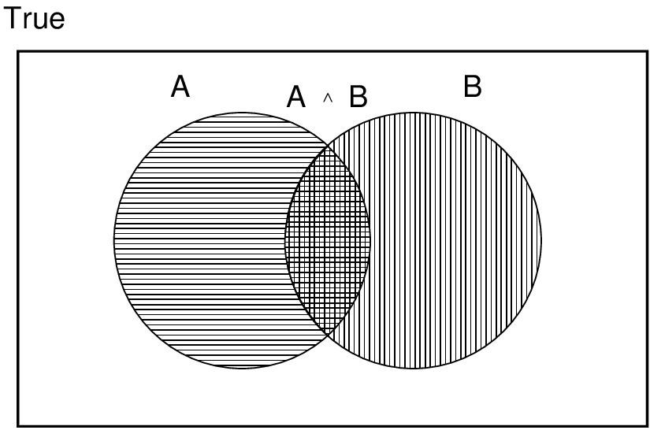

# Chapter 14 Probabilistic Reasoning over time

<!-- tabs:start -->

#### **Tiếng Việt**
<div class="pdf-container">
  <iframe src="TaiLieu/ebooks_Chapters_Vi3/Chapter_14_Probabilistic%20Reasoning%20over%20time/chapter_14_vi.html" width="100%" height="100%"></iframe>
</div>

#### **Tiếng Anh**
<div class="pdf-container">
  <iframe src="TaiLieu/ebooks_Chapters/Chapter_14_Probabilistic%20Reasoning%20over%20time.pdf" width="100%" height="100%"></iframe>
</div>

#### **Slide**

\usepackage{aima-slides}
\usepackage[utf8]{inputenc}
\usepackage[T5]{fontenc}
\usepackage{lmodern}

# Độ bất định (Uncertainty)

## Chương 14

---
## Nội dung

- Default (Uncertainty)

- Xác thực (Xác suất)

- Cú pháp (Cú pháp)

- Ngữ nghĩa (Ngữ nghĩa)

- Các quy tắc suy diễn

---
## Bất định độ 

Cho hành động $A_t$ = trái đi sân bay trước $t$ phút chuyến bay cửa cánh

Liệu $A_t$ có giúp tôi đến đúng giờ không?

Các vấn đề:
  
1) khả năng khảo sát một phần (đường dẫn trạng thái, kế hoạch của tài liệu khác, v.v.)
  
2) cảm biến nhiễu (Báo cáo giao thông thông tin KCBS)
  
3) sự không chắc chắn trong hoạt động kết quả (xịt lốp xe, v.v.)
  
4) sự phức tạp của việc mô hình hóa và giao thông dự kiến

Do đó, một cách tiếp theo logic thuần túy có thể

\phantom{or }1) có nguy cơ sai thật sự: "$A_{25}$ sẽ giúp tôi đến đó đúng giờ"

hoặc 2) dẫn đến các kết luận quá yếu để quyết định:
    
"$A_{25}$ sẽ giúp tôi đến đúng thời điểm nếu không có tai nạn trên cầu
    
và trời không mưa và xe của tôi vẫn còn nguyên v.v. và v.v."

(Có thể nói $A_{1440}$ sẽ giúp tôi đến đúng giờ một cách hợp lý

Nhưng tôi sẽ phải ở lại qua đêm tại sân bay $\ldots$)

---
##  Bất chấp mức độ xử lý phương pháp 

Logic <u>default (Default)</u> hoặc <u>phi đơn điệu (nonmonotonic)</u>:
  
  Giả sử lịch sử của tôi không bị xịt trước
  
  Giả sử $A_{25}$ có tác dụng trừ khi được củng cố bởi bằng chứng 

Vấn đề: Những giả định nào hợp lý? Làm cách nào để xử lý tính nhất quán?

<u> Quy tắc với hệ số fudge (Yếu tố fudge)</u>:
  
$A_{25} \mapsto_{0.3}$ đến đó đúng giờ
  
$Sprinkler \mapsto_{0.99} WetGrass$
  
$WetGrass \mapsto_{0.7} Rain$

Vấn đề: Các mạch rối với sự kết hợp, ví dụ, $Sprinkler$ gây ra $Rain$??

<u>Xác suất (Xác suất)</u>
  
  Dựa trên các bằng chứng có sẵn,
    
    $A_{25}$ sẽ giúp tôi đến đúng thời điểm với xác thực 0.04

Lý thuyết cờ bạc của Mahaviracarya (thế kỷ 9), Cardamo (1565)

(Logic <u>mờ (Fuzzy)</u> xử lý *độ chính xác (mức độ chân lý)* CHỨ KHÔNG PHẢI bất định độ, ví dụ:
  
  $WetGrass$ true ở mức 0,2)

---
## Xác suất (Xác suất)

Các xác nhận hiệu suất ảnh hưởng của 
   *summ Tắt*
  <u> lười biếng (lười biếng)</u>: thất bại trong việc liệt kê các trường hợp ngoại lệ, các điều kiện phụ, v.v.
  
  <u> thiếu hiểu biết (thiếu hiểu biết)</u>: thiếu các sự kiện liên quan, các điều kiện ban đầu, v.v.

Xác thực <u>chủ quan (Subjective)</u> hoặc <u>Bayesian</u>:

Xác thực liên hệ các mệnh đề với trạng thái tri thức của chính một người
    
ví dụ, $P(A_{25} | \mbox{không có tai nạn nào được báo cáo}) = 0.06$

This <u>không</u> phải là các xác nhận về thế giới

Xác minh các mệnh đề thay đổi khi có bằng chứng mới:
    
ví dụ, $P(A_{25} | \mbox{không có tai nạn nào được báo cáo},\ \mbox{5 a.m.}) = 0.15$

(Logic kéo trạng thái tự động $KB \models 
  pha$, chứ không phải sự thật.)

---
## Không quyết định trong điều kiện bất định 

Giả sử tôi tin vào điều sau đây:
\begin{eqnarray*}
P(A_{25}\mbox{ giúp tôi đến đó đúng giờ} | \ldots) &=& 0.04 

P(A_{90}\mbox{ giúp tôi đến đó đúng giờ} | \ldots) &=& 0.70 

P(A_{120}\mbox{ giúp tôi đến đó đúng giờ} | \ldots) &=& 0.95 

P(A_{1440}\mbox{ giúp tôi đến đó đúng giờ} | \ldots) &=& 0.9999 
\end{eqnarray*}
Chọn hành động nào?

Phụ thuộc vào <u> sự ưu tiên (preferences)</u> của tôi đối với việc lỡ chuyến bay so với ẩm thực sân bay, v.v.

<u>Lý thuyết hữu ích (Lý thuyết hữu ích)</u> được sử dụng để biểu diễn và suy diễn các bậc ưu tiên

<u>Lý thuyết quyết định (Lý thuyết quyết định)</u> = lý thuyết hữu ích + lý thuyết xác thực

---
##  Các vật phẩm đầu tiên của màn trình diễn

Với bất kỳ mệnh đề $A$, $B$ nào

1. $0 \leq P(A) \leq 1$

2. $P(True) = 1$ và $P(False) = 0$

3. $P(A \lor B) = P(A) + P(B) - P(A\land B)$

,45\textwidth


de Finetti (1931): một tác tử đặt theo phạm vi xác thực
những vấn đề đầu tiên này có thể bị buộc phải đặt số tiền bị mất bất kể kết quả như thế nào.

---
## Cú pháp (Cú pháp)

Tương tự logic mệnh đề: các thế giới có thể được định nghĩa bằng cách phân bổ công việc
giá trị cho các <u> ngẫu nhiên (biến ngẫu nhiên) </u>.

Các biến ngẫu nhiên <u>mệnh đề</u> hoặc <u>Boolean</u>
  
  ví dụ: $Cavity$ (tôi có răng sâu không?)

Bao gồm các biểu thức logic mệnh đề
  
  ví dụ: $\lnot Burglary \lor Earthquake$

Biến ngẫu nhiên <u>nhiều giá trị (Đa giá trị)</u>
  
  ví dụ: $Weather$ is one in $\<sunny,rain,cloudy,snow\>$

Các giá trị phải đầy đủ (đầy đủ) và loại trừ lẫn nhau (loại trừ lẫn nhau)

Mệnh đề được xây dựng bằng cách gán một giá trị:
  
ví dụ: $Weather \eq sunny$; hoặc $Cavity \eq true$ choose clear

---
## Cú pháp (tiếp theo)

Xác thực <u>tiên nghiệm (Prior)</u> hoặc <u>không điều kiện (vô điều kiện)</u> của các mệnh đề
  
  ví dụ: $P(Cavity) = 0.1$ và $P(Weather \eq sunny) = 0.72$

tương ứng với niềm tin trước khi có bất kỳ bằng chứng nào (mới)

<u>Phân phối xác suất (Phân phối xác suất)</u> đưa ra các giá trị cho tất cả các quyền được phân bổ có thể có:
  
  $P(Weather) = \<0.72,0.1,0.08,0.1\>$ (<u>đã chuẩn hóa (chuẩn hóa)</u>,nghĩa là tổng bằng 1)

<u>Phân phối đồng thời (Phân phối xác suất chung)</u> đối với một tập các biến 

các giá trị được phép phân bổ có thể dành cho tất cả các biến
  
  $P(Weather,Cavity)$ = một ma trận giá trị $4 \times 2$:

\[\begin{array}{l|cccc}
\hfil Weather \eq & sunny & rain & cloudy & snow 

\hline
Cavity \eq true & & & & 

Cavity \eq false & & & &
\end{array}\]

<u>Cú pháp (tiếp theo)</u>

Xác thực <u>có điều kiện (Có điều kiện)</u> hoặc <u>hậu nghiệm (sau)</u>
  
  ví dụ: $P(Cavity | Toothache) = 0.8$
  
  nghĩa là, <u>\u{biết rằng $Toothache$ là tất cả những gì tôi biết</u>}

Ký hiệu cho phân phối có điều kiện:
  
  $P(Weather | Earthquake)$ = vector 2 element của vector 4 element

Nếu chúng ta biết nhiều hơn, ví dụ: $Cavity$ cũng được cho trước, thì chúng ta có
  
  $P(Cavity | Toothache,Cavity) = 1$

Lưu ý: niềm tin ít cụ thể hơn *vẫn có giá trị* sau khi có thêm bằng chứng
mới đến, nhưng cũng không phải lúc nào *hữu ích*

Bằng chứng mới có thể không liên quan, cho phép đơn giản hóa, ví dụ:
  
$P(Cavity | Toothache,49ersWin) = P(Cavity | Toothache) = 0.8$

Loại suy diễn này được phê duyệt bởi miền kiến thức là rất quan trọng

---
## Xác suất có điều kiện

Định nghĩa xác thực có điều kiện:
\[
  P(A|B) = \frac{P(A\land B)}{P(B)} \mbox{ nếu } P(B) \neq 0
\]
<u>Quy tắc nhân (Quy tắc sản phẩm)</u> đưa ra một công thức thay thế:
  
  $P(A\land B) = P(A|B)P(B) = P(B|A)P(A)$

Một phiên bản ứng dụng tổng hợp cho toàn bộ phân phối, ví dụ:
  
  $P(Weather,Cavity) = P(Weather|Cavity) P(Cavity)$

(Xem như một tập hợp $4\times 2$ các phương pháp, *không* phải nhân ma trận.)

<u>Quy tắc chuỗi (Quy tắc chuỗi)</u> được suy ra bằng cách áp dụng liên tiếp quy tắc nhân:
  
$P(X_1,\ldots,X_n) = P(X_1,\ldots,X_{n-1})\ 
                        P(X_n | X_1,\ldots,X_{n-1})$
    
                    = $P(X_1,\ldots,X_{n-2})\ 
                        P(X_{n-1} | X_1,\ldots,X_{n-2})\ 
                        P(X_n | X_1,\ldots,X_{n-1})$
    
                  = $\ldots$
    
                  = $\myprod_{i\eq 1}^n P(X_i | X_1,\ldots,X_{i-1})$

---
## Quy tắc Bayes (Quy tắc Bayes)

Quy tắc nhân $P(A\land B) = P(A|B)P(B) = P(B|A)P(A)$
\[
{}\implies \mbox{<u>Quy tắc Bayes </u>}  P(A|B) = \frac{P(B|A)P(A)}{P(B)}
\]
Tại sao điều này lại hữu ích???

Để đánh giá giá xác thực <u>chẩn đoán (chẩn đoán)</u> từ xác thực <u>nhân quả (nhân quả)</u>:
\[
  P(Nguy\hat{e}n\ nh\hat{a}n|K\hat{e}t\ qu\mbox{\`{a}}) = \frac{P(K\hat{e}t\ qu\mbox{\`{a}}|Nguy\hat{e}n\ nh\hat{a}n)P(Nguy\hat{e}n\ nh\hat{a}n)}{P(K\hat{e}t\ qu\mbox{\`{a}})}
\]
Ví dụ, gọi $M$ là viêm loét não, $S$ là cứng cổ:
\[
  P(M|S) = \frac{P(S|M)P(M)}{P(S)} = \frac{0.8 \times 0.0001}{0.1} = 0.0008
\]
Lưu ý:Đặc hậu của bệnh viêm khớp chưa còn rất nhỏ!

---
## Chuẩn hóa (Chuẩn hóa)

Giả sử chúng tôi muốn tính toán hậu quả trên $A$

khi biết $B\eq b$, và giả sử $A$ có thể có các giá trị $a_1 \ldots a_m$

Chúng ta có thể áp dụng quy tắc Bayes cho mỗi giá trị của $A$:
  
  $P(A\eq a_1|B\eq b) = P(B\eq b|A\eq a_1)P(A\eq a_1)/P(B\eq b)$
  
  $\ldots$
  
  $P(A\eq a_m|B\eq b) = P(B\eq b|A\eq a_m)P(A\eq a_m)/P(B\eq b)$

Cộng các giá trị này lại và lưu ý rằng $\mysum_i P(A\eq a_i|B\eq b) = 1$:
\[1/P(B\eq b)  = 1/\mysum_i P(B\eq b|A\eq a_i)P(A\eq a_i)\]
Đây là <u>hệ số chuẩn hóa (hệ số chuẩn hóa)</u>, hằng số theo $i$, được ký hiệu là $
  pha$:
\[
  P(A|B\eq b) = 
  pha P(B\eq b | A)P(A)
\]
Thông thường một phân phối chưa chuẩn hóa, sau đó chuẩn hóa ở cuối
  
  ví dụ: giả sử $P(B\eq b | A)P(A) = \<0.4,0.2,0.2\>$
    
    thì $P(A|B\eq b) = 
  pha \<0.4,0.2,0.2\> 
                        = \frac{\<0.4,0.2,0.2\>}{0.4+0.2+0.2} 
                        = \<0.5,0.25,0.25\>$

---
## Điều kiện hóa (Điều hòa)

Giới thiệu một plugin điều kiện biến thể:
\[
  P(X|Y) = \mysum_z P(X|Y,Z\eq z) P(Z\eq z|Y)
\]
Giác: normal dễ dàng hơn để đánh giá từng trường hợp cụ thể trực quan, ví dụ:

$P(RunOver|Cross)$
  
  = $P(RunOver|Cross,Light\eq green)P(Light\eq green|Cross)$
  
  + $P(RunOver|Cross,Light\eq yellow)P(Light\eq yellow|Cross)$
  
  + $P(RunOver|Cross,Light\eq red)P(Light\eq red|Cross)$

Khi $Y$ vắng mặt, chúng ta có <u> tổng lấy ra (tổng hợp)</u> hoặc <u>lấy biên (marginalization)</u>:
\[
  P(X) = \mysum_z P(X|Z\eq z) P(Z\eq z) = \mysum_z P(X,Z\eq z)
\]
Nói chung, với một phân phối trên một biến, thì
phân phối trên bất kỳ tập tin nào (được gọi là phân phối <u>biên (marginal)</u> vì
lý do lịch sử) có thể được tính toán bằng cách tính tổng các biến khác.

---
## Phân phối đồng thời đầy đủ (Bản phân phối đầy đủ chung)

Một <u>mô tả hoàn thành màn hình xác thực</u>xác định mọi mục nhập trong phân phối
đồng thời cho tất cả các biến $\mbf{X} = X_1,\ldots,X_n$

Nghĩa là, một màn trình diễn cho mỗi thế giới có thể có $X_1\eq x_1,\ldots,X_n\eq x_n$

(So sánh với đầy đủ các lý thuyết trong logic.)

Ví dụ: giả sử $Toothache$ và $Cavity$ là các biến ngẫu nhiên:
\[\begin{array}{l|cc}
 & Toothache\eq true & Toothache\eq false 

\hline
Cavity \eq true  & 0.04 & 0.06 

Cavity \eq false & 0.01 & 0.89
\end{array}\]
Các thế giới có thể được phân loại trừ khi lẫn lộn nhau $\implies$ $P(w_1 \land w_2) = 0$

Các thế giới có thể đủ $\implies$ $w_1 \lor \cdots \lor w_n$ là $True$
    
làm điều đó $\mysum_i P(w_i) = 1$

---
## Phân phối đầy đủ (tiếp theo)

1) Đối với bất kỳ mệnh đề $\phi$ nào được định nghĩa trên các biến ngẫu nhiên
    
   $\phi(w_i)$ là đúng hoặc sai

2) $\phi$ tương đương với việc tuyển dụng $w_i$ khi $\phi(w_i)$ đúng

Làm điều đó $P(\phi) = \mysum_{\{w_i:\ \phi(w_i)\}} P(w_i)$

Nghĩa là, xác thực không điều kiện của bất kỳ mệnh đề nào đều có thể tính được
as a sum of the entry from the full distribution

Xác định điều kiện có thể được tính toán theo một tỷ lệ tương tự:
\[
  P(\phi|\xi) = \frac{P(\phi\land \xi)}{P(\xi)}
\]
Ví dụ: 
\[
  P(Cavity |Toothache) 
   = \frac{P(Cavity \land Toothache)}{P(Toothache)}
   = \frac{0.04}{0.04+0.01} = 0.8
\]

---
## Suy diễn từ các phân phối đồng thời

Thông thường, chúng tôi quan tâm đến 
  
  phân phối hậu kỳ của <u>các truy vấn biến (biến truy vấn)</u> $\mbf{Y}$
  
  cho trước các công cụ giá trị có thể $\mbf{e}$ đối với <u>các biến bằng chứng (biến bằng chứng)</u> $\mbf{E}$

Gọi <u>các biến ẩn (biến ẩn)</u> là $\mbf{H} = \mbf{X} - \mbf{Y} - \mbf{E}$

Khi được phép tính tổng các mục nhập được yêu cầu sẽ được thực hiện bằng cách lấy tổng
ẩn các biến:
\[
P(\mbf{Y}|\mbf{E}\eq \mbf{e}) = 
  pha P(\mbf{Y},\mbf{E}\eq \mbf{e})
= 
  pha \mysum_{\smbf{h}} P(\mbf{Y},\mbf{E}\eq \mbf{e},\mbf{H}\eq \mbf{h})
\]
Tổng số hạng được phép là các mục nhập đồng thời vì $\mbf{Y}$, $\mbf{E}$ và $\mbf{H}$ cùng nhau loại bỏ các biến ngẫu nhiên

Các vấn đề rõ ràng:
  
1) Độ phức tạp thời gian trong trường hợp xấu nhất là $O(d^n)$ trong đó $d$ là số ngôi (arity) lớn nhất
  
2) Độ phức tạp không gian $O(d^n)$ để lưu trữ phân phối đồng thời
  
3) Làm cách nào để tìm các số cho mục $O(d^n)$???

\usepackage{fleqn}
\usepackage{epsf}
\usepackage{aima2e-slides}

# Bayesian networks

## Chapter 14.1--3

---
## Phác thảo

- Cú pháp

- Ngữ nghĩa

- Phân phối được tham số hóa

---
## Mạng Bayesian

Một ký hiệu đồ họa đơn giản cho các xác nhận độc lập có điều kiện

và do đó cho đặc điểm kỹ thuật nhỏ gọn của phân phối chung đầy đủ

Cú pháp:
  
  một tập hợp các nút, mỗi nút một biến
  
  một đồ thị có hướng, không theo chu kỳ (liên kết \mat{$\approx$} "ảnh hưởng trực tiếp")
  
  phân phối có điều kiện cho mỗi nút dựa trên cha mẹ của nó:
    
    \mat{$P(X_i|\Parents(X_i))$}

Trong trường hợp đơn giản nhất, phân phối có điều kiện được biểu thị dưới dạng 

một \defn{bảng xác suất có điều kiện} (CPT) đưa ra 

phân phối trên \mat{$X_i$} cho mỗi kết hợp giá trị gốc

---
## Ví dụ

Cấu trúc liên kết của mạng mã hóa các xác nhận độc lập có điều kiện:

,5\textwidth


\mat{$Weather$} độc lập với các biến khác

\mat{$Toothache$} và \mat{$Catch$} độc lập có điều kiện với \mat{$Cavity$}

---
## Ví dụ

Tôi đang ở nơi làm việc, người hàng xóm John gọi điện báo rằng chuông báo thức của tôi đang đổ chuông, nhưng
hàng xóm Mary không gọi. Đôi khi nó được đặt ra bởi trẻ vị thành niên
động đất. Có trộm à?

Biến: \mat{$Burglar$}, \mat{$Earthquake$}, \mat{$Alarm$}, \mat{$JohnCalls$}, \mat{$MaryCalls$}

Cấu trúc liên kết mạng phản ánh kiến thức "nhân quả":
  
 -- Một tên trộm có thể tắt báo động
  
 -- Một trận động đất có thể tắt báo động
  
 -- Báo thức có thể khiến Mary gọi 
  
 -- Chuông báo thức có thể khiến John phải gọi

---
## Ví dụ tiếp theo.

,95\textwidth


---
## Độ nhỏ gọn

CPT cho Boolean \mat{$X_i$} với \mat{$k$} cha mẹ Boolean có\hspace*{1.75in}in\raisebox{-1.5in[0pt][0pt]{

\mat{$2^k$} hàng cho sự kết hợp của các giá trị gốc

Mỗi hàng yêu cầu một số \mat{$p$} cho \mat{$X_i\eq true$}

(số của \mat{$X_i\eq false$} chỉ là \mat{$1-p$})

Nếu mỗi biến có không quá \mat{$k$} cha mẹ, 

mạng hoàn chỉnh yêu cầu số \mat{$O(n\cdot 2^k)$}

Tức là, tăng tuyến tính với \mat{$n$}, so với  \mat{$O(2^n)$} để phân phối chung đầy đủ

Đối với mạng trộm, số \mat{$1 + 1 + 4 + 2 + 2 \eq 10$} (so với  \mat{$2^5-1 = 31$})

---
## Ngữ nghĩa toàn cầu

Ngữ nghĩa \defn{Global} xác định phân phối chung đầy đủ\hspace*{1.2in}in\raisebox{-1.5in[0pt][0pt]{

là sản phẩm của phân phối có điều kiện cục bộ:
\mat{\[
  P(x_1,\ldots,x_n) = \myprod_{i\eq 1}^n P(x_i|\parents(X_i))
\]}
ví dụ: \mat{$P(j\land m\land a\land \lnot b \land \lnot e)$}
\mat{\[
  =
\]}

---
## Ngữ nghĩa toàn cầu

Ngữ nghĩa "Toàn cầu" xác định phân phối chung đầy đủ\hspace*{1.2in}in\raisebox{-1.5in[0pt][0pt]{

là sản phẩm của phân phối có điều kiện cục bộ:
\mat{\[
  P(x_1,\ldots,x_n) = \myprod_{i\eq 1}^n P(x_i|\parents(X_i))
\]}
ví dụ: \mat{$P(j\land m\land a\land \lnot b \land \lnot e)$} 
\mat{\begin{eqnarray*}
  &=& P(j|a) P(m|a) P(a|\lnot b, \lnot e) P(\lnot b) P(\lnot e)

  &=& 0.9\stimes 0.7\stimes 0.001\stimes 0.999 \stimes 0.998

  &\approx& 0.00063
\end{eqnarray*}}

---
## Ngữ nghĩa cục bộ

Ngữ nghĩa \defn{Local}: mỗi nút độc lập có điều kiện

của những người không phải là hậu duệ của nó được trao cho cha mẹ của nó

,55\textwidth


Định lý: \mat{Local semantics} \mat{$\lequiv$} \mat{global semantics}

---
## Chăn Markov

Mỗi nút độc lập có điều kiện với tất cả các nút khác dựa trên 
 của nó
\defn{Chăn Markov}: cha mẹ + con cái + cha mẹ con cái

,5\textwidth


---
## Xây dựng mạng Bayesian

Cần một phương pháp sao cho một loạt các xác nhận có thể kiểm tra cục bộ của 

tính độc lập có điều kiện đảm bảo ngữ nghĩa toàn cầu cần thiết

1. Chọn thứ tự các biến \mat{$X_1,\ldots,X_n$}

2. Với \mat{$i$} = 1 đến \mat{$n$}
  
  thêm \mat{$X_i$} vào mạng 
  
  chọn cha mẹ từ \mat{$X_1,\ldots,X_{i-1}$} sao cho 
    
    \mat{$ P(X_i|\Parents(X_i)) = P(X_i|X_1,\, \ldots,\, X_{i-1}) $}

Sự lựa chọn này của cha mẹ đảm bảo ngữ nghĩa toàn cầu:
\mat{\begin{eqnarray*}
P(X_1,\ldots,X_n) &=& \myprod_{i\eq 1}^n P(X_i | X_1,\, \ldots,\, X_{i-1})
 &nbsp;&nbsp; \bbox{(chain rule)}

    &=& \myprod_{i\eq 1}^n P(X_i|\Parents(X_i))
 &nbsp;&nbsp; \bbox{(by construction)}
\end{eqnarray*}}

---
## Ví dụ

Giả sử chúng ta chọn thứ tự \mat{$M$}, \mat{$J$}, \mat{$A$}, \mat{$B$}, \mat{$E$}

,5\textwidth


\mat{$P(J|M) = P(J)$}?

---
## Ví dụ

\ptext{Giả sử chúng ta chọn thứ tự \mat{$M$}, \mat{$J$}, \mat{$A$}, \mat{$B$}, \mat{$E$}}

,5\textwidth


\ptext{\mat{$P(J|M) = P(J)$}? &nbsp;&nbsp;  Không

\mat{$P(A|J,M) = P(A|J)$}? \mat{$P(A|J,M) = P(A)$}?

---
## Ví dụ

\ptext{Giả sử chúng ta chọn thứ tự \mat{$M$}, \mat{$J$}, \mat{$A$}, \mat{$B$}, \mat{$E$}}

,5\textwidth


\ptext{\mat{$P(J|M) = P(J)$}? &nbsp;&nbsp;  Không

\ptext{\mat{$P(A|J,M) = P(A|J)$}? \mat{$P(A|J,M) = P(A)$}? &nbsp;&nbsp;  Không

\mat{$P(B|A,J,M) = P(B|A)$}?

\mat{$P(B|A,J,M) = P(B)$}?

---
## Ví dụ

\ptext{Giả sử chúng ta chọn thứ tự \mat{$M$}, \mat{$J$}, \mat{$A$}, \mat{$B$}, \mat{$E$}}

,5\textwidth


\ptext{\mat{$P(J|M) = P(J)$}? &nbsp;&nbsp;  Không

\ptext{\mat{$P(A|J,M) = P(A|J)$}? \mat{$P(A|J,M) = P(A)$}? &nbsp;&nbsp;  Không

\ptext{\mat{$P(B|A,J,M) = P(B|A)$}? &nbsp;&nbsp;  Có

\ptext{\mat{$P(B|A,J,M) = P(B)$}? &nbsp;&nbsp;  Không

\mat{$P(E|B,A,J,M) = P(E|A)$}?

\mat{$P(E|B,A,J,M) = P(E|A,B)$}?

---
## Ví dụ

\ptext{Giả sử chúng ta chọn thứ tự \mat{$M$}, \mat{$J$}, \mat{$A$}, \mat{$B$}, \mat{$E$}}

,5\textwidth


\ptext{\mat{$P(J|M) = P(J)$}? &nbsp;&nbsp;  Không

\ptext{\mat{$P(A|J,M) = P(A|J)$}? \mat{$P(A|J,M) = P(A)$}? &nbsp;&nbsp;  Không

\ptext{\mat{$P(B|A,J,M) = P(B|A)$}? &nbsp;&nbsp;  Có

\ptext{\mat{$P(B|A,J,M) = P(B)$}? &nbsp;&nbsp;  Không

\ptext{\mat{$P(E|B,A,J,M) = P(E|A)$}? &nbsp;&nbsp;  Không

\ptext{\mat{$P(E|B,A,J,M) = P(E|A,B)$}? &nbsp;&nbsp;  Có

---
## Ví dụ tiếp theo.

,5\textwidth


Quyết định tính độc lập có điều kiện là khó theo hướng phi nhân quả

(Các mô hình nhân quả và sự độc lập có điều kiện dường như đã được lập trình sẵn cho con người!)

Đánh giá xác suất có điều kiện là khó theo hướng phi nhân quả

Mạng kém gọn hơn: cần có số \mat{$1 + 2 + 4 + 2 + 4 \eq 13$}

---
## Ví dụ: Chẩn đoán ô tô

Bằng chứng ban đầu: xe không nổ máy

Các biến có thể kiểm tra (màu xanh lá cây), các biến " bị hỏng, vì vậy hãy sửa nó " (màu cam) 

Biến ẩn (màu xám) đảm bảo cấu trúc thưa thớt, giảm tham số


---
## Ví dụ: Bảo hiểm ô tô


---
## Phân phối có điều kiện nhỏ gọn

CPT tăng theo cấp số nhân với số lượng cha mẹ

CPT trở nên vô hạn với cha hoặc con có giá trị liên tục

Giải pháp: Phân phối \defn{canonical} được xác định nhỏ gọn

Các nút \defn{Xác định} là trường hợp đơn giản nhất:
  
   \mat{$X = f(Parents(X))$} cho một số chức năng \mat{$f$}

Ví dụ: hàm Boolean
  
  \mat{$NorthAmerican \lequiv Canadian \lor US \lor Mexican$}

Ví dụ: mối quan hệ số giữa các biến liên tục
\mat{\[
  \frac{\partial Level}{\partial t} = \mbox{ inflow + precipitation 
                                            - outflow - evaporation}
\]}

---
## Phân phối có điều kiện thu gọn tiếp.

\defn{Noisy-OR} mô hình phân phối có nhiều nguyên nhân không tương tác
  
  1) Cha mẹ \mat{$U_1\ldots U_k$} bao gồm tất cả các nguyên nhân (có thể thêm \defn{nút rò rỉ})
  
  2) Xác suất hư hỏng độc lập \mat{$q_i$} cho riêng từng nguyên nhân 
    
    \mat{${} \implies 
     P(X|U_1\ldots U_j,\lnot U_{j+1}\ldots \lnot U_k)
     = 1 - \myprod_{i\eq 1}^j q_i$}

| &nbsp; | &nbsp; | &nbsp; | &nbsp; | &nbsp; |
|---|---|---|---|---|
| \makebox[72pt]{\mat{$Cold$}} | \makebox[72pt]{\mat{$Flu$}} | \makebox[72pt]{\mat{$Malaria$}} | \mat{$P(Fever)$} | \mat{$P(\lnot Fever)$} |
| F | F | F | \mat{$\mbf{0.0}$} | \mat{$1.0$} |
| F | F | T | \mat{$0.9$} | \mat{$\mbf{0.1}$} |
| F | T | F | \mat{$0.8$} | \mat{$\mbf{0.2}$} |
| F | T | T | \mat{$0.98$} | \mat{$0.02 = 0.2 \times 0.1$} |
| T | F | F | \mat{$0.4$} | \mat{$\mbf{0.6}$} |
| T | F | T | \mat{$0.94$} | \mat{$0.06 = 0.6 \times 0.1$} |
| T | T | F | \mat{$0.88$} | \mat{$0.12 = 0.6 \times 0.2$} |
| T | T | T | \mat{$0.988$} | \mat{$0.012 = 0.6 \times 0.2 \times 0.1$} |

Số tham số *tuyến tính* trong số cha mẹ

---
## Mạng lai (rời rạc+liên tục)

Rời rạc (\mat{$Subsidy?$} và \mat{$Buys?$});  liên tục (\mat{$Harvest$} và \mat{$Cost$})

,42\textwidth


Tùy chọn 1: rời rạc---có thể có lỗi lớn, CPT lớn

Tùy chọn 2: họ chính tắc được tham số hóa hữu hạn

1) Biến liên tục, cha mẹ rời rạc+liên tục (ví dụ: \mat{$Cost$})

2) Biến rời rạc, cha mẹ liên tục (ví dụ: \mat{$Buys?$})

---
## Biến con liên tục

Cần một hàm mật độ điều kiện \defn{} cho biến con đã cho
cha mẹ liên tục, cho mỗi nhiệm vụ có thể có cho cha mẹ riêng biệt

Phổ biến nhất là mô hình Gaussian tuyến tính \defn{}, ví dụ:
\begin{eqnarray*}
\lefteqn{P(Cost\eq c|Harvest\eq h,Subsidy?\eq true)}

 & = & N(a_t h + b_t, \sigma_t)(c)

 &=& \frac{1}{\sigma_t \sqrt{2\pi}}
 exp\left(-\frac{1}{2} 
          \left(\frac{c-(a_t h + b_t)}{\sigma_t}\right)^2
    \right)
\end{eqnarray*}

Giá trị trung bình \mat{$Cost$} thay đổi tuyến tính với \mat{$Harvest$}, phương sai được cố định

Sự thay đổi tuyến tính là không hợp lý trên toàn bộ phạm vi 
  
  nhưng hoạt động tốt nếu phạm vi *có khả năng* của \mat{$Harvest$} hẹp

---
## Biến con liên tục

,5\textwidth


Mạng liên tục với các bản phân phối của LG
  
  \mat{$\implies$} phân phối chung đầy đủ là Gaussian đa biến 
  

Mạng LG rời rạc+liên tục là mạng Gaussian có điều kiện \defn{}
tức là, một Gaussian đa biến trên tất cả các biến liên tục
cho mỗi sự kết hợp của các giá trị biến rời rạc

---
## Biến rời rạc với cha mẹ liên tục

Xác suất của \mat{$Buys?$} cho trước \mat{$Cost$} phải là ngưỡng "mềm":

,6\textwidth


Phân phối \defn{Probit} sử dụng tích phân của Gaussian:
  
  \mat{$\Phi(x) = \int_{-\infty}^{x} N(0,1)(x) dx$}
  
  \mat{$P(Buys?\eq true \given Cost \eq c) = \Phi((-c + \mu)/\sigma)$}

---
## Tại sao lại là probit?

1. Nó có hình dạng phù hợp

2. Có thể xem là ngưỡng cứng có vị trí bị nhiễu

,6\textwidth


---
## Biến rời rạc tiếp theo.

Phân phối \defn{Sigmoid} (hoặc \defn{logit}) cũng được sử dụng trong mạng thần kinh:
\mat{\[
P(Buys?\eq true \given Cost \eq c) = \frac{1}{1+exp(-2\frac{-c+\mu}{\sigma})}
\]}
Sigmoid có hình dạng tương tự probit nhưng đuôi dài hơn nhiều:

,6\textwidth


---
## Tóm tắt

Lưới Bayes cung cấp một biểu diễn tự nhiên cho (do nguyên nhân gây ra)

độc lập có điều kiện

Cấu trúc liên kết + CPT = biểu diễn nhỏ gọn của phân phối chung

Nói chung là dễ dàng đối với các chuyên gia (không phải) chuyên gia để xây dựng

Phân phối chuẩn (ví dụ: noise-OR) = biểu diễn nhỏ gọn của CPT

Các biến liên tục $\implies$ phân phối được tham số hóa (ví dụ: tuyến tính
Gaussian)

\usepackage{fleqn}
\usepackage{epsf}
\usepackage{aima2e-slides}

# Inference in Bayesian networks

## Chapter 14.4--5

---
## Phác thảo

- Suy luận chính xác bằng cách liệt kê

- Suy luận chính xác bằng cách loại bỏ biến

- Suy luận gần đúng bằng mô phỏng ngẫu nhiên

- Suy luận gần đúng của chuỗi Markov Monte Carlo

---
## Nhiệm vụ suy luận

\defn{Truy vấn đơn giản}: tính biên sau \mat{$P(X_i|\mbf{E}\eq \e)$}
  
  ví dụ: \mat{$P(NoGas|Gauge\eq empty,Lights\eq on,Starts\eq false)$}

\defn{Truy vấn liên kết}: \mat{$P(X_i,X_j|\mbf{E}\eq \e) = 
    P(X_i|\mbf{E}\eq \e)  P(X_j|X_i,\mbf{E}\eq \e) $}

\defn{Quyết định tối ưu}: mạng quyết định bao gồm thông tin tiện ích;
    
    suy luận xác suất cần thiết cho \mat{$P(outcome|action,evidence)$}

\defn{Giá trị của thông tin}: cần tìm kiếm bằng chứng nào tiếp theo?

\defn{Phân tích độ nhạy}: giá trị xác suất nào là quan trọng nhất?

\defn{Giải thích}: tại sao tôi cần động cơ khởi động mới?

---
## Suy luận bằng phép liệt kê

Cách hơi thông minh để tính tổng các biến từ khớp
mà không thực sự xây dựng sự biểu diễn rõ ràng của nó

Truy vấn đơn giản trên mạng trộm:\hspace*{2.5in}in\raisebox{-1.5in[0pt][0pt]{

\mat{$P(B|j,m)$}

\mat{$= P(B,j,m)/P(j,m)$}

\mat{$= 
  pha P(B,j,m)$}

\mat{$= 
  pha \ \mysum_e \ \mysum_a \ P(B,e,a,j,m)$}

Viết lại toàn bộ các mục chung sử dụng tích của các mục CPT:

\mat{$P(B|j,m)$}

\mat{$= 
  pha \ \mysum_e \ \mysum_a \ P(B)P(e)P(a|B,e)P(j|a)P(m|a) $}

\mat{$= 
  pha P(B)\ \mysum_e\ P(e)\ \mysum_a\ P(a|B,e)P(j|a)P(m|a)$}
       
Đệ quy liệt kê theo chiều sâu đầu tiên: \mat{$O(n)$} không gian, \mat{$O(d^n)$} thời gian

---
## Thuật toán liệt kê

```text
function Enumeration-Ask(\v{X), $\e$, \v{bn}}{a distribution over \v{X}}
    \firstinputs{\v{X}} {the query variable}
    \inputs{\v{\e}}{observed values for variables $\E$}
    \inputs{\v{bn}}{a Bayesian network with variables $\{X\} \union \E \union \Y$}

    $Q(\v{X)$}{a distribution over \v{X}, initially empty}
    \k{for each} value \v{$x_i$} of \v{X} \k{do}
          extend \v{$\e$} with value \v{$x_i$} for \v{X}
          $Q(\v{x_i)$}{Enumerate-All(Vars[\v{bn}], \v{$\e$})}
    \k{return} Normalize($Q(\v{X})$)
\fnsep
function Enumerate-All(\v{vars), $\e$}{a real number}
    \k{if} Empty?(\v{vars}) \k{then return} 1.0
    \v{Y}{First(\v{vars})}
    \k{if} \v{Y} has value \v{y} in \v{$\e$}
          \k{then return} $P(\v{y} | Pa(\v{Y})) \times {}$Enumerate-All(Rest(\v{vars}), \v{$\e$})
          \k{else return} $\sum_{\v{y}} P(\v{y} | Pa(\v{Y})) \times {}$Enumerate-All(Rest(\v{vars}), $\v{\e}_{\v{y}}$)
                where $\v{\e}_{\v{y}}$ is $\v{\e}$ extended with $\v{Y}\eq \v{y}$
```

---
## Cây đánh giá


Việc liệt kê không hiệu quả: tính toán lặp đi lặp lại 
  
  ví dụ: tính \mat{$P(j|a)P(m|a)$} cho mỗi giá trị của \mat{$e$}

---
## Suy luận bằng cách loại bỏ biến

Loại bỏ biến: thực hiện tính tổng từ phải sang trái,

lưu trữ kết quả trung gian (\defn{factors}) để tránh tính toán lại

\mat{$P(B|j,m)$}
    
    \mat{$= 
  pha \underbrace{P(B)}_B 
             \mysum_e \underbrace{P(e)}_E
             \mysum_a \underbrace{P(a|B,e)}_A
             \underbrace{P(j|a)}_J
             \underbrace{P(m|a)}_M$}
    
    \mat{$= 
  pha P(B)\mysum_e P(e)\mysum_a P(a|B,e) P(j|a) f_M(a)$}
    
    \mat{$= 
  pha P(B)\mysum_e P(e)\mysum_a P(a|B,e) f_J(a) f_M(a)$}
    
    \mat{$= 
  pha P(B)\mysum_e P(e)\mysum_a f_A(a,b,e) f_J(a) f_M(a)$}
    
    \mat{$= 
  pha P(B)\mysum_e P(e)f_{\bar{A}JM}(b,e) $} (tổng \mat{$A$})
    
    \mat{$= 
  pha P(B)f_{\bar{E}\bar{A}JM}(b)$} (tổng \mat{$E$})
    
    \mat{$= 
  pha f_B(b)\stimes f_{\bar{E}\bar{A}JM}(b)$} 

---
## Loại bỏ biến: Các thao tác cơ bản

\defn{Tính tổng} một biến từ tích của các thừa số: 
  
  di chuyển bất kỳ yếu tố không đổi nào ra ngoài phép tính tổng 
  
  cộng các ma trận con theo tích từng điểm của các thừa số còn lại

\mat{$\mysum_x f_1 \stimes \cdots \stimes f_k =
f_1 \stimes \cdots \stimes f_i\  \mysum_x\; f_{i+1} \stimes \cdots \stimes
f_k = f_1 \stimes \cdots \stimes f_i \stimes f_{\bar{X}}$}

giả sử \mat{$f_1,\ldots,f_i$} không phụ thuộc vào \mat{$X$}

\defn{Tích điểm} của thừa số \mat{$f_1$} và \mat{$f_2$}:
  
  \mat{$f_1(x_1,\ldots,x_j,y_1,\ldots,y_k) \stimes
     f_2(y_1,\ldots,y_k,z_1,\ldots,z_l)$}
    
  = \mat{$f(x_1,\ldots,x_j,y_1,\ldots,y_k,z_1,\ldots,z_l)$}

Ví dụ: \mat{$f_1(a,b) \stimes f_2(b,c) = f(a,b,c)$}

---
## Thuật toán loại bỏ biến 

```text
function Elimination-Ask(\v{X), \e, \v{bn}}{a distribution over \v{X}}
      inputs: X, the query variable
      inputs: \e, evidence specified as an event
      inputs: bn, a belief network specifying joint distribution $P(X_1,\ldots,X_n)$

    \v{factors}{$\emptylist$}; \v{vars}{Reverse(Vars[\v{bn}])}
    \k{for each} \v{var} \k{in} \v{vars} \k{do}
          \v{factors}{$[Make-Factor(\v{var}, \v{\e})|\v{factors}]$}
          \k{if} \v{var} is a hidden variable \k{then} \v{factors}{Sum-Out(\v{var}, \v{factors})}
    \k{return} Normalize(Pointwise-Product(\v{factors}))
```

---
## Các biến không liên quan

Hãy xem xét truy vấn \mat{$P(JohnCalls|Burglary\eq true)$}\hspace*{1.0in}in\raisebox{-1.5in[0pt][0pt]{}
\mat{\[
  P(J|b) = 
  pha P(b) \sum_e P(e) \sum_a P(a|b,e) P(J|a) \sum_m P(m|a)
\]}
Tổng trên \mat{$m$} giống hệt 1; \mat{$M$} là *không liên quan* với truy vấn

Thm 1: \mat{$Y$} không liên quan trừ khi \mat{$Y\elt Ancestors(\{X\}\union \E)$}

Đây, \mat{$X\eq JohnCalls$}, \mat{$\E\eq\{Burglary\}$} và 

\mat{$Ancestors(\{X\}\union \E) = \{Alarm,Earthquake\}$}

vì vậy \mat{$MaryCalls$} không liên quan

(So sánh điều này với chuỗi ngược từ truy vấn trong KB mệnh đề Horn)

---
## Các biến không liên quan tiếp.

Defn: \underline{biểu đồ đạo đức} của Bayes net: kết hôn với tất cả cha mẹ và mũi tên thả

Định nghĩa: \mat{$\A$} được phân tách bằng \underline{m} khỏi \mat{$\B$} bởi \mat{$\C$} nếu được phân tách bằng \mat{$\C$} trong biểu đồ đạo đức

Thm 2: \mat{$Y$} không liên quan nếu m được phân tách khỏi \mat{$X$} bởi \mat{$\E$}\hspace*{1.0in}in\raisebox{-1.5in[0pt][0pt]{}

Đối với \mat{$P(JohnCalls|Alarm\eq true)$}, cả 

\mat{$Burglary$} và \mat{$Earthquake$} không liên quan

---
## Độ phức tạp của suy luận chính xác

\defn{Mạng được kết nối đơn} (hoặc \defn{polytrees}):
  
  -- bất kỳ hai nút nào cũng được kết nối bằng nhiều nhất một đường dẫn (vô hướng)
  
  -- chi phí về thời gian và không gian của việc loại bỏ biến đổi là \mat{$O(d^k n)$}

\defn{Các mạng được kết nối nhiều lần}:
  
  -- có thể giảm 3SAT để suy luận chính xác \mat{$\implies$} NP-hard
  
  -- tương đương với *đếm* kiểu 3SAT \mat{$\implies$} \#P-complete

,75\textwidth


---
## Suy luận bằng mô phỏng ngẫu nhiên

Ý tưởng cơ bản:
  
  1) Vẽ \mat{$N$} mẫu từ phân phối lấy mẫu \mat{$S$}\hspace*{1.5in}in\raisebox{-1.5in[0pt][0pt]{
  
  2) Tính xác suất hậu nghiệm gần đúng \mat{$\hat P$}
  
  3) Chứng tỏ điều này hội tụ về xác suất đúng \mat{$P$}

Tóm tắt:
  
  -- Lấy mẫu từ mạng trống
  
  -- Lấy mẫu từ chối: từ chối các mẫu không đồng ý với bằng chứng
  
  -- Trọng số khả năng: sử dụng bằng chứng để cân mẫu
  
  -- Chuỗi Markov Monte Carlo (MCMC): mẫu từ quá trình ngẫu nhiên
    
      có phân bố cố định là phần sau thực sự

---
## Lấy mẫu từ mạng trống

```text
function Prior-Sample(\v{bn)}{an event sampled from \v{bn}}
      inputs: bn, a belief network specifying joint distribution $P(X_1,\ldots,X_n)$

    \v{\x}{an event with $n$ elements}
    \k{for} $i = 1$ \k{to} $n$ \k{do}
          $\v{x_i$}{a random sample from $P(X_i | \parents(X_i))$}
               given the values of $\Parents(X_i)$ in \v{\x}
    \k{return} \v{\x}
```

---
## Ví dụ

,85\textwidth


---
## Ví dụ

,85\textwidth


---
## Ví dụ

,85\textwidth


---
## Ví dụ

,85\textwidth


---
## Ví dụ

,85\textwidth


---
## Ví dụ

,85\textwidth


---
## Ví dụ

,85\textwidth


---
## Lấy mẫu từ mạng trống tiếp theo.

Xác suất \prog{PriorSample} tạo ra một sự kiện cụ thể
  
  \mat{$S_{PS}(x_1\ldots x_n) = \myprod_{i\eq 1}^n P(x_i | \parents(X_i))
    = P(x_1\ldots x_n)$}

tức là xác suất trước thực sự

Ví dụ: \mat{$S_{PS}(t, f, t, t) = 0.5 \stimes 0.9 \stimes 0.8 \stimes 0.9 = 0.324 = P(t, f, t,t)$}

Gọi \mat{$N_{PS}(x_1\ldots x_n)$} là số lượng mẫu được tạo
cho sự kiện \mat{$x_1,\ldots, x_n$}

Sau đó chúng tôi có
\mat{\begin{eqnarray*}
  \lim_{N\to\infty} \hat P(x_1,\ldots, x_n) 
      & = & \lim_{N\to\infty} N_{PS}(x_1,\ldots, x_n)/N 

      & = & S_{PS}(x_1,\ldots,x_n) 

      & = & P(x_1\ldots x_n)
\end{eqnarray*}}
Nghĩa là, các ước tính bắt nguồn từ \prog{PriorSample} là \defn{nhất quán}

Viết tắt: \mat{$\hat P(x_1,\ldots, x_n) \approx P(x_1\ldots x_n)$}

---
## Lấy mẫu loại bỏ

\mat{$\hat{P}(X|\e)$} được ước tính từ các mẫu phù hợp với \mat{$\e$}

```text
function Rejection-Sampling(\v{X), \v{\e}, \v{bn}, \v{N}}{an estimate of $P(\v{X}|\v{\e})$}
    \firstlocal{\mbf{N}}{a vector of counts over \v{X}, initially zero}

    \k{for} \v{j} = 1 to \v{N} \k{do}
          \v{\x}{Prior-Sample(\v{bn})}
          \k{if} \v{\x} is consistent with \v{\e} \k{then}
              \mbf{N[\v{x}]}{\mbf{N}[\v{x}]+1} where \v{x} is the value of \v{X} in \v{\x}
    \k{return} Normalize(\mbf{N}[\v{X}])
```

Ví dụ: ước tính \mat{$P(Rain|Sprinkler\eq true)$} sử dụng 100 mẫu 
  
  27 mẫu có \mat{$Sprinkler\eq true$}
    
    Trong số này, 8 có \mat{$Rain\eq true$} và 19 có \mat{$Rain\eq false$}.
[0.2in]
\mat{$\hat{P}(Rain|Sprinkler\eq true) = \noprog{Normalize}(\<8,19\>) =
\<0.296,0.704\>$}

Tương tự như quy trình ước lượng thực nghiệm cơ bản trong thế giới thực

---
## Phân tích lấy mẫu từ chối

\mat{$\hat{P}(X|\e) = 
  pha \mbf{N}_{PS}(X,\e) $} 
    &nbsp;&nbsp;&nbsp;&nbsp;  (định nghĩa thuật toán)
  
\mat{$= \mbf{N}_{PS}(X,\e)/N_{PS}(\e)$} 
    &nbsp;&nbsp;&nbsp;&nbsp;  (chuẩn hóa bởi \mat{$N_{PS}(\e)$})
  
\mat{$\approx P(X,\e)/P(\e)$} 
    &nbsp;&nbsp;&nbsp;&nbsp;  (thuộc tính của \prog{PriorSample})
  
\mat{$= P(X|\e)$} 
    &nbsp;&nbsp;&nbsp;&nbsp;  (định nghĩa về xác suất có điều kiện)

Do đó việc lấy mẫu từ chối trả về các ước tính sau nhất quán

Vấn đề: cực kỳ tốn kém nếu \mat{$P(\e)$} nhỏ

\mat{$P(\e)$} giảm theo cấp số nhân với số lượng biến bằng chứng!

---
## Trọng số khả năng

Ý tưởng: sửa các biến bằng chứng, chỉ lấy mẫu các biến không có bằng chứng,

và cân nhắc từng mẫu theo khả năng nó phù hợp với bằng chứng

```text
function Likelihood-Weighting(\v{X), \v{\e}, \v{bn}, \v{N}}{an estimate of $P(\v{X}|\v{\e})$}
    \firstlocal{\v{\mbf{W}}}{a vector of weighted counts over \v{X}, initially zero}

    \k{for} \v{j} = 1 to \v{N} \k{do}
          \v{\x, \v{w}}{Weighted-Sample(\v{bn})}
          $\v{\mbf{W}[\v{x}]$}{$\v{\mbf{W}}[\v{x}]+\v{w}$} where \v{x} is the value of \v{X} in \v{\x}
    \k{return} Normalize($\v{\mbf{W}}[\v{X}]$)
\fnsep
function Weighted-Sample(\v{bn), \v{\e}}{an event and a weight}

    \v{\x}{an event with $n$ elements}; \v{w}{1}
    \k{for} \v{i} = 1 \k{to} $n$ \k{do}
          \k{if} $\v{X_i}$ has a value $\v{x_i}$ in \v{\e}
                \k{then} \v{w}{$\v{w}\times P(\v{X_i}\eq \v{x_i} | \parents(\v{X_i}))$}
                \k{else} $\v{x_i$}{a random sample from $P(\v{X_i} | \parents(\v{X_i}))$}
    \k{return} \v{\x}, \v{w}
```

---
## Ví dụ về trọng số khả năng

,7\textwidth


\mat{$w = 1.0$}

---
## Ví dụ về trọng số khả năng

,7\textwidth


\mat{$w = 1.0$}

---
## Ví dụ về trọng số khả năng

,7\textwidth


\mat{$w = 1.0$}

---
## Ví dụ về trọng số khả năng

,7\textwidth


\mat{$w = 1.0 \stimes 0.1$}

---
## Ví dụ về trọng số khả năng

,7\textwidth


\mat{$w = 1.0 \stimes 0.1$}

---
## Ví dụ về trọng số khả năng

,7\textwidth


\mat{$w = 1.0 \stimes 0.1$}

---
## Ví dụ về trọng số khả năng

,7\textwidth


\mat{$w = 1.0 \stimes 0.1 \stimes 0.99 = 0.099$}

---
## Phân tích trọng số khả năng

Xác suất lấy mẫu cho \prog{WeightedSample} là
  
  \mat{$S_{WS}(\mbf{z},\e) = \myprod_{i\eq 1}^l P(z_i|\parents(Z_i))$}

Lưu ý: chỉ chú ý đến bằng chứng trong *tổ tiên*\hspace*{0.3in}in\raisebox{-1.3in[0pt][0pt]{
    
    \mat{$\implies$} đâu đó "ở giữa" trước và
    
    phân bố sau

Trọng lượng của một mẫu nhất định \mat{$\mbf{z},\e$} là 
  
  \mat{$w(\mbf{z},\e) = \myprod_{i\eq 1}^m P(e_i | \parents(E_i))$}

Xác suất lấy mẫu có trọng số là 
  
  \mat{$S_{WS}(\mbf{z},\e) w(\mbf{z},\e)$}
    
    \mat{$= \myprod_{i\eq 1}^l P(z_i|\parents(Z_i))\ \ 
       \myprod_{i\eq 1}^m P(e_i|\parents(E_i))$}
    
    \mat{$= P(\mbf{z},\e)$} (theo ngữ nghĩa toàn cầu tiêu chuẩn của mạng)

Do đó, trọng số khả năng trả về ước tính nhất quán

nhưng hiệu suất vẫn suy giảm với nhiều biến số bằng chứng

vì một số mẫu có gần như toàn bộ trọng lượng

---
## Suy luận gần đúng sử dụng MCMC

"Trạng thái" của mạng = sự gán hiện tại cho tất cả các biến.

Tạo trạng thái tiếp theo bằng cách lấy mẫu một biến cho chăn Markov 

Lấy mẫu lần lượt từng biến, giữ bằng chứng cố định

```text
function MCMC-Ask(\v{X), \v{\e}, \v{bn}, \v{N}}{an estimate of $P(\v{X}|\v{\e})$}
    \firstlocal{$\v{\mbf{N}}[\v{X}]$}{a vector of counts over \v{X}, initially zero}
    \local{\mbf{Z}}{the nonevidence variables in \v{bn}}
    \local{\v{\x}}{the current state of the network, initially copied from \v{\e}}

    initialize \v{\x} with random values for the variables in \v{\mbf{Y}}
    \k{for} \v{j} = 1 to \v{N} \k{do}
          \k{for each} $\v{Z_i}$ in \v{\mbf{Z}} \k{do}
                sample the value of $\v{Z_i}$ in \v{\x} from $P(\v{Z_i}|\markovBlanket(\v{Z_i}))$ 
                      given the values of $\MarkovBlanket(\v{Z_i})$ in \v{\x}
                $\v{\mbf{N}[\v{x}]$}{$\v{\mbf{N}}[\v{x}]+1$} where \v{x} is the value of \v{X} in \v{\x}
    \k{return} Normalize($\v{\mbf{N}}[\v{X}]$)
```

Cũng có thể chọn một biến để lấy mẫu ngẫu nhiên mỗi lần

---
## Chuỗi Markov

Với \mat{$Sprinkler\eq true,WetGrass\eq true$}, có bốn trạng thái:

,7\textwidth


Đi loanh quanh một lúc, tính trung bình những gì bạn nhìn thấy

---
## Ví dụ MCMC tiếp theo.

Ước tính \mat{$P(Rain|Sprinkler\eq true,WetGrass\eq true)$}

Mẫu \mat{$Cloudy$} hoặc \mat{$Rain$} được cung cấp chăn Markov, lặp lại.

Đếm số lần \mat{$Rain$} đúng và sai trong các mẫu.

Ví dụ: truy cập 100 tiểu bang
  
  31 có \mat{$Rain\eq true$}, 69 có \mat{$Rain\eq false$}

\mat{$\hat{P}(Rain|Sprinkler\eq true,WetGrass\eq true)$}
  
      \mat{$= \noprog{Normalize}(\<31,69\>) = \<0.31,0.69\>$}

Định lý: phương pháp tiếp cận chuỗi \defn{phân phối cố định}: 
  
Phần thời gian dài hạn dành cho mỗi trạng thái chính xác là 
  
tỷ lệ thuận với xác suất sau của nó

---
## Lấy mẫu chăn Markov

Chăn Markov của \mat{$Cloudy$} là\hspace*{2.3in}in\raisebox{-1.3in[0pt][0pt]{
    
    \mat{$Sprinkler$} và \mat{$Rain$}

Chăn Markov của \mat{$Rain$} là 
    
    \mat{$Cloudy$}, \mat{$Sprinkler$} và \mat{$WetGrass$}

Xác suất cho chăn Markov được tính như sau:
  
  \mat{$P(x_i'|\markovBlanket(X_i)) = P(x_i'|\parents(X_i)) 
           \myprod_{Z_j\in Children(X_i)} P(z_j|\parents(Z_j))$}

Dễ dàng triển khai trong các hệ thống song song truyền thông điệp, bộ não

Các vấn đề tính toán chính:
  
  1) Khó biết liệu đã đạt được sự hội tụ hay chưa
  
  2) Có thể lãng phí nếu chăn Markov lớn:
    
    \mat{$P(X_i|\markovBlanket(X_i))$} sẽ không thay đổi nhiều (luật số lớn)

---
## Tóm tắt

Suy luận chính xác bằng cách loại bỏ biến: 
  
 -- polytime trên polytrees, NP-hard trên đồ thị chung
  
 -- không gian = thời gian, rất nhạy cảm với cấu trúc liên kết

Suy luận gần đúng của LW, MCMC:
  
 -- LW hoạt động kém khi có nhiều bằng chứng (hạ lưu)
  
 -- LW, MCMC thường không nhạy cảm với cấu trúc liên kết
  
 -- Sự hội tụ có thể rất chậm với xác suất gần bằng 1 hoặc 0
  
 -- Có thể xử lý sự kết hợp tùy ý của các biến rời rạc và liên tục

 

---
## Phân tích MCMC: Đề cương

Xác suất chuyển tiếp \mat{$\transition{\x}{\x'}$}

Xác suất chiếm dụng \mat{$\pi_t(\x)$} tại thời điểm \mat{$t$}

Điều kiện cân bằng trên \mat{$\pi_t$} xác định phân bố cố định \mat{$\pi(\x)$}
    
Lưu ý: phân phối cố định phụ thuộc vào sự lựa chọn \mat{$\transition{\x}{\x'}$}

Theo cặp \defn{cân bằng chi tiết} ở các trạng thái đảm bảo trạng thái cân bằng

\defn{Xác suất chuyển tiếp lấy mẫu Gibbs}:
    
    lấy mẫu từng biến cho các giá trị hiện tại của tất cả các biến khác

\mat{$\implies$} cân bằng chi tiết với mặt sau thật

Đối với mạng Bayesian, việc lấy mẫu Gibbs giảm xuống còn 

lấy mẫu có điều kiện trên chăn Markov của mỗi biến

---
## Phân phối cố định

\mat{$\pi_t(\x)$} = xác suất ở trạng thái \mat{$\x$} tại thời điểm \mat{$t$}

\mat{$\pi_{t+1}(\x')$} = xác suất ở trạng thái \mat{$\x'$} tại thời điểm \mat{$t+1$}

\mat{$\pi_{t+1}$} xét về \mat{$\pi_t$} và \mat{$\transition{\x}{\x'}$}
\mat{\[
  \pi_{t+1}(\x') = \mysum_{\smbf{x}} \pi_t(\x) \transition{\x}{\x'}
\]}
Phân bố cố định: \mat{$\pi_t = \pi_{t+1} = \pi$}
\mat{\[
  \pi(\x') = \mysum_{\smbf{x}} \pi(\x) \transition{\x}{\x'}
       &nbsp;&nbsp;&nbsp;&nbsp; \mbox{for all }\x'
\]}
Nếu \mat{$\pi$} tồn tại thì nó là duy nhất (cụ thể cho \mat{$\transition{\x}{\x'}$})

Ở trạng thái cân bằng, "dòng ra" dự kiến = "dòng vào" dự kiến
  

---
## Số dư chi tiết

"Outflow" = "inflow" cho mỗi cặp trạng thái:
\mat{\[
  \pi(\x) \transition{\x}{\x'} 
   = \pi(\x') \transition{\x'}{\x}
       &nbsp;&nbsp;&nbsp;&nbsp; \mbox{for all }\x,\ \x'
\]}
Cân bằng chi tiết \mat{$\implies$} tính ổn định:
\mat{\begin{eqnarray*}
\mysum_{\smbf{x}} \pi(\x) \transition{\x}{\x'} 
   & = & \mysum_{\smbf{x}} \pi(\x') \transition{\x'}{\x} 

   & = & \pi(\x') \mysum_{\smbf{x}} \transition{\x'}{\x} 

   & = & \pi(\x')
\end{eqnarray*}}

Các thuật toán MCMC thường được xây dựng bằng cách thiết kế một quá trình chuyển đổi

xác suất \mat{$q$} cân bằng chi tiết với \mat{$\pi$} mong muốn

---
##  Lấy mẫu Gibbs 

Lấy mẫu lần lượt từng biến, cho trước *tất cả các biến khác*

Lấy mẫu \mat{$X_i$}, đặt \mat{$\bar{\X_i}$} là tất cả các biến không có bằng chứng khác

Giá trị hiện tại là \mat{$x_i$} và \mat{$\bar{\x_i}$}; \mat{$\e$} đã được sửa 

Xác suất chuyển tiếp được đưa ra bởi
\mat{\[
\transition{\x}{\x'} =
  \transition{x_i,\bar{\x_i}}{x_i',\bar{\x_i}} =
    P(x_i'|\bar{\x_i},\e)
\]}
Điều này mang lại sự cân bằng chi tiết với phần sau thực sự \mat{$P(\x|\e)$}:
\mat{\begin{eqnarray*}
\pi(\x) \transition{\x}{\x'} 
   &=& P(\x|\e) P(x_i'|\bar{\x_i},\e) 
     =  P(x_i,\bar{\x_i}|\e)P(x_i'|\bar{\x_i},\e)  

   &=& P(x_i|\bar{\x_i},\e)P(\bar{\x_i}|\e)
       P(x_i'|\bar{\x_i},\e)  &nbsp;&nbsp; \mbox{(chain rule)} 

   &=& P(x_i|\bar{\x_i},\e)P(x_i',\bar{\x_i}|\e)
       &nbsp;&nbsp;&nbsp;&nbsp; \mbox{(chain rule backwards)} 

   &=& \transition{\x'}{\x} \pi(\x') 
       = \pi(\x') \transition{\x'}{\x} 
\end{eqnarray*}}

---
## Hiệu suất của thuật toán xấp xỉ

\defn{Xấp xỉ tuyệt đối}: 
  \mat{$|P(X|\e) - \hat P(X|\e)| \leq \epsilon$}

\defn{Xấp xỉ tương đối}: 
  \mat{$\frac{|P(X|\smbf{e}) - \hat P(X|\smbf{e})|}{P(X|\smbf{e})} \leq \epsilon$}

Tương đối \mat{$\implies$} tuyệt đối kể từ \mat{$0\leq P \leq 1$} (có thể là \mat{$O(2^{-n})$})

Các thuật toán ngẫu nhiên có thể thất bại với xác suất tối đa \mat{$\delta$}

Xấp xỉ đa thời gian: \mat{$\mbox{poly}(n,\epsilon^{-1},\log \delta^{-1})$}

Định lý (Dagum và Luby, 1993): cả tuyệt đối và tương đối

xấp xỉ cho các thuật toán xác định hoặc ngẫu nhiên

là NP-hard cho mọi \mat{$\epsilon,\delta<0.5$}

(Polytime gần đúng tuyệt đối không có bằng chứng---giới hạn Chernoff)


#### **Trắc nghiệm**
*(Chưa có bài tập trắc nghiệm)*

#### **Pseudocode**
- [FORWARD-BACKWARD](codeAndExercises/aima-pseudocode-master/md/Forward-Backward.md)
- [FIXED-LAG-SMOOTHING](codeAndExercises/aima-pseudocode-master/md/Fixed-Lag-Smoothing.md)
- [PARTICLE-FILTERING](codeAndExercises/aima-pseudocode-master/md/Particle-Filtering.md)

*(Thư mục chứa mã giả cho các thuật toán trong sách: `codeAndExercises/aima-pseudocode-master/md`)*

#### **Python**
- [Probability](codeAndExercises/aima-python-master/notebooks/probability.ipynb)
- [Probability (Python File)](codeAndExercises/aima-python-master/notebooks/probability.py)
- [Kalman Filter](codeAndExercises/aima-python-master/notebooks/kalman_filter.ipynb)
- [Kalman Filter (Python File)](codeAndExercises/aima-python-master/notebooks/kalman_filter.py)
- [Viterbi Algorithm](codeAndExercises/aima-python-master/notebooks/viterbi_algorithm.ipynb)
- [Viterbi Algorithm (Python File)](codeAndExercises/aima-python-master/notebooks/viterbi_algorithm.py)
- [Expectation Maximization](codeAndExercises/aima-python-master/notebooks/expectation_maximization.ipynb)
- [Expectation Maximization (Python File)](codeAndExercises/aima-python-master/notebooks/expectation_maximization.py)


#### **Bài tập**

##### Bài tập 14.1

We have a bag of three biased coins $a$, $b$, and $c$ with probabilities
of coming up heads of 20%, 60%, and 80%, respectively. One coin is drawn
randomly from the bag (with equal likelihood of drawing each of the
three coins), and then the coin is flipped three times to generate the
outcomes $X_1$, $X_2$, and $X_3$.<br>

1.  Draw the Bayesian network corresponding to this setup and define the
    necessary CPTs.<br>

2.  Calculate which coin was most likely to have been drawn from the bag
    if the observed flips come out heads twice and tails once.


---

##### Bài tập 14.2

We have a bag of three biased coins $a$, $b$, and $c$ with probabilities
of coming up heads of 30%, 60%, and 75%, respectively. One coin is drawn
randomly from the bag (with equal likelihood of drawing each of the
three coins), and then the coin is flipped three times to generate the
outcomes $X_1$, $X_2$, and $X_3$.<br>

1.  Draw the Bayesian network corresponding to this setup and define the
    necessary CPTs.<br>

2.  Calculate which coin was most likely to have been drawn from the bag
    if the observed flips come out heads twice and tails once.<br>


---

##### Bài tập 14.3

Equation (<a href="#">parameter-joint-repn-equation</a> on
page <a class="pageRef" title="" href="#">parameter-joint-repn-equation</a> defines the joint distribution represented by a
Bayesian network in terms of the parameters
$\theta(X_i{{\,|\,}}{Parents}(X_i))$. This exercise asks you to derive
the equivalence between the parameters and the conditional probabilities
${\textbf{ P}}(X_i{{\,|\,}}{Parents}(X_i))$ from this definition.<br>

1.  Consider a simple network $X\rightarrow Y\rightarrow Z$ with three
    Boolean variables. Use
    Equations (<a class="equationRef" title="" href="#">conditional-probability-equation</a> and (<a class="pageRef" title="" href="#">marginalization-equation</a>
    (pages <a href="#">conditional-probability-equation</a> and <a href="#">marginalization-equation</a>)
    to express the conditional probability $P(z{{\,|\,}}y)$ as the ratio of two sums, each over entries in the
    joint distribution ${\textbf{P}}(X,Y,Z)$.<br>

2.  Now use Equation (<a class="equationRef" title="" href="#">parameter-joint-repn-equation</a> to
    write this expression in terms of the network parameters
    $\theta(X)$, $\theta(Y{{\,|\,}}X)$, and $\theta(Z{{\,|\,}}Y)$.<br>

3.  Next, expand out the summations in your expression from part (b),
    writing out explicitly the terms for the true and false values of
    each summed variable. Assuming that all network parameters satisfy
    the constraint
    $\sum_{x_i} \theta(x_i{{\,|\,}}{parents}(X_i)){{\,=\,}}1$, show
    that the resulting expression reduces to $\theta(z{{\,|\,}}y)$.<br>

4.  Generalize this derivation to show that
    $\theta(X_i{{\,|\,}}{Parents}(X_i)) = {\textbf{P}}(X_i{{\,|\,}}{Parents}(X_i))$
    for any Bayesian network.<br>


---

##### Bài tập 14.4

The <b>arc reversal</b> operation of in a Bayesian network allows us to change the direction
of an arc $X\rightarrow Y$ while preserving the joint probability
distribution that the network represents <a class="paperRef" title="" href="">Shachter:1986</a>. Arc reversal
may require introducing new arcs: all the parents of $X$ also become
parents of $Y$, and all parents of $Y$ also become parents of $X$.<br>

1.  Assume that $X$ and $Y$ start with $m$ and $n$ parents,
    respectively, and that all variables have $k$ values. By calculating
    the change in size for the CPTs of $X$ and $Y$, show that the total
    number of parameters in the network cannot decrease during
    arc reversal. (<i>Hint</i>: the parents of $X$ and $Y$ need
    not be disjoint.)<br>

2.  Under what circumstances can the total number remain constant?<br>

3.  Let the parents of $X$ be $\textbf{U} \cup \textbf{V}$ and the parents of $Y$ be
    $\textbf{V} \cup \textbf{W}$, where $\textbf{U}$ and $\textbf{W}$ are disjoint. The formulas for the
    new CPTs after arc reversal are as follows: $$\begin{aligned}
    {\textbf{P}}(Y | \textbf{U},\textbf{V},\textbf{W}) &=& \sum_x {\textbf{P}}(Y | \textbf{V},\textbf{W}, x) {\textbf{P}}(x | \textbf{U}, \textbf{V}) \\
    {\textbf{P}}(X | \textbf{U},\textbf{V},\textbf{W}, Y) &=& {\textbf{P}}(Y | X, \textbf{V}, \textbf{W}) {\textbf{P}}(X | \textbf{U}, \textbf{V}) / {\textbf{P}}(Y | \textbf{U},\textbf{V},\textbf{W})\ .\end{aligned}$$
    Prove that the new network expresses the same joint distribution
    over all variables as the original network.


---

##### Bài tập 14.5

Consider the Bayesian network in
Figure <a class="insideBookFigRef" target="_blank" href="https://aimacode.github.io/aima-exercises/figures/burglary-figure.png">burglary-figure.</a><br>

1.  If no evidence is observed, are ${Burglary}$ and ${Earthquake}$
    independent? Prove this from the numerical semantics and from the
    topological semantics.<br>

2.  If we observe ${Alarm}{{\,=\,}}{true}$, are ${Burglary}$ and
    ${Earthquake}$ independent? Justify your answer by calculating
    whether the probabilities involved satisfy the definition of
    conditional independence.


---

##### Bài tập 14.6

Suppose that in a Bayesian network containing an unobserved variable
$Y$, all the variables in the Markov blanket ${MB}(Y)$ have been
observed.<br>

1.  Prove that removing the node $Y$ from the network will not affect
    the posterior distribution for any other unobserved variable in
    the network.<br>

2.  Discuss whether we can remove $Y$ if we are planning to use (i)
    rejection sampling and (ii) likelihood weighting.<br>


    <figure>
      
      <figcaption><center><b>Three possible structures for a Bayesian network describing genetic inheritance of handedness.</b></center></figcaption>
    </figure>


---

##### Bài tập 14.7

Let $H_x$ be a random variable denoting the
handedness of an individual $x$, with possible values $l$ or $r$. A
common hypothesis is that left- or right-handedness is inherited by a
simple mechanism; that is, perhaps there is a gene $G_x$, also with
values $l$ or $r$, and perhaps actual handedness turns out mostly the
same (with some probability $s$) as the gene an individual possesses.
Furthermore, perhaps the gene itself is equally likely to be inherited
from either of an individual’s parents, with a small nonzero probability
$m$ of a random mutation flipping the handedness.<br>

1.  Which of the three networks in
    Figure <a class="insideExercisesFigRef" href="#handedness-figure">handedness-figure</a> claim that
    $ {\textbf{P}}(G_{father},G_{mother},G_{child}) = {\textbf{P}}(G_{father}){\textbf{P}}(G_{mother}){\textbf{P}}(G_{child})$?<br>

2.  Which of the three networks make independence claims that are
    consistent with the hypothesis about the inheritance of handedness?<br>

3.  Which of the three networks is the best description of the
    hypothesis?<br>

4.  Write down the CPT for the $G_{child}$ node in network (a), in
    terms of $s$ and $m$.<br>

5.  Suppose that
    $P(G_{father}{{\,=\,}}l)=P(G_{mother}{{\,=\,}}l)=q$. In
    network (a), derive an expression for $P(G_{child}{{\,=\,}}l)$
    in terms of $m$ and $q$ only, by conditioning on its parent nodes.<br>

6.  Under conditions of genetic equilibrium, we expect the distribution
    of genes to be the same across generations. Use this to calculate
    the value of $q$, and, given what you know about handedness in
    humans, explain why the hypothesis described at the beginning of
    this question must be wrong.<br>


---

##### Bài tập 14.8

The <b>Markov
blanket</b> of a variable is defined on page <a href="#">markov-blanket-page</a>.
Prove that a variable is independent of all other variables in the
network, given its Markov blanket and derive
Equation (<a class="equationRef" title="" href="#">markov-blanket-equation</a>)
(page <a class="pageRef" title="" href="#">markov-blanket-equation</a>).
<figure>
  
    <figcaption><center><b>A Bayesian network describing some features of a car's electrical system and engine. Each variable is Boolean, and the <i>true</i> value indicates that the corresponding aspect of the vehicle is in working order.</b></center></figcaption>
</figure>


---

##### Bài tập 14.9

Consider the network for car diagnosis shown in
Figure <a class="insideExercisesFigRef" href="#car-starts-figure">car-starts-figure</a><br>.

1.  Extend the network with the Boolean variables ${IcyWeather}$ and
    ${StarterMotor}$.<br>

2.  Give reasonable conditional probability tables for all the nodes.<br>

3.  How many independent values are contained in the joint probability
    distribution for eight Boolean nodes, assuming that no conditional
    independence relations are known to hold among them?<br>

4.  How many independent probability values do your network tables
    contain?<br>

5.  The conditional distribution for ${Starts}$ could be described as
    a <b>noisy-AND</b> distribution. Define this
    family in general and relate it to the noisy-OR distribution.


---

##### Bài tập 14.10

Consider a simple Bayesian network with root variables ${Cold}$,
${Flu}$, and ${Malaria}$ and child variable ${Fever}$, with a
noisy-OR conditional distribution for ${Fever}$ as described in
Section <a class="sectionRef" title="" href="#">canonical-distribution-section</a>. By adding
appropriate auxiliary variables for inhibition events and fever-inducing
events, construct an equivalent Bayesian network whose CPTs (except for
root variables) are deterministic. Define the CPTs and prove
equivalence.


---

##### Bài tập 14.11

Consider the family of linear Gaussian networks, as
defined on page <a class="pageRef" title="" href="#">LG-network-page</a><br>.

1.  In a two-variable network, let $X_1$ be the parent of $X_2$, let
    $X_1$ have a Gaussian prior, and let
    ${\textbf{P}}(X_2{{\,|\,}}X_1)$ be a linear
    Gaussian distribution. Show that the joint distribution $P(X_1,X_2)$
    is a multivariate Gaussian, and calculate its covariance matrix.<br>

2.  Prove by induction that the joint distribution for a general linear
    Gaussian network on $X_1,\ldots,X_n$ is also a
    multivariate Gaussian.<br>


---

##### Bài tập 14.12

The probit distribution defined on
page <a class="pageRef" title="" href="#">probit-page</a> describes the probability distribution for a Boolean
child, given a single continuous parent.<br>

1.  How might the definition be extended to cover multiple continuous
    parents?<br>

2.  How might it be extended to handle a <i>multivalued</i>
    child variable? Consider both cases where the child’s values are
    ordered (as in selecting a gear while driving, depending on speed,
    slope, desired acceleration, etc.) and cases where they are
    unordered (as in selecting bus, train, or car to get to work).
    (<i>Hint</i>: Consider ways to divide the possible values
    into two sets, to mimic a Boolean variable.)


---

##### Bài tập 14.13

In your local nuclear power station, there is an alarm that senses when
a temperature gauge exceeds a given threshold. The gauge measures the
temperature of the core. Consider the Boolean variables $A$ (alarm
sounds), $F_A$ (alarm is faulty), and $F_G$ (gauge is faulty) and the
multivalued nodes $G$ (gauge reading) and $T$ (actual core temperature).<br>

1.  Draw a Bayesian network for this domain, given that the gauge is
    more likely to fail when the core temperature gets too high.<br>

2.  Is your network a polytree? Why or why not?<br>

3.  Suppose there are just two possible actual and measured
    temperatures, normal and high; the probability that the gauge gives
    the correct temperature is $x$ when it is working, but $y$ when it
    is faulty. Give the conditional probability table associated with
    $G$.<br>

4.  Suppose the alarm works correctly unless it is faulty, in which case
    it never sounds. Give the conditional probability table associated
    with $A$.<br>

5.  Suppose the alarm and gauge are working and the alarm sounds.
    Calculate an expression for the probability that the temperature of
    the core is too high, in terms of the various conditional
    probabilities in the network.<br>


---

##### Bài tập 14.14

Two astronomers in different parts of the world
make measurements $M_1$ and $M_2$ of the number of stars $N$ in some
small region of the sky, using their telescopes. Normally, there is a
small possibility $e$ of error by up to one star in each direction. Each
telescope can also (with a much smaller probability $f$) be badly out of
focus (events $F_1$ and $F_2$), in which case the scientist will
undercount by three or more stars (or if $N$ is less than 3, fail to
detect any stars at all). Consider the three networks shown in
Figure <a class="insideExercisesFigRef"  href="#telescope-nets-figure">telescope-nets-figure</a>.<br>

1.  Which of these Bayesian networks are correct (but not
    necessarily efficient) representations of the preceding information?<br>

2.  Which is the best network? Explain.<br>

3.  Write out a conditional distribution for
    ${\textbf{P}}(M_1{{\,|\,}}N)$, for the case where
    $N{{\,\in\\,}}\{1,2,3\}$ and $M_1{{\,\in\\,}}\{0,1,2,3,4\}$. Each
    entry in the conditional distribution should be expressed as a
    function of the parameters $e$ and/or $f$.<br>

4.  Suppose $M_1{{\,=\,}}1$ and $M_2{{\,=\,}}3$. What are the
    <i>possible</i> numbers of stars if you assume no prior
    constraint on the values of $N$?<br>

5.  What is the <i>most likely</i> number of stars, given these
    observations? Explain how to compute this, or if it is not possible
    to compute, explain what additional information is needed and how it
    would affect the result.<br>


---

##### Bài tập 14.15

Consider the network shown in
Figure <a class="insideExercisesFigRef" href="#telescope-nets-figure">telescope-nets-figure</a>(ii), and assume that the
two telescopes work identically. $N{{\,\in\\,}}\{1,2,3\}$ and
$M_1,M_2{{\,\in\\,}}\{0,1,2,3,4\}$, with the symbolic CPTs as described
in Exercise <a class="exerciseRef" href="{{ site.baseurl }}/bayes-nets-exercises/ex_14/">telescope-exercise</a>. Using the enumeration
algorithm (Figure <a class="insideBookFigRef" target="_blank" href="https://aimacode.github.io/aima-exercises/figures/enumeration-algorithm.png">enumeration-algorithm</a> on
page <a class="pageRef" id="pageref" title="" href="#">enumeration-algorithm</a>), calculate the probability distribution
${\textbf{P}}(N{{\,|\,}}M_1{{\,=\,}}2,M_2{{\,=\,}}2)$.<br>


<figure>
  
  <figcaption><center><b>Three possible networks for the telescope problem.</b></center></figcaption>
</figure>


---

##### Bài tập 14.16

Consider the Bayes net shown in Figure <a class="insideExercisesFigRef" href="#politics-figure">politics-figure</a><br>.

1.  Which of the following are asserted by the network
    <i>structure</i>?<br>

    1.  ${\textbf{P}}(B,I,M) = {\textbf{P}}(B){\textbf{P}}(I){\textbf{P}}(M)$.<br>

    2.  ${\textbf{P}}(J|G) = {\textbf{P}}(J|G,I)$.<br>

    3.  ${\textbf{P}}(M|G,B,I) = {\textbf{P}}(M|G,B,I,J)$.<br>

2.  Calculate the value of $P(b,i,\lnot m,g,j)$.<br>

3.  Calculate the probability that someone goes to jail given that they
    broke the law, have been indicted, and face a politically
    motivated prosecutor.<br>

4.  A <b>context-specific independence</b> (see
    page <a class="pageRef" title="" href="#">CSI-page</a>) allows a variable to be independent of some of
    its parents given certain values of others. In addition to the usual
    conditional independences given by the graph structure, what
    context-specific independences exist in the Bayes net in
    Figure <a class="insideExercisesFigRef" href="#politics-figure">politics-figure</a>?<br>

5.  Suppose we want to add the variable
    $P={PresidentialPardon}$ to the network; draw the new
    network and briefly explain any links you add.<br>
<figure>
  
  <figcaption><center><b>A simple Bayes net with
  Boolean variables B = {BrokeElectionLaw}, I = {Indicted}, M = {PoliticallyMotivatedProsecutor}, G= {FoundGuilty}, J = {Jailed}.</b></center></figcaption>
</figure>


---

##### Bài tập 14.17

Consider the Bayes net shown in Figure <a class="insideExercisesFigRef" href="#politics-figure">politics-figure</a><br>.

1.  Which of the following are asserted by the network
    <i>structure</i>?<br>

    1.  ${\textbf{P}}(B,I,M) = {\textbf{P}}(B){\textbf{P}}(I){\textbf{P}}(M)$.<br>

    2.  ${\textbf{P}}(J|G) = {\textbf{P}}(J|G,I)$.<br>

    3.  ${\textbf{P}}(M|G,B,I) = {\textbf{P}}(M|G,B,I,J)$.<br>

2.  Calculate the value of $P(b,i,\lnot m,g,j)$.<br>

3.  Calculate the probability that someone goes to jail given that they
    broke the law, have been indicted, and face a politically
    motivated prosecutor.<br>

4.  A <b>context-specific independence</b> (see
    page <a class="pageRef" id="pageref" title="" href="#">CSI-page</a>) allows a variable to be independent of some of
    its parents given certain values of others. In addition to the usual
    conditional independences given by the graph structure, what
    context-specific independences exist in the Bayes net in
    Figure <a class="insideExercisesFigRef" id="insideexercisesfigref" href="#politics-figure">politics-figure</a>?<br>

5.  Suppose we want to add the variable
    $P={PresidentialPardon}$ to the network; draw the new
    network and briefly explain any links you add.<br>


---

##### Bài tập 14.18

Consider the variable elimination algorithm in
Figure <a class="insideBookFigRef" target="_blank" href="https://aimacode.github.io/aima-exercises/figures/elimination-ask-algorithm.png">elimination-ask-algorithm</a> (page <a class="pageRef" title="" href="#">elimination-ask-algorithm</a>).<br>

1.  Section <a class="sectionRef" title="" href="#">exact-inference-section</a> applies variable
    elimination to the query
    $${\textbf{P}}({Burglary}{{\,|\,}}{JohnCalls}{{\,=\,}}{true},{MaryCalls}{{\,=\,}}{true})\ .$$
    Perform the calculations indicated and check that the answer
    is correct.<br>

2.  Count the number of arithmetic operations performed, and compare it
    with the number performed by the enumeration algorithm.<br>

3.  Suppose a network has the form of a <i>chain</i>: a sequence
    of Boolean variables $X_1,\ldots, X_n$ where
    ${Parents}(X_i){{\,=\,}}\{X_{i-1}\}$ for $i{{\,=\,}}2,\ldots,n$.
    What is the complexity of computing
    ${\textbf{P}}(X_1{{\,|\,}}X_n{{\,=\,}}{true})$ using
    enumeration? Using variable elimination?<br>

4.  Prove that the complexity of running variable elimination on a
    polytree network is linear in the size of the tree for any variable
    ordering consistent with the network structure.<br>


---

##### Bài tập 14.19

Investigate the complexity of exact inference
in general Bayesian networks:<br>

1.  Prove that any 3-SAT problem can be reduced to exact inference in a
    Bayesian network constructed to represent the particular problem and
    hence that exact inference is NP-hard. (<i>Hint</i>:
    Consider a network with one variable for each proposition symbol,
    one for each clause, and one for the conjunction of clauses.)<br>

2.  The problem of counting the number of satisfying assignments for a
    3-SAT problem is \#P-complete. Show that exact inference is at least
    as hard as this.<br>


---

##### Bài tập 14.20

Consider the problem of generating a
random sample from a specified distribution on a single variable. Assume
you have a random number generator that returns a random number
uniformly distributed between 0 and 1.<br>

1.  Let $X$ be a discrete variable with
    $P(X{{\,=\,}}x_i){{\,=\,}}p_i$ for
    $i{{\,\in\\,}}\{1,\ldots,k\}$. The <b>cumulative distribution</b> of $X$ gives the probability
    that $X{{\,\in\\,}}\{x_1,\ldots,x_j\}$ for each possible $j$. (See
    also Appendix [math-appendix].) Explain how to
    calculate the cumulative distribution in $O(k)$ time and how to
    generate a single sample of $X$ from it. Can the latter be done in
    less than $O(k)$ time?<br>

2.  Now suppose we want to generate $N$ samples of $X$, where $N\gg k$.
    Explain how to do this with an expected run time per sample that is
    <i>constant</i> (i.e., independent of $k$).<br>

3.  Now consider a continuous-valued variable with a parameterized
    distribution (e.g., Gaussian). How can samples be generated from
    such a distribution?<br>

4.  Suppose you want to query a continuous-valued variable and you are
    using a sampling algorithm such as LIKELIHOODWEIGHTING to do the inference. How would
    you have to modify the query-answering process?


---

##### Bài tập 14.21

Consider the query
${\textbf{P}}({Rain}{{\,|\,}}{Sprinkler}{{\,=\,}}{true},{WetGrass}{{\,=\,}}{true})$
in Figure <a class="insideBookFigRef" target="_blank" href="https://aimacode.github.io/aima-exercises/figures/rain-clustering-figure.png">rain-clustering-figure</a>(a)
(page <a class="pageRef" title="" href="#">rain-clustering-figure</a>) and how Gibbs sampling can answer it.<br>

1.  How many states does the Markov chain have?<br>

2.  Calculate the <b>transition matrix</b>
    ${\textbf{Q}}$ containing
    $q({\textbf{y}}$ $\rightarrow$ ${\textbf{y}}')$
    for all ${\textbf{y}}$, ${\textbf{y}}'$.<br>

3.  What does ${\textbf{ Q}}^2$, the square of the
    transition matrix, represent?<br>

4.  What about ${\textbf{Q}}^n$ as $n\to \infty$?<br>

5.  Explain how to do probabilistic inference in Bayesian networks,
    assuming that ${\textbf{Q}}^n$ is available. Is this a
    practical way to do inference?


---

##### Bài tập 14.22

This exercise explores the stationary
distribution for Gibbs sampling methods.<br>

1.  The convex composition $[\alpha, q_1; 1-\alpha, q_2]$ of $q_1$ and
    $q_2$ is a transition probability distribution that first chooses
    one of $q_1$ and $q_2$ with probabilities $\alpha$ and $1-\alpha$,
    respectively, and then applies whichever is chosen. Prove that if
    $q_1$ and $q_2$ are in detailed balance with $\pi$, then their
    convex composition is also in detailed balance with $\pi$.
    (<i>Note</i>: this result justifies a variant of GIBBS-ASK in which
    variables are chosen at random rather than sampled in a
    fixed sequence.)<br>

2.  Prove that if each of $q_1$ and $q_2$ has $\pi$ as its stationary
    distribution, then the sequential composition
    $q {{\,=\,}}q_1 \circ q_2$ also has $\pi$ as its
    stationary distribution.<br>


---

##### Bài tập 14.23

The <b>Metropolis--Hastings</b> algorithm is a member of the MCMC family; as such,
it is designed to generate samples $\textbf{x}$ (eventually) according to target
probabilities $\pi(\textbf{x})$. (Typically we are interested in sampling from
$\pi(\textbf{x}){{\,=\,}}P(\textbf{x}{{\,|\,}}\textbf{e})$.) Like simulated annealing,
Metropolis–Hastings operates in two stages. First, it samples a new
state $\textbf{x'}$ from a <b>proposal distribution</b> $q(\textbf{x'}{{\,|\,}}\textbf{x})$, given the current state $\textbf{x}$.
Then, it probabilistically accepts or rejects $\textbf{x'}$ according to the <b>acceptance probability</b>
$$\alpha(\textbf{x'}{{\,|\,}}\textbf{x}) = \min\ \left(1,\frac{\pi(\textbf{x'})q(\textbf{x}{{\,|\,}}\textbf{x'})}{\pi(\textbf{x})q(\textbf{x'}{{\,|\,}}\textbf{x})}  \right)\ .$$
If the proposal is rejected, the state remains at $\textbf{x}$.<br>

1.  Consider an ordinary Gibbs sampling step for a specific variable
    $X_i$. Show that this step, considered as a proposal, is guaranteed
    to be accepted by Metropolis–Hastings. (Hence, Gibbs sampling is a
    special case of Metropolis–Hastings.)<br>

2.  Show that the two-step process above, viewed as a transition
    probability distribution, is in detailed balance with $\pi$.<br>


---

##### Bài tập 14.24

Three soccer teams $A$, $B$, and $C$, play each
other once. Each match is between two teams, and can be won, drawn, or
lost. Each team has a fixed, unknown degree of quality—an integer
ranging from 0 to 3—and the outcome of a match depends probabilistically
on the difference in quality between the two teams.<br>

1.  Construct a relational probability model to describe this domain,
    and suggest numerical values for all the necessary
    probability distributions.<br>

2.  Construct the equivalent Bayesian network for the three matches.<br>

3.  Suppose that in the first two matches $A$ beats $B$ and draws with
    $C$. Using an exact inference algorithm of your choice, compute the
    posterior distribution for the outcome of the third match.<br>

4.  Suppose there are $n$ teams in the league and we have the results
    for all but the last match. How does the complexity of predicting
    the last game vary with $n$?<br>

5.  Investigate the application of MCMC to this problem. How quickly
    does it converge in practice and how well does it scale?<br>


---


<!-- tabs:end -->
