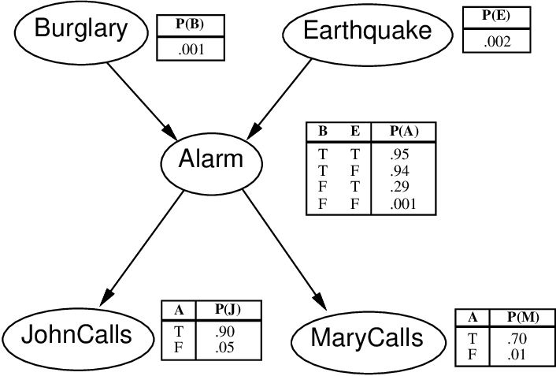
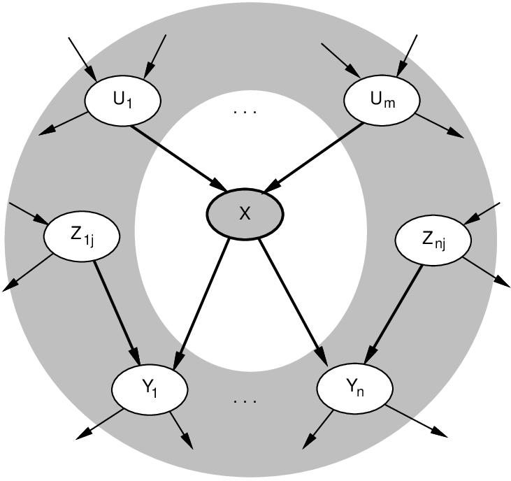
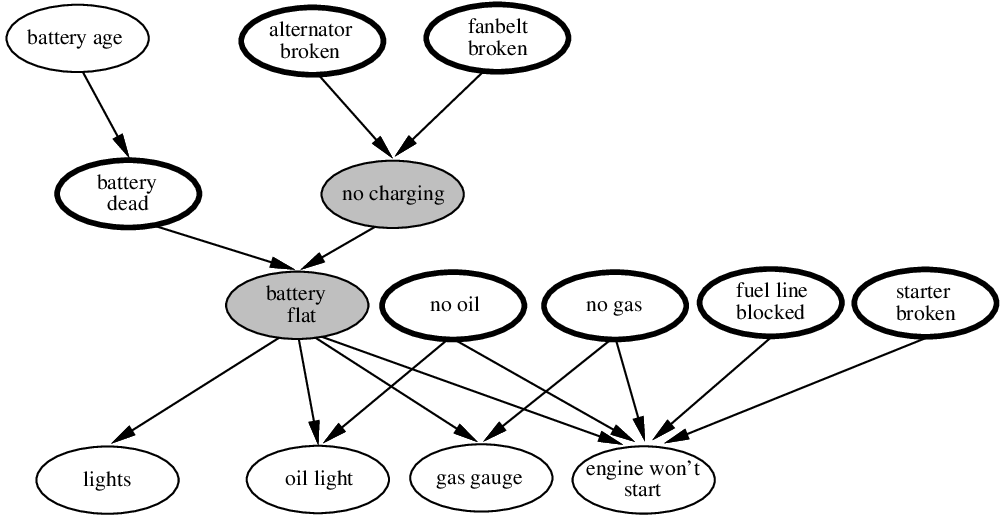
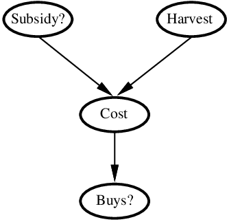
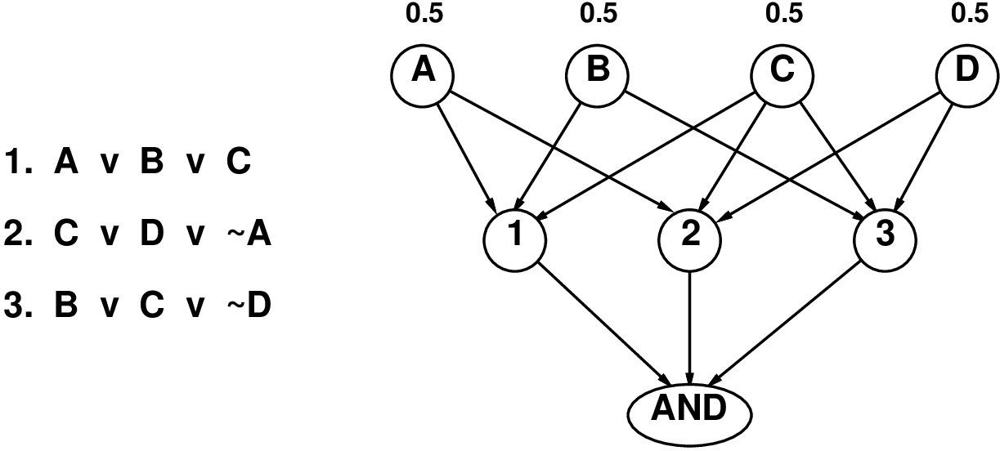
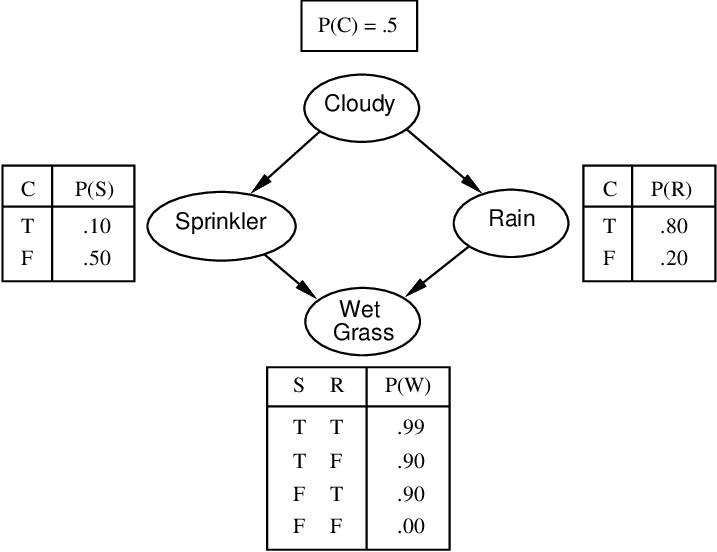
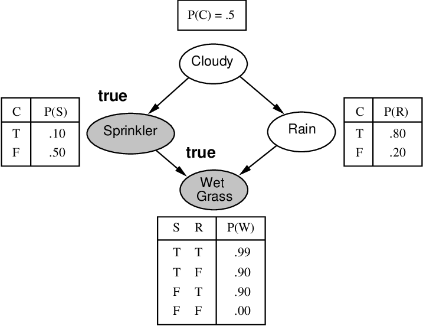

# Chapter 15 Making simple decisions

<!-- tabs:start -->

#### **Tiếng Việt**
<div class="pdf-container">
  <iframe src="TaiLieu/ebooks_Chapters_Vi3/Chapter_15_Making%20simple%20decisions/chapter_15_vi.html" width="100%" height="100%"></iframe>
</div>

#### **Tiếng Anh**
<div class="pdf-container">
  <iframe src="TaiLieu/ebooks_Chapters/Chapter_15_Making%20simple%20decisions.pdf" width="100%" height="100%"></iframe>
</div>

#### **Slide**

\usepackage{aima-slides}
\usepackage[utf8]{inputenc}
\usepackage[T5]{fontenc}
\usepackage{lmodern}

# Mạng niềm tin (Belief networks)

## Chương 15.1--2

---
## Nội dung

- Độc lập có điều kiện (Conditional independence)

- Mạng Bayes: cú pháp và ngữ nghĩa

- Suy diễn chính xác (Exact inference)

- Suy diễn xấp xỉ (Approximate inference)

---
## Độc lập (Independence)

Hai biến ngẫu nhiên $A$ $B$ <u>độc lập</u> (tuyệt đối) khi và chỉ khi
  
\phantom{hoặc }$P(A|B) = P(A)$
  
hoặc $P(A,B) = P(A|B)P(B) = P(A)P(B)$

ví dụ: $A$ và $B$ là hai lần tung đồng xu

Nếu $n$ biến Boolean độc lập, phân phối đồng thời đầy đủ là
  
  $P(X_1,\ldots,X_n) = \myprod_i P(X_i)$

do đó có thể được chỉ định chỉ bằng $n$ con số

Độc lập tuyệt đối là một yêu cầu rất khắt khe, hiếm khi được đáp ứng

---
## Độc lập có điều kiện

Xem xét bài toán nha sĩ với ba biến ngẫu nhiên:
  
  $Toothache$, $Cavity$, $Catch$ (que thăm dò bằng thép vướng vào răng tôi)

Phân phối đồng thời đầy đủ có $2^3 - 1$ = 7 mục nhập độc lập

Nếu tôi bị sâu răng, xác suất que thăm dò vướng vào đó
không phụ thuộc vào việc tôi có bị đau răng hay không:
  
  (1) $P(Catch|Toothache,Cavity) = P(Catch|Cavity)$
 
nghĩa là, $Catch$ <u>độc lập có điều kiện</u> với $Toothache$ khi biết $Cavity$

Sự độc lập tương tự giữ nguyên nếu tôi không bị sâu răng:
  
  (2) $P(Catch|Toothache,\lnot Cavity) = P(Catch|\lnot Cavity)$

---
## Độc lập có điều kiện (tiếp)

Các phát biểu tương đương với (1) 

(1a) $P(Toothache|Catch,Cavity) = P(Toothache|Cavity)$ <u>Tại sao</u>??

(1b) $P(Toothache,Catch|Cavity) = P(Toothache|Cavity)P(Catch|Cavity)$ <u>Tại sao</u>??

Phân phối đồng thời đầy đủ bây giờ có thể được viết thành
  
  $P(Toothache,Catch,Cavity) = P(Toothache,Catch|Cavity) P(Cavity)$
    
    = $P(Toothache|Cavity)P(Catch|Cavity)P(Cavity)$

nghĩa là, 2 + 2 + 1 = 5 số độc lập (phương trình 1 và 2 loại bỏ đi 2 số)

---
## Độc lập có điều kiện (tiếp)

Các phát biểu tương đương với (1) 

(1a) $P(Toothache|Catch,Cavity) = P(Toothache|Cavity)$ <u>Tại sao</u>??

$P(Toothache|Catch,Cavity)$
  
  = $P(Catch|Toothache,Cavity)P(Toothache|Cavity)/P(Catch|Cavity)$
  
  = $P(Catch|Cavity)P(Toothache|Cavity)/P(Catch|Cavity)$ (từ 1)
  
  = $P(Toothache|Cavity)$

(1b) $P(Toothache,Catch|Cavity) = P(Toothache|Cavity)P(Catch|Cavity)$ <u>Tại sao</u>??

$P(Toothache,Catch|Cavity)$
  
  = $P(Toothache|Catch,Cavity)P(Catch|Cavity)$ (quy tắc nhân)
  
  = $P(Toothache|Cavity)P(Catch|Cavity)$ (từ 1a)

---
## Mạng niềm tin (Belief networks)

Một ký hiệu đồ họa đơn giản cho các khẳng định độc lập có điều kiện

và do đó dùng để biểu diễn một cách nhỏ gọn các phân phối đồng thời đầy đủ

Cú pháp:
  
  một tập hợp các nút, mỗi nút cho một biến
  
  một đồ thị có hướng, không chu trình (liên kết $\approx$ "ảnh hưởng trực tiếp")
  
  một phân phối có điều kiện cho mỗi nút khi biết các nút cha của nó:
    
    $P(X_i|Parents(X_i))$

Trong trường hợp đơn giản nhất, phân phối có điều kiện được biểu diễn bằng

một <u>bảng xác suất có điều kiện (conditional probability table - CPT)</u>

---
## Ví dụ

Tôi đang ở chỗ làm, người hàng xóm John gọi điện báo chuông báo động nhà tôi đang reo, nhưng
người hàng xóm Mary không gọi. Đôi khi nó bị kích hoạt bởi các
trận động đất nhỏ. Có kẻ trộm không?

Các biến: $Burglar$, $Earthquake$, $Alarm$, $JohnCalls$, $MaryCalls$

Cấu trúc mạng phản ánh kiến thức "nhân quả":



Lưu ý: $\leq k$ nút cha ${} \implies O(d^k n)$ số so với $O(d^n)$

---
## Ngữ nghĩa (Semantics)

Ngữ nghĩa "toàn cục (Global)" định nghĩa phân phối đồng thời đầy đủ là

tích của các phân phối có điều kiện cục bộ:
\[
  P(X_1,\ldots,X_n) = \myprod_{i\eq 1}^n P(X_i|Parents(X_i))
\]
ví dụ: $P(J\land M\land A\land \lnot B \land \lnot E)$ <u>được cho bởi</u>??
  
  =

---
## Ngữ nghĩa

Ngữ nghĩa "toàn cục" định nghĩa phân phối đồng thời đầy đủ là

tích của các phân phối có điều kiện cục bộ:
\[
  P(X_1,\ldots,X_n) = \myprod_{i\eq 1}^n P(X_i|Parents(X_i))
\]
ví dụ: $P(J\land M\land A\land \lnot B \land \lnot E)$ <u>được cho bởi</u>??
  
  = $P(\lnot B)P(\lnot E)P(A|\lnot B \land \lnot E)P(J|A)P(M|A)$

Ngữ nghĩa "cục bộ (Local)": mỗi nút độc lập có điều kiện

với các nút không phải hậu duệ (nondescendants) của nó khi biết các nút cha của nó

Định lý: Ngữ nghĩa cục bộ $\lequiv$ ngữ nghĩa toàn cục

---
## Bao đóng Markov (Markov blanket)

Mỗi nút độc lập có điều kiện với tất cả các nút khác khi biết

<u>Bao đóng Markov</u> của nó: các cha + các con + các cha của các con



---
## Xây dựng mạng niềm tin

Cần một phương pháp sao cho một loạt các khẳng định độc lập có điều kiện

có thể kiểm tra cục bộ đảm bảo được ngữ nghĩa toàn cục yêu cầu

1. Chọn một thứ tự của các biến $X_1,\ldots,X_n$

2. Với $i$ = 1 đến $n$
  
  thêm $X_i$ vào mạng
  
  chọn các cha từ $X_1,\ldots,X_{i-1}$ sao cho
    
    $ P(X_i|Parents(X_i)) = P(X_i|X_1,\, \ldots,\, X_{i-1}) $

Việc lựa chọn các nút cha này đảm bảo ngữ nghĩa toàn cục:
  
  $P(X_1,\ldots,X_n) = \myprod_{i\eq 1}^n P(X_i | X_1,\, \ldots,\, X_{i-1})$ (quy tắc chuỗi)
    
    = $\myprod_{i\eq 1}^n P(X_i|Parents(X_i))$ theo cách xây dựng

---
## Ví dụ

Giả sử chúng ta chọn thứ tự $M$, $J$, $A$, $B$, $E$


$P(J|M) = P(J)$?

---
## Ví dụ

\ptext{Giả sử chúng ta chọn thứ tự $M$, $J$, $A$, $B$, $E$}


\ptext{$P(J|M) = P(J)$?} &nbsp;&nbsp;  Không

$P(A|J,M) = P(A|J)$? $P(A|J,M) = P(A)$?

---
## Ví dụ

\ptext{Giả sử chúng ta chọn thứ tự $M$, $J$, $A$, $B$, $E$}


\ptext{$P(J|M) = P(J)$? &nbsp;&nbsp;  Không}

\ptext{$P(A|J,M) = P(A|J)$? $P(A|J,M) = P(A)$?} &nbsp;&nbsp;  Không

$P(B|A,J,M) = P(B|A)$?

$P(B|A,J,M) = P(B)$?

---
## Ví dụ

\ptext{Giả sử chúng ta chọn thứ tự $M$, $J$, $A$, $B$, $E$}


\ptext{$P(J|M) = P(J)$? &nbsp;&nbsp;  Không}

\ptext{$P(A|J,M) = P(A|J)$? $P(A|J,M) = P(A)$? &nbsp;&nbsp;  Không}

\ptext{$P(B|A,J,M) = P(B|A)$?} &nbsp;&nbsp;  Có

\ptext{$P(B|A,J,M) = P(B)$?} &nbsp;&nbsp;  Không

$P(E|B,A,J,M) = P(E|A)$?

$P(E|B,A,J,M) = P(E|A,B)$?

---
## Ví dụ

\ptext{Giả sử chúng ta chọn thứ tự $M$, $J$, $A$, $B$, $E$}


\ptext{$P(J|M) = P(J)$? &nbsp;&nbsp;  Không}

\ptext{$P(A|J,M) = P(A|J)$? $P(A|J,M) = P(A)$? &nbsp;&nbsp;  Không}

\ptext{$P(B|A,J,M) = P(B|A)$? &nbsp;&nbsp;  Có}

\ptext{$P(B|A,J,M) = P(B)$? &nbsp;&nbsp;  Không}

\ptext{$P(E|B,A,J,M) = P(E|A)$?} &nbsp;&nbsp;  Không

\ptext{$P(E|B,A,J,M) = P(E|A,B)$?} &nbsp;&nbsp;  Có

---
## Ví dụ: Chẩn đoán xe (Car diagnosis)

Bằng chứng ban đầu: động cơ không nổ

Các biến có thể kiểm tra (hình bầu dục mỏng), các biến chẩn đoán (hình bầu dục dày)

Các biến ẩn (bị tô đậm) đảm bảo cấu trúc thưa thớt, giảm các tham số



---
## Ví dụ: Bảo hiểm xe ô tô (Car insurance)

Dự đoán chi phí yêu cầu bồi thường (y tế, trách nhiệm pháp lý, tài sản)

dựa trên dữ liệu từ đơn đăng ký (các nút không được tô sáng khác)


---
## Phân phối có điều kiện nhỏ gọn

Bảng CPT tăng theo cấp số nhân theo số lượng các nút cha

Bảng CPT trở thành vô hạn khi nút cha hoặc con mang giá trị liên tục

Giải pháp: Các phân phối <u>chính tắc (canonical)</u> được định nghĩa một cách nhỏ gọn

Các nút <u>tất định (Deterministic)</u> là trường hợp đơn giản nhất:
  
   $X = f(Parents(X))$ đối với một hàm số $f$ nào đó

Ví dụ: Các hàm Boolean
  
  $NorthAmerican \lequiv Canadian \lor US \lor Mexican$

Ví dụ: Mối quan hệ số học giữa các biến liên tục
\[
  \frac{\partial Level}{\partial t} = \mbox{ inflow + precipation 
                                            - outflow - evaporation}
\]

---
## Phân phối có điều kiện nhỏ gọn (tiếp)

Phân phối <u>Noisy-OR</u> mô hình hóa nhiều nguyên nhân không tương tác
  
  1) Các nút cha $U_1\ldots U_k$ bao gồm tất cả các nguyên nhân (có thể thêm <u>nút rò rỉ (leak node)</u>)
  
  2) Xác suất hỏng độc lập $q_i$ cho riêng từng nguyên nhân
    
    ${} \implies 
     P(X|U_1\ldots U_j,\lnot U_{j+1}\ldots \lnot U_k)
     = 1 - \myprod_{i\eq 1}^j q_i$

| &nbsp; | &nbsp; | &nbsp; | &nbsp; | &nbsp; |
|---|---|---|---|---|
| \makebox[72pt]{$Cold$} | \makebox[72pt]{$Flu$} | \makebox[72pt]{$Malaria$} | $P(Fever)$ | $P(\lnot Fever)$ |
| F | F | F | $\mbf{0.0}$ | $1.0$ |
| F | F | T | $0.9$ | $\mbf{0.1}$ |
| F | T | F | $0.8$ | $\mbf{0.2}$ |
| F | T | T | $0.98$ | $0.02 = 0.2 \times 0.1$ |
| T | F | F | $0.4$ | $\mbf{0.6}$ |
| T | F | T | $0.94$ | $0.06 = 0.6 \times 0.1$ |
| T | T | F | $0.88$ | $0.12 = 0.6 \times 0.2$ |
| T | T | T | $0.988$ | $0.012 = 0.6 \times 0.2 \times 0.1$ |

Số lượng tham số tuyến tính với số lượng nút cha

---
## Mạng lai (Hybrid networks) (rời rạc+liên tục)

Biến rời rạc ($Subsidy?$ và $Buys?$);  biến liên tục ($Harvest$ và $Cost$)



Lựa chọn 1: rời rạc hóa---có thể có lỗi lớn, bảng CPT lớn

Lựa chọn 2: các họ chính tắc được tham số hóa hữu hạn

1) Biến liên tục, cha rời rạc+liên tục (ví dụ: $Cost$)

2) Biến rời rạc, cha liên tục (ví dụ: $Buys?$)

---
## Biến con liên tục

Cần một hàm <u>mật độ có điều kiện</u> cho biến con khi biết các
nút cha liên tục, cho mỗi phép gán có thể có đối với các cha rời rạc

Phổ biến nhất là mô hình <u>Gaussian tuyến tính</u>, ví dụ:
\begin{eqnarray*}
\lefteqn{P(Cost\eq c|Harvest\eq h,Subsidy?\eq true)}

 & = & N(a_t h + b_t, \sigma_t)(c)

 &=& \frac{1}{\sigma_t \sqrt{2\pi}}
 exp\left(-\frac{1}{2} 
          \left(\frac{c-(a_t h + b_t)}{\sigma_t}\right)^2
    \right)
\end{eqnarray*}

Giá trị trung bình $Cost$ thay đổi tuyến tính với $Harvest$, phương sai cố định

Biến thiên tuyến tính là vô lý trên toàn dải
  
  nhưng có thể chấp nhận được nếu phạm vi <u>khả dĩ</u> của $Harvest$ hẹp

---
## Biến con liên tục

\threegraph{graphs/linear-gaussian-true.ps}{graphs/linear-gaussian-false.ps}{graphs/linear-gaussian-average.ps}

Mạng toàn liên tục với các phân phối LG
  
  $\implies$ phân phối đồng thời đầy đủ là một Gaussian đa biến
  

Mạng LG rời rạc+liên tục là một mạng <u>Gaussian có điều kiện</u>
nghĩa là, một Gaussian đa biến trên tất cả các biến liên tục
cho mỗi tổ hợp các giá trị biến rời rạc

---
## Biến rời rạc có các cha liên tục

Xác suất $Buys?$ khi biết $Cost$ nên là một ngưỡng "mềm":


Phân phối <u>Probit</u> sử dụng tích phân của Gaussian:
  
  $\Phi(x) = \int_{-\infty}{^x} N(0,1)(x) dx$
  
  $P(Buys?\eq true \given Cost \eq c) = \Phi((-c + \mu)/\sigma)$

Có thể xem là ngưỡng cứng có vị trí bị nhiễu

---
## Biến rời rạc (tiếp)

Phân phối <u>Sigmoid</u> (hoặc <u>logit</u>) cũng được sử dụng trong mạng nơ-ron:
\[
P(Buys?\eq true \given Cost \eq c) = \frac{1}{1+exp(-2\frac{-c+\mu}{\sigma})}
\]
Sigmoid có dạng tương tự probit nhưng đuôi dài hơn nhiều:


\usepackage{aima-slides}
\usepackage[utf8]{inputenc}
\usepackage[T5]{fontenc}
\usepackage{lmodern}

# Suy diễn trong mạng niềm tin

## Chương 15.3--4 + bổ sung

---
## Nội dung

- Suy diễn chính xác bằng phép liệt kê (enumeration)

- Suy diễn chính xác bằng cách loại bỏ biến (variable elimination)

- Suy diễn xấp xỉ bằng mô phỏng ngẫu nhiên (stochastic simulation)

- Suy diễn xấp xỉ bằng chuỗi Markov Monte Carlo

---
## Các tác vụ suy diễn (Inference tasks)

<u>Truy vấn đơn giản (Simple queries)</u>: tính biên hậu nghiệm $P(X_i|\mbf{E}\eq \mbf{e})$
  
  ví dụ: $P(NoGas|Gauge\eq empty,Lights\eq on,Starts\eq false)$

<u>Truy vấn hội (Conjunctive queries)</u>: $P(X_i,X_j|\mbf{E}\eq \mbf{e}) = 
    P(X_i|\mbf{E}\eq \mbf{e})  P(X_j|X_i,\mbf{E}\eq \mbf{e}) $

<u>Quyết định tối ưu (Optimal decisions)</u>: mạng quyết định bao gồm thông tin về độ hữu ích;
    
    cần suy diễn xác suất cho $P(K\hat{e}t\ qu\mbox{\`{a}}|h\mbox{\`{a}}nh\ \mbox{\dj}\hat{o}ng,b\mbox{\`{a}}ng\ ch\acute{u}ng)$

<u>Giá trị của thông tin (Value of information)</u>: nên tìm kiếm bằng chứng nào tiếp theo?

<u>Phân tích độ nhạy (Sensitivity analysis)</u>: các giá trị xác suất nào là quan trọng nhất?

<u>Giải thích (Explanation)</u>: tại sao tôi cần một bộ khởi động mới?

---
## Suy diễn bằng cách liệt kê

Một cách thông minh hơn một chút để tính tổng các biến từ phân phối đồng thời
mà không thực sự xây dựng biểu diễn rõ ràng của nó

Truy vấn đơn giản trên mạng trộm (burglary network):

$P(B|J\eq true,M\eq true)$

$= P(B,J\eq true,M\eq true)/P(J\eq true,M\eq true)$

$= 
  pha P(B,J\eq true,M\eq true)$

$= 
  pha \mysum_e \mysum_a P(B,e,a,J\eq true,M\eq true)$

Viết lại các mục nhập đồng thời đầy đủ bằng cách sử dụng tích của các mục nhập CPT:

$P(B\eq true|J\eq true,M\eq true)$

$= 
  pha \mysum_e \mysum_a P(B\eq true)P(e)P(a|B\eq true,e)P(J\eq true|a)P(M\eq true|a) $

$= 
  pha P(B\eq true)\mysum_e P(e)\mysum_a P(a|B\eq true,e)P(J\eq true|a)P(M\eq true|a)$
       

---
## Thuật toán liệt kê

Liệt kê ưu tiên chiều sâu cạn kiệt (Exhaustive depth-first enumeration): độ phức tạp không gian $O(n)$, thời gian $O(d^n)$

```text
EnumerationAsk(\v{X},\mbf{e},\v{bn}) \k{returns} a distribution over \v{X} 
\k{inputs}: \v{X}, {the query variable}
            {\mbf{e}}, {evidence specified as an event}
            \v{bn}, {a belief network specifying joint distribution $P(X_1,\ldots,X_n)$}

    $Q(\v{X)$}{a distribution over \v{X}}
    \k{for each} value $x_i$ of \v{X} \k{do}
          extend \mbf{e} with value $x_i$ for \v{X}
          $Q(x_i)$ <- EnumerateAll(Vars[\v{bn],\mbf{e})}
    \k{return} Normalize($Q(X)$)
\fnsep
EnumerateAll(\v{vars},\mbf{e}) \k{returns} a real number
    \k{if} Empty?(\v{vars}) \k{then return} 1.0
    \k{else do}
          \v{Y}{First(\v{vars})}
          \k{if} \v{Y} has value \v{y} in \mbf{e}
                \k{then return} $P(y | Pa(Y)) \times {}$EnumerateAll(Rest(\v{vars}),\mbf{e})
                \k{else return} $\sum_{y} P(y | Pa(Y)) \times {}$EnumerateAll(Rest(\v{vars}),$\mbf{e}_y$)
                      where $\mbf{e}_y$ is \mbf{e} extended with $Y\eq y$
```

---
## Suy diễn bằng cách loại bỏ biến

Liệt kê không hiệu quả: tính toán lặp lại
  
  ví dụ: tính $P(J\eq true|a)P(M\eq true|a)$ cho mỗi giá trị của $e$

Loại bỏ biến (Variable elimination): thực hiện tính tổng từ phải sang trái,

lưu trữ các kết quả trung gian (<u>các hệ số (factors)</u>) để tránh tính toán lại

$P(B|J\eq true,M\eq true)$
    
    $= 
  pha \underbrace{P(B)}_B 
             \mysum_e \underbrace{P(e)}_E
             \mysum_a \underbrace{P(a|B,e)}_A
             \underbrace{P(J\eq true|a)}_J
             \underbrace{P(M\eq true|a)}_M$
    
    $= 
  pha P(B)\mysum_e P(e)\mysum_a P(a|B,e) P(J\eq true|a) f_M(a)$
    
    $= 
  pha P(B)\mysum_e P(e)\mysum_a P(a|B,e) f_J(a) f_M(a)$
    
    $= 
  pha P(B)\mysum_e P(e)\mysum_a f_A(a,b,e) f_J(a) f_M(a)$
    
    $= 
  pha P(B)\mysum_e P(e)f_{\bar{A}JM}(b,e) $ (tính tổng $A$)
    
    $= 
  pha P(B)f_{\bar{E}\bar{A}JM}(b)$ (tính tổng $E$)
    
    $= 
  pha f_B(b)\stimes f_{\bar{E}\bar{A}JM}(b)$ 

---
## Loại bỏ biến: Các phép toán cơ bản

<u>Tích từng điểm (Pointwise product)</u> của các hệ số $f_1$ và $f_2$:
  
  $f_1(x_1,\ldots,x_j,y_1,\ldots,y_k) \stimes
     f_2(y_1,\ldots,y_k,z_1,\ldots,z_l)$
    
  = $f(x_1,\ldots,x_j,y_1,\ldots,y_k,z_1,\ldots,z_l)$

Ví dụ: $f_1(a,b) \stimes f_2(b,c) = f(a,b,c)$

Lấy tổng một biến ra khỏi tích các hệ số: di chuyển bất kỳ hệ số hằng số nào
ra ngoài phép tổng:

$\mysum_x f_1 \stimes \cdots \stimes f_k =
f_1 \stimes \cdots \stimes f_i\  \mysum_x\; f_{i+1} \stimes \cdots \stimes
f_k = f_1 \stimes \cdots \stimes f_i \stimes f_{\bar{X}}$

giả sử $f_1,\ldots,f_i$ không phụ thuộc vào $X$

---
## Thuật toán loại bỏ biến

```text
function EliminationAsk(\v{X),\mbf{e},\v{bn}}{a distribution over \v{X}}
      inputs: X, the query variable
    \inputs{\mbf{e}}{evidence specified as an event}
      inputs: bn, a belief network specifying joint distribution $P(X_1,\ldots,X_n)$

    if $\v{X}\elt\mbf{e}$ then return observed point distribution for \v{X}
    \v{factors}{$[, ]$}; \v{vars}{Reverse(Vars[\v{bn}])}
    \k{for each} \v{var} \k{in} \v{vars} \k{do}
          \v{factors}{$[MakeFactor(\v{var},\mbf{e})|\v{factors}]$}
          \k{if} \v{var} is a hidden variable \k{then} \v{factors}{SumOut(\v{var},\v{factors})}
    \k{return} Normalize(PointwiseProduct(\v{factors}))
```

---
## Độ phức tạp của suy diễn chính xác

Mạng <u>kết nối đơn (Singly connected)</u> (hoặc <u>đa cây (polytrees)</u>):
  
  -- bất kỳ hai nút nào cũng được kết nối với nhau bởi tối đa một đường dẫn (không có hướng)
  
  -- chi phí thời gian và không gian của việc loại bỏ biến là $O(d^k n)$

Mạng <u>kết nối đa (Multiply connected)</u>:
  
  -- có thể quy giản 3SAT thành suy diễn chính xác $\implies$ NP-khó (NP-hard)
  
  -- tương đương với việc *đếm* các mô hình 3SAT $\implies$ \#P-đầy đủ (\#P-complete)



---
## Suy diễn bằng mô phỏng ngẫu nhiên

Ý tưởng cơ bản:
  
  1) Rút ra $N$ mẫu từ một phân phối lấy mẫu $S$
  
  2) Tính xác suất hậu nghiệm xấp xỉ $\hat P$
  
  3) Chỉ ra rằng xác suất này hội tụ về xác suất thực $P$

Phác thảo:
  
  -- Lấy mẫu từ một mạng rỗng (Sampling from an empty network)
  
  -- Lấy mẫu loại bỏ (Rejection sampling): từ chối các mẫu không khớp với bằng chứng
  
  -- Trọng số hợp lý (Likelihood weighting): sử dụng bằng chứng để tính trọng số cho các mẫu
  
  -- MCMC: lấy mẫu từ một quá trình ngẫu nhiên mà phân phối
    
       dừng của nó là phân phối hậu nghiệm thực

---
## Lấy mẫu từ một mạng rỗng

```text
function PriorSample(\v{bn)}{an event sampled from $P(X_1,\ldots,X_n)$ specified by \v{bn}}
    \mbf{x}{an event with $n$ elements}
    \k{for} $i = 1$ \k{to} $n$ \k{do}
          $x_i$ <- a random sample from $P(X_i | Parents(X_i))$
    \k{return} \mbf{x}
```

$P(Cloudy) = \<0.5,0.5\>$
    
    mẫu $\rightarrow$ $true$

$P(Sprinkler|Cloudy) = \<0.1,0.9\>$
    
    mẫu $\rightarrow$ $false$

$P(Rain|Cloudy) = \<0.8,0.2\>$
    
    mẫu $\rightarrow$ $true$

\hbox{$P(WetGrass|\lnot Sprinkler,Rain) = \<0.9,0.1\>$}
    
    mẫu $\rightarrow$ $true$

 



---
## Lấy mẫu từ một mạng rỗng (tiếp)

Xác suất để thuật toán \prog{PriorSample} sinh ra một sự kiện cụ thể
  
  $S_{PS}(x_1\ldots x_n) = \myprod_{i\eq 1}^n P(x_i | Parents(X_i))
    = P(x_1\ldots x_n)$

nghĩa là, xác suất tiên nghiệm thực

Gọi $N_{PS}(\mbf{Y}\eq \mbf{y})$ là số mẫu được tạo ra
trong đó $\mbf{Y}\eq \mbf{y}$, đối với bất kỳ tập biến $\mbf{Y}$ nào.

Khi đó $\hat P(\mbf{Y}\eq \mbf{y}) = N_{PS}(\mbf{Y}\eq \mbf{y})/N$ và
\begin{eqnarray*}
  \lim_{N\to\infty} \hat P(\mbf{Y}\eq \mbf{y}) 
      & = & \mysum_{\smbf{h}} S_{PS}(\mbf{Y}\eq \mbf{y},\mbf{H}\eq \mbf{h})

      & = &  \mysum_{\smbf{h}} P(\mbf{Y}\eq \mbf{y},\mbf{H}\eq \mbf{h})

      & = & P(\mbf{Y}\eq \mbf{y})
\end{eqnarray*}
Nghĩa là, các ước tính thu được từ \prog{PriorSample} là <u>nhất quán (consistent)</u>

---
## Lấy mẫu loại bỏ

$\hat{P}(X|\mbf{e})$ được ước tính từ các mẫu đồng ý với $\mbf{e}$

```text
function RejectionSampling(\v{X),\mbf{e},\v{bn},\v{N}}{an approximation to $P(X|\mbf{e})$}
    \mbf{N[\v{X}]}{a vector of counts over \v{X}, initially zero}
    \k{for} \v{j} = 1 to $N$ \k{do}
          \mbf{x}{PriorSample(\v{bn})}
          \k{if} \mbf{x} is consistent with \mbf{e} \k{then}
              \mbf{N[\v{x}]}{\mbf{N}[\v{x}]+1} where \v{x} is the value of \v{X} in \mbf{x}
    \k{return} Normalize(\mbf{N}[\v{X}])
```

Ví dụ: ước lượng $P(Rain|Sprinkler\eq true)$ bằng cách sử dụng 100 mẫu
  
  27 mẫu có $Sprinkler\eq true$
    
    Trong số này, 8 mẫu có $Rain\eq true$ và 19 mẫu có $Rain\eq false$.
[0.2in]
$\hat{P}(Rain|Sprinkler\eq true) = \noprog{Normalize}(\<8,19\>) =
\<0.296,0.704\>$

Tương tự như một quy trình ước lượng thực nghiệm cơ bản trong thế giới thực

---
## Phân tích lấy mẫu loại bỏ

$\hat{P}(X|\mbf{e}) = 
  pha \mbf{N}_{PS}(X,\mbf{e}) $ 
    &nbsp;&nbsp;&nbsp;&nbsp;  (định nghĩa thuật toán)
  
$= \mbf{N}_{PS}(X,\mbf{e})/N_{PS}(\mbf{e})$ 
    &nbsp;&nbsp;&nbsp;&nbsp;  (được chuẩn hóa bằng $N_{PS}(\mbf{e})$)
  
$\approx P(X,\mbf{e})/P(\mbf{e})$ 
    &nbsp;&nbsp;&nbsp;&nbsp;  (đặc tính của \prog{PriorSample})
  
$= P(X|\mbf{e})$ 
    &nbsp;&nbsp;&nbsp;&nbsp;  (định nghĩa xác suất có điều kiện)

Do đó việc lấy mẫu loại bỏ trả về các ước tính hậu nghiệm nhất quán

Vấn đề: chi phí cực kỳ lớn nếu $P(\mbf{e})$ nhỏ

---
## Trọng số hợp lý (Likelihood weighting)

Ý tưởng: cố định các biến bằng chứng, chỉ lấy mẫu các biến không phải bằng chứng,

và đánh trọng số từng mẫu theo khả năng nó phù hợp với bằng chứng

```text
function WeightedSample(\v{bn),\mbf{e}}{an event and a weight}
    \mbf{x}{an event with $n$ elements}; \v{w}{1}
    \k{for} \v{i} = 1 \k{to} $n$ \k{do}
          \k{if} $X_i$ has a value $x_i$ in \mbf{e}
                \k{then} \v{w}{$\v{w}\times P(X_i\eq x_i | Parents(X_i))$}
                \k{else} $x_i$ <- a random sample from $P(X_i | Parents(X_i))$
    \k{return} \mbf{x}, \v{w}

function LikelihoodWeighting(\v{X),\mbf{e},\v{bn},\v{N}}{an approximation to $P(X|\mbf{e})$}
    $\mbf{W[\v{X}]$}{a vector of weighted counts over \v{X}, initially zero}
    \k{for} \v{j} = 1 to $N$ \k{do}
          \mbf{x,\v{w}}{WeightedSample(\v{bn})}
          $\mbf{W[\v{x}]$}{$\mbf{W}[\v{x}]+\v{w}$} where \v{x} is the value of \v{X} in \mbf{x}
    \k{return} Normalize($\mbf{W}[\v{X}]$)
```

---
## Ví dụ về trọng số hợp lý

Ước lượng $P(Rain|Sprinkler\eq true,WetGrass\eq true)$



---
## LW example contd.

Sample generation process:

1. $w \leftarrow 1.0$

2. Sample $P(Cloudy) = \<0.5,0.5\>$; say $true$

3. $Sprinkler$ has value $true$, so
  
  $w \leftarrow w \times P(Sprinkler\eq true|Cloudy\eq true) = 0.1$

4. Sample $P(Rain|Cloudy\eq true) = \<0.8,0.2\>$; say $true$ 

5. $WetGrass$ has value $true$, so
  
  $w \leftarrow w \times P(WetGrass\eq true|Sprinkler\eq true,Rain\eq true) = 0.099$

---
## Likelihood weighting analysis

Sampling probability for \prog{WeightedSample} is
  
  $S_{WS}(\mbf{y},\mbf{e}) = \myprod_{i\eq 1}^l P(y_i|Parents(Y_i))$

Note: pays attention to evidence in *ancestors* only
    
    $\implies$ somewhere "in between" prior and posterior distribution

Weight for a given sample $\mbf{y},\mbf{e}$ is
  
  $w(\mbf{y},\mbf{e}) = \myprod_{i\eq 1}^m P(e_i | Parents(E_i))$

Weighted sampling probability is
  
  $S_{WS}(\mbf{y},\mbf{e}) w(\mbf{y},\mbf{e})$
    
    $= \myprod_{i\eq 1}^l P(y_i|Parents(Y_i))\ \ 
       \myprod_{i\eq 1}^m P(e_i|Parents(E_i))$
    
    $= P(\mbf{y},\mbf{e})$ (by standard global semantics of network)

Hence likelihood weighting returns consistent estimates

but performance still degrades with many evidence variables

---
## Approximate inference using MCMC

"State" of network = current assignment to all variables

Generate next state by sampling one variable given Markov blanket

Sample each variable in turn, keeping evidence fixed

```text
function MCMC-Ask(\v{X),\mbf{e},\v{bn},\v{N}}{an approximation to $P(X|\mbf{e})$}
    \firstlocal{$\mbf{N}[\v{X}]$}{a vector of counts over \v{X}, initially zero}
    \local{\mbf{Y}}{the nonevidence variables in \v{bn}}
    \local{\mbf{x}}{the current state of the network, initially copied from \mbf{e}}

    initialize \v{\mbf{x}} with random values for the variables in \v{\mbf{Y}}
    \k{for} \v{j} = 1 to $N$ \k{do}
          $\mbf{N[\v{x}]$}{$\mbf{N}[\v{x}]+1$} where \v{x} is the value of \v{X} in \mbf{x}
          \k{for each} $Y_i$ in \v{\mbf{Y}} \k{do}
                sample the value of $Y_i$ in \mbf{x} from $P(Y_i|MB(Y_i))$ given the values of $MB(Y_i)$ in \mbf{x}
    \k{return} Normalize($\mbf{N}[\v{X}]$)
```

Approaches <u>stationary distribution</u>: long-run fraction of time
spent in each state is exactly proportional to its posterior
probability

---
## MCMC Example

Estimate $P(Rain|Sprinkler\eq true,WetGrass\eq true)$

Sample $Cloudy$ then $Rain$, repeat.

Count number of times $Rain$ is true and false in the samples.

Markov blanket of $Cloudy$ is $Sprinkler$ and $Rain$

Markov blanket of $Rain$ is $Cloudy$, $Sprinkler$, and $WetGrass$


---
## MCMC example contd.

Random initial state: $Cloudy\eq true$ and $Rain\eq false$

1. $P(Cloudy|MB(Cloudy)) = P(Cloudy|Sprinkler,\lnot Rain)$
    
    sample $\rightarrow$ $false$

2. $P(Rain|MB(Rain)) = P(Rain|\lnot Cloudy,Sprinkler,WetGrass)$
    
    sample $\rightarrow$ $true$

Visit 100 states
  
  31 have $Rain\eq true$, 69 have $Rain\eq false$

$\hat{P}(Rain|Sprinkler\eq true,WetGrass\eq true)$
  
      $= \noprog{Normalize}(\<31,69\>) = \<0.31,0.69\>$

---
## MCMC analysis: Outline

Transition probability $\transition{\mbf{y}}{\mbf{y}'}$

Occupancy probability $\pi_t(\mbf{y})$ at time $t$

Equilibrium condition on $\pi_t$ defines stationary distribution $\pi(\mbf{y})$
    
Note: stationary distribution depends on choice of $\transition{\mbf{y}}{\mbf{y}'}$

Pairwise <u>detailed balance</u> on states guarantees equilibrium

<u>Gibbs sampling</u> transition probability:
    
    sample each variable given current values of all others

$\implies$ detailed balance with the true posterior

For Bayesian networks, Gibbs sampling reduces to

sampling conditioned on each variable's Markov blanket

---
## Stationary distribution

$\pi_t(\mbf{y})$ = probability in state $\mbf{y}$ at time $t$

$\pi_{t+1}(\mbf{y}')$ = probability in state $\mbf{y}'$ at time $t+1$

$\pi_{t+1}$ in terms of $\pi_t$ and $\transition{\mbf{y}}{\mbf{y}'}$
\[
  \pi_{t+1}(\mbf{y}') = \mysum_{\smbf{y}} \pi_t(\mbf{y}) \transition{\mbf{y}}{\mbf{y}'}
\]
Stationary distribution: $\pi_t = \pi_{t+1} = \pi$
\[
  \pi(\mbf{y}') = \mysum_{\smbf{y}} \pi(\mbf{y}) \transition{\mbf{y}}{\mbf{y}'}
       &nbsp;&nbsp;&nbsp;&nbsp; \mbox{for all }\mbf{y}'
\]
If $\pi$ exists, it is unique (specific to $\transition{\mbf{y}}{\mbf{y}'}$)

In equilibrium, expected "outflow" = expected "inflow"
  

---
## Detailed balance

"Outflow" = "inflow" for each pair of states:
\[
  \pi(\mbf{y}) \transition{\mbf{y}}{\mbf{y}'} 
   = \pi(\mbf{y}') \transition{\mbf{y}'}{\mbf{y}}
       &nbsp;&nbsp;&nbsp;&nbsp; \mbox{for all }\mbf{y},\ \mbf{y}'
\]
Detailed balance $\implies$ stationarity:
\begin{eqnarray*}
\mysum_{\smbf{y}} \pi(\mbf{y}) \transition{\mbf{y}}{\mbf{y}'} 
   & = & \mysum_{\smbf{y}} \pi(\mbf{y}') \transition{\mbf{y}'}{\mbf{y}} 

   & = & \pi(\mbf{y}') \mysum_{\smbf{y}} \transition{\mbf{y}'}{\mbf{y}} 

   & = & \pi(\mbf{y}')
\end{eqnarray*}

MCMC algorithms typically constructed by designing a transition

probability $q$ that is in detailed balance with desired $\pi$

---
## Gibbs sampling

Sample each variable in turn, given *all other variables*

Sampling $Y_i$, let $\bar{\mbf{Y}_i}$ be all other nonevidence variables

Current values are $y_i$ and $\bar{\mbf{y}_i}$; $\mbf{e}$ is fixed

Transition probability is given by
\[
\transition{\mbf{y}}{\mbf{y}'} =
  \transition{y_i,\bar{\mbf{y}_i}}{y_i',\bar{\mbf{y}_i}} =
    P(y_i'|\bar{\mbf{y}_i},\mbf{e})
\]
This gives detailed balance with true posterior $P(\mbf{y}|\mbf{e})$:
\begin{eqnarray*}
\pi(\mbf{y}) \transition{\mbf{y}}{\mbf{y}'} 
   &=& P(\mbf{y}|\mbf{e}) P(y_i'|\bar{\mbf{y}_i},\mbf{e}) 
     =  P(y_i,\bar{\mbf{y}_i}|\mbf{e})P(y_i'|\bar{\mbf{y}_i},\mbf{e})  

   &=& P(y_i|\bar{\mbf{y}_i},\mbf{e})P(\bar{\mbf{y}_i}|\mbf{e})
       P(y_i'|\bar{\mbf{y}_i},\mbf{e})  &nbsp;&nbsp; \mbox{(chain rule)} 

   &=& P(y_i|\bar{\mbf{y}_i},\mbf{e})P(y_i',\bar{\mbf{y}_i}|\mbf{e})
       &nbsp;&nbsp;&nbsp;&nbsp; \mbox{(chain rule backwards)} 

   &=& \transition{\mbf{y}'}{\mbf{y}} \pi(\mbf{y}') 
       = \pi(\mbf{y}') \transition{\mbf{y}'}{\mbf{y}} 
\end{eqnarray*}

---
## Markov blanket sampling

A variable is independent of all others given its Markov blanket:
  
  $P(y_i'|\bar{\mbf{y}_i},\mbf{e}) = P(y_i'|MB(Y_i))$

Probability given the Markov blanket is calculated as follows:
  
  $P(y_i'|MB(Y_i)) = P(y_i'|Parents(Y_i)) 
           \myprod_{Z_j\in Children(Y_i)} P(z_j|Parents(Z_j))$

Hence computing the sampling distribution over $Y_i$ for each
flip requires just $cd$ multiplications if $Y_i$ has $c$ children
and $d$ values; can cache it if $c$ not too large.

Main computational problems:
  
  1) Difficult to tell if convergence has been achieved
  
  2) Can be wasteful if Markov blanket is large:
    
    $P(Y_i|MB(Y_i))$ won't change much (law of large numbers)

---
## Performance of approximation algorithms

<u>Absolute approximation</u>: 
  $|P(X|\mbf{e}) - \hat P(X|\mbf{e})| \leq \epsilon$

<u>Relative approximation</u>: 
  $\frac{|P(X|\smbf{e}) - \hat P(X|\smbf{e})|}{P(X|\smbf{e})} \leq \epsilon$

Relative $\implies$ absolute since $0\leq P \leq 1$ (may be $O(2^{-n})$)

Randomized algorithms may fail with probability at most $\delta$

Polytime approximation: $\mbox{poly}(n,\epsilon^{-1},\log \delta^{-1})$

Theorem (Dagum and Luby, 1993): both absolute and relative

approximation for either deterministic or randomized algorithms

are NP-hard for any $\epsilon,\delta<0.5$

(Absolute approximation polytime with no evidence---Chernoff bounds)


#### **Trắc nghiệm**
*(Chưa có bài tập trắc nghiệm)*

#### **Pseudocode**
- [OUPM](codeAndExercises/aima-pseudocode-master/md/oupm.md)
- [NET-VISA](codeAndExercises/aima-pseudocode-master/md/net-visa.md)
- [RADAR](codeAndExercises/aima-pseudocode-master/md/radar.md)
- [GENERATE-IMAGE](codeAndExercises/aima-pseudocode-master/md/generate-image.md)
- [GENERATE-MARKOV-LETTERS](codeAndExercises/aima-pseudocode-master/md/generate-markov-letters.md)

*(Thư mục chứa mã giả cho các thuật toán trong sách: `codeAndExercises/aima-pseudocode-master/md`)*

#### **Python**
- [Dynamic Decision Network](codeAndExercises/aima-python-master/notebooks/dynamic_decision_network.ipynb)
- [Dynamic Decision Network (Python File)](codeAndExercises/aima-python-master/notebooks/dynamic_decision_network.py)


#### **Bài tập**

##### Bài tập 15.1

Show that any second-order Markov
process can be rewritten as a first-order Markov process with an
augmented set of state variables. Can this always be done
<i>parsimoniously</i>, i.e., without increasing the number of
parameters needed to specify the transition model?


---

##### Bài tập 15.2

In this exercise, we examine what
happens to the probabilities in the umbrella world in the limit of long
time sequences.<br>

1.  Suppose we observe an unending sequence of days on which the
    umbrella appears. Show that, as the days go by, the probability of
    rain on the current day increases monotonically toward a
    fixed point. Calculate this fixed point.<br>

2.  Now consider <i>forecasting</i> further and further into the
    future, given just the first two umbrella observations. First,
    compute the probability $P(r_{2+k}|u_1,u_2)$ for
    $k=1 \ldots 20$ and plot the results. You should see that
    the probability converges towards a fixed point. Prove that the
    exact value of this fixed point is 0.5.


---

##### Bài tập 15.3

This exercise develops a space-efficient variant of
the forward–backward algorithm described in
Figure <a class="insideBookFigRef" target="_blank" href="https://aimacode.github.io/aima-exercises/figures/forward-backward-algorithm.png">forward-backward-algorithm</a> (page <a class="pageRef" title="" href="#">forward-backward-algorithm</a>).
We wish to compute $\textbf{P} (\textbf{X}_k|\textbf{e}_{1:t})$ for
$k=1,\ldots ,t$. This will be done with a divide-and-conquer
approach.<br>

1.  Suppose, for simplicity, that $t$ is odd, and let the halfway point
    be $h=(t+1)/2$. Show that $\textbf{P} (\textbf{X}_k|\textbf{e}_{1:t}) $
     can be computed for
    $k=1,\ldots ,h$ given just the initial forward message
    $\textbf{f}_{1:0}$, the backward message $\textbf{b}_{h+1:t}$, and the evidence
    $\textbf{e}_{1:h}$.<br>

2.  Show a similar result for the second half of the sequence.<br>

3.  Given the results of (a) and (b), a recursive divide-and-conquer
    algorithm can be constructed by first running forward along the
    sequence and then backward from the end, storing just the required
    messages at the middle and the ends. Then the algorithm is called on
    each half. Write out the algorithm in detail.<br>

4.  Compute the time and space complexity of the algorithm as a function
    of $t$, the length of the sequence. How does this change if we
    divide the input into more than two pieces?<br>


---

##### Bài tập 15.4

On page <a class="pageRef" title="" href="#">flawed-viterbi-page</a>, we outlined a flawed
procedure for finding the most likely state sequence, given an
observation sequence. The procedure involves finding the most likely
state at each time step, using smoothing, and returning the sequence
composed of these states. Show that, for some temporal probability
models and observation sequences, this procedure returns an impossible
state sequence (i.e., the posterior probability of the sequence is
zero).


---

##### Bài tập 15.5

Equation (<a class="equationRef" title="" href="#">matrix-filtering-equation</a>) describes the
filtering process for the matrix formulation of HMMs. Give a similar
equation for the calculation of likelihoods, which was described
generically in Equation (<a class="equationRef" title="" href="#">forward-likelihood-equation</a>).


---

##### Bài tập 15.6

Consider the vacuum worlds of
Figure <a class="insideBookFigRef" target="_blank" href="https://aimacode.github.io/aima-exercises/figures/vacuum-maze-ch4-figure.png">vacuum-maze-ch4-figure</a> (perfect sensing) and
Figure <a class="insideBookFigRef" target="_blank" href="https://aimacode.github.io/aima-exercises/figures/vacuum-maze-hmm2-figure.png">vacuum-maze-hmm2-figure</a> (noisy sensing). Suppose
that the robot receives an observation sequence such that, with perfect
sensing, there is exactly one possible location it could be in. Is this
location necessarily the most probable location under noisy sensing for
sufficiently small noise probability $\epsilon$? Prove your claim or
find a counterexample.


---

##### Bài tập 15.7

In Section <a class="sectionRef" title="" href="#">hmm-localization-section</a>, the prior
distribution over locations is uniform and the transition model assumes
an equal probability of moving to any neighboring square. What if those
assumptions are wrong? Suppose that the initial location is actually
chosen uniformly from the northwest quadrant of the room and the action
actually tends to move southeast. Keeping
the HMM model fixed, explore the effect on localization and path
accuracy as the southeasterly tendency increases, for different values
of $\epsilon$.


---

##### Bài tập 15.8

Consider a version of the vacuum robot
(page <a class="pageRef" title="" href="#">vacuum-maze-hmm2-figure</a>) that has the policy of going straight for as long
as it can; only when it encounters an obstacle does it change to a new
(randomly selected) heading. To model this robot, each state in the
model consists of a <i>(location, heading)</i> pair. Implement
this model and see how well the Viterbi algorithm can track a robot with
this model. The robot’s policy is more constrained than the random-walk
robot; does that mean that predictions of the most likely path are more
accurate?


---

##### Bài tập 15.9

We have described three policies for the vacuum robot: (1) a uniform
random walk, (2) a bias for wandering southeast, as described in
Exercise <a class="exerciseRef" href="{{ site.baseurl }}/dbn-exercises/ex_7/">hmm-robust-exercise</a>, and (3) the policy
described in Exercise <a href="#">roomba-viterbi-exercise</a>. Suppose
an observer is given the observation sequence from a vacuum robot, but
is not sure which of the three policies the robot is following. What
approach should the observer use to find the most likely path, given the
observations? Implement the approach and test it. How much does the
localization accuracy suffer, compared to the case in which the observer
knows which policy the robot is following?


---

##### Bài tập 15.10

This exercise is concerned with filtering in an environment with no
landmarks. Consider a vacuum robot in an empty room, represented by an
$n \times m$ rectangular grid. The robot’s location is hidden; the only
evidence available to the observer is a noisy location sensor that gives
an approximation to the robot’s location. If the robot is at location
$(x, y)$ then with probability .1 the sensor gives the correct location,
with probability .05 each it reports one of the 8 locations immediately
surrounding $(x, y)$, with probability .025 each it reports one of the
16 locations that surround those 8, and with the remaining probability
of .1 it reports “no reading.” The robot’s policy is to pick a direction
and follow it with probability .8 on each step; the robot switches to a
randomly selected new heading with probability .2 (or with probability 1
if it encounters a wall). Implement this as an HMM and do filtering to
track the robot. How accurately can we track the robot’s path?


---

##### Bài tập 15.11

This exercise is concerned with filtering in an environment with no
landmarks. Consider a vacuum robot in an empty room, represented by an
$n \times m$ rectangular grid. The robot’s location is hidden; the only
evidence available to the observer is a noisy location sensor that gives
an approximation to the robot’s location. If the robot is at location
$(x, y)$ then with probability .1 the sensor gives the correct location,
with probability .05 each it reports one of the 8 locations immediately
surrounding $(x, y)$, with probability .025 each it reports one of the
16 locations that surround those 8, and with the remaining probability
of .1 it reports “no reading.” The robot’s policy is to pick a direction
and follow it with probability .7 on each step; the robot switches to a
randomly selected new heading with probability .3 (or with probability 1
if it encounters a wall). Implement this as an HMM and do filtering to
track the robot. How accurately can we track the robot’s path?

<figure>
  
  <figcaption><center><b>A Bayesian network representation of a switching Kalman filter. The switching variable $S_t$ is a discrete state variable whose value determines
  the transition model for the continuous state variables $\textbf{X}_t$.
  For any discrete state $\textit{i}$, the transition model
  $\textbf{P}(\textbf{X}_{t+1}|\textbf{X}_t,S_t= i)$ is a linear Gaussian model, just as in a
  regular Kalman filter. The transition model for the discrete state,
  $\textbf{P}(S_{t+1}|S_t)$, can be thought of as a matrix, as in a hidden
  Markov model.</b></center></figcaption>
</figure>


---

##### Bài tập 15.12

Often, we wish to monitor a continuous-state
system whose behavior switches unpredictably among a set of $k$ distinct
“modes.” For example, an aircraft trying to evade a missile can execute
a series of distinct maneuvers that the missile may attempt to track. A
Bayesian network representation of such a <b>switching Kalman
filter</b> model is shown in
Figure <a class="insideExercisesFigRef"  href="#switching-kf-figure">switching-kf-figure</a>.<br><br>

1.  Suppose that the discrete state $S_t$ has $k$ possible values and
    that the prior continuous state estimate
    ${\textbf{P}}(\textbf{X}_0)$ is a multivariate
    Gaussian distribution. Show that the prediction
    ${\textbf{P}}(\textbf{X}_1)$ is a <b>mixture of
    Gaussians</b>—that is, a weighted sum of Gaussians such
    that the weights sum to 1.<br><br>

2.  Show that if the current continuous state estimate
    ${\textbf{P}}(\textbf{X}_t|\textbf{e}_{1:t})$ is a mixture of $m$ Gaussians,
    then in the general case the updated state estimate
    ${\textbf{P}}(\textbf{X}_{t+1}|\textbf{e}_{1:t+1})$ will be a mixture of
    $km$ Gaussians.<br><br>

3.  What aspect of the temporal process do the weights in the Gaussian
    mixture represent?<br><br>

The results in (a) and (b) show that the representation of the posterior
grows without limit even for switching Kalman filters, which are among
the simplest hybrid dynamic models.


---

##### Bài tập 15.13

Complete the missing step in the derivation
of Equation (<a class="equationRef" title="" href="#">kalman-one-step-equation</a>) on
page <a class="pageRef" title="" href="#">kalman-one-step-equation</a>, the first update step for the one-dimensional Kalman
filter.


---

##### Bài tập 15.14

Let us examine the behavior of the variance
update in Equation (<a class="equationRef" title="" href="#">kalman-univariate-equation</a>)
(page <a class="pageRef" title="" href="#">kalman-univariate-equation</a>).<br>

1.  Plot the value of $\sigma_t^2$ as a function of $t$, given various
    values for $\sigma_x^2$ and $\sigma_z^2$.<br>

2.  Show that the update has a fixed point $\sigma^2$ such that
    $\sigma_t^2 \rightarrow \sigma^2$ as $t \rightarrow \infty$, and
    calculate the value of $\sigma^2$.<br>

3.  Give a qualitative explanation for what happens as
    $\sigma_x^2\rightarrow 0$ and as $\sigma_z^2\rightarrow 0$.


---

##### Bài tập 15.15

A professor wants to know if students are getting
enough sleep. Each day, the professor observes whether the students
sleep in class, and whether they have red eyes. The professor has the
following domain theory:<br>

-   The prior probability of getting enough sleep, with no observations,
    is 0.7.<br>

-   The probability of getting enough sleep on night $t$ is 0.8 given
    that the student got enough sleep the previous night, and 0.3
    if not.<br>

-   The probability of having red eyes is 0.2 if the student got enough
    sleep, and 0.7 if not.<br>

-   The probability of sleeping in class is 0.1 if the student got
    enough sleep, and 0.3 if not.<br>

Formulate this information as a dynamic Bayesian network that the
professor could use to filter or predict from a sequence of
observations. Then reformulate it as a hidden Markov model that has only
a single observation variable. Give the complete probability tables for
the model.<br>


---

##### Bài tập 15.16

A professor wants to know if students are getting
enough sleep. Each day, the professor observes whether the students
sleep in class, and whether they have red eyes. The professor has the
following domain theory:<br>

-   The prior probability of getting enough sleep, with no observations,
    is 0.7.<br>

-   The probability of getting enough sleep on night $t$ is 0.8 given
    that the student got enough sleep the previous night, and 0.3
    if not.<br>

-   The probability of having red eyes is 0.2 if the student got enough
    sleep, and 0.7 if not.<br>

-   The probability of sleeping in class is 0.1 if the student got
    enough sleep, and 0.3 if not.<br>

Formulate this information as a dynamic Bayesian network that the
professor could use to filter or predict from a sequence of
observations. Then reformulate it as a hidden Markov model that has only
a single observation variable. Give the complete probability tables for
the model.<br>


---

##### Bài tập 15.17

For the DBN specified in Exercise <a class="exerciseRef" href="{{ site.baseurl }}/dbn-exercises/ex_15/">sleep1-exercise</a> and
for the evidence values<br>

$\textbf{e}_1 = not\space red\space eyes,\space not\space sleeping\space in\space class$<br>
$\textbf{e}_2 = red\space eyes,\space not\space sleeping\space in\space class$<br>
$\textbf{e}_3 = red\space eyes,\space sleeping\space in\space class$<br>

perform the following computations:<br>

1.  State estimation: Compute $P({EnoughSleep}_t | \textbf{e}_{1:t})$ for each
    of $t = 1,2,3$.<br>

2.  Smoothing: Compute $P({EnoughSleep}_t | \textbf{e}_{1:3})$ for each of
    $t = 1,2,3$.<br>

3.  Compare the filtered and smoothed probabilities for $t=1$ and $t=2$.<br>


---

##### Bài tập 15.18

Suppose that a particular student shows up with red eyes and sleeps in
class every day. Given the model described in
Exercise <a class="exerciseRef" href="{{ site.baseurl }}/dbn-exercises/ex_15/">sleep1-exercise</a>, explain why the probability
that the student had enough sleep the previous night converges to a
fixed point rather than continuing to go down as we gather more days of
evidence. What is the fixed point? Answer this both numerically (by
computation) and analytically.


---

##### Bài tập 15.19

This exercise analyzes in more detail the
persistent-failure model for the battery sensor in
Figure <a class="insideBookFigRef" target="_blank" href="https://aimacode.github.io/aima-exercises/figures/battery-persistence-figure.png">battery-persistence-figure</a>(a)
(page <a class="pageRef" title="" href="#">battery-persistence-figure</a>).<br>

1.  Figure <a class="insideBookFigRef" target="_blank" href="https://aimacode.github.io/aima-exercises/figures/battery-persistence-figure.png">battery-persistence-figure</a>(b) stops at
    $t=32$. Describe qualitatively what should happen as
    $t\to\infty$ if the sensor continues to read 0.<br>

2.  Suppose that the external temperature affects the battery sensor in
    such a way that transient failures become more likely as
    temperature increases. Show how to augment the DBN structure in
    Figure <a class="insideBookFigRef" target="_blank" href="https://aimacode.github.io/aima-exercises/figures/battery-persistence-figure.png">battery-persistence-figure</a>(a), and explain
    any required changes to the CPTs.<br>

3.  Given the new network structure, can battery readings be used by the
    robot to infer the current temperature?<br>


---

##### Bài tập 15.20

Consider applying the variable elimination
algorithm to the umbrella DBN unrolled for three slices, where the query
is ${\textbf{P}}(R_3|u_1,u_2,u_3)$. Show that the space
complexity of the algorithm—the size of the largest factor—is the same,
regardless of whether the rain variables are eliminated in forward or
backward order.


---


<!-- tabs:end -->
