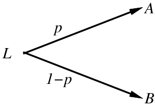
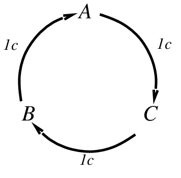
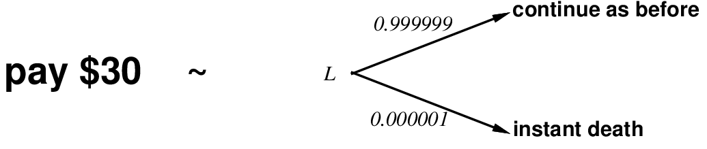
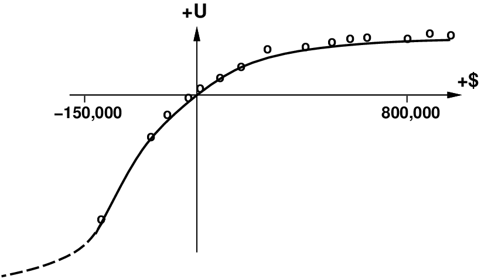
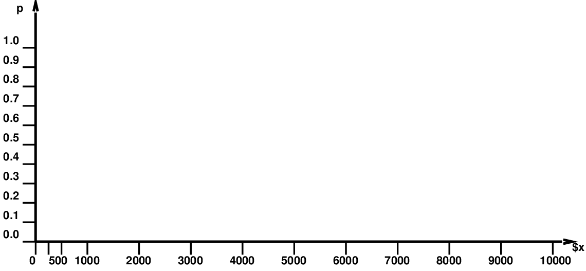
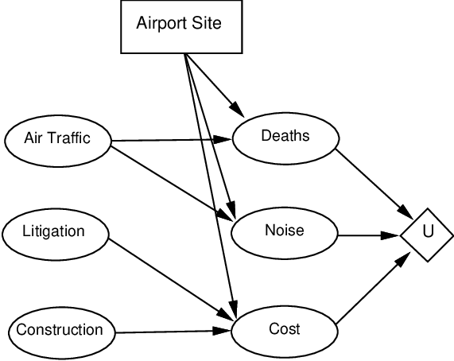
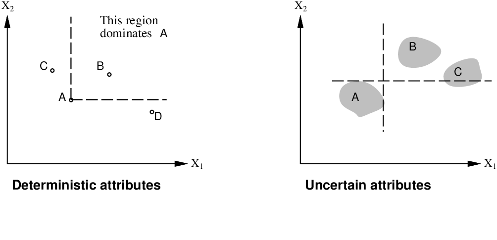
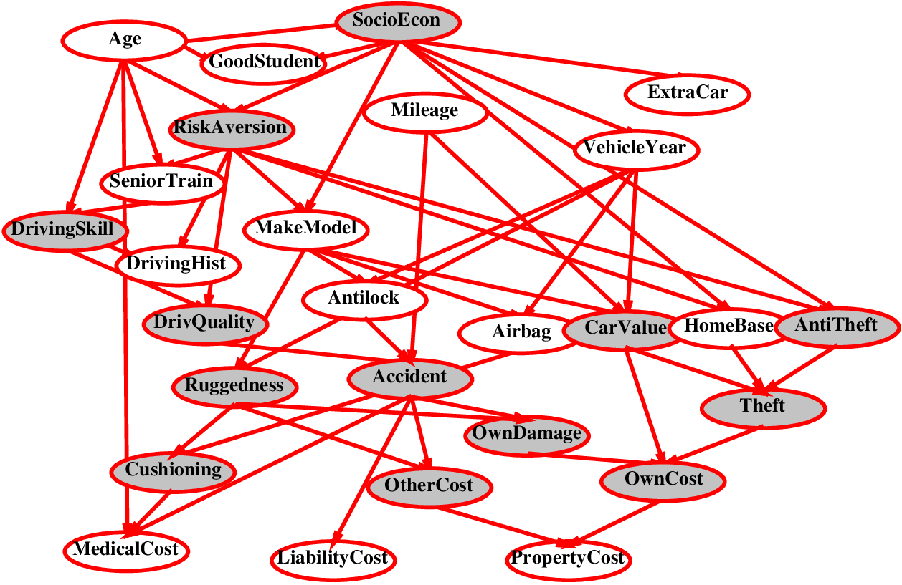
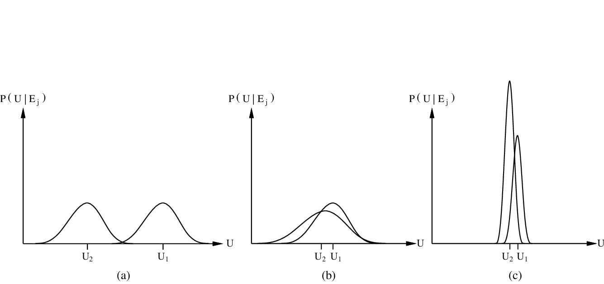

# Chapter 16 Making Complex Decisions

<!-- tabs:start -->

#### **Tiếng Việt**

  <iframe src="TaiLieu/ebooks_Chapters_Vi3/Chapter_16_Making%20Complex%20Decisions/chapter_16_vi.html" width="100%" height="100%"></iframe>

#### **Tiếng Anh**

  <iframe src="TaiLieu/ebooks_Chapters/Chapter_16_Making%20Complex%20Decisions.pdf" width="100%" height="100%"></iframe>

#### **Slide**

\usepackage{aima-slides}
\usepackage[utf8]{inputenc}
\usepackage[T5]{fontenc}
\usepackage{lmodern}

# Rational decisions

## Chapter 16

---
## Outline

- Rational preferences

- Utilities

- Money

- Multiattribute utilities

- Decision networks

- Value of information

---
## Preferences

An agent chooses among <u>prizes</u> ($A$, $B$, etc.) and 
<u>lotteries</u>, i.e., situations with uncertain prizes

Lottery $L = [p,A;\ (1-p),B]$

 

Notation:
  
$A \pref B$  &nbsp;&nbsp;&nbsp;&nbsp;  $A$ preferred to $B$
  
$A \indiff B$  &nbsp;&nbsp;&nbsp;&nbsp;  indifference between $A$ and $B$
  
$A \prefeq B$  &nbsp;&nbsp;&nbsp;&nbsp;  $B$ not preferred to $A$

---
## Rational preferences

Idea: preferences of a rational agent must obey constraints.

Rational preferences $\implies$ 
    
   behavior describable as maximization of expected utility

Constraints:
  
\underline{Orderability}
    
$(A \pref B) \lor (B \pref A) \lor (A \indiff B)$
  
\underline{Transitivity}
    
$(A \pref B) \land (B \pref C) \implies (A \pref C)$
  
\underline{Continuity}
    
$A \pref B \pref C \implies \Exi{p} [p,A;\ 1-p,C] \indiff B$
  
\underline{Substitutability}
    
$A \indiff B \implies [p,A;\ 1-p,C] \indiff [p,B; 1-p,C]$
  
\underline{Monotonicity}
    
$A \pref B \implies (p \geq q \lequiv [p,A;\ 1-p,B] \prefeq [q,A;\ 1-q,B])$

---
## Rational preferences contd.

Violating the constraints leads to self-evident irrationality

For example: an agent with intransitive preferences
can be induced to give away all its money

If $B \pref C$, then an agent who has $C$
would pay (say) 1 cent to get $B$

If $A \pref B$, then an agent who has $B$
would pay (say) 1 cent to get $A$

If $C \pref A$, then an agent who has $A$
would pay (say) 1 cent to get $C$

 

\  &nbsp;&nbsp;&nbsp;&nbsp;  &nbsp;&nbsp;&nbsp;&nbsp; 

---
## Maximizing expected utility

<u>Theorem</u> (Ramsey, 1931; von Neumann and Morgenstern, 1944):

Given preferences satisfying the constraints

there exists a real-valued function $U$ such that
    
    $U(A) \geq U(B)\ \lequiv \ A\prefeq B$
    
    $U([p_1,S_1;\ \ldots\ ;\ p_n,S_n]) = \mysum_i\ p_i U(S_i)$

<u>MEU principle</u>:
  
Choose the action that maximizes expected utility

Note: an agent can be entirely rational (consistent with MEU)

without ever representing or manipulating utilities and probabilities

E.g., a lookup table for perfect tictactoe

---
## Utilities

Utilities map states to real numbers. Which numbers?

Standard approach to assessment of human utilities:
  
  compare a given state $A$ to a <u>standard lottery</u> $L_p$ that has
    
    "best possible prize" $\ubest$ with probability $p$
    
    "worst possible catastrophe" $\uworst$ with probability $(1-p)$
  
  adjust lottery probability $p$ until $A \indiff L_p$

---
## Utility scales

<u>Normalized utilities</u>: $\ubest = 1.0$, $\uworst = 0.0$

<u>Micromorts</u>: one-millionth chance of death
  
  useful for Russian roulette, paying to reduce product risks, etc.

<u>QALYs</u>: quality-adjusted life years
  
  useful for medical decisions involving substantial risk

Note: behavior is <u>invariant</u> w.r.t. +ve linear transformation
\[
  U'(x) = k_1 U(x) + k_2  &nbsp;&nbsp; \mbox{where } k_1 > 0
\]
With deterministic prizes only (no lottery choices), only

<u>ordinal utility</u> can be determined, i.e., total order on prizes

---
## Money

Money does <u>not</u> behave as a utility function

Given a lottery $L$ with expected monetary value $EMV(L)$,

usually $U(L) < U(EMV(L))$, i.e., people are <u>risk-averse</u>

Utility curve: for what probability $p$ am I indifferent between\
a fixed prize $x$ and a lottery $[p,\$M;\ (1-p),\$0]$ for large $M$?

Typical empirical data, extrapolated with <u>risk-prone</u> behavior:

---
## Student group utility

For each $x$, adjust $p$ until half the class votes for lottery (M=10,000)

---
## Decision networks

Add <u>action nodes</u> and <u>utility</u> nodes to belief networks

to enable rational decision making

Algorithm:
  
  For each value of action node
    
    compute expected value of utility node given action, evidence
  
  Return MEU action

---
## Multiattribute utility

How can we handle utility functions of many variables $X_1\ldots X_n$?

E.g., what is $U(Deaths,Noise,Cost)$?

How can complex utility functions be assessed from 

preference behaviour?

Idea 1: identify conditions under which decisions can be made without
complete identification of $U(x_1,\ldots,x_n)$

Idea 2: identify various types of <u>independence</u> in preferences

and derive consequent canonical forms for $U(x_1,\ldots,x_n)$

---
## Strict dominance

Typically define attributes such that $U$ is <u>monotonic</u> in each

<u>Strict dominance</u>: choice $B$ strictly dominates choice $A$ iff
    
$\All{i} X_i(B) \geq X_i(A)$  &nbsp;&nbsp;  (and hence $U(B) \geq U(A)$)

Strict dominance seldom holds in practice

---
## Stochastic dominance

\twograph{graphs/dominance-density.ps}{graphs/dominance-cumulative.ps}

Distribution $p_1$ <u>stochastically dominates</u> distribution $p_2$ iff
    
  $\displaystyle\All{t} \int_{-\infty}^t p_1(x)dx \leq \int_{-\infty}^t p_2(t)dt$

If $U$ is monotonic in $x$, then $A_1$ with outcome distribution $p_1$

stochastically dominates $A_2$ with outcome distribution $p_2$:
    
  $\displaystyle\int_{-\infty}^{\infty} p_1(x) U(x)dx \geq \int_{-\infty}^{\infty} p_2(x) U(x)dx $

Multiattribute case: stochastic dominance on all attributes $\implies$ optimal

---
## Stochastic dominance contd.

Stochastic dominance can often be determined without

exact distributions using <u>qualitative</u> reasoning

E.q., construction cost increases with distance from city
    
      $S_2$ is further from the city than $S_1$
  
  $\implies$ $S_1$ stochastically dominates $S_2$ on cost

E.g., injury increases with collision speed

Can annotate belief networks with stochastic dominance information:
  
  $X \qplus Y$ ($X$ positively influences $Y$) means that
  
  For every value $\mbf{z}$ of $Y$'s other parents $\mbf{Z}$
    
    $\All{x_1,x_2} x_1 \geq x_2 \implies
      P(Y|x_1,\mbf{z})$ stochastically dominates $ P(Y|x_2,\mbf{z})$

---
## Example: car insurance

Which arcs are positive or negative influences?

---
## Preference structure: Deterministic

$X_1$ and $X_2$ <u>preferentially independent</u> of $X_3$ iff
  
  preference between $\< x_1,x_2,x_3 \>$ and $\< x_1',x_2',x_3 \>$
  
  does not depend on $x_3$

E.g., $\<Noise,Cost,Safety\>$:
  
  $\<$20,000 suffer, \$4.6 billion, 0.06 deaths/mpm$\>$ vs.
  
  $\<$70,000 suffer, \$4.2 billion, 0.06 deaths/mpm$\>$

<u>Theorem</u> (Leontief, 1947): if every pair of attributes is P.I. of its complement,
then every subset of attributes is P.I of its complement: <u>mutual P.I.</u>.

<u>Theorem</u> (Debreu, 1960): mutual P.I. $\implies$ $\exists$ <u>additive</u> value function:
\[
  V(S) = \mysum_i V_i(X_i(S))
\]
Hence assess $n$ single-attribute functions; often a good approximation

---
## Preference structure: Stochastic

Need to consider preferences over lotteries:

$\mbf{X}$ is <u>utility-independent</u> of $\mbf{Y}$ iff
  
  preferences over lotteries $\mbf{X}$ do not depend on $\mbf{y}$

Mutual U.I.: each subset is U.I of its complement

$\implies$ $\exists$ <u>multiplicative</u> utility function:
  
$U  =  k_1U_1 + k_2U_2 + k_3U_3$
    
 + $k_1k_2U_1U_2 + k_2k_3U_2U_3 + k_3k_1U_3U_1$
    
 + $k_1k_2k_3U_1U_2U_3$

Routine procedures and software packages for generating preference
tests to identify various canonical families of utility functions

---
## Value of information

Idea: compute value of acquiring each possible piece of evidence

Can be done <u>directly from decision network</u>

Example: buying oil drilling rights
  
  Two blocks $A$ and $B$, exactly one has oil, worth $k$
  
  Prior probabilities 0.5 each, mutually exclusive
  
  Current price of each block is $k/2$
  
  Consultant offers accurate survey of $A$. Fair price?

Solution: compute expected value of information
  
  = expected value of best action given the information
    
    minus expected value of best action without information

Survey may say "oil in A" or "no oil in A", prob. 0.5 each
  
  = [$0.5 \times {}$ value of "buy A" given "oil in A"
    
    + $0.5 \times {}$ value of "buy B" given "no oil in A"]
    
    -- 0
  
  = $(0.5 \times k/2) + (0.5 \times k/2) - 0 = k/2$

---
## General formula

Current evidence $E$, current best action $
  pha$

Possible action outcomes $S_i$, potential new evidence $E_j$
\[
  EU(
  pha|E) = \max_{a} \mysum_i\ U(S_i)\;P(S_i|E,a)
\]
Suppose we knew $E_j \eq e_{jk}$, then we would choose $
  pha_{e_{jk}}$ s.t.
\[
  EU(
  pha_{e_{jk}}|E,E_j \eq e_{jk}) = \max_a \mysum_i\ U(S_i)\;P(S_i|E,a,E_j \eq e_{jk})
\]
$E_j$ is a random variable whose value is {\it currently} unknown

$\implies$ must compute expected gain over all possible values:
\[
VPI_{E}(E_j) = \left(\mysum_k\ P(E_j \eq e_{jk}|E)
EU(
  pha_{e_{jk}}|E,E_j \eq e_{jk})\right) - EU(
  pha|E) 
\]
(VPI = value of perfect information)

---
## Properties of VPI

<u>Nonnegative</u>---in *expectation*, not *post hoc*
\[
\All{j,E} VPI_{E}(E_j)\geq 0\
\]
<u>Nonadditive</u>---consider, e.g., obtaining $E_j$ twice
\[
VPI_{E}(E_j,E_k) \not= VPI_{E}(E_j) + VPI_{E}(E_k)
\]
<u>Order-independent</u>
\[
VPI_{E}(E_j,E_k) = VPI_{E}(E_j) + VPI_{E,E_j}(E_k)
                   = VPI_{E}(E_k) + VPI_{E,E_k}(E_j) 
\]
Note: when more than one piece of evidence can be gathered,

maximizing VPI for each to select one is not always optimal

$\implies$ evidence-gathering becomes a <u>sequential</u> decision problem

---
## Qualitative behaviors

a) Choice is obvious, information worth little

b) Choice is nonobvious, information worth a lot

c) Choice is nonobvious, information worth little

 

#### **Trắc nghiệm**
*(Chưa có bài tập trắc nghiệm)*

#### **Pseudocode**
- [INFORMATION-GATHERING-AGENT](codeAndExercises/aima-pseudocode-master/md/Information-Gathering-Agent.md)

*(Thư mục chứa mã giả cho các thuật toán trong sách: `codeAndExercises/aima-pseudocode-master/md`)*

#### **Python**
- [Mdp](codeAndExercises/aima-python-master/notebooks/mdp.ipynb)
- [Mdp (Python File)](codeAndExercises/aima-python-master/notebooks/mdp.py)
- [Mdp Apps](codeAndExercises/aima-python-master/notebooks/mdp_apps.ipynb)
- [Mdp Apps (Python File)](codeAndExercises/aima-python-master/notebooks/mdp_apps.py)

#### **Bài tập**

##### Bài tập 16.1

(Adapted from David Heckerman.) This exercise concerns
the <b>Almanac Game</b>, which is used by
decision analysts to calibrate numeric estimation. For each of the
questions that follow, give your best guess of the answer, that is, a
number that you think is as likely to be too high as it is to be too
low. Also give your guess at a 25th percentile estimate, that is, a
number that you think has a 25% chance of being too high, and a 75%
chance of being too low. Do the same for the 75th percentile. (Thus, you
should give three estimates in all—low, median, and high—for each
question.) 

1.  Number of passengers who flew between New York and Los Angeles
    in 1989. 

2.  Population of Warsaw in 1992. 

3.  Year in which Coronado discovered the Mississippi River. 

4.  Number of votes received by Jimmy Carter in the 1976
    presidential election. 

5.  Age of the oldest living tree, as of 2002. 

6.  Height of the Hoover Dam in feet. 

7.  Number of eggs produced in Oregon in 1985. 

8.  Number of Buddhists in the world in 1992. 

9.  Number of deaths due to AIDS in the United States
    in 1981. 

10. Number of U.S. patents granted in 1901. 

The correct answers appear after the last exercise of this chapter. From
the point of view of decision analysis, the interesting thing is not how
close your median guesses came to the real answers, but rather how often
the real answer came within your 25% and 75% bounds. If it was about
half the time, then your bounds are accurate. But if you’re like most
people, you will be more sure of yourself than you should be, and fewer
than half the answers will fall within the bounds. With practice, you
can calibrate yourself to give realistic bounds, and thus be more useful
in supplying information for decision making. Try this second set of
questions and see if there is any improvement: 

1.  Year of birth of Zsa Zsa Gabor. 

2.  Maximum distance from Mars to the sun in miles. 

3.  Value in dollars of exports of wheat from the United States in 1992. 

4.  Tons handled by the port of Honolulu in 1991. 

5.  Annual salary in dollars of the governor of California in 1993. 

6.  Population of San Diego in 1990. 

7.  Year in which Roger Williams founded Providence, Rhode Island. 

8.  Height of Mt. Kilimanjaro in feet. 

9.  Length of the Brooklyn Bridge in feet. 

10. Number of deaths due to automobile accidents in the United States
    in 1992. 

---

##### Bài tập 16.2

Chris considers four used cars before buying the one with maximum
expected utility. Pat considers ten cars and does the same. All other
things being equal, which one is more likely to have the better car?
Which is more likely to be disappointed with their car’s quality? By how
much (in terms of standard deviations of expected quality)?

---

##### Bài tập 16.3

Chris considers five used cars before buying the one with maximum
expected utility. Pat considers eleven cars and does the same. All other
things being equal, which one is more likely to have the better car?
Which is more likely to be disappointed with their car’s quality? By how
much (in terms of standard deviations of expected quality)?

---

##### Bài tập 16.4

In 1713, Nicolas Bernoulli stated a puzzle,
now called the St. Petersburg paradox, which works as follows. You have
the opportunity to play a game in which a fair coin is tossed repeatedly
until it comes up heads. If the first heads appears on the $n$th toss,
you win $2^n$ dollars. 

1.  Show that the expected monetary value of this game is infinite. 

2.  How much would you, personally, pay to play the game? 

3.  Nicolas’s cousin Daniel Bernoulli resolved the apparent paradox in
    1738 by suggesting that the utility of money is measured on a
    logarithmic scale (i.e., $U(S_{n}) = a\log_2 n +b$, where $S_n$ is
    the state of having $n$). What is the expected utility of the game
    under this assumption? 

4.  What is the maximum amount that it would be rational to pay to play
    the game, assuming that one’s initial wealth is $k$? 

---

##### Bài tập 16.5

Write a computer program to automate the process in
Exercise <a href="#">assessment-exercise</a>. Try your program out on
several people of different net worth and political outlook. Comment on
the consistency of your results, both for an individual and across
individuals.

---

##### Bài tập 16.6

The Surprise Candy Company makes candy in
two flavors: 75% are strawberry flavor and 25% are anchovy flavor. Each
new piece of candy starts out with a round shape; as it moves along the
production line, a machine randomly selects a certain percentage to be
trimmed into a square; then, each piece is wrapped in a wrapper whose
color is chosen randomly to be red or brown. 70% of the strawberry
candies are round and 70% have a red wrapper, while 90% of the anchovy
candies are square and 90% have a brown wrapper. All candies are sold
individually in sealed, identical, black boxes. 

Now you, the customer, have just bought a Surprise candy at the store
but have not yet opened the box. Consider the three Bayes nets in
Figure <a class="insideExercisesFigRef"  href="#3candy-figure">3candy-figure</a>. 

1.  Which network(s) can correctly represent
    ${\textbf{P}}(Flavor,Wrapper,Shape)$? 

2.  Which network is the best representation for this problem? 

3.  Does network (i) assert that
    ${\textbf{P}}(Wrapper|Shape){{\,=\,}}{\textbf{P}}(Wrapper)$? 

4.  What is the probability that your candy has a red wrapper? 

5.  In the box is a round candy with a red wrapper. What is the
    probability that its flavor is strawberry? 

6.  A unwrapped strawberry candy is worth $s$ on the open market and an
    unwrapped anchovy candy is worth $a$. Write an expression for the
    value of an unopened candy box. 

7.  A new law prohibits trading of unwrapped candies, but it is still
    legal to trade wrapped candies (out of the box). Is an unopened
    candy box now worth more than less than, or the same as before? 

    <figure>
      
      <figcaption>
<b>Three proposed Bayes nets for the Surprise Candy
      problem</b>
</figcaption>
    </figure>

---

##### Bài tập 16.7

The Surprise Candy Company makes candy in
two flavors: 70% are strawberry flavor and 30% are anchovy flavor. Each
new piece of candy starts out with a round shape; as it moves along the
production line, a machine randomly selects a certain percentage to be
trimmed into a square; then, each piece is wrapped in a wrapper whose
color is chosen randomly to be red or brown. 80% of the strawberry
candies are round and 80% have a red wrapper, while 90% of the anchovy
candies are square and 90% have a brown wrapper. All candies are sold
individually in sealed, identical, black boxes. 

Now you, the customer, have just bought a Surprise candy at the store
but have not yet opened the box. Consider the three Bayes nets in
Figure <a class="insideExercisesFigRef"  href="#3candy-figure">3candy-figure</a>. 

1.  Which network(s) can correctly represent
    ${\textbf{P}}(Flavor,Wrapper,Shape)$? 

2.  Which network is the best representation for this problem? 

3.  Does network (i) assert that
    ${\textbf{P}}(Wrapper|Shape){{\,=\,}}{\textbf{P}}(Wrapper)$? 

4.  What is the probability that your candy has a red wrapper? 

5.  In the box is a round candy with a red wrapper. What is the
    probability that its flavor is strawberry? 

6.  A unwrapped strawberry candy is worth $s$ on the open market and an
    unwrapped anchovy candy is worth $a$. Write an expression for the
    value of an unopened candy box. 

7.  A new law prohibits trading of unwrapped candies, but it is still
    legal to trade wrapped candies (out of the box). Is an unopened
    candy box now worth more than less than, or the same as before? 

---

##### Bài tập 16.8

Prove that the judgments $B \succ A$ and $C \succ D$ in the Allais
paradox (page <a class="pageRef" title="" href="#">allais-page</a>) violate the axiom of substitutability.

---

##### Bài tập 16.9

Consider the Allais paradox described on page <a class="pageRef" title="" href="#">allais-page</a>: an agent
who prefers $B$ over $A$ (taking the sure thing), and $C$ over $D$
(taking the higher EMV) is not acting rationally, according to utility
theory. Do you think this indicates a problem for the agent, a problem
for the theory, or no problem at all? Explain.

---

##### Bài tập 16.10

Tickets to a lottery cost 1. There are two possible prizes:
a 10 payoff with probability 1/50, and a 1,000,000 payoff with
probability 1/2,000,000. What is the expected monetary value of a
lottery ticket? When (if ever) is it rational to buy a ticket? Be
precise—show an equation involving utilities. You may assume current
wealth of $k$ and that $U(S_k)=0$. You may also assume that
$U(S_{k+{10}}) = {10}\times U(S_{k+1})$, but you may not make any
assumptions about $U(S_{k+1,{000},{000}})$. Sociological studies show
that people with lower income buy a disproportionate number of lottery
tickets. Do you think this is because they are worse decision makers or
because they have a different utility function? Consider the value of
contemplating the possibility of winning the lottery versus the value of
contemplating becoming an action hero while watching an adventure movie.

---

##### Bài tập 16.11

Assess your own utility for different incremental
amounts of money by running a series of preference tests between some
definite amount $M_1$ and a lottery $[p,M_2; (1-p), 0]$. Choose
different values of $M_1$ and $M_2$, and vary $p$ until you are
indifferent between the two choices. Plot the resulting utility
function.

---

##### Bài tập 16.12

How much is a micromort worth to you? Devise a protocol to determine
this. Ask questions based both on paying to avoid risk and being paid to
accept risk.

---

##### Bài tập 16.13

Let continuous variables $X_1,\ldots,X_k$ be
independently distributed according to the same probability density
function $f(x)$. Prove that the density function for
$\max\{X_1,\ldots,X_k\}$ is given by $kf(x)(F(x))^{k-1}$, where $F$ is
the cumulative distribution for $f$.

---

##### Bài tập 16.14

Economists often make use of an exponential utility function for money:
$U(x) = -e^{-x/R}$, where $R$ is a positive constant representing an
individual’s risk tolerance. Risk tolerance reflects how likely an
individual is to accept a lottery with a particular expected monetary
value (EMV) versus some certain payoff. As $R$ (which is measured in the
same units as $x$) becomes larger, the individual becomes less
risk-averse. 

1.  Assume Mary has an exponential utility function with $R = \$500$. Mary is given the choice between receiving $\$500$ with certainty
    (probability 1) or participating in a lottery which has a 60%
    probability of winning \$5000 and a 40% probability of
    winning nothing. Assuming Marry acts rationally, which option would
    she choose? Show how you derived your answer. 

2.  Consider the choice between receiving $\$100$ with certainty (probability 1) or participating in a lottery which has a 50% probability of winning $\$500$ and a 50% probability of winning
    nothing. Approximate the value of R (to 3 significant digits) in an
    exponential utility function that would cause an individual to be
    indifferent to these two alternatives. (You might find it helpful to
    write a short program to help you solve this problem.)

---

##### Bài tập 16.15

Economists often make use of an exponential utility function for money:
$U(x) = -e^{-x/R}$, where $R$ is a positive constant representing an
individual’s risk tolerance. Risk tolerance reflects how likely an
individual is to accept a lottery with a particular expected monetary
value (EMV) versus some certain payoff. As $R$ (which is measured in the
same units as $x$) becomes larger, the individual becomes less
risk-averse. 

1.  Assume Mary has an exponential utility function with $R = \$400$. Mary is given the choice between receiving $\$400$ with certainty
    (probability 1) or participating in a lottery which has a 60%
    probability of winning \$5000 and a 40% probability of
    winning nothing. Assuming Marry acts rationally, which option would
    she choose? Show how you derived your answer. 

2.  Consider the choice between receiving $\$100$ with certainty (probability 1) or participating in a lottery which has a 50% probability of winning \$500 and a 50% probability of winning
    nothing. Approximate the value of R (to 3 significant digits) in an
    exponential utility function that would cause an individual to be
    indifferent to these two alternatives. (You might find it helpful to
    write a short program to help you solve this problem.)

---

##### Bài tập 16.16

Alex is given the choice between two games. In Game 1, a fair coin is
flipped and if it comes up heads, Alex receives $\$100$. If the coin comes up tails, Alex receives nothing. In Game 2, a fair coin is flipped twice. Each time the coin comes up heads, Alex receives $\$50$, and Alex
receives nothing for each coin flip that comes up tails. Assuming that
Alex has a monotonically increasing utility function for money in the
range \[\$0, \$100\], show mathematically that if Alex prefers Game 2 to
Game 1, then Alex is risk averse (at least with respect to this range of
monetary amounts). 

Show that if $X_1$ and $X_2$ are preferentially independent of $X_3$,
and $X_2$ and $X_3$ are preferentially independent of $X_1$, then $X_3$
and $X_1$ are preferentially independent of $X_2$.

---

##### Bài tập 16.17

Repeat Exercise <a class="exerciseRef" href="{{ site.baseurl }}/decision-theory-exercises/ex_21/">airport-id-exercise</a>, using the action-utility
representation shown in Figure <a class="insideBookFigRef" target="_blank" href="https://aimacode.github.io/aima-exercises/figures/airport-au-id-figure.png">airport-au-id-figure</a>.

---

##### Bài tập 16.18

For either of the airport-siting diagrams from Exercises
<a class="exerciseRef" href="{{ site.baseurl }}/decision-theory-exercises/ex_21/" >airport-id-exercise</a> and <a class="exerciseRef" href="{{ site.baseurl }}/decision-theory-exercises/ex_17/">airport-au-id-exercise</a>, to which
conditional probability table entry is the utility most sensitive, given
the available evidence?

---

##### Bài tập 16.19

Modify and extend the Bayesian network code in the code repository to
provide for creation and evaluation of decision networks and the
calculation of information value.

---

##### Bài tập 16.20

Consider a student who has the choice to buy or not buy a textbook for a
course. We’ll model this as a decision problem with one Boolean decision
node, $B$, indicating whether the agent chooses to buy the book, and two
Boolean chance nodes, $M$, indicating whether the student has mastered
the material in the book, and $P$, indicating whether the student passes
the course. Of course, there is also a utility node, $U$. A certain
student, Sam, has an additive utility function: 0 for not buying the
book and -\$100 for buying it; and \$2000 for passing the course and 0
for not passing. Sam’s conditional probability estimates are as follows:
$$\begin{array}{ll}
P(p|b,m) = 0.9              & P(m|b) = 0.9       \\
P(p|b, \lnot m) = 0.5       & P(m|\lnot b) = 0.7 \\
P(p|\lnot b, m) = 0.8       & \\
P(p|\lnot b, \lnot m) = 0.3 & \\
\end{array}$$ 

You might think that $P$ would be independent of $B$ given
$M$, But this course has an open-book final—so having the book helps. 

1.  Draw the decision network for this problem. 

2.  Compute the expected utility of buying the book and of not
    buying it.
 
3.  What should Sam do?

---

##### Bài tập 16.21

This exercise completes the analysis of the
airport-siting problem in Figure <a class="insideBookFigRef" target="_blank" href="https://aimacode.github.io/aima-exercises/figures/airport-id-figure.png">airport-id-figure</a> .

1.  Provide reasonable variable domains, probabilities, and utilities
    for the network, assuming that there are three possible sites. 

2.  Solve the decision problem. 

3.  What happens if changes in technology mean that each aircraft
    generates half the noise? 

4.  What if noise avoidance becomes three times more important? 

5.  Calculate the VPI for ${AirTraffic}$, ${Litigation}$, and
    ${Construction}$ in your model. 

---

##### Bài tập 16.22

(Adapted from Pearl [<a class="paperRef" title="" href="">Pearl:1988</a>].) A used-car
buyer can decide to carry out various tests with various costs (e.g.,
kick the tires, take the car to a qualified mechanic) and then,
depending on the outcome of the tests, decide which car to buy. We will
assume that the buyer is deciding whether to buy car $c_1$, that there
is time to carry out at most one test, and that $t_1$ is the test of
$c_1$ and costs \$50. 

A car can be in good shape (quality $q^+$) or bad shape (quality $q^-$),
and the tests might help indicate what shape the car is in. Car $c_1$
costs \$1,500, and its market value is $\$2,000$ if it is in good shape; if
not, $\$700$ in repairs will be needed to make it in good shape. The buyer’s estimate is that $c_1$ has a 70% chance of being in good shape. 

1.  Draw the decision network that represents this problem. 

2.  Calculate the expected net gain from buying $c_1$, given no test. 

3.  Tests can be described by the probability that the car will pass or
    fail the test given that the car is in good or bad shape. We have
    the following information: 

    $P({pass}(c_1,t_1) | q^+(c_1)) = {0.8}$ 

    $P({pass}(c_1,t_1) | q^-(c_1)) = {0.35}$ 

    Use Bayes’ theorem to calculate the probability that the car will pass (or fail) its test and hence the probability that it is in good (or bad) shape given each possible test outcome. 

4.  Calculate the optimal decisions given either a pass or a fail, and
    their expected utilities. 

5.  Calculate the value of information of the test, and derive an
    optimal conditional plan for the buyer. 

---

##### Bài tập 16.23

Recall the definition of <i>value of
information</i> in Section <a class="sectionRef" title="" class="sectionRef" href="">VPI-section</a>. 

1.  Prove that the value of information is nonnegative and
    order independent. 

2.  Explain why it is that some people would prefer not to get some
    information—for example, not wanting to know the sex of their baby
    when an ultrasound is done. 

3.  A function $f$ on sets is <b>submodular</b> if, for any element $x$ and any sets $A$
    and $B$ such that $A\subseteq B$, adding $x$ to $A$ gives a greater
    increase in $f$ than adding $x$ to $B$:
    $$A\subseteq B \Rightarrow (f(A \cup \{x\}) - f(A)) \geq (f(B\cup \{x\}) - f(B))\ .$$
    Submodularity captures the intuitive notion of <i>diminishing
    returns</i>. Is the value of information, viewed as a function
    $f$ on sets of possible observations, submodular? Prove this or find
    a counterexample.

---

<!-- tabs:end -->
