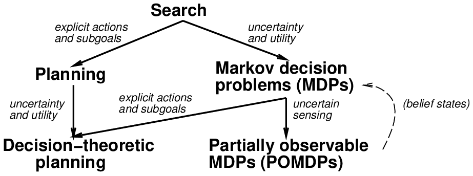
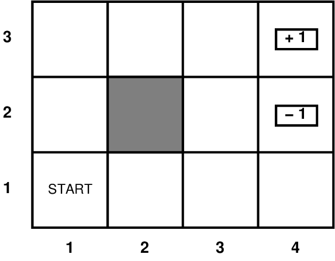
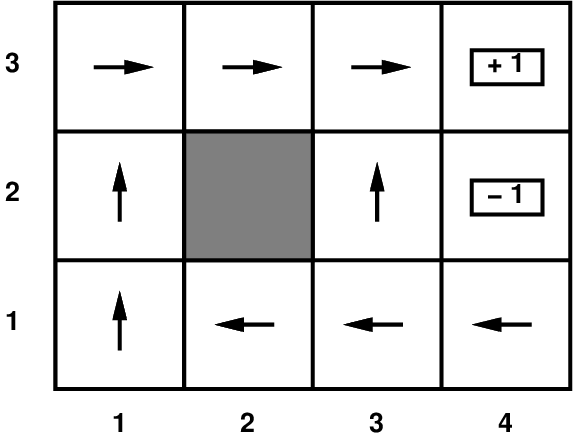

# Chapter 17 Multiagent decision making

<!-- tabs:start -->

#### **Tiếng Việt**

  <iframe src="TaiLieu/ebooks_Chapters_Vi3/Chapter_17_Multiagent%20decision%20making/chapter_17_vi.html?v=2" width="100%" height="100%"></iframe>

#### **Tiếng Anh**

  <iframe src="TaiLieu/ebooks_Chapters/Chapter_17_Multiagent%20decision%20making.pdf" width="100%" height="100%"></iframe>

#### **Slide**

\usepackage{fleqn}
\usepackage{epsf}
\usepackage{aima2e-slides}

# Complex decisions

## Chapter 17, Sections 1--3

---
## Phác thảo

- Các vấn đề về quyết định tuần tự

- Lặp lại giá trị

- Lặp lại chính sách

---
## Các vấn đề về quyết định tuần tự

---
## Ví dụ MDP

,4\textwidth
 \hspace*{1in} $s \in S$
,2\textwidth
$a \in A$

Kỳ $s \in S$, hành động $a \in A$

<u>Mô hình</u> $T(s,a,s') \equiv P(s'|s,a)$ = xác suất $a$ trong $s$ dẫn đến $s'$

<u>Chức năng thưởng</u> $R(s)$ (hoặc $R(s,a)$, $R(s,a,s')$)
    
   = $\left\{\begin{array}{ll} -0.04 & \mbox{ (small penalty) for nonterminal states}

                               \pm 1 & \mbox{ for terminal states}\end{array}\right.$

---
## Giải quyết MDP

Trong các bài toán tìm kiếm, mục đích là tìm một chuỗi {\em} tối ưu

Trong MDP, mục tiêu là tìm ra một *Policy* tối ưu $\pi(s)$
    
   tức là hành động tốt nhất cho mọi trạng thái có thể $s$ 
    
   (vì không thể đoán trước được mình sẽ đi về đâu)

Chính sách tối ưu tối đa hóa (giả sử) *tổng phần thưởng dự kiến*

Chính sách tối ưu khi hình phạt của tiểu bang $R(s)$ là --0,04:

,45\textwidth

---
## Rủi ro và phần thưởng

,75\textwidth

---
## Tiện ích của chuỗi trạng thái

Cần hiểu các ưu tiên giữa *chuỗi* trạng thái

Thường xem xét <u>tùy chọn cố định</u> trên chuỗi phần thưởng:
\[
  [r,r_0,r_1,r_2,\ldots]\pref [r,r'_0,r'_1,r'_2,\ldots]
  \lequiv
  [r_0,r_1,r_2,\ldots]\pref [r'_0,r'_1,r'_2,\ldots]
\]  
<u>Định lý</u>: chỉ có hai cách để kết hợp phần thưởng theo thời gian.
  
  1) Hàm tiện ích *Additive*:
    
   $U([s_0,s_1,s_2,\ldots]) = R(s_0) + R(s_1) + R(s_2) + \cdots $
  
  2) Hàm tiện ích *Giảm giá*:
    
   $U([s_0,s_1,s_2,\ldots]) = R(s_0) + \gamma R(s_1) + \gamma^2 R(s_2) + \cdots $
    
   trong đó $\gamma$ là <u>hệ số chiết khấu</u>

---
## Tiện ích của các trạng thái

Tiện ích của một *state* (hay còn gọi là *value*) được xác định là 
    
$U(s) = {}$ <u>tổng số phần thưởng dự kiến (được chiết khấu) (cho đến khi chấm dứt)</u>
    
\phantom{$U(s) = {}$} <u>giả sử hành động tối ưu</u>

Với những tiện ích của các bang, việc lựa chọn hành động tốt nhất chỉ là MEU:
  
  tối đa hóa lợi ích mong đợi của những người kế nhiệm trực tiếp 

\twofig{figures/sequential-decision-values.ps}{figures/sequential-decision-policy.ps}

---
## Tiện ích tiếp theo.

Vấn đề: các tiện ích cộng thêm có thời gian sống vô hạn $\implies$ là vô hạn

1) <u>Chân trời hữu hạn</u>: kết thúc tại một *thời gian cố định* $T$
  
  Chính sách $\implies$ <u>không cố định</u>: $\pi(s)$ phụ thuộc vào thời gian còn lại

2) <u>(Các) trạng thái hấp thụ</u>: w/ prob. 1, tác nhân cuối cùng " chết " đối với bất kỳ $\pi$
  
  $\implies$ Tiện ích dự kiến của mọi trạng thái là hữu hạn

3) Chiết khấu: giả sử $\gamma<1$, $R(s) \leq R_{{\rm max}}$,
\[ U([s_0,\ldots s_{\infty}]) = \mysum_{t=0}^{\infty} \gamma^t R(s_t) \leq R_{{\rm max}}/(1-\gamma)\]
Đường chân trời ngắn hơn $\gamma \Rightarrow {}$ nhỏ hơn

4) Tối đa hóa <u>lợi ích hệ thống</u> = phần thưởng trung bình mỗi bước thời gian

Định lý: chính sách tối ưu có mức tăng không đổi sau thoáng qua ban đầu

Ví dụ: kế hoạch hàng ngày của tài xế taxi đưa đón hành khách

---
## Lập trình động: phương trình Bellman

Định nghĩa về tính hữu dụng của các trạng thái dẫn đến một mối quan hệ đơn giản giữa
Tiện ích của các nước lân cận:

<u>tổng số phần thưởng dự kiến</u>
  
= <u>phần thưởng hiện tại</u>
    
+ $\gamma \stimes{}$<u>tổng số phần thưởng dự kiến sau khi thực hiện hành động tốt nhất</u>

Phương trình Bellman (1957):
\[ U(s) = R(s) + \gamma\,\max_a \mysum_{s'} U(s') T(s,a,s')\]

$U(1,1) = -0.04$

\tab + $\gamma\,\max\{ 0.8 U(1,2) + 0.1 U(2,1) + 0.1 U(1,1),$*up

\tab \phantom{+ \mbox{$\max\{$*}$0.9 U(1,1) + 0.1 U(1,2) $*left

\tab \phantom{+ \mbox{$\max\{$*}$0.9 U(1,1) + 0.1 U(2,1) $*down

\tab \phantom{+ \mbox{$\max\{$*$0.8 U(2,1) + 0.1 U(1,2) + 0.1 U(1,1) \}$*đúng*

Một phương trình trên mỗi trạng thái = $n$ <u>phi tuyến </u> phương trình trong $n$ ẩn số

---
## Thuật toán lặp giá trị

<u>Idea</u>: Bắt đầu với các giá trị tiện ích tùy ý
    
          Cập nhật để làm cho chúng <u>nhất quán cục bộ</u> với Bellman eqn.
    
          Tối ưu toàn cầu nhất quán cục bộ $\Rightarrow$ ở mọi nơi

Lặp lại đồng thời cho mọi $s$ cho đến khi "không thay đổi"
\[ U(s) \leftarrow R(s) + \gamma\,\max_a \mysum_{s'} U(s') T(s,a,s')  &nbsp;&nbsp;&nbsp;&nbsp;  \mbox{for all } s\]

,6\textwidth

---
## Hội tụ

Xác định <u>max-norm</u> $||U|| = \max_s |U(s)|$,

vì vậy $||U-V||$ = chênh lệch tối đa giữa $U$ và $V$

Đặt $U^t$ và $U^{t+1}$ là các giá trị gần đúng liên tiếp của hữu dụng thực $U$

<u>Định lý</u>: Đối với hai phép tính gần đúng bất kỳ $U^t$ và $V^t$
\[ ||U^{t+1}-V^{t+1}|| \leq \gamma\, ||U^{t}-V^{t}|| \]
Tức là, mọi phép tính gần đúng khác biệt đều phải tiến gần nhau hơn

vì vậy, đặc biệt, bất kỳ phép tính gần đúng nào cũng phải tiến gần hơn đến giá trị thực $U$

và sự lặp lại giá trị hội tụ thành một giải pháp duy nhất, ổn định, tối ưu

<u>Định lý</u>: nếu $||U^{t+1} - U^t||<\epsilon$ thì $||U^{t+1} - U||<2\epsilon\gamma/(1-\gamma)$

Tức là, khi thay đổi trong $U^t$ trở nên nhỏ, chúng ta gần như đã hoàn tất.

Chính sách MEU sử dụng $U^t$ có thể tối ưu từ lâu trước khi hội tụ các giá trị

---
## Lặp lại chính sách

Howard, 1960: tìm kiếm đồng thời các giá trị chính sách và tiện ích tối ưu

Thuật toán:
  
  $\pi \leftarrow {}$ chính sách ban đầu tùy ý
  
  lặp lại cho đến khi không có thay đổi nào trong $\pi$
    
    các tiện ích tính toán được cung cấp $\pi$ 
    
    cập nhật $\pi$ như thể các tiện ích đã chính xác (tức là MEU cục bộ)

Để tính toán các tiện ích được xác định giá trị $\pi$ (\u{} cố định):
\[ U(s) = R(s) + \gamma\,\mysum_{s'} U(s') T(s,\pi(s),s') &nbsp;&nbsp;&nbsp;&nbsp;  \mbox{for all } s \]
tức là, $n$ phương trình <u>tuyến tính</u> đồng thời trong $n$ ẩn số,
giải quyết trong $O(n^3)$

---
##  Lặp lại chính sách đã sửa đổi 

Việc lặp lại chính sách thường hội tụ trong một vài lần lặp, nhưng mỗi lần đều tốn kém

Ý tưởng: sử dụng một vài bước lặp giá trị (nhưng đã sửa $\pi$) 

bắt đầu từ hàm giá trị được tạo lần trước 

để tạo ra bước xác định giá trị gần đúng.

Thường hội tụ nhanh hơn nhiều so với VI hoặc PI thuần túy

Dẫn đến các thuật toán tổng quát hơn trong đó cập nhật giá trị Bellman
và cập nhật chính sách của Howard có thể được thực hiện cục bộ theo bất kỳ thứ tự nào

Thuật toán <u>Học tăng cường</u> hoạt động bằng cách thực hiện như vậy
cập nhật dựa trên các chuyển đổi được quan sát được thực hiện theo cách chưa biết ban đầu
môi trường

---
## Khả năng quan sát một phần

POMDP có mô hình quan sát \u{} $O(s,e)$ xác định xác suất mà
đại lý thu được bằng chứng $e$ khi ở trạng thái $s$

Tác nhân không biết nó đang ở trạng thái nào 
    
$\implies$ nói về chính sách thật vô nghĩa $\pi(s)$!!

<u>Định lý</u> (Astrom, 1965): chính sách tối ưu trong POMDP là một hàm
    
  $\pi(b)$ trong đó $b$ là <u>trạng thái niềm tin</u> (phân bố xác suất trên các trạng thái)

Có thể chuyển đổi POMDP thành MDP trong không gian trạng thái niềm tin, trong đó
    
  $T(b,a,b')$ là xác suất trạng thái niềm tin mới là $b'$
    
  cho rằng trạng thái niềm tin hiện tại là $b$ và tác nhân thực hiện $a$.
    
  Tức là về cơ bản là bước cập nhật lọc

---
## Tiếp theo khả năng quan sát một phần 

Giải pháp tự động bao gồm hành vi thu thập thông tin

Nếu có trạng thái $n$ thì $b$ là một vectơ có giá trị thực theo chiều $n$
    
$\implies$ việc giải quyết POMDP rất (thực sự là PSPACE-) rất khó!

Thế giới thực là một POMDP (ban đầu không xác định được $T$ và $O$)

---
## Biến đổi bất biến

Hành vi không tuần tự bất biến dưới biến đổi tuyến tính:
\[
  U'(s) = k_1 U(s) + k_2  &nbsp;&nbsp; \mbox{where } k_1 > 0
\]
Hành vi tuần tự với tiện ích phụ gia là bất biến

bổ sung bất kỳ phần thưởng <u>dựa trên tiềm năng</u> nào:
\[
  R'(s,a,s') = R(s,a,s') + F(s,a,s')
\]
trong đó phần thưởng được thêm vào phải thỏa mãn
\[
\gamma \Phi(s') - \Phi(s)
\]
đối với một số <u>hàm tiềm năng </u> $\Phi$ ở các trạng thái

---
## Q-lặp 

Xác định $Q(s,a)$ = giá trị mong đợi của việc thực hiện hành động $a$ ở trạng thái $s$
  
  = $R(s) + \gamma\,\mysum_{s'} U(s') T(s,a,s')$
  
  tức là $U(s) = \max_a Q(s,a)$

Thuật toán Q-iteration: giống như phép lặp giá trị, nhưng thực hiện
\[
Q(s,a) \leftarrow R(s) + \gamma\,\mysum_{s'} T(s,a,s') \max_{a'} Q(s',a')  &nbsp;&nbsp;&nbsp;&nbsp;  \mbox{for all } s,a
\]

---
## Vấn đề

Độ phức tạp: đa thời gian về số lượng trạng thái (bằng lập trình tuyến tính)
  
  nhưng số lượng trạng thái là số mũ theo số lượng biến trạng thái
  
  $\rightarrow$ Boutilier *et al*>: sử dụng cấu trúc trạng thái
  
  $\rightarrow$ học tăng cường: mẫu $S$, xấp xỉ $U$
  
  $\rightarrow$ phương pháp phân cấp trong xây dựng chính sách

Khả năng quan sát một phần: không thể đảm nhận việc quan sát hoàn hảo trạng thái
  
  $\implies$ duy trì <u>trạng thái niềm tin</u> (trạng thái sau)
    
  và giảm POMDP xuống MDP trong không gian trạng thái niềm tin (eek)
  
  $\rightarrow$ Cassandra *et al*: Lặp lại giá trị POMDP
  
  $\rightarrow$ Hansen: Chính sách POMDP dưới dạng DFA

\usepackage{aima-slides}
\usepackage[utf8]{inputenc}
\usepackage[T5]{fontenc}
\usepackage{lmodern}

# Complex decisions

## Chapter 17, Sections 1--3

---
## Phác thảo

- Vấn đề về quyết định

- Lặp lại giá trị

- Lặp lại chính sách

---
## Các vấn đề về quyết định tuần tự

---
## Ví dụ MDP

,4\textwidth
 \hspace*{1in} $M_{ij}^a \equiv P(j|i,a)$
,2\textwidth
$a$

Mô hình $M_{ij}^a \equiv P(j|i,a)$ = xác suất thực hiện $a$ trong $i$ dẫn đến $j$

Mỗi tiểu bang có một *bonus* $R(i)$
    
   = -0,04 (hình phạt nhỏ) đối với các trạng thái không kết thúc
    
   = $\pm 1$ cho trạng thái đầu cuối

---
## Giải quyết MDP

Trong các bài toán tìm kiếm, mục đích là tìm một chuỗi {\em} tối ưu

Trong MDP, mục đích là tìm ra một *chính sách
     tối ưu
   tức là hành động tốt nhất cho mọi trạng thái có thể
    
   (vì không thể đoán trước được mình sẽ đi về đâu)

Các giá trị trạng thái và chính sách tối ưu cho $R(i)$ đã cho:

{figures/sequential-decision-values.ps}

---
## Tiện ích

Trong các bài toán quyết định *tuần tự*, các ưu tiên được thể hiện

giữa *chuỗi* trạng thái

Thường sử dụng hàm tiện ích *addd*:
    
$U([s_1,s_2,s_3,\ldots,s_n]) = R(s_1) + R(s_2) + R(s_3) + \cdots + R(s_n)$

(xem chi phí đường dẫn trong các vấn đề tìm kiếm)

Tiện ích của một *state* (còn gọi là *value*) của nó) được xác định là 
    
$U(s_i) = {}$ <u>tổng số phần thưởng dự kiến cho đến khi chấm dứt</u>
    
\phantom{$U(s_i) = {}$} <u>giả sử hành động tối ưu</u>

Với những lợi ích của các bang, việc lựa chọn
hành động tốt nhất chỉ là MEU: chọn hành động sao cho
ích lợi mong đợi của những người kế nhiệm trực tiếp là cao nhất.

---
## Phương trình Bellman

Định nghĩa về tính hữu dụng của các trạng thái dẫn đến một mối quan hệ đơn giản giữa
Tiện ích của các nước lân cận:

<u>tổng số phần thưởng dự kiến</u>
  
= <u>phần thưởng hiện tại</u>
    
+ <u>tổng số phần thưởng dự kiến sau khi thực hiện hành động tốt nhất</u>

Phương trình Bellman (1957):
\[ U(i) = R(i) + \max_a \mysum_j U(j) M_{ij}^a\]

$U(1,1) = -0.04$

\tab + $\max\{ 0.8 U(1,2) + 0.1 U(2,1) + 0.1 U(1,1),$*up

\tab \phantom{+ \mbox{$\max\{$*}$0.9 U(1,1) + 0.1 U(1,2) $*left

\tab \phantom{+ \mbox{$\max\{$*}$0.9 U(1,1) + 0.1 U(2,1) $*down

\tab \phantom{+ \mbox{$\max\{$*$0.8 U(2,1) + 0.1 U(1,2) + 0.1 U(1,1) \}$*đúng*

Một phương trình trên mỗi trạng thái = $n$ <u>phi tuyến </u> phương trình trong $n$ ẩn số

---
## Thuật toán lặp giá trị

<u>Idea</u>: Bắt đầu với các giá trị tiện ích tùy ý
    
          Cập nhật để làm cho chúng <u>nhất quán cục bộ</u> với Bellman eqn.
    
          Tối ưu toàn cầu nhất quán cục bộ $\Rightarrow$ ở mọi nơi

lặp lại cho đến khi "không thay đổi"
\[ U(i) \leftarrow R(i) + \max_a \mysum_j U(j) M_{ij}^a  &nbsp;&nbsp;&nbsp;&nbsp;  \mbox{for all } i\]

,6\textwidth

---
##  Lặp lại chính sách (Howard, 1960)

Ý tưởng: tìm kiếm đồng thời các giá trị chính sách và tiện ích tối ưu

Thuật toán:
  
  $\pi \leftarrow {}$ chính sách ban đầu tùy ý
  
  lặp lại cho đến khi không có thay đổi nào trong $\pi$
    
    các tiện ích tính toán được cung cấp $\pi$ 
    
    cập nhật $\pi$ như thể các tiện ích đã chính xác (tức là MEU cục bộ)

Để tính toán các tiện ích đã cho $\pi$ cố định:
\[ U(i) = R(i) + \mysum_j U(j) M_{ij}^{\pi(i)} &nbsp;&nbsp;&nbsp;&nbsp;  \mbox{for all } i \]
tức là, $n$ phương trình <u>tuyến tính</u> đồng thời trong $n$ ẩn số,
giải quyết trong $O(n^3)$

---
## Nếu tôi sống mãi mãi thì sao? (lạc đề)

Sử dụng định nghĩa cộng của tiện ích, $U(i)$ là vô hạn!

Hơn nữa, việc lặp lại giá trị không kết thúc 

Chúng ta nên so sánh hai kiếp sống vô tận như thế nào?

1) Chiết khấu: phần thưởng trong tương lai được chiết khấu theo tỷ lệ $\gamma \leq 1$
\[ U([s_0,\ldots s_{\infty}]) = \mysum_{t=0}^{\infty} \gamma^t R(s_t)\]
Tiện ích tối đa được giới hạn ở trên bởi $R_{{\rm max}}/(1-\gamma)$ 

Đường chân trời ngắn hơn $\gamma \Rightarrow {}$ nhỏ hơn

2) Tối đa hóa <u>lợi ích hệ thống</u> = phần thưởng trung bình mỗi bước thời gian

Định lý: chính sách tối ưu có mức tăng không đổi sau thoáng qua ban đầu

Ví dụ: kế hoạch hàng ngày của tài xế taxi đưa đón hành khách

#### **Trắc nghiệm**
*(Chưa có bài tập trắc nghiệm)*

#### **Pseudocode**
- [VALUE-ITERATION](codeAndExercises/aima-pseudocode-master/md/Value-Iteration.md)
- [POLICY-ITERATION](codeAndExercises/aima-pseudocode-master/md/Policy-Iteration.md)
- [POMDP-VALUE-ITERATION](codeAndExercises/aima-pseudocode-master/md/POMDP-Value-Iteration.md)

*(Thư mục chứa mã giả cho các thuật toán trong sách: `codeAndExercises/aima-pseudocode-master/md`)*

#### **Python**
- [Game Theory](codeAndExercises/aima-python-master/notebooks/game_theory.ipynb)
- [Game Theory (Python File)](codeAndExercises/aima-python-master/notebooks/game_theory.py)

#### **Bài tập**

##### Bài tập 17.1

For the $4\times 3$ world shown in
Figure <a class="insideBookFigRef" target="_blank" href="https://aimacode.github.io/aima-exercises/figures/sequential-decision-world-figure.png">sequential-decision-world-figure</a>., calculate
which squares can be reached from (1,1) by the action sequence
$[{Up},{Up},{Right},{Right},{Right}]$ and with what
probabilities. Explain how this computation is related to the prediction
task (see Section <a href="#">general-filtering-section</a> for a
hidden Markov model.

---

##### Bài tập 17.2

For the $4\times 3$ world shown in
Figure <a class="insideBookFigRef" target="_blank" href="https://aimacode.github.io/aima-exercises/figures/sequential-decision-world-figure.png">sequential-decision-world-figure</a>, calculate
which squares can be reached from (1,1) by the action sequence
$[{Right},{Right},{Right},{Up},{Up}]$ and with what
probabilities. Explain how this computation is related to the prediction
task (see Section <a class="sectionRef" title="" href="#">general-filtering-section</a>) for a
hidden Markov model.

---

##### Bài tập 17.3

Select a specific member of the set of policies that are optimal for
$R(s)>0$ as shown in
Figure <a class="insideBookFigRef" target="_blank" href="https://aimacode.github.io/aima-exercises/figures/sequential-decision-policies-figure.png">sequential-decision-policies-figure</a>(b), and
calculate the fraction of time the agent spends in each state, in the
limit, if the policy is executed forever. (<i>Hint</i>:
Construct the state-to-state transition probability matrix corresponding
to the policy and see
Exercise <a class="exerciseRef" href="{{ site.baseurl }}/dbn-exercises/ex_2/">markov-convergence-exercise</a>.)

---

##### Bài tập 17.4

Suppose that we define the utility of a state
sequence to be the <i>maximum</i> reward obtained in any state
in the sequence. Show that this utility function does not result in
stationary preferences between state sequences. Is it still possible to
define a utility function on states such that MEU decision making gives
optimal behavior?

---

##### Bài tập 17.5

Can any finite search problem be translated exactly into a Markov
decision problem such that an optimal solution of the latter is also an
optimal solution of the former? If so, explain <i>precisely</i>
how to translate the problem and how to translate the solution back; if
not, explain <i>precisely</i> why not (i.e., give a
counterexample).

---

##### Bài tập 17.6

Sometimes MDPs are formulated with a
reward function $R(s,a)$ that depends on the action taken or with a
reward function $R(s,a,s')$ that also depends on the outcome state. 

1.  Write the Bellman equations for these formulations. 

2.  Show how an MDP with reward function $R(s,a,s')$ can be transformed
    into a different MDP with reward function $R(s,a)$, such that
    optimal policies in the new MDP correspond exactly to optimal
    policies in the original MDP. 

3.  Now do the same to convert MDPs with $R(s,a)$ into MDPs with $R(s)$. 

---

##### Bài tập 17.7

For the environment shown in
Figure <a class="insideBookFigRef" target="_blank" href="https://aimacode.github.io/aima-exercises/figures/sequential-decision-world-figure.png">sequential-decision-world-figure</a>, find all the
threshold values for $R(s)$ such that the optimal policy changes when
the threshold is crossed. You will need a way to calculate the optimal
policy and its value for fixed $R(s)$. (<i>Hint</i>: Prove that
the value of any fixed policy varies linearly with $R(s)$.)

---

##### Bài tập 17.8

Equation (<a class="equationRef" title="" href="#">vi-contraction-equation</a>) on
page <a class="pageRef" title="" href="#">vi-contraction-equation</a> states that the Bellman operator is a contraction. 

1.  Show that, for any functions $f$ and $g$,
    $$|\max_a f(a) - \max_a g(a)| \leq \max_a |f(a) - g(a)|\ .$$ 

2.  Write out an expression for $$|(B\,U_i - B\,U'_i)(s)|$$ and then apply
    the result from (1) to complete the proof that the Bellman operator
    is a contraction. 

---

##### Bài tập 17.9

This exercise considers two-player MDPs that correspond to zero-sum,
turn-taking games like those in
Chapter <a class="chapterRef" href="{{site.baseurl}}/game-playing-exercises/">game-playing-chapter</a>. Let the players be $A$
and $B$, and let $R(s)$ be the reward for player $A$ in state $s$. (The
reward for $B$ is always equal and opposite.) 

1.  Let $U_A(s)$ be the utility of state $s$ when it is $A$’s turn to
    move in $s$, and let $U_B(s)$ be the utility of state $s$ when it is
    $B$’s turn to move in $s$. All rewards and utilities are calculated
    from $A$’s point of view (just as in a minimax game tree). Write
    down Bellman equations defining $U_A(s)$ and $U_B(s)$. 

2.  Explain how to do two-player value iteration with these equations,
    and define a suitable termination criterion. 

3.  Consider the game described in
    Figure <a class="insideBookFigRef" target="_blank" href="https://aimacode.github.io/aima-exercises/figures/line-game4-figure.png">line-game4-figure</a> on page <a class="pageRef" id="pageref" title="" href="#">line-game4-figure</a>.
    Draw the state space (rather than the game tree), showing the moves
    by $A$ as solid lines and moves by $B$ as dashed lines. Mark each
    state with $R(s)$. You will find it helpful to arrange the states
    $(s_A,s_B)$ on a two-dimensional grid, using $s_A$ and $s_B$ as
    “coordinates.” 

4.  Now apply two-player value iteration to solve this game, and derive
    the optimal policy. 

    <figure>
      
      <figcaption>
<b>(a) $3 \times 3$ world for Exercise <a href="#">3x3-mdp-exercise</a>. The reward for each state is indicated. The upper right square is a terminal state. (b) $101 \times 3$ world for Exercise <a href="#">101x3-mdp-exercise</a> (omitting 93 identical columns in the middle).
      The start state has reward 0.</b>
</figcaption>
    </figure>

---

##### Bài tập 17.10

Consider the $3 \times 3$ world shown in
Figure <a class="insideExercisesFigRef"  href="#grid-mdp-figure">grid-mdp-figure</a>(a). The transition model is the
same as in the $4\times 3$
Figure <a class="insideBookFigRef" id="insidebookfigref" target="_blank" href="https://aimacode.github.io/aima-exercises/figures/sequential-decision-world-figure.png">sequential-decision-world-figure</a>: 80% of the
time the agent goes in the direction it selects; the rest of the time it
moves at right angles to the intended direction. 

Implement value iteration for this world for each value of $r$ below.
Use discounted rewards with a discount factor of 0.99. Show the policy
obtained in each case. Explain intuitively why the value of $r$ leads to
each policy. 

1.  $r = -100$ 

2.  $r = -3$ 

3.  $r = 0$ 

4.  $r = +3$ 

---

##### Bài tập 17.11

Consider the $101 \times 3$ world shown in
Figure <a class="insideExercisesFigRef"  href="#grid-mdp-figure">grid-mdp-figure</a>(b). In the start state the agent
has a choice of two deterministic actions, <i>Up</i> or
<i>Down</i>, but in the other states the agent has one
deterministic action, <i>Right</i>. Assuming a discounted reward
function, for what values of the discount $\gamma$ should the agent
choose <i>Up</i> and for which <i>Down</i>? Compute the
utility of each action as a function of $\gamma$. (Note that this simple
example actually reflects many real-world situations in which one must
weigh the value of an immediate action versus the potential continual
long-term consequences, such as choosing to dump pollutants into a
lake.)

---

##### Bài tập 17.12

Consider an undiscounted MDP having three states, (1, 2, 3), with
rewards $-1$, $-2$, $0$, respectively. State 3 is a terminal state. In
states 1 and 2 there are two possible actions: $a$ and $b$. The
transition model is as follows: 

-   In state 1, action $a$ moves the agent to state 2 with probability
    0.8 and makes the agent stay put with probability 0.2. 

-   In state 2, action $a$ moves the agent to state 1 with probability
    0.8 and makes the agent stay put with probability 0.2. 

-   In either state 1 or state 2, action $b$ moves the agent to state 3
    with probability 0.1 and makes the agent stay put with
    probability 0.9. 

Answer the following questions: 

1.  What can be determined <i>qualitatively</i> about the
    optimal policy in states 1 and 2? 

2.  Apply policy iteration, showing each step in full, to determine the
    optimal policy and the values of states 1 and 2. Assume that the
    initial policy has action $b$ in both states. 

3.  What happens to policy iteration if the initial policy has action
    $a$ in both states? Does discounting help? Does the optimal policy
    depend on the discount factor? 

---

##### Bài tập 17.13

Consider the $4\times 3$ world shown in
Figure <a class="insideBookFigRef" target="_blank" href="https://aimacode.github.io/aima-exercises/figures/sequential-decision-world-figure.png">sequential-decision-world-figure</a> .

1.  Implement an environment simulator for this environment, such that
    the specific geography of the environment is easily altered. Some
    code for doing this is already in the online code repository. 

2.  Create an agent that uses policy iteration, and measure its
    performance in the environment simulator from various
    starting states. Perform several experiments from each starting
    state, and compare the average total reward received per run with
    the utility of the state, as determined by your algorithm. 

3.  Experiment with increasing the size of the environment. How does the
    run time for policy iteration vary with the size of the environment? 

---

##### Bài tập 17.14

How can the value determination algorithm be
used to calculate the expected loss experienced by an agent using a
given set of utility estimates ${U}$ and an estimated
model ${P}$, compared with an agent using correct values?

---

##### Bài tập 17.15

Let the initial belief state $b_0$ for the
$4\times 3$ POMDP on page <a class="pageRef" title="" href="#">4x3-pomdp-page</a> be the uniform distribution
over the nonterminal states, i.e.,
$< \frac{1}{9},\frac{1}{9},\frac{1}{9},\frac{1}{9},\frac{1}{9},\frac{1}{9},\frac{1}{9},\frac{1}{9},\frac{1}{9},0,0 >$.
Calculate the exact belief state $b_1$ after the agent moves and its
sensor reports 1 adjacent wall. Also calculate $b_2$ assuming that the
same thing happens again.

---

##### Bài tập 17.16

What is the time complexity of $d$ steps of POMDP value iteration for a
sensorless environment?

---

##### Bài tập 17.17

Consider a version of the two-state POMDP on
page <a class="pageRef" title="" href="#">2state-pomdp-page</a> in which the sensor is 90% reliable in state 0 but
provides no information in state 1 (that is, it reports 0 or 1 with
equal probability). Analyze, either qualitatively or quantitatively, the
utility function and the optimal policy for this problem.

---

##### Bài tập 17.18

Show that a dominant strategy
equilibrium is a Nash equilibrium, but not vice versa.

---

##### Bài tập 17.19

In the children’s game of rock–paper–scissors each player reveals at the
same time a choice of rock, paper, or scissors. Paper wraps rock, rock
blunts scissors, and scissors cut paper. In the extended version
rock–paper–scissors–fire–water, fire beats rock, paper, and scissors;
rock, paper, and scissors beat water; and water beats fire. Write out
the payoff matrix and find a mixed-strategy solution to this game.

---

##### Bài tập 17.20

Solve the game of <i>three</i>-finger Morra.

---

##### Bài tập 17.21

In the <i>Prisoner’s Dilemma</i>, consider the case where after
each round, Alice and Bob have probability $X$ meeting again. Suppose
both players choose the perpetual punishment strategy (where each will
choose ${refuse}$ unless the other player has ever played
${testify}$). Assume neither player has played ${testify}$ thus far.
What is the expected future total payoff for choosing to ${testify}$
versus ${refuse}$ when $X = .2$? How about when $X = .05$? For what
value of $X$ is the expected future total payoff the same whether one
chooses to ${testify}$ or ${refuse}$ in the current round?

---

##### Bài tập 17.22

The following payoff matrix, from @Blinder:1983 by way of <a class="paperRef" title="" href="">Bernstein:1996</a>, shows a game between
politicians and the Federal Reserve. 

$$
\begin{array} 
	{|r|r|}\hline  & Fed: contract & Fed: do nothing & Fed: expand \\ 
	\hline
		Pol: contract & F=7, P=1 & F=9, P=4 & F=6, P=6 \\ 
		Pol: do nothing & F=8, P=2 & F=5, P=5 & F=4, P=9 \\ 
		Pol: expand & F=3, P=3 & F=2, P=7 & F=1, P=8\\ 
	\hline  
\end{array}
$$

 
Politicians can expand or contract fiscal policy, while the Fed can
expand or contract monetary policy. (And of course either side can
choose to do nothing.) Each side also has preferences for who should do
what—neither side wants to look like the bad guys. The payoffs shown are
simply the rank orderings: 9 for first choice through 1 for last choice.
Find the Nash equilibrium of the game in pure strategies. Is this a
Pareto-optimal solution? You might wish to analyze the policies of
recent administrations in this light.

---

##### Bài tập 17.23

A Dutch auction is similar in an English auction, but rather than
starting the bidding at a low price and increasing, in a Dutch auction
the seller starts at a high price and gradually lowers the price until
some buyer is willing to accept that price. (If multiple bidders accept
the price, one is arbitrarily chosen as the winner.) More formally, the
seller begins with a price $p$ and gradually lowers $p$ by increments of
$d$ until at least one buyer accepts the price. Assuming all bidders act
rationally, is it true that for arbitrarily small $d$, a Dutch auction
will always result in the bidder with the highest value for the item
obtaining the item? If so, show mathematically why. If not, explain how
it may be possible for the bidder with highest value for the item not to
obtain it.

---

##### Bài tập 17.24

Imagine an auction mechanism that is just like an ascending-bid auction,
except that at the end, the winning bidder, the one who bid $b_{max}$,
pays only $b_{max}/2$ rather than $b_{max}$. Assuming all agents are
rational, what is the expected revenue to the auctioneer for this
mechanism, compared with a standard ascending-bid auction?

---

##### Bài tập 17.25

Teams in the National Hockey League historically received 2 points for
winning a game and 0 for losing. If the game is tied, an overtime period
is played; if nobody wins in overtime, the game is a tie and each team
gets 1 point. But league officials felt that teams were playing too
conservatively in overtime (to avoid a loss), and it would be more
exciting if overtime produced a winner. So in 1999 the officials
experimented in mechanism design: the rules were changed, giving a team
that loses in overtime 1 point, not 0. It is still 2 points for a win
and 1 for a tie.  

1.  Was hockey a zero-sum game before the rule change? After? 

2.  Suppose that at a certain time $t$ in a game, the home team has
    probability $p$ of winning in regulation time, probability $0.78-p$
    of losing, and probability 0.22 of going into overtime, where they
    have probability $q$ of winning, $.9-q$ of losing, and .1 of tying.
    Give equations for the expected value for the home and
    visiting teams. 

3.  Imagine that it were legal and ethical for the two teams to enter
    into a pact where they agree that they will skate to a tie in
    regulation time, and then both try in earnest to win in overtime.
    Under what conditions, in terms of $p$ and $q$, would it be rational
    for both teams to agree to this pact? 

4.  <a class="paperRef" title="" href="">Longley+Sankaran:2005</a> report that since the rule change, the percentage of games with a
    winner in overtime went up 18.2%, as desired, but the percentage of
    overtime games also went up 3.6%. What does that suggest about
    possible collusion or conservative play after the rule change? 

---

<!-- tabs:end -->
